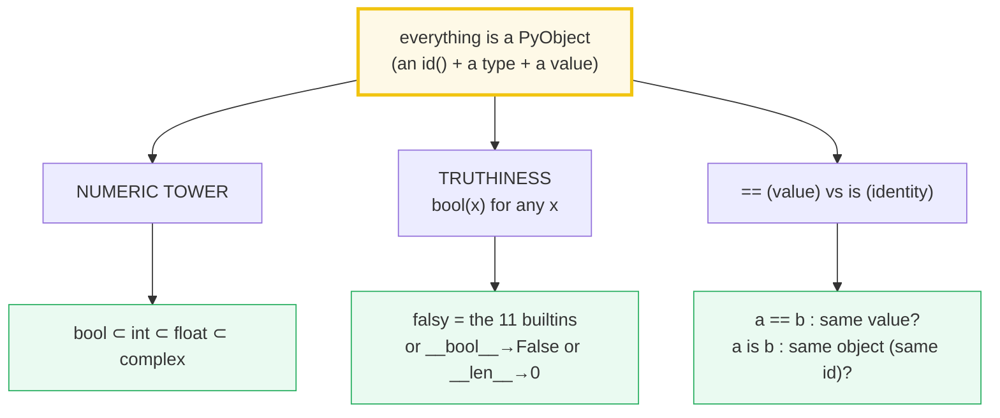
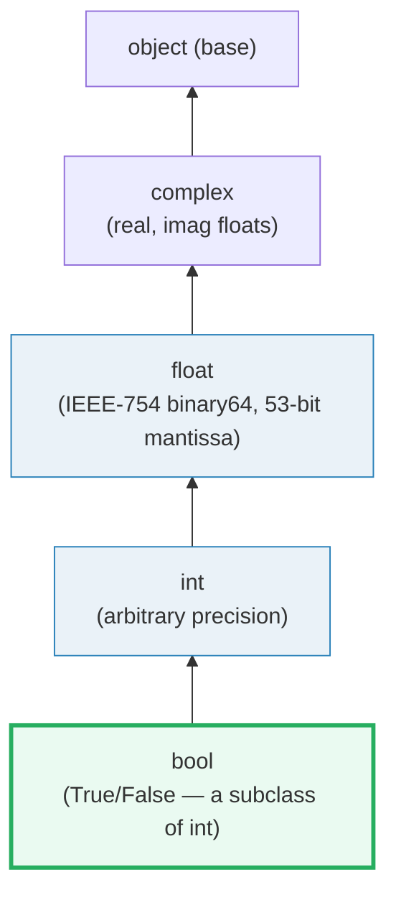
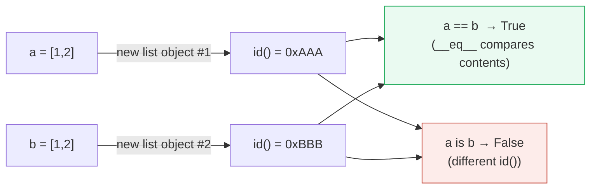

# Types & Truthiness — The Numeric Tower, `bool()`, and `==` vs `is`

> **The one rule:** Python has one object model. Numbers nest
> (`bool` ⊂ `int` ⊂ `float` ⊂ `complex`), every object answers a truth test,
> and `==` (value) is a *different question* from `is` (identity). Get these
> three straight and the rest of the language stops surprising you.

**Companion code:** [`types_and_truthiness.py`](./types_and_truthiness.py).
**Every number and table below is printed by `uv run python
types_and_truthiness.py`** — change the code, re-run, re-paste. Nothing here is
hand-computed. Captured stdout lives in
[`types_and_truthiness_output.txt`](./types_and_truthiness_output.txt).

**Goal of this bundle (lineage, old → new):**

> from *"I know `int` and `str` exist"*
> → *"I understand Python's type / numeric tower, the truthiness rules, and the
> object model that makes `==` / `is` behave as they do."*

🔗 This is bundle **#1 of Phase 1**, the designated *style anchor* — every
later bundle mimics the structure you see here. The deep refcount / `PyObject*`
theory behind `is` is deferred to
[`MEMORY_MODEL`](./MEMORY_MODEL.md) (Phase 3); this guide only *introduces*
identity and points forward. See [`TODO.md`](./TODO.md) for the full plan.

---

## 0. The three ideas on one page



| Question | Operator | What it really asks | Overridable? |
|---|---|---|---|
| "Are these the same **value**?" | `==` | calls `__eq__` | yes (any class) |
| "Are these the same **object**?" | `is` | same `id()`? | **no** — never calls `__eq__` |
| "Is this truthy?" | `bool(x)` / `if x` | `__bool__`, else `__len__`, else `True` | yes |

---

## 1. The numeric tower: `bool ⊂ int ⊂ float ⊂ complex`

Python has **three distinct numeric types** (`int`, `float`, `complex`), and
`bool` is a **subtype** of `int`. "Subtype" means *every* `bool` IS an `int`
(so `isinstance(True, int)` is `True`), but not every `int` is a `bool`
(`isinstance(1, bool)` is `False`). `isinstance()` and `issubclass()` walk this
chain; the MRO (`__mro__`) prints it literally.



The practical consequence: `1 == True` is `True`, `0 == False` is `True`, and
`True == 1.0` is `True` — numeric `==` **coerces across the tower** before
comparing (the language reference calls this "as though the exact values were
being compared").

> From `types_and_truthiness.py` Section A:
> ```
> ======================================================================
> SECTION A — The numeric tower: bool ⊂ int ⊂ float ⊂ complex
> ======================================================================
> Python has three distinct numeric types (int, float, complex). bool
> is a SUBTYPE of int. 'Subtype' means every bool IS an int, but not
> every int is a bool. isinstance() walks this chain.
> 
> expression                  result  type        
> ------------------------------------------------
> isinstance(True, bool)      True    
> isinstance(True, int)       True    
> isinstance(True, float)     False   
> isinstance(1, bool)         False   
> isinstance(1, int)          True    
> issubclass(bool, int)       True    
> type(True).__mro__          (<class 'bool'>, <class 'int'>, <class 'object'>)
> type(1).__mro__             (<class 'int'>, <class 'object'>)
> 
> [check] bool is a subclass of int: OK
> [check] isinstance(True, int) is True: OK
> [check] isinstance(1, bool) is False (int is NOT a bool): OK
> [check] 1 == True is True: OK
> [check] 0 == False is True: OK
> [check] True == 1.0 is True (numeric coercion across the tower): OK
> ```

### Why `bool` is a subclass of `int` (internals)

Historical accident with a purpose: PEP 285 (GvR, 2002) made `bool` a subclass
of `int` so that pre-`bool` code (which used `1`/`0` for true/false) kept
working — `True` and `False` are literally the integer objects `1` and `0` with
a different type tag. In CPython, `True` and `False` are **singletons** at
fixed addresses; the `int` value is stored in the same `PyLongObject` struct.
This is why `sum([True, False, True])` returns `2` (an `int`, not a `bool`) —
arithmetic promotes back up the tower to the wider type. The bitwise operators
`& | ^` are the exception: applied to two `bool`s they stay `bool`.

🔗 `__bool__`, `__eq__`, and the rest of the dunder protocols are covered
properly in [`DUNDER_METHODS`](./DUNDER_METHODS.md) (Phase 2).

---

## 2. Truth value testing — `bool(x)` for every builtin

The rule, verbatim from the [docs](https://docs.python.org/3/library/stdtypes.html#truth-value-testing):
an object is **false** by default *unless* its class defines
`__bool__()` → `False` **or** `__len__()` → `0`. The builtins below are the
fixed falsy set; everything else is truthy.

The eleven falsy builtins: `None`, `False`, `0`, `0.0`, `0j`, `''`, `()`, `[]`,
`{}`, `set()`, `range(0)`. (Plus `Decimal(0)`, `Fraction(0, 1)` from the stdlib
— same "zero of any numeric type" rule.)

> From `types_and_truthiness.py` Section B:
> ```
> ======================================================================
> SECTION B — Truth value testing: bool(x) for every builtin
> ======================================================================
> Rule (docs.python.org stdtypes.html#truth-value-testing): an object
> is False if it is one of the builtins below, OR its class defines
> __bool__() -> False, OR (no __bool__) __len__() -> 0. Everything
> else is True.
> 
> value           bool(x)   truthy?
> ------------------------------------
> None            False     falsy
> False           False     falsy
> 0 (int)         False     falsy
> 0.0 (float)     False     falsy
> 0j (complex)    False     falsy
> '' (str)        False     falsy
> () (tuple)      False     falsy
> [] (list)       False     falsy
> {} (dict)       False     falsy
> set() (set)     False     falsy
> range(0)        False     falsy
> True            True      TRUTHY
> 1 (int)         True      TRUTHY
> 'a' (str)       True      TRUTHY
> [0] (list)      True      TRUTHY
> range(1)        True      TRUTHY
> 
> [check] bool(None) is False: OK
> [check] bool(0) is False: OK
> [check] bool([]) is False: OK
> [check] bool(set()) is False: OK
> [check] bool('') is False: OK
> [check] bool(range(0)) is False: OK
> class                       __bool__  __len__   bool(obj)
> ----------------------------------------------------------
> BoolFalse                   False     -         False
> LenZero                     -         0         False
> LenZeroBoolTrue             True      0         True
> 
> [check] object with __bool__->False is falsy: OK
> [check] object with only __len__->0 is falsy: OK
> [check] __bool__ takes precedence over __len__: OK
> ```

### Why the lookup order is `__bool__` then `__len__` (internals)

When the interpreter needs a truth value (for `if`, `while`, `and`, `or`,
`not`, or the `bool()` constructor), CPython calls `PyObject_IsTrue`, which
tries the type's `nb_bool` slot (your `__bool__`) **first**; if absent it falls
back to `mp_length` (your `__len__`); if neither is defined the object is
truthy. That is why `LenZeroBoolTrue` — which defines *both* `__bool__ → True`
and `__len__ → 0` — comes out **truthy**: `__bool__` wins. Returning anything
other than a `bool` from `__bool__`, or anything other than an `int ≥ 0` from
`__len__`, raises `TypeError` at truth-test time.

---

## 3. `bool` is an `int` subclass — arithmetic with `True`/`False`

Because `bool ⊂ int`, `True == 1` and `False == 0`, and the arithmetic
operators treat them as integers. The result type tells you which path CPython
took: `+ - * /` **promote to `int`** (the wider type); `& | ^` between two
`bool`s **stay `bool`**.

> From `types_and_truthiness.py` Section C:
> ```
> ======================================================================
> SECTION C — bool arithmetic: True and False behave as 1 and 0
> ======================================================================
> Because bool subclasses int, True == 1 and False == 0. Arithmetic
> promotes the result to int (bool operators &, |, ^ keep it bool).
> 
> expression                        result    type
> --------------------------------------------------------
> True + True                       2         int
> True + False                      1         int
> True * 3                          3         int
> sum([True, False, True, True])    3         int
> (True + True).__class__.__name__  int       str
> (True & False).__class__.__name__ bool      str
> bool(0)                           False     bool
> bool(1)                           True      bool
> bool(42)                          True      bool
> bool(-1)                          True      bool
> 
> [check] True + True == 2: OK
> [check] sum([True, False, True]) == 2: OK
> [check] True + True has type int (not bool): OK
> [check] True & False has type bool (bitwise keeps bool): OK
> [check] bool(42) is True (any nonzero int is truthy): OK
> [check] bool(-1) is True (negatives are truthy too): OK
> ```

**Expert gotcha:** `sum([True, False, True]) == 2` is convenient for counting
truthy flags, but note the result is an `int`, not a `bool`. If a type
annotation or a downstream consumer strictly expects `bool`, you'll silently get
an `int` instead. The reverse trap: never write `if x == True:` to test a
bool — `if x:` (or, if you must distinguish from `1`, `if x is True:`). `==`
would let `1 == True` and `1.0 == True` slip through.

---

## 4. Numeric precision & floor division (`//`)

Two facts that bite every Python programmer sooner or later:

1. **Floats are IEEE-754 binary64** — 53 bits of mantissa. The decimal `0.1` is
   not exactly representable in binary (it's `3602879701896397 / 2**55`, an
   infinitely-repeating binary fraction truncated). So `0.1 + 0.2` is *not*
   `0.3`; it's the nearest representable double, `0.30000000000000004`.
2. **`//` is *floor* division**, not truncation. It rounds toward **−∞**, so
   `-7 // 2 == -4` (not `-3`). The companion `%` is defined so that
   `(x // y) * y + (x % y) == x` always holds — which forces the remainder to
   take the **sign of the divisor** (`-7 % 2 == 1`).

The `2**53` boundary is where the `float` mantissa runs out: `2**53` is exactly
representable, but `2**53 + 1` is not — it rounds back down to `2**53`.
`int`, being arbitrary-precision, has no such limit.

> From `types_and_truthiness.py` Section D:
> ```
> ======================================================================
> SECTION D — Numeric precision & floor division (//)
> ======================================================================
> Floats are IEEE 754 binary64: 53 bits of mantissa. Most decimal
> fractions (like 0.1) cannot be represented exactly, so arithmetic
> drifts. // is FLOOR division: it rounds toward -infinity, not 0.
> 
> expression                            result
> --------------------------------------------------------------
> 0.1 + 0.2                             0.30000000000000004
> 0.1 + 0.2 == 0.3                      False
> 0.1 + 0.2 == 0.30000000000000004      True
> (0.1).as_integer_ratio()              (3602879701896397, 36028797018963968)
> 7 // 2                                3
> -7 // 2                               -4
> 7 // -2                               -4
> -7 // -2                              3
> 7 % 2                                 1
> -7 % 2                                1
> int(2**53)                            9007199254740992
> int(2**53) == float(2**53)            True
> int(2**53 + 1) == float(2**53 + 1)    False
> float(2**53 + 1)                      9007199254740992.0
> float(2**53 + 2)                      9007199254740994.0
> 
> [check] 0.1 + 0.2 == 0.30000000000000004 (binary float drift): OK
> [check] 7 // 2 == 3: OK
> [check] -7 // 2 == -4 (floor, NOT truncation toward 0): OK
> [check] 7 // -2 == -4 (floor): OK
> [check] -7 // -2 == 3 (floor of 3.5): OK
> [check] -7 % 2 == 1 (// and % keep divisor sign consistent): OK
> [check] 2**53 is exactly representable as float: OK
> [check] 2**53 + 1 is NOT representable as float (lost a bit): OK
> ```

### Why `0.1 + 0.2 != 0.3` (internals)

This is **not a Python bug** — it's IEEE-754. Every language using hardware
doubles has the same issue (C, Java, JS, …). The [tutorial's](https://docs.python.org/3/tutorial/floatingpoint.html)
derivation: the best double approximation to `1/10` is
`3602879701896397 / 2**55`; add two of those and round once more, and the
nearest double to the true sum prints as `0.30000000000000004`. Compare floats
with [`math.isclose`](https://docs.python.org/3/library/math.html#math.isclose),
or use [`fractions.Fraction`](https://docs.python.org/3/library/fractions.html)
/ [`decimal.Decimal`](https://docs.python.org/3/library/decimal.html) when you
need exact decimal arithmetic (money, accounting).

### Why `//` floors (internals)

CPython defines `//` so that `x == (x // y) * y + (x % y)` is an *identity* for
all integers. The only way to keep that identity true *and* have a non-negative
remainder (the property that makes `%` useful for modular arithmetic and ring
buffers) is to floor toward −∞. Hence `-7 // 2 == -4` and `-7 % 2 == 1`. C and
Java's `%` truncates toward zero instead — a common source of off-by-one bugs
when porting index math.

---

## 5. Equality (`==`) vs identity (`is`); the `[-5, 256]` int cache



`==` asks *"do these hold the same value?"* — it calls `__eq__` and can be
overloaded by any class. `is` asks *"do these names point at the **same
object**?"* — it compares `id()` and **cannot** be overloaded (it's a raw
pointer comparison in CPython). Two fresh lists with equal contents are `==`
but not `is`; the singleton `None` is always tested with `is None`, never
`== None`.

The **small-int cache**: CPython pre-allocates one `int` object for every value
in `[-5, 256]` (see the [`PyLong_FromLong` CPython detail](https://docs.python.org/3/c-api/long.html#c.PyLong_FromLong)).
Any time such a value is produced, you get a *reference to the shared object*,
so two independently-built `256`s are literally the same object. Past `256`,
each construction makes a fresh object — so two `257`s are `==` but **not**
`is`. The demo below builds every value through `int(<str>)` at runtime so that
compile-time constant folding can't mask the cache boundary.

> From `types_and_truthiness.py` Section E:
> ```
> ======================================================================
> SECTION E — Equality (==) vs identity (is); the [-5, 256] int cache
> ======================================================================
> == calls __eq__ and compares VALUES. `is` compares IDENTITY: do two
> names point at the SAME object (same id())? `is` never calls
> __eq__ and cannot be overloaded. CPython caches small ints, so two
> independent occurrences of e.g. 256 are the SAME object.
> 
> expression            result
> ----------------------------------------
> a = [1,2]; b = [1,2]  
> a == b                True
> a is b                False
> id(a) == id(b)        False
> id(a) != id(b)        True
> 
> [check] a == b is True (equal contents): OK
> [check] a is b is False (distinct list objects): OK
> CPython small-int cache covers [-5, 256] inclusive.
> Below: each int is built via int(<str>) at runtime.
> 
> expression                    result  note
> ------------------------------------------------------------------
> int('-5') is int('-5')        True    [IN ] in cache -> shared
> int('0') is int('0')          True    [IN ] in cache -> shared
> int('100') is int('100')      True    [IN ] in cache -> shared
> int('256') is int('256')      True    [IN ] in cache -> shared
> int('257') is int('257')      False   [OUT] out of cache -> distinct objects
> int('1000') is int('1000')    False   [OUT] out of cache -> distinct objects
> 
> [check] int('-5') is int('-5') (lower cache bound shared): OK
> [check] int('256') is int('256') (upper cache bound shared): OK
> [check] int('257') is NOT int('257') (just past the cache): OK
> [check] int('1000') is NOT int('1000') (well past the cache): OK
> s1 = "wombat"; s2 = "wombat"
> s1 == s2              True
> s1 is s2              True  (often shared: CPython interns look-alike literals)
> 
> [check] equal str literals compare equal (==): OK
> ```

### Why `is` exists at all — the `PyObject*` view (internals)

A Python variable is **not a box that holds a value**; it is a **label tied to
a `PyObject*`** (a pointer to a C struct holding a refcount, a type pointer,
and the value). `a = [1,2]; b = [1,2]` creates **two** list structs at two
addresses; `a` and `b` are two labels on two pointers. `==` follows the
pointers and compares the *contents*; `is` just compares the *pointers
themselves* (it's literally `a == b` in C, on the `PyObject*` values). That is
why `is` is (a) not overridable, (b) faster than `==`, and (c) the *only*
correct way to test for `None`, `True`, `False` — those are singletons, so
identity and equality coincide but `is` makes the intent explicit and skips the
`__eq__` call.

🔗 The full story — refcounting, `id()`, the small-int **and string-interning**
caches, mutability vs immutability, aliasing, `copy`/`deepcopy` — is the entire
subject of [`MEMORY_MODEL`](./MEMORY_MODEL.md) (Phase 3). The `s1 is s2 → True`
line above is a first taste of string interning; the rule for *which* strings
get interned is non-trivial and is deferred there.

---

## Pitfalls

| Trap | Example | The fix |
|---|---|---|
| Comparing floats with `==` | `0.1 + 0.2 == 0.3` → `False` | use `math.isclose(a, b)`; or `Fraction`/`Decimal` for exact decimal |
| Assuming `//` truncates toward 0 | `-7 // 2` → `-4`, not `-3` | remember `//` **floors** toward −∞; porting from C? re-check sign math |
| Using `==` to test for `None` | `if x == None:` lets a misbehaving `__eq__` lie | always `if x is None:` (identity, no `__eq__` call) |
| Using `==` to test a bool | `if flag == True:` passes for `1` and `1.0` too | `if flag:` for truthiness; `if flag is True:` for strict bool |
| Treating `True`/`False` as ordinary ints silently | `sum([True, True])` → `2` (an `int`, not `bool`) | fine for counting; cast `bool(...)` when the type must be `bool` |
| Relying on `is` for arbitrary ints/strings | `a is b` for big ints is **not guaranteed** | use `==` for value equality; reserve `is` for singletons & cache curiosity |
| `2**53 + 1` silently equal to `2**53` as float | `float(2**53 + 1) == 2**53` → `True` | keep big integers as `int`; only `float` when you accept the precision limit |
| Truth-testing a numpy/torch array | `bool(np.array([1,2]))` raises `ValueError` | call `.any()` / `.all()` explicitly — their `__len__`/`__bool__` is stricter |
| Mutating while relying on `__bool__` side effects | `__bool__` is called *every* `if`/`while`/`and` | keep `__bool__`/`__len__` pure & cheap |

---

## Cheat sheet

- **Numeric tower:** `bool ⊂ int ⊂ float ⊂ complex`. `isinstance(True, int)` →
  `True`; `1 == True` → `True`; arithmetic promotes to the wider type.
- **Falsy builtins (the eleven):** `None, False, 0, 0.0, 0j, '', (), [], {},
  set(), range(0)`. Plus any object whose `__bool__()` → `False` (or
  `__len__()` → `0` if no `__bool__`).
- **Truth-test order:** `__bool__` first, then `__len__`, else `True`. `__bool__`
  must return a `bool`; `__len__` must return a non-negative `int`.
- **Floats:** IEEE-754 binary64, 53-bit mantissa. `0.1 + 0.2 == 0.3` is
  `False`. Compare with `math.isclose`. Big ints lose bits past `2**53`.
- **`//`:** floor division (toward −∞). `-7 // 2 == -4`. `%` takes the divisor's
  sign. Identity: `(x // y) * y + (x % y) == x`.
- **`==` vs `is`:** `==` is value (`__eq__`, overridable); `is` is identity
  (same `id()`, **not** overridable, faster). Test singletons (`None`, `True`,
  `False`) with `is`.
- **Small-int cache:** `[-5, 256]` inclusive — shared singletons. Past it,
  identity is **not** guaranteed; always use `==` for value equality.

---

## Sources

- **Python docs — Built-in Types: Truth Value Testing & Numeric Types.**
  https://docs.python.org/3/library/stdtypes.html
  *The authoritative list of falsy builtins; the rule that `bool` is a subclass
  of `int`; the numeric-type coercion rules; the `//` floor-division semantics
  (`1//2 == 0`, `(-1)//2 == -1`). Quoted verbatim in §2 and §4.*
- **Python docs — Floating-Point Arithmetic: Issues and Limitations.**
  https://docs.python.org/3/tutorial/floatingpoint.html
  *Derives why `0.1` is stored as `3602879701896397 / 2**55`, why
  `0.1 + 0.1 + 0.1 == 0.3` is `False`, and the "53 bits starting with the most
  significant bit" statement that underpins the `2**53` boundary in §4.*
- **Python docs — C API: Integer Objects (`PyLong_FromLong`).**
  https://docs.python.org/3/c-api/long.html#c.PyLong_FromLong
  *The "CPython implementation detail" that defines the small-int cache range:
  "CPython keeps an array of integer objects for all integers between −5 and
  256." Quoted in §5.*
- **Python docs — Expressions: Comparisons.**
  https://docs.python.org/3/reference/expressions.html#comparisons
  *The eight comparison operators, including that `is`/`is not` "test object
  identity" and "cannot be customized … never raise an exception." Basis for §5.*
- **Python docs — Data model.**
  https://docs.python.org/3/reference/datamodel.html
  *`object.__bool__`, `object.__len__`, `object.__eq__` — the dunder protocols
  that §2 and §5 lean on. (Full treatment in the 🔗 `DUNDER_METHODS` bundle.)*
- **PEP 285 — Adding a bool type (GvR, 2002).**
  https://peps.python.org/pep-0285/
  *The decision to make `bool` a subclass of `int` (so `True == 1`), and the
  rationale that this preserves backward compatibility with pre-`bool` code.
  Referenced in the §1 internals note.*
- **Wikipedia — Double-precision floating-point format.**
  https://en.wikipedia.org/wiki/Double-precision_floating-point_format
  *Independent confirmation of the IEEE-754 binary64 layout: 1 sign + 11
  exponent + 52 mantissa bits (53 with the implicit leading bit), and that
  integers in `[2**53, 2**54)` round to a multiple of 2 — the §4 `2**53 + 1`
  result.*
