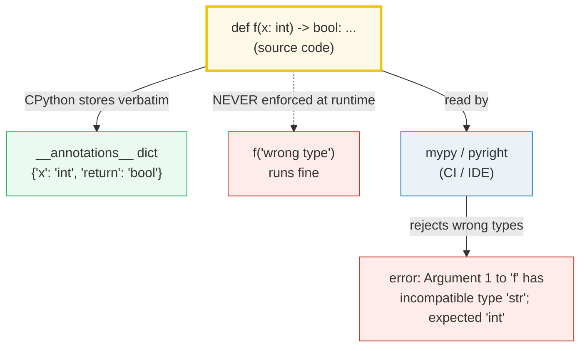
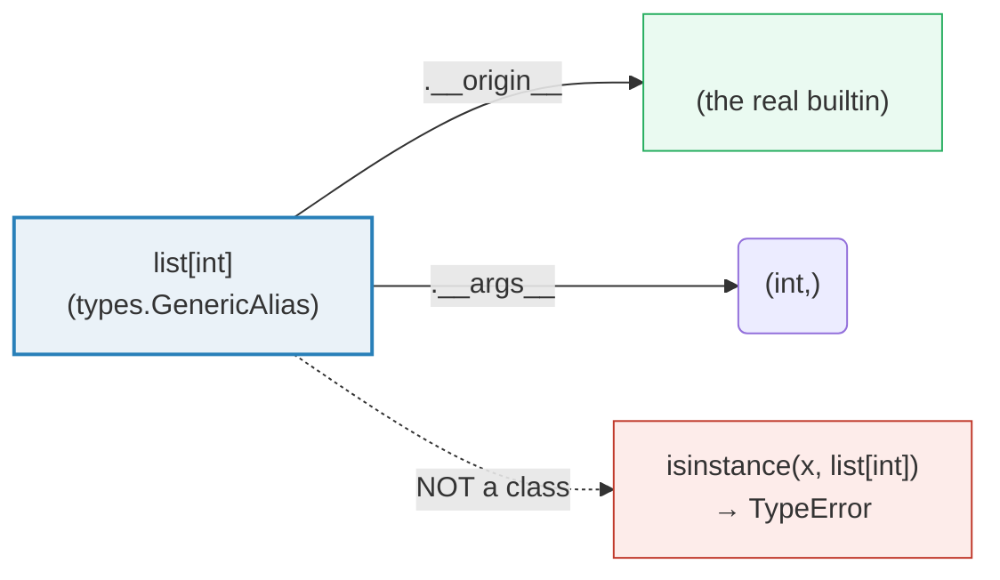
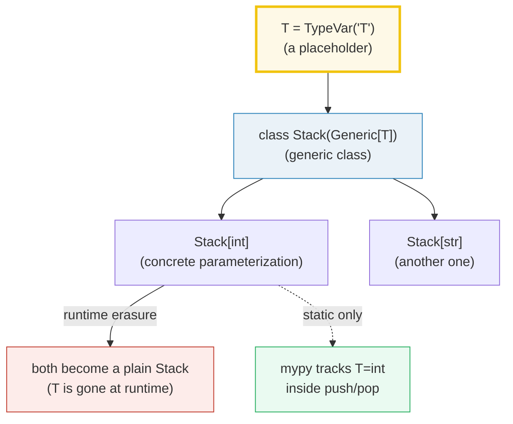
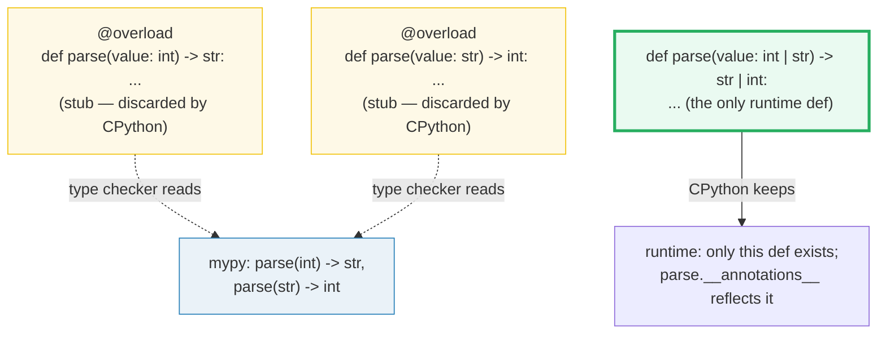

# Type Hints — Annotations, `__annotations__`, Generics, Protocols & `@overload`

> **The one rule:** Python's type hints are pure **documentation** for static
> checkers (mypy/pyright) AND a runtime `__annotations__` dict — CPython stores
> them but **does not enforce them**. This is *gradual typing*: add hints
> incrementally, get real static safety in CI, lose none of Python's dynamism at
> runtime. `TypeVar`/`Generic`, `Protocol`, and `@overload` are the three tools
> that make the static side actually expressive.

**Companion code:** [`type_hints.py`](./type_hints.py).
**Every number and table below is printed by `uv run python type_hints.py`** —
change the code, re-run, re-paste. Nothing here is hand-computed. Captured
stdout lives in [`type_hints_output.txt`](./type_hints_output.txt).

**Goal of this bundle (lineage, old → new):**

> from *"type hints are just docstrings that look like code"*
> → *"I understand gradual typing: annotations are hints for static checkers +
> a runtime `__annotations__` dict; generics/Protocols/`@overload` give me real
> static safety without losing Python's flexibility."*

🔗 This is bundle **#18 of Phase 3**. It builds directly on:
- [`TYPES_AND_TRUTHINESS`](./TYPES_AND_TRUTHINESS.md) (P1 #1) — `type(x)`,
  `isinstance()`, and the numeric tower that the type system describes.
- [`CLASSES_BASICS`](./CLASSES_BASICS.md) (P2 #9) — class scope, where most
  annotations live; the `@dataclass` + type-hints pattern starts there.
- [`INHERITANCE_MRO`](./INHERITANCE_MRO.md) (P2 #11) — **nominal** subtyping
  via the MRO. This bundle's §6 introduces **structural** subtyping (Protocol)
  as the duck-typed counterpart.
- [`FUNCTIONAL_TOOLKIT`](./FUNCTIONAL_TOOLKIT.md) (P2 #15) — `singledispatch`
  is *runtime* type dispatch; §7's `@overload` is its *static* mirror.

See [`TODO.md`](./TODO.md) for the full phase plan.

---

## 0. The one idea on one page



| Question | Who answers | How |
|---|---|---|
| "What type did the author *say* this is?" | **CPython (runtime)** | `f.__annotations__` — a plain dict |
| "Is the call `f('wrong')` actually wrong?" | **mypy / pyright (static)** | separate CI pass; never blocks import |
| "Can I get a real `TypeError` from hints?" | only if **you** add an `isinstance` check | the hints alone do nothing |
| "Does `list[int]` constrain a real list?" | **no** | it produces a `types.GenericAlias` hint |

---

## 1. Basic annotations: `f.__annotations__` + NOT enforced at runtime

The simplest possible hint is `def f(x: int, y: str) -> bool`. Two things happen
at runtime:

1. CPython parses the annotation expressions and stores them in
   `f.__annotations__` — a `dict` mapping each annotated name to its type.
2. **That's it.** When you *call* `f`, CPython ignores the dict entirely. Wrong-
   type arguments run fine unless the function body itself trips on them.

This file uses `from __future__ import annotations` (**PEP 563**, deferred
evaluation), so the values in `__annotations__` are the **source text** of each
annotation (the string `"int"`, not the `int` type). `typing.get_type_hints(f)`
resolves those strings back to real type objects by `eval`-ing them in the
right namespace. This stringization is what makes forward references
(`def f(x: "Node") -> None`) and self-references work without ceremony.

> From `type_hints.py` Section A:
> ```
> ======================================================================
> SECTION A — Basic annotations: f.__annotations__ + NOT enforced at runtime
> ======================================================================
> Annotations live in f.__annotations__ as a dict. This file has
> 'from __future__ import annotations' (PEP 563) in effect, so each
> value is the SOURCE TEXT of the annotation. typing.get_type_hints()
> resolves those strings back to real type objects. Either way, the
> runtime does NOT enforce them when you call f.
> 
> def f(x: int, y: str) -> bool: return bool(x) and bool(y)
> expression                              result
> ----------------------------------------------------------------------
> f.__annotations__                       {'x': 'int', 'y': 'str', 'return': 'bool'}
> get_type_hints(f)                       {'x': <class 'int'>, 'y': <class 'str'>, 'return': <class 'bool'>}
> f(2, "hello")                           True
> f("a", 1) (WRONG types)                 True  <- ran anyway!
> 
> [check] f.__annotations__ stores STRINGS (PEP 563 deferred eval): OK
> [check] get_type_hints(f) resolves 'x' to the real type int: OK
> [check] get_type_hints(f) resolves 'return' to the real type bool: OK
> [check] calling f with wrong types does NOT raise at runtime: OK
> ```

### Why `__annotations__` exists at all (internals)

Two communities wanted annotations: (a) static type-checkers (mypy, PEP 484)
and (b) runtime tools — serializers (pydantic, mashumaro), DI frameworks
(fastapi), doc generators. CPython stays neutral: it stores the annotation
expressions **verbatim** in `__annotations__` and lets each tool decide what to
do with them. The dict's location is well-defined:

- **Function annotations** → `func.__annotations__`
- **Class-level annotations** → `cls.__annotations__` (inherited lookup is
  non-trivial; use `typing.get_type_hints(cls)` for the *resolved* merge)
- **Module-level annotations** → `module.__annotations__` (one dict per module)
- **Function-local annotations** → **nowhere.** PEP 526 explicitly excludes
  them from `__annotations__`; they exist only for the static checker.

The `from __future__ import annotations` switch (PEP 563, default behavior
planned for some future Python) stringizes every annotation at parse time. This
costs one `eval` per annotation when you call `get_type_hints()`, but buys you
free forward references and zero import-time side effects from annotation
expressions.

🔗 The full storage story — `__dict__`, descriptors, MRO lookup of inherited
annotations — is unpacked in [`PROPERTIES_DESCRIPTORS`](./PROPERTIES_DESCRIPTORS.md)
(P2 #10) and [`CLASSES_BASICS`](./CLASSES_BASICS.md) (P2 #9).

---

## 2. Variable annotations (PEP 526): `name: type = value`

PEP 526 (Python 3.6) extended annotation syntax from function signatures to
arbitrary variables:

```python
count: int = 0          # module-level — goes to module.__annotations__
class C:
    host: str = "x"     # class-level  — goes to C.__annotations__
def f():
    local_x: int = 42   # function-local — goes NOWHERE (checker-only)
```

The crucial subtlety: **an annotation alone does not bind a name.** `name: str`
(without `= ...`) is a *declaration*; only the assignment binds it. At module
and class scope the annotation is recorded in `__annotations__`; at function
scope it is purely a hint to the static checker and the runtime discards it.

> From `type_hints.py` Section B:
> ```
> ======================================================================
> SECTION B — Variable annotations (PEP 526): name: type = value
> ======================================================================
> Annotations register types in __annotations__ at MODULE and CLASS
> scope. At FUNCTION scope they are pure hints — the runtime stores
> nothing. An annotation alone does NOT bind a name; only the
> assignment does.
> 
> expression                              result
> ----------------------------------------------------------------------
> module __annotations__                  {'module_count': 'int'}
> ServerConfig.__annotations__            {'host': 'str', 'port': 'int', 'debug': 'bool'}
> helper.__annotations__                  {'return': 'None'}
> ServerConfig.host (class default)       '127.0.0.1'
> 
> [check] module __annotations__ records module_count as the STRING 'int': OK
> [check] ServerConfig.__annotations__ has host/port/debug (PEP 563 strings): OK
> [check] ServerConfig.host class default is the assigned value: OK
> [check] function-LOCAL variable annotations are NOT stored (only 'return'): OK
> ```

### Why `helper.__annotations__` shows `{'return': 'None'}` not `{}`

The function `helper` is annotated `-> None`. **Return-type annotations live on
the function object**, not in any local scope, so they always appear in
`func.__annotations__` under the key `"return"`. The local *_local_x* variable,
by contrast, is invisible to the runtime — that's the lesson. This is why a
purely-local annotation can never be inspected by runtime tools (pydantic,
fastapi); they can only see annotations on the function, class, or module.

🔗 `@dataclass` reads `__annotations__` to decide which fields to generate;
[`CLASSES_BASICS`](./CLASSES_BASICS.md) (P2 #9) covers that pipeline.

---

## 3. Container types: `list[int]`, `dict[str, float]`, `tuple[int, ...]`

Python 3.9 (PEP 585) let you subscript the built-in containers directly:
`list[int]`, `dict[str, float]`, `tuple[int, str]`. The result is a
**`types.GenericAlias`** — a thin wrapper around the origin class that records
the type args. At runtime it does *nothing* to enforce membership.



The three tuple forms every Python programmer must know:

| Annotation | Meaning |
|---|---|
| `tuple[int, str]` | Fixed-length, exactly 2 elements: an int then a str |
| `tuple[int, ...]` | Variable-length, all ints (the `...` is literal `Ellipsis`) |
| `tuple[()]` | The empty tuple (length zero) |
| `tuple` (bare) | Same as `tuple[Any, ...]` — no info |

> From `type_hints.py` Section C:
> ```
> ======================================================================
> SECTION C — Container types: list[int], dict[str, float], tuple[int, ...]
> ======================================================================
> Subscripting builtins produces a types.GenericAlias — a HINT to
> the checker. At runtime, list[int] does NOT constrain what you
> put in the list. tuple[T, ...] means 'variable-length, all T';
> tuple[int, str] means a fixed shape of exactly two elements.
> 
> expression                      value
> ----------------------------------------------------------------------
> type(nums)                      <class 'list'>
> type(scores)                    <class 'dict'>
> type(fixed)                     <class 'tuple'>
> nums (list[int])                [1, 2, 3]
> scores (dict[str, float])       {'alice': 9.5, 'bob': 7.0}
> fixed (tuple[int, str])         (1, 'x')
> list[int]                       list[int]
> dict[str, float]                dict[str, float]
> tuple[int, ...]                 tuple[int, ...]
> list[int].__origin__            <class 'list'>
> dict[str, float].__args__       (<class 'str'>, <class 'float'>)
> tuple[int, ...].__args__        (<class 'int'>, Ellipsis)
> 
> After nums.append('not an int'): nums = [1, 2, 3, 'not an int']
> 
> [check] nums is a plain list (annotation is just a hint): OK
> [check] list[int] is a GenericAlias, not a real class: OK
> [check] list[int].__origin__ is the built-in list: OK
> [check] dict[str, float].__args__ == (str, float): OK
> [check] tuple[int, ...].__args__ == (int, Ellipsis): OK
> [check] appending wrong type to list[int] runs fine (no TypeError): OK
> ```

### Why this is fine (and where it bites)

Letting `list[int]` be a *hint* (not a real parameterized class) preserves
backward compatibility — every existing `list` operation still works, and
CPython pays zero per-element overhead. The cost is that **`isinstance(x,
list[int])` raises `TypeError`** (you can only check against the un-subscripted
`list`). To actually validate element types at runtime you need a library
(pydantic, typeguard, cattrs) — and even then it's opt-in, not free.

---

## 4. `TypeVar` + `Generic`: a typed `Stack[T]`

`TypeVar("T")` creates a **type variable** — a placeholder standing for "some
consistent type, to be chosen by the caller." A class inheriting from
`Generic[T]` becomes *parameterizable*: `Stack[int]` declares "this stack holds
ints," and mypy can check that `s.push("x")` is a type error.



The runtime-vs-static split is sharpest here:

- `Stack.__parameters__ == (T,)` — the unparameterized class remembers its
  type vars.
- `Stack[int].__parameters__ == ()` — once subscripted with a concrete type,
  the parameters are *bound*. `__origin__` points back to the plain `Stack`.
- `isinstance(s, Stack)` works; `isinstance(s, Stack[int])` raises `TypeError`
  ("Subscripted generics cannot be used with class and instance checks").
  This is **PEP 484**'s deliberate choice: type parameters are erased, just
  like Java generics after erasure.

> From `type_hints.py` Section D:
> ```
> ======================================================================
> SECTION D — TypeVar + Generic: a typed Stack[T]
> ======================================================================
> TypeVar('T') is a placeholder type. Inheriting Generic[T] makes a
> class parameterizable: Stack[int] declares the element type, and
> mypy can check push/pop. At runtime a Stack is just a Stack —
> isinstance works against the plain class, but Stack[int] raises
> TypeError because parameters are erased (PEP 484).
> 
> expression                              result
> ----------------------------------------------------------------------
> s.push(1); s.push(2); s.push(3)         [1, 2, 3]
> s.pop()                                 3
> type(s)                                 <class '__main__.Stack'>
> isinstance(s, Stack)                    True
> isinstance(s, Stack[int])               TypeError: Subscripted generics cannot be used with class and instance checks
> Stack[int]                              __main__.Stack[int]
> Stack[int].__origin__                   <class '__main__.Stack'>
> Stack.__parameters__                    (~T,)
> 
> [check] s.pop() returns the last-pushed int: OK
> [check] isinstance(s, Stack) works at runtime: OK
> [check] Stack[int].__origin__ is the unparameterized Stack: OK
> [check] Stack.__parameters__ == (T,) (unsubscripted): OK
> ```

### Why `__parameters__` prints as `(~T,)` (internals)

The `~` is mypy's notation for an **invariant** type variable. `TypeVar("T")`
with no keyword args is invariant by default — meaning `Stack[int]` is NOT a
subtype of `Stack[object]`, even though `int` is a subtype of `object`. This
prevents the classic mutable-container hole: if it were covariant, you could
`push("not an int")` into a `Stack[object]` alias of a `Stack[int]` and corrupt
it. Use `TypeVar("T", covariant=True)` or `contravariant=True)` to override
(only safe for immutable/readonly containers — see PEP 484 variance rules).

---

## 5. `Optional` / `Union` / `Callable`: composable hints

Three composable forms that every Python signature uses daily:

| Form | Equivalent | Since |
|---|---|---|
| `Optional[X]` | `Union[X, None]` — "X or None" | 3.5 (PEP 484) |
| `Union[X, Y]` | either X or Y | 3.5 (PEP 484) |
| `X \| Y` | `Union[X, Y]` (new syntax) | **3.10** (PEP 604) |
| `Callable[[ArgTypes], Ret]` | a function with those arg types returning `Ret` | 3.5 (PEP 484) |

PEP 604 unified `|` and `Union` at the equality level: `(int | None) ==
Optional[int]` is now `True`. But they have **different runtime types** —
`int | None` builds a `types.UnionType`, while `Optional[int]` builds a
`typing._UnionGenericAlias`. They compare equal, but you can tell them apart
via `type(...).__name__`.

> From `type_hints.py` Section E:
> ```
> ======================================================================
> SECTION E — Optional / Union / Callable: composable type hints
> ======================================================================
> Optional[X] is just Union[X, None]. Python 3.10 added X | Y (PEP
> 604). Callable[[ArgTypes], Ret] types higher-order functions. At
> runtime these build hints, NOT validators.
> 
> expression                            result
> ----------------------------------------------------------------------
> first_or_none([])                     None
> first_or_none([42])                   42
> format_id(7)                          'id=7'
> format_id("abc")                      'id=abc'
> apply(lambda a,b: a+b, 3, 4)          7
> int | None                            int | None
> Optional[int]                         typing.Optional[int]
> Union[int, str]                       typing.Union[int, str]
> Callable[[int, int], int]             typing.Callable[[int, int], int]
> (int | None) == Optional[int]         True
> Union[int, str] == (int | str)        True
> type(int | None).__name__             UnionType
> type(Optional[int]).__name__          _UnionGenericAlias
> 
> [check] first_or_none([]) returns None: OK
> [check] first_or_none([42]) returns 42: OK
> [check] format_id accepts int and str equally (Union hint): OK
> [check] apply passes the callable through (Callable hint): OK
> [check] int | None equals Optional[int] (PEP 604 unifies them): OK
> [check] Union[int, str] equals int | str (order-independent): OK
> [check] X | Y syntax produces types.UnionType (PEP 604): OK
> ```

### Why `Optional` does NOT mean "optional argument" (gotcha)

`Optional[int]` means "the *value* can be an int or None." It says **nothing**
about whether the argument can be omitted. An optional argument is one with a
default:

```python
def f(x: int = 0) -> None: ...        # optional arg, NOT Optional
def g(x: Optional[int] = None) -> None: ...  # optional AND nullable
def h(x: Optional[int]) -> None: ...  # required arg that may be None
```

This is the single most common misreading of `Optional`. The name is
unfortunate; `Nullable` would have been clearer. Prefer the explicit `int |
None` (PEP 604) — it makes the "or None" semantics obvious.

### `Callable` for higher-order functions

`Callable[[int, int], int]` reads as "a callable taking two ints and returning
an int." It's how you type decorators, callbacks, and `map`/`filter`/`reduce`.
The argument list is one of: a literal list of types, `...` (any args), a
`ParamSpec` (forwarded signature, PEP 612), or `Concatenate[...]` (prepended
args). For complex signatures (keyword-only, overloaded) use a **callback
Protocol** instead (§6).

---

## 6. `Protocol`: structural typing + `@runtime_checkable` (PEP 544)

This is where Python's type system gets genuinely interesting. **Nominal**
typing (the default — see 🔗 [`INHERITANCE_MRO`](./INHERITANCE_MRO.md), P2 #11)
says "B is-a A because B *declares* `class B(A)`." **Structural** typing says "B
is-a A because B *has the methods A requires* — no inheritance needed." That's
just duck typing, made static.

```mermaid
graph TD
    P["@runtime_checkable
class SupportsClose(Protocol):
    def close(self) -> None: ..."]
    F["class FileLike:
    def close(self) -> None: ..."]
    N["class IntegerOnly: ..."]
    F -->|has close()| SAT["structural subtype<br/>isinstance == True"]
    N -->|no close()| NSAT["NOT a subtype<br/>isinstance == False"]
    F -.->|no inheritance!| NI["SupportsClose NOT in FileLike.__mro__"]
    style P fill:#fef9e7,stroke:#f1c40f,stroke-width:3px
    style SAT fill:#eafaf1,stroke:#27ae60
    style NSAT fill:#fdecea,stroke:#c0392b
    style NI fill:#eaf2f8,stroke:#2980b9
```

A `Protocol` class body lists the required methods (with `...` bodies). Any
class with matching methods is automatically a structural subtype — *no
inheritance required*. The `@runtime_checkable` decorator opts the protocol in
to `isinstance`/`issubclass`, which work by `hasattr`-checking each protocol
member. PEP 544 calls this "static duck typing."

> From `type_hints.py` Section F:
> ```
> ======================================================================
> SECTION F — Protocol: structural typing + @runtime_checkable (PEP 544)
> ======================================================================
> A Protocol describes a SHAPE — any object with the right methods
> is a structural subtype, NO inheritance required. With
> @runtime_checkable, isinstance() checks the shape at runtime via
> hasattr(). This is static duck typing.
> 
> expression                                result
> ----------------------------------------------------------------------
> isinstance(FileLike(), SupportsClose)     True
> isinstance(IntegerOnly(), SupportsClose)  True
> issubclass(FileLike, SupportsClose)       True
> issubclass(int, SupportsClose)            False
> FileLike.__mro__                          (<class '__main__.FileLike'>, <class 'object'>)
> SupportsClose.__mro__                     (<class '__main__.SupportsClose'>, <class 'typing.Protocol'>, <class 'typing.Generic'>, <class 'object'>)
> 
> [check] FileLike structurally satisfies SupportsClose (has close()): OK
> [check] IntegerOnly does NOT satisfy SupportsClose (no close()): OK
> [check] issubclass works for runtime_checkable protocols: OK
> [check] FileLike does NOT inherit SupportsClose (structural, not nominal): OK
> ```

### Why `@runtime_checkable` is opt-in (and shallow)

PEP 544 makes `@runtime_checkable` explicit because **runtime protocol checks
are not type-safe**. The runtime check is just `hasattr(obj, 'close')` — it
verifies the *name* exists, not the *signature*. A class with `def close(self,
x, y)` would still pass `isinstance(obj, SupportsClose)`, then blow up when you
called `obj.close()` with no args. Worse, attributes set in `__init__` can
appear or disappear between calls. Hence:

- `isinstance()` works for both data and non-data protocols.
- `issubclass()` works only for **non-data** protocols (those with methods
  only) — checking data attributes on a class object is unreliable.
- **Subscripted generic protocols** (`Iterable[int]`) always raise `TypeError`
  on `isinstance` — type args are erased.

🔗 Compare this to **nominal** ABCs in [`INHERITANCE_MRO`](./INHERITANCE_MRO.md)
(P2 #11), where `isinstance` walks the MRO. Protocols and ABCs coexist: ABCs
for when you want runtime method sharing, Protocols for when you only want to
*describe a shape*.

---

## 7. `@overload`: many signatures for the checker, ONE real impl

Some functions genuinely have different return types depending on the input
type — `json.loads` returns `dict | list | str | int | ...`, but if you pass a
`bytes` you always get the same shape back. `@overload` lets you declare each
input→output mapping for the **static** checker, while keeping exactly one
runtime implementation.



The rule, verbatim from the [typing docs](https://docs.python.org/3/library/typing.html#typing.overload):
a series of `@overload`-decorated definitions must be followed by exactly one
**non-decorated** definition for the same name. CPython keeps only the last
one; the stubs are for the checker.

> From `type_hints.py` Section G:
> ```
> ======================================================================
> SECTION G — @overload: many signatures for the checker, ONE real impl
> ======================================================================
> The @overload-decorated stubs declare every input->output mapping
> for STATIC checkers. The LAST (non-decorated) def is the runtime
> implementation. CPython discards the stubs; only the real impl
> is callable. mypy/pyright use the stubs to narrow return types.
> 
> expression                            result
> ----------------------------------------------------------------------
> parse(42)                             '42'
> parse("hello")                        5
> type(parse(42)).__name__              str
> type(parse("hi")).__name__            int
> parse.__annotations__                 {'value': 'int | str', 'return': 'str | int'}
> 
> [check] parse(42) returns '42' (a str): OK
> [check] parse('hello') returns 5 (an int): OK
> [check] parse.__annotations__ is the REAL impl's (stubs discarded): OK
> ```

### Why `parse.__annotations__` shows the *real* impl's hints, not the stubs'

The `@overload` decorator (in `typing`) is essentially `raise
NotImplementedError` at import time if called directly — but CPython's import
machinery simply **rebinds the name** on each `def`. The last definition wins,
so `parse` ends up bound to the real impl, whose annotations are what
`__annotations__` reflects. The stubs vanish without a trace at runtime; only
mypy/pyright (reading the source as text) see them.

🔗 This is the **static** counterpart to **runtime** dispatch via
`functools.singledispatch` — see [`FUNCTIONAL_TOOLKIT`](./FUNCTIONAL_TOOLKIT.md)
(P2 #15). `@overload` is checked by mypy but does nothing at runtime;
`singledispatch` is the reverse — actual runtime dispatch on the first
argument's type, with no static checking. Use `@overload` when the dispatch is
only for type narrowing, `singledispatch` when you actually need different code
paths.

---

## 8. Runtime vs static: the gradual-typing contract

Bringing it all together: Python is **gradually typed**. Three independent
systems coexist:

| System | When it runs | What it sees | What it enforces |
|---|---|---|---|
| **CPython (the interpreter)** | always | `__annotations__` dict | **nothing** — annotations are stored, never checked |
| **mypy / pyright (static checker)** | CI / IDE / pre-commit | the source text of annotations | type errors (rejected before runtime) |
| **runtime tools (pydantic, typeguard, cattrs)** | when *you* call them | `__annotations__` via `get_type_hints` | whatever they're configured to enforce |

This is the **gradual** in gradual typing: you can annotate one function in a
10-year-old codebase and mypy will check just that function, ignoring the rest
(unless you opt in with `--strict`). You never have to "convert" a codebase;
you grow the typed surface area over time.

> From `type_hints.py` Section H:
> ```
> ======================================================================
> SECTION H — Runtime vs static: the gradual-typing contract
> ======================================================================
> Python is GRADUALLY typed: annotations are pure hints. CPython
> stores them in __annotations__ and otherwise IGNORES them; mypy
> and pyright are the ENFORCERS, run separately in CI. This lets you
> add types incrementally without breaking existing code.
> 
> expression                                result
> ----------------------------------------------------------------------
> add(2, 3)                                 5
> add("x", "y") (mypy rejects, runtime OK)  'xy'
> add.__annotations__                       {'a': 'int', 'b': 'int', 'return': 'int'}
> 
> Two KINDS of static typing, coexisting:
>   NOMINAL    : class B(A)    — B IS-A A because it SAYS so (MRO)
>   STRUCTURAL : class C: ...  — C is-a SupportsClose because it HAS
>                                close(), no inheritance needed
> 
> Runtime type dispatch (e.g. functools.singledispatch) is a third
> axis — see FUNCTIONAL_TOOLKIT (P2 #15).
> 
> [check] add(2, 3) == 5: OK
> [check] runtime accepts add('x', 'y') -> 'xy' (no TypeError): OK
> [check] annotations are stored in __annotations__ (CPython keeps them): OK
> ```

### Two KINDS of static typing (and a third, runtime, axis)

- **Nominal subtyping** (PEP 484 default): "B is-a A because `class B(A)`."
  mypy walks the MRO. Covered in 🔗 [`INHERITANCE_MRO`](./INHERITANCE_MRO.md)
  (P2 #11).
- **Structural subtyping** (PEP 544): "B is-a A because B has A's methods."
  mypy compares shapes. Covered in §6 of this bundle.
- **Runtime dispatch** (`functools.singledispatch`): a third axis entirely —
  *runtime* branching on the first arg's type, with no static checking at all.
  Covered in 🔗 [`FUNCTIONAL_TOOLKIT`](./FUNCTIONAL_TOOLKIT.md) (P2 #15).

The three are complementary, not competing. Use nominal when you share code
via inheritance; structural when you only want to describe a shape; runtime
dispatch when you need different code paths per type at execution time.

---

## Pitfalls

| Trap | Example | The fix |
|---|---|---|
| Treating `Optional[X]` as "optional argument" | `def f(x: Optional[int])` — caller MUST pass `x` (or `None`) | `Optional` = "nullable value"; an *optional argument* is one with a default: `def f(x: int = 0)` |
| Expecting `__annotations__` to hold real types | `f.__annotations__["x"]` returns the **string** `"int"` under PEP 563 | use `typing.get_type_hints(f)` to resolve strings → real type objects |
| Assuming function-local annotations are stored | `def f(): x: int = 5` — `x` is invisible to runtime tools | locals are checker-only; only module/class/function-return annotations survive |
| `isinstance(x, list[int])` | raises `TypeError: Subscripted generics cannot be used…` | check against the un-subscripted `list` (or use pydantic/typeguard for element validation) |
| `isinstance(x, Stack[int])` for a user `Generic` | same `TypeError` — params are erased | use `isinstance(x, Stack)` against the bare class |
| `@runtime_checkable` checking the signature, not just the name | a class with `def close(self, x, y)` passes `isinstance(_, SupportsClose)` | the runtime check is shallow `hasattr`; only mypy verifies the signature |
| Calling an `@overload` stub directly | `NotImplementedError` or "not callable" — CPython keeps only the last `def` | the non-decorated final `def` is the only runtime impl |
| Forgetting `@overload` stubs must precede a real impl | mypy error: "An overloaded function … must have an implementation" | always end with one non-`@overload` `def` for the same name |
| Trusting `X \| Y` to work on Python < 3.10 | `SyntaxError` on 3.9 and earlier | `from __future__ import annotations` defers parsing (since 3.7) |
| Assuming `TypeVar("T")` is covariant | `Stack[object]` is NOT a supertype of `Stack[int]` | default is **invariant** for mutable containers; use `covariant=True` only for read-only |
| Mixing nominal and structural without realizing it | a class with the right methods satisfies a Protocol even if the author never heard of it | that's the point — but it can let in "accidental" implementations; document expectations |
| Relying on `__annotations__` for inherited class fields | subclass annotations overwrite; parent's are NOT merged in | `typing.get_type_hints(cls)` walks the MRO and merges |

---

## Cheat sheet

- **Annotations are pure hints.** CPython stores them in `__annotations__`
  (function / class / module scope) and otherwise **ignores** them. mypy /
  pyright are the enforcers, run separately in CI.
- **PEP 563 stringization.** With `from __future__ import annotations`, each
  value in `__annotations__` is the *source text* (the string `"int"`). Use
  `typing.get_type_hints(obj)` to resolve them back to real type objects.
- **Variable annotations (PEP 526).** Module- and class-level land in
  `__annotations__`; function-local ones are checker-only and go nowhere. An
  annotation without assignment does NOT bind the name.
- **Container subscripts build a `types.GenericAlias`.** `list[int]` is a hint;
  `__origin__` is `list`, `__args__` is `(int,)`. `isinstance(x, list[int])`
  raises `TypeError`. `tuple[int, str]` = fixed shape; `tuple[int, ...]` =
  variable-length.
- **`TypeVar` + `Generic`.** `T = TypeVar("T"); class Stack(Generic[T])`. The
  unparameterized `Stack.__parameters__ == (T,)`; subscripting with a concrete
  type binds it (`Stack[int].__parameters__ == ()`). Default variance is
  **invariant**.
- **`Optional[X]` == `X | None` == `Union[X, None]`.** "Nullable value," NOT
  "optional argument." PEP 604 (`X | Y`) unifies them at equality since 3.10;
  `int | None` builds `types.UnionType`, `Optional[int]` builds
  `typing._UnionGenericAlias`.
- **`Callable[[ArgTypes], Ret]`** types higher-order functions. Use a callback
  `Protocol` for keyword-only / variadic / overloaded signatures.
- **`Protocol` (PEP 544) = structural subtyping = static duck typing.**
  `@runtime_checkable` opts in to `isinstance`/`issubclass`, which check shape
  via `hasattr` (shallow — names only, not signatures).
- **`@overload`.** Many stub signatures for the checker, ONE real runtime impl
  (the last non-decorated `def`). CPython discards the stubs; only mypy /
  pyright read them.
- **Gradual typing.** Add hints incrementally — mypy checks only what's
  annotated. Two static kinds: **nominal** (MRO inheritance, PEP 484) vs
  **structural** (Protocol, PEP 544). One runtime kind: `singledispatch`.

---

## Sources

- **Python docs — `typing`: Support for type hints.**
  https://docs.python.org/3/library/typing.html
  *The canonical runtime reference. Quoted verbatim at the top of §1: "The
  Python runtime does not enforce function and variable type annotations. They
  can be used by third party tools such as type checkers, IDEs, linters, etc."
  Source of the `Optional[X] == X | None`, `Callable[[int], str]`, `Protocol`
  and `@overload` definitions used throughout.*
- **PEP 484 — Type Hints (GvR, Lehtosalo, Langa, 2014).**
  https://peps.python.org/pep-0484/
  *The original typing PEP. Defines `TypeVar`, `Generic`, `Union`, `Optional`,
  `Callable`, variance rules, and the gradual-typing contract ("annotations
  are not enforced at runtime"). Basis for §1, §4, §5.*
- **PEP 526 — Syntax for Variable Annotations (GvR, Gonzalez, Levkivskyi, 2016).**
  https://peps.python.org/pep-0526/
  *Extends annotation syntax from function signatures to variables. Source of
  the "module/class scope → `__annotations__`; function-local → nowhere" rule
  and the `ClassVar` distinction. Quoted in §2.*
- **PEP 544 — Protocols: Structural subtyping (Levkivskyi et al., 2017).**
  https://peps.python.org/pep-0544/
  *Introduces `Protocol`, `@runtime_checkable`, and the nominal-vs-structural
  distinction. The `SupportsClose` example is taken verbatim from the PEP.
  Source of the "isinstance checks are shallow (hasattr only)" and
  "subscripted generic protocols always raise TypeError" rules in §6.*
- **PEP 563 — Postponed evaluation of annotations (Langa, 2018).**
  https://peps.python.org/pep-0563/
  *The `from __future__ import annotations` switch that stringizes every
  annotation. Explains why `f.__annotations__["x"]` is the string `"int"` and
  why `get_type_hints()` is needed to resolve them. Quoted in §1 and §2.*
- **PEP 585 — Type Hinting Generics In Standard Collections (Langa, 2019).**
  https://peps.python.org/pep-0585/
  *Made `list[int]`, `dict[str, float]`, `tuple[int, ...]` work directly
  (previously required `from typing import List, Dict, Tuple`). Source of the
  `types.GenericAlias` machinery in §3.*
- **PEP 604 — Allow writing union types as `X | Y` (Langa, 2019).**
  https://peps.python.org/pep-0604/
  *The `int | None` syntax. Source of the `(int | None) == Optional[int]`
  equality and the `types.UnionType` runtime type in §5.*
- **mypy — Type System Reference / Cheat Sheet.**
  https://mypy.readthedocs.io/en/stable/cheat_sheet_py3.html
  *Independent confirmation of the runtime-vs-static split: "The Python
  runtime does not enforce function and variable type annotations." Source of
  the `@overload` pattern in §7 and the variance defaults in §4.*
- **Python docs — `dataclasses`.**
  https://docs.python.org/3/library/dataclasses.html
  *`@dataclass` reads `__annotations__` to generate `__init__`/`__repr__`/
  `__eq__`. Cross-referenced via 🔗 [`CLASSES_BASICS`](./CLASSES_BASICS.md).*
