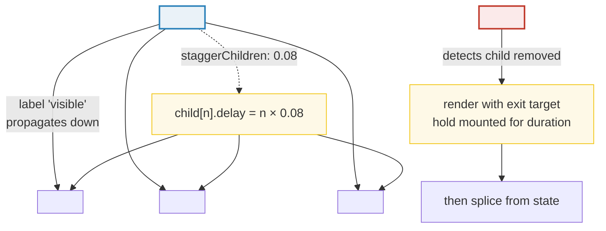
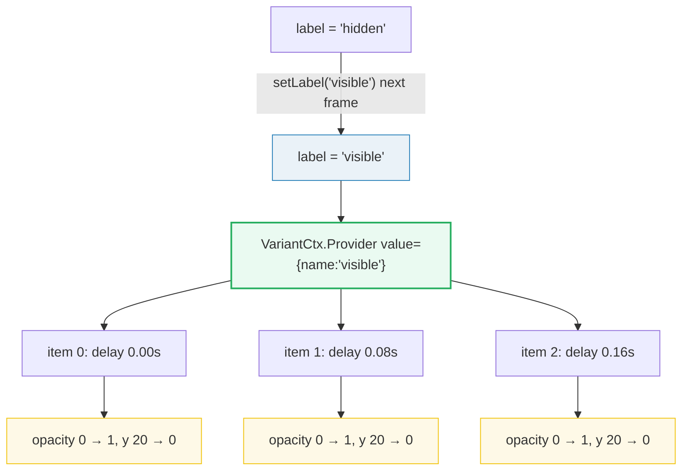
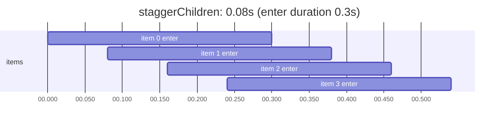
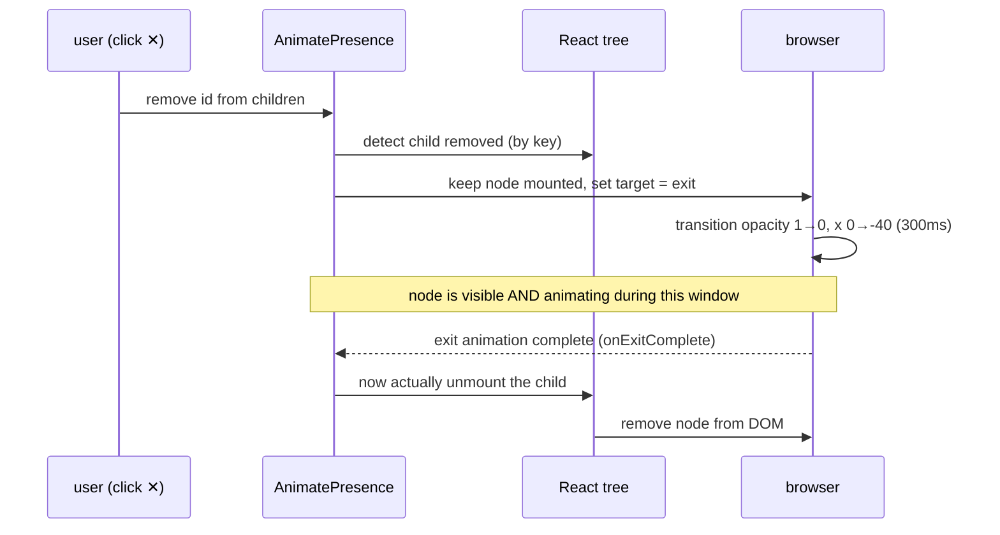

# Animation Orchestration

> **Companion demo:** [`animation_orchestration.html`](./animation_orchestration.html) — open in a browser.
> Watch a from-scratch React build reproduce Framer Motion's `variants`, `staggerChildren`, and `AnimatePresence` using a Context, a per-index `transitionDelay`, and a deferred unmount.

---

## 0. TL;DR — the one idea

Animating **one** element is a solved problem (see [`framer_motion_core`](./framer_motion_core.html) — a `requestAnimationFrame` tween loop). Choreographing **many** elements — a list rippling in, a dismissed card fading out *before* it leaves the DOM, a parent flipping a named label that every child follows — needs **orchestration**. Framer Motion (now just **Motion**, `motion/react`) ships three primitives for exactly this, and each is a plain-React mechanism in disguise:



| Framer Motion primitive | What it does | Plain-React equivalent (used in the demo) |
|---|---|---|
| **`variants`** | named target objects (`hidden`, `visible`, `exit`) — parent switches a string label, children that declare the same variant set inherit it | a `React.Context` carrying the active label down the tree |
| **`staggerChildren`** | each child animates `index × step` seconds after the previous — a wave, not a flash | each child reads its index and sets `style.transitionDelay = index × step` |
| **`AnimatePresence`** | keeps a removed child mounted long enough to play its `exit` animation | park the id in an "exiting" map, render with the `exit` target, splice from state after N ms |

The whole point: **you never drive the animation from React state per-frame** (that's the rAF loop's job). Orchestration is about *when* and *in what order* elements target their animations — sequencing, not tweening.

---

## 1. Variants — named states that propagate

A **variant** is a plain object mapping a string label to a target. The parent picks the active label via `initial` / `animate`; **every child that declares a `variants` prop with the same labels follows automatically** — no per-child wiring.

```jsx
import { motion } from "motion/react";

const list = {
  hidden:  { opacity: 0 },
  visible: { opacity: 1, transition: { staggerChildren: 0.08 } }
};
const item = {
  hidden:  { opacity: 0, y: 20 },
  visible: { opacity: 1, y: 0 }
};

<motion.ul variants={list} initial="hidden" animate="visible">
  <motion.li variants={item}>One</motion.li>
  <motion.li variants={item}>Two</motion.li>
  <motion.li variants={item}>Three</motion.li>
</motion.ul>
```

**Propagation rules:**

- The label flows parent → child only if the child ALSO has a `variants` prop. A child with a bare `animate={{...}}` is **not** controlled by the parent — it ignores the inherited label.
- The child looks up its own `variants[label]`; if the label is missing from the child's set, that child does nothing for that transition.
- Removing `initial`/`animate` from the children (letting them inherit) is the canonical pattern — adding them back **overrides** propagation and breaks stagger.

### The plain-React mechanism

```jsx
// a Context carries the active label + stagger step down the tree
const VariantCtx = React.createContext({ name: "visible", stagger: 0 });

function MotionItem({ variants, index, ...rest }) {
  const { name, stagger } = React.useContext(VariantCtx);
  const target = variants[name] ?? {};
  return <li style={{ ...styleFrom(target), transitionDelay: `${index * stagger}s` }} {...rest} />;
}

<VariantCtx.Provider value={{ name: label, stagger: 0.08 }}>
  <ul>{items.map((id, i) => <MotionItem key={id} index={i} variants={item} />)}</ul>
</VariantCtx.Provider>
```



---

## 2. Stagger — the wave

`staggerChildren` sits inside the **parent's** `transition`. Each child waits `staggerChildren` seconds after the **previous** child *starts* — not after it finishes. The result is an overlapping ripple, not a strict sequence.

```
child 0  ▁▂▃▄▅▆▇█   starts at t = 0.00s
child 1     ▁▂▃▄▅▆▇█  starts at t = 0.08s   (staggerChildren = 0.08)
child 2        ▁▂▃▄▅▆▇█ starts at t = 0.16s
         └── each starts step after the previous BEGINS, not ends
```



### `staggerChildren` vs `delayChildren` vs `when`

All three live on the parent's `transition` and control **child** timing — they are easy to confuse:

| option | effect | visual |
|---|---|---|
| `staggerChildren: 0.08` | child *n* starts at `n × 0.08` | ripple / wave |
| `delayChildren: 0.2` | **all** children wait `0.2`, then animate together | single delayed flash |
| `when: "beforeChildren"` | parent completes its own animation, **then** children start | strict parent-then-child ordering |
| `when: "afterChildren"` | children complete, **then** parent animates | child-then-parent ordering |

You can combine them: `{ when: "beforeChildren", staggerChildren: 0.08 }` means "parent finishes, then children ripple".

---

## 3. AnimatePresence — exit animations

React unmounts a component **instantly** the frame it's removed from the tree. There is no "post-removal" lifecycle hook, so a `motion` component's `exit` target would never play. `<AnimatePresence>` fixes this by **detecting removal and keeping the child mounted** until its `exit` animation finishes.

```jsx
import { AnimatePresence, motion } from "motion/react";

<AnimatePresence>
  {items.map((id) => (
    <motion.li
      key={id}
      initial={{ opacity: 0, y: 20 }}
      animate={{ opacity: 1, y: 0 }}
      exit={{ opacity: 0, x: -40 }}      // played only because AnimatePresence wraps it
      transition={{ duration: 0.3 }}
    />
  ))}
</AnimatePresence>
```

### The exit lifecycle



### The plain-React mechanism (deferred unmount)

Without `AnimatePresence`, you simulate it in two steps: **(1)** flag the item as exiting so it re-renders with the `exit` target, **(2)** after the exit duration, splice it from state for real.

```jsx
function removeItem(id) {
  // 1. park in "exiting" — keeps it mounted, switches it to the exit target
  setExiting((prev) => ({ ...prev, [id]: true }));
  // 2. after the exit duration, really remove it
  setTimeout(() => {
    setItems((prev) => prev.filter((i) => i !== id));
    setExiting((prev) => {
      const next = { ...prev };
      delete next[id];
      return next;
    });
  }, EXIT_MS);   // must match the exit transition duration
}
```

> **The key insight:** during the exit window the element is *still in the `items` array* — it just renders with `exiting === true`, which forces the `exit` variant. Only after the timeout does the array actually shrink. This is exactly the bookkeeping `AnimatePresence` automates for you (plus handling key changes, `mode="popLayout"`, and multiple simultaneous exits).

---

## 4. Custom transition per variant

Each variant target can carry its **own** `transition`. The `visible` state can spring in; `exit` can tween out fast — they are independent.

```jsx
const item = {
  hidden:  { opacity: 0, y: 20 },
  visible: {
    opacity: 1, y: 0,
    transition: { type: "spring", stiffness: 300, damping: 24 }   // springy enter
  },
  exit: {
    opacity: 0, scale: 0.8,
    transition: { type: "tween", duration: 0.18, ease: "easeIn" } // snappy exit
  }
};
```

| label | transition | why |
|---|---|---|
| `visible` | spring | enter should feel alive, interruptible |
| `exit` | tween, short | exits should get out of the way fast — springs overshoot and linger |
| `hover` / `tap` | tween, very short | gestures need instant feedback |

The `transition` prop on the component is the **default**; a `transition` nested inside a variant target **overrides** it for that label only.

---

## 5. Killer Gotchas

| trap | symptom | fix |
|---|---|---|
| **child has its own `initial`/`animate`** | stagger & label propagation silently stop — children animate together, ignoring the parent | remove `initial`/`animate` from children; let them inherit the label via `variants` only |
| **`exit` set but no `<AnimatePresence>`** | removed component vanishes instantly, no exit animation | wrap the mapped list in `<AnimatePresence>` — `exit` only fires inside it |
| **missing `key` on mapped children** | AnimatePresence can't track which child left → exits don't play, or wrong item animates | always pass a stable, unique `key` (an id, never the array index) |
| **`key` = array index** | removing item 0 shifts every later index; AnimatePresence thinks a different child left | use a stable id as the key, not `i` |
| **setTimeout duration ≠ exit transition duration** | item unmounts before animation finishes (or lingers, invisible but blocking) | keep the deferred-unmount timeout equal to the `exit` transition `duration` |
| **`staggerChildren` on the child, not the parent** | no stagger — children animate together | `staggerChildren` lives on the **parent's** `transition`, inside the variant |
| **`staggerChildren` vs `delayChildren` confused** | expected a ripple, got a single delayed flash (or vice-versa) | `staggerChildren` = per-child incremental delay; `delayChildren` = one shared delay for all |
| **parent missing the matching label** | parent switches to `"exit"` but children have no `exit` variant → they freeze on removal | define every label you switch to on BOTH parent and children |
| **`AnimatePresence` with multiple direct children, no `mode`** | exiting + entering items overlap in the same slot (layout jank) | set `mode="popLayout"` or `mode="wait"` (wait = enter only after all exits finish) |
| **custom component, not a `motion.*` one** | variants/propagation do nothing — plain components don't read the context | wrap with `motion.create(MyComponent)` or spread the variant target manually |
| **exiting item still counted in state** | list length / `.length` checks include the exiting row | in the from-scratch sim, filter `exiting` ids out of "committed" counts; or trust `onExitComplete` |

### Cheat sheet

```jsx
// ── the canonical orchestrated list ──
const list = {
  hidden:  { opacity: 0 },
  visible: { opacity: 1, transition: { staggerChildren: 0.08, when: "beforeChildren" } }
};
const item = {
  hidden: { opacity: 0, y: 20 },
  visible: { opacity: 1, y: 0, transition: { type: "spring", stiffness: 300 } },
  exit:   { opacity: 0, x: -40, transition: { duration: 0.18 } }
};

<AnimatePresence mode="popLayout">
  <motion.ul variants={list} initial="hidden" animate="visible">
    {items.map((it) => (
      <motion.li key={it.id} variants={item} exit="exit">
        {it.label}
      </motion.li>
    ))}
  </motion.ul>
</AnimatePresence>
```

| one-liner | does |
|---|---|
| `variants={{ hidden, visible }}` | declare named states for label-switching |
| `initial="hidden" animate="visible"` | parent picks the active label |
| `staggerChildren: 0.08` | per-child incremental delay (ripple) |
| `delayChildren: 0.2` | one shared delay for all children |
| `when: "beforeChildren"` | parent finishes, then children start |
| `<AnimatePresence>` | enables `exit` on unmounting children |
| `<AnimatePresence mode="wait">` | enter only after all exits complete |
| `<AnimatePresence mode="popLayout">` | exiting + entering overlap (layout-aware) |
| `exit={{ opacity: 0 }}` | target played before unmount (needs AnimatePresence) |
| `custom={i}` + `variants={{ enter: c => ({...}) }}` | dynamic per-item variant (function target) |

---

## 🔗 Cross-references

- [`framer_motion_core`](./framer_motion_core.html) — the single-element rAF tween loop. Orchestration is built on top of it: variants/stagger/exit only decide *when* each element targets its animation; the actual per-frame writes go through that same loop. Read this first.
- [`spring_physics`](./spring_physics.html) — springs vs tweens. The `transition: { type: "spring" }` inside a variant target uses the spring integrator; `type: "tween"` uses easing. Covers why exits should tween and enters should spring.
- [`css_animations`](./css_animations.html) — the browser primitives underneath. The from-scratch demo uses CSS `transition` + `transitionDelay`; Motion uses rAF writes for the same properties. Use CSS for simple hover/focus, Motion for state-driven sequencing.
- [`view_transitions`](./view_transitions.html) — the native `ViewTransition` API. `AnimatePresence` + `layoutId` is the React-friendly equivalent for shared-element/route exit-enter choreography; the browser API does the same FLIP at the navigation level.

---

## Sources

- Motion — React animation (`initial`, `animate`, `exit`, **variants** orchestration): <https://motion.dev/docs/react-animation>
- Motion — React transitions (`staggerChildren`, `delayChildren`, `when: "beforeChildren"`): <https://motion.dev/docs/react-transitions>
- Motion — AnimatePresence (exit animations, `mode`, `onExitComplete`): <https://motion.dev/docs/react-animate-presence>
- Motion — Stagger helper (`stagger()` for `useAnimate` imperative sequencing): <https://motion.dev/docs/stagger>
- Motion — React motion component (`variants`, `transition`, gesture targets): <https://motion.dev/docs/react-motion-component>
