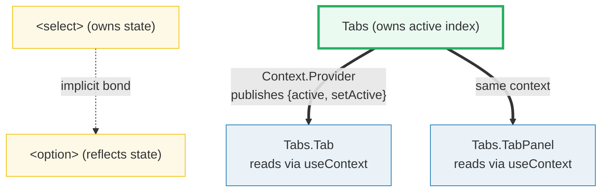
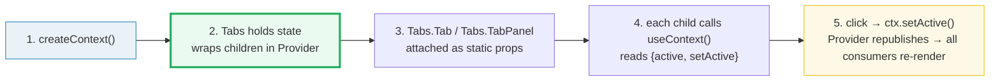
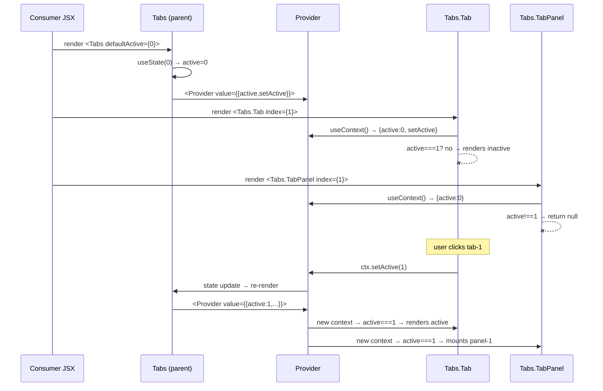

# Compound Components

> **Companion demo:** [`compound_components.html`](./compound_components.html) — open in a browser to see the pattern render live (with an embedded gold-check that drives the tabs and asserts state).

---

## 0. TL;DR — the one idea

HTML gives you `<select>` and `<option>`: two tags that cooperate with **zero props** between them. The `<select>` owns the open/selected state; each `<option>` reflects it without being told. React ships no such pairing, so you build one:

- A **parent** component holds the state and publishes it through a **Context** (`React.createContext` + `<Provider>`).
- Related **sub-components** are attached as static properties (`Tabs.Tab = …`, `Tabs.TabPanel = …`) and read that state with `useContext`.

The consumer writes `<Tabs><Tabs.TabList><Tabs.Tab/></Tabs.TabList><Tabs.TabPanel/></Tabs>` and never passes a state prop. This is the ergonomics of `<select>/<option>`, and it's the pattern behind Radix UI, Headless UI, Reach UI, and the MUI Select.



**The whole pattern in five lines:**

```jsx
var TabsContext = React.createContext({});                 // 1. create the channel
function Tabs(props) {                                     // 2. parent holds state
  var s = React.useState(props.defaultActive || 0);
  var ctx = React.useMemo(() => ({ active: s[0], setActive: s[1] }), [s[0]]);
  return <TabsContext.Provider value={ctx}>{props.children}</TabsContext.Provider>;
}
Tabs.Tab = function (props) {                              // 3. attach as static prop
  var ctx = React.useContext(TabsContext);                 // 4. consume — no props!
  return <button data-active={ctx.active === props.index}>{props.children}</button>;
};
```

---

## 1. How it works

Three moving parts, each doing exactly one job:

### 1a. Context is the glue

`React.createContext(default)` returns an object with a `.Provider` component and (via the hook) a consumption path. The parent renders `<Ctx.Provider value={…}>` around its children; any descendant — no matter how deep — can call `useContext(Ctx)` and get that value. **This is the only channel state flows through.** No prop is ever passed from `Tabs` to `Tabs.Tab`.

> Cross-link: [`use_context.html`](./use_context.html) — the Context API is the foundation; compound components are the pattern built on top.

### 1b. The parent provides

`Tabs` owns the state (`useState`) and is responsible for **wrapping its children in the Provider**. Note the children come from `props.children` — the parent does not enumerate or know what its sub-components are. That's the point: the consumer controls the tree shape.

### 1c. Static property assignment — `Tabs.Tab = …`

Sub-components are attached as properties of the parent function:

```jsx
Tabs.TabList   = function TabList(props)   { … };
Tabs.Tab       = function Tab(props)       { … };
Tabs.TabPanel  = function TabPanel(props)  { … };
```

JSX member expressions compile cleanly: `<Tabs.Tab index={0}>Overview</Tabs.Tab>` becomes `React.createElement(Tabs.Tab, { index: 0 }, 'Overview')`. The namespacing is purely a DX convention — it reads like the HTML `<select><option>` pairing and keeps the public API discoverable via autocomplete (`Tabs.` → suggests `Tab`, `TabList`, `TabPanel`).



---

## 2. Mechanism / internals — parent provides, children consume

The mental model is **publish/subscribe over a subtree**:



Why this is powerful:

- **Decoupling.** `Tabs.Tab` depends on the *shape* of the context, not on `Tabs`' implementation. You can swap the parent's internals (add keyboard nav, an `orientation` flag, animation) without touching any consumer.
- **Flexible composition.** Tabs/panels can be reordered, conditionally rendered, or live in separate subtrees (as long as they stay under the same `Provider`). The parent doesn't care.
- **Implicit state.** The thing that would otherwise be six props threaded through the tree — `active`, `setActive`, `orientation`, `idBase`, `onSelect`, `disabled` — becomes zero props. The API surface shrinks to the meaningful ones (`index`, `children`).

---

## 3. When to use compound components

| Reach for compound components when… | Don't use it when… |
|---|---|
| A widget has 2+ cooperating parts (tabs, accordion, menu, select, dialog w/ trigger) | There's only one component — just use props |
| You want the consumer to control ordering / conditional rendering of parts | The parent must strictly control child order (a config object is clearer) |
| The API would otherwise need ≥3 props drilled to grandchildren | State is trivial and lives in one place — `useState` + props is simpler |
| You're building a reusable design-system primitive | It's a one-off; YAGNI |

### vs render props

[Render props](./render_props.html) (`<List render={items => <ul>…</ul>} />`) also share state without drilling, but the parent **calls** a function you pass — it controls the render. Compound components invert this: the consumer writes the JSX tree declaratively and the children pull state via context. Use render props when the parent needs to feed computed data *into* the child's render; use compound when the child just needs to read shared UI state.

### vs custom hooks

A custom hook ([`use_context`](./use_context.html), [`custom_hooks`](./custom_hooks.html)) can expose the same `{active, setActive}` tuple, but then *every* consumer must call it and wire up its own JSX. The compound pattern packages the state **and** the cooperating components together, so the consumer writes declarative markup. Reach for a hook when the logic is reusable across unrelated components; reach for the compound pattern when the logic *and* the DOM structure belong together.

---

## 4. Real-world examples

| Library | Compound API | Notes |
|---|---|---|
| **Radix UI** | `<Tabs><Tabs.List><Tabs.Trigger/><Tabs.Content/></Tabs.List></Tabs>` | Headless primitives; compound + Context + roving focus. The canonical reference. |
| **Headless UI** (React) | `<TabGroup><TabList><Tab/></TabList><TabPanels><TabPanel/></TabPanels></TabGroup>` | Unstyled, fully accessible; same implicit-state flow. |
| **Reach UI** | `<Tabs><TabList><Tab/></TabList><TabPanels><TabPanel/></TabPanels></Tabs>` | Predecessor that popularized the pattern; merged into Radix. |
| **shadcn/ui** | copies Radix's compound shape, styling it with Tailwind | Built *on top of* Radix — same pattern, different styling layer. |
| **MUI** | `<Tabs><Tab/>…</Tabs>` + `<TabPanel>` | The classic, early large-scale adoption of the pattern. |

> The shared DNA across all of them: **one parent + Context + static-property sub-components that consume.** Once you see it, you can't un-see it.

---

## 5. Killer Gotchas

| trap | symptom | fix |
|------|---------|-----|
| **Empty/`undefined` context default** | `useContext` returns `{}` → `ctx.active` is `undefined` → child renders as if "no parent". Happens when a sub-component is rendered *outside* its Provider. | Give `createContext` a meaningful default, or assert and throw a clear error inside the consumer. |
| **`index` key collisions** | Two `<Tabs.Tab index={0}>` make both look active; reordering tabs silently desyncs the panel. | Derive `index` from position (`React.Children.map`) instead of trusting the consumer to pass it — see Headless/Radix. |
| **Unstable context value** | Parent rebuilds `{active, setActive}` as a new object every render → **every** consumer re-renders even when nothing changed. | Wrap the value in `useMemo(() => ({active, setActive}), [active])`. |
| **Forgetting `Tabs.Tab = …`** | `<Tabs.Tab>` is `undefined` → React throws "Element type is invalid". | Attach sub-components as static properties *after* the function declaration, before export. |
| **DevTools show a flat tree** | React DevTools renders `Tabs`, `TabList`, `Tab`, `TabPanel` as siblings, hiding the parent/child relationship. | It's cosmetic — the Context Provider is the real link, not the DOM tree. Set `displayName` on each piece for clarity. |
| **State doesn't reset on tab close** | A panel that hides via CSS (`hidden`) keeps its internal state alive. | Return `null` (unmount) rather than `display:none` when a panel is inactive — see the demo's `if (ctx.active !== index) return null`. |

---

### Cheat sheet

```jsx
// 1 · create the shared channel (once, module scope)
var Ctx = React.createContext(null);

// 2 · parent holds state + provides
function Tabs(props) {
  var s = React.useState(props.defaultActive ?? 0);
  var ctx = React.useMemo(
    () => ({ active: s[0], setActive: s[1] }),
    [s[0]]
  );
  return <Ctx.Provider value={ctx}>{props.children}</Ctx.Provider>;
}

// 3 · attach sub-components as static properties
Tabs.Tab      = function (p) {            // ← static assignment
  var c = React.useContext(Ctx);          // ← consume, no props from parent
  var on = c.active === p.index;
  return <button data-active={on} onClick={() => c.setActive(p.index)}>{p.children}</button>;
};
Tabs.TabPanel = function (p) {
  var c = React.useContext(Ctx);
  if (c.active !== p.index) return null;  // ← unmount inactive panels
  return <div>{p.children}</div>;
};

// 4 · consumer writes clean, prop-drill-free markup
<Tabs defaultActive={0}>
  <Tabs.Tab index={0}>Overview</Tabs.Tab>
  <Tabs.TabPanel index={0}>…</Tabs.TabPanel>
</Tabs>
```

**Decision rule:** if a component has cooperating parts and the consumer should control their order/conditionals, reach for compound components. Otherwise: one part → props; computed data into a child → render props; pure logic reuse → a custom hook.

---

## 🔗 Cross-references

- [`use_context.html`](./use_context.html) — the Context API is the foundation; compound components are the pattern built on top.
- [`render_props.html`](./render_props.html) — the sibling alternative: parent feeds data *into* the child's render instead of the child pulling via context.
- [`headless_ui.html`](./headless_ui.html) — production-grade compound components: state reducer + prop getters on top of this exact pattern.
- [`../frontend/react/react_components_props.html`](../frontend/react/react_components_props.html) — the basics of explicit prop passing that compound components exist to *avoid* drilling.

---

## Sources

- React docs — *Passing Data Deeply with Context*: https://react.dev/learn/passing-data-deeply-with-context
- Kent C. Dodds — *Advanced React Component Patterns* (compound components): https://kentcdodds.com/blog/advanced-react-component-patterns
- React docs — * createContext*: https://react.dev/reference/react/createContext
- Radix UI — *Tabs primitive* (compound component reference impl): https://www.radix-ui.com/primitives/docs/components/tabs
