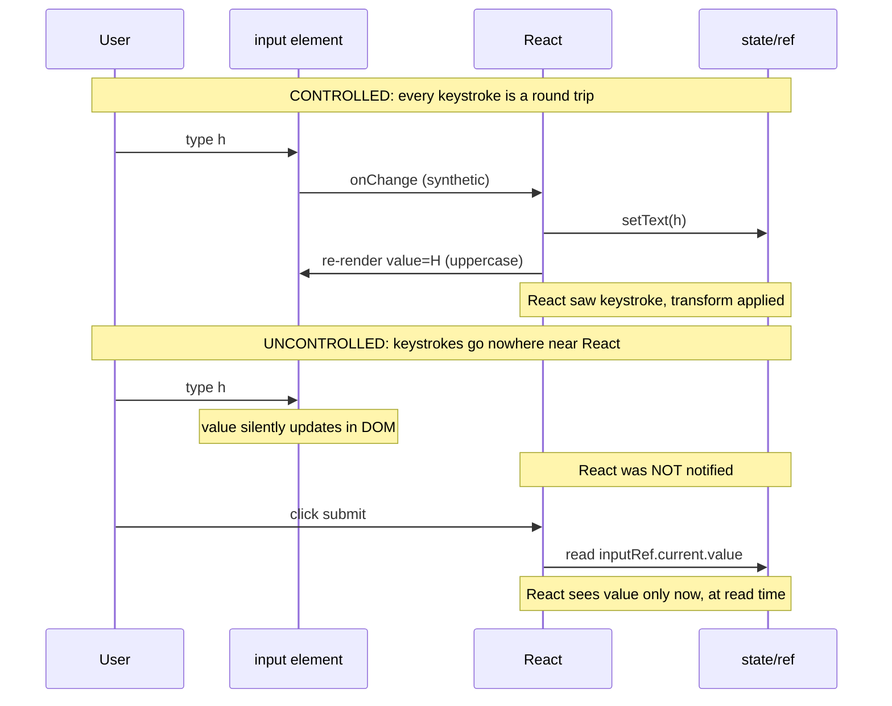

# Controlled vs Uncontrolled Components — who owns the input's value?

> **Companion demo:** [`controlled_uncontrolled.html`](./controlled_uncontrolled.html) — open in a browser.
> **React version:** 19.2.7 via ESM CDN + Babel standalone.

---

## 0. TL;DR — the one idea

> **The analogy:** a controlled input is a **walkie-talkie** — every word you say
> goes through React (state → re-render → value prop). An uncontrolled input is a
> **mailbox** — you drop a letter in (DOM types), and React only checks the contents
> when it opens the door (reads `ref.current.value`). The reset hatch for both:
> change the `key` prop to remount the component, wiping every piece of state.

```mermaid
graph TD
    subgraph C["CONTROLLED — React owns the value"]
        CT["useState('')"] -->|render| CV["value={text.toUpperCase()}"]
        CV --> DOM1["<input> shows transformed text"]
        K1["keystroke"] -->|onChange| CT
    end
    subgraph U["UNCONTROLLED — DOM owns the value"]
        DV["defaultValue='hello'"] --> DOM2["<input> shows 'hello'"]
        K2["keystroke"] -->|silent| DOM2
        DOM2 -->|on submit only| REF["inputRef.current.value"]
    end
    RESET["change key prop"] -->|unmount+remount| FRESH["fresh state — works for EITHER pattern"]
    style CT fill:#eafaf1,stroke:#27ae60,stroke-width:2px
    style CV fill:#eaf2f8,stroke:#2980b9
    style DOM1 fill:#fef9e7,stroke:#f1c40f
    style DV fill:#fdedec,stroke:#e74c3c
    style REF fill:#fdedec,stroke:#e74c3c
    style RESET fill:#f4ecf7,stroke:#8e44ad,stroke-width:2px
```



The whole distinction is one question: **when the user types, does React see it?**

- **Yes** → controlled. You render `<input value={x} onChange={e => setX(e.target.value)} />`.
  React state `x` is the source of truth; the `value` prop is what's displayed.
- **No** → uncontrolled. You render `<input defaultValue="x" ref={r} />`. The DOM
  owns the value silently; React reads it only when you reach into `r.current.value`.

There is no "better" — each exists because the other is awkward in some case.

---

## 1. How it works

### Controlled — React state is the source of truth

```jsx
function ControlledDemo() {
  const [text, setText] = useState('');
  return (
    <input
      value={text.toUpperCase()}                       // value derived from state
      onChange={e => setText(e.target.value)}          // keystrokes flow back into state
    />
  );
}
```

The flow per keystroke:

1. User types `"h"`. The DOM input value briefly becomes `"h"`.
2. React's synthetic event system fires `onChange` with `e.target.value === "h"`.
3. `setText("h")` schedules a re-render.
4. On re-render, `value={text.toUpperCase()}` evaluates to `"H"`, so React pushes
   `"H"` back into the DOM. The displayed value is now uppercase.

Because React sees **every keystroke**, you can transform (uppercase, mask credit
cards), validate (disable submit while invalid), gate (limit length), or derive
(char count, suggestions) — all from the state you already have in scope.

### Uncontrolled — the DOM owns the value

```jsx
function UncontrolledDemo() {
  const inputRef = useRef(null);
  const [msg, setMsg] = useState('');
  return (
    <form onSubmit={e => {
      e.preventDefault();
      setMsg('submitted: ' + inputRef.current.value);   // read ONCE, on demand
    }}>
      <input ref={inputRef} defaultValue="hello" />      // initial value, no value prop
      <button type="submit">submit</button>
      <p>{msg}</p>
    </form>
  );
}
```

Key differences:

- **`defaultValue` (not `value`)** sets the initial text. There is no `value` prop
  at all, so React never pushes anything into the DOM after mount.
- **`ref={inputRef}`** lets React hand you the live DOM node in `inputRef.current`.
- Typing updates the DOM silently — **no re-render**, no React involvement.
- You read `inputRef.current.value` only when you need it (on submit, on blur, etc.).

This is exactly how HTML forms worked before React existed. It's the right tool when
the per-keystroke re-render is wasteful or impossible.

---

## 2. Mechanism — the render cycle, side by side



| Aspect | Controlled | Uncontrolled |
|--------|-----------|--------------|
| source of truth | `useState` value | DOM `.value` (read via `ref.current`) |
| initial value | `useState(initial)` | `defaultValue="initial"` |
| per-keystroke re-render | **yes** | no |
| read on submit | the state variable is already in scope | `ref.current.value` |
| validation/formatting | trivial — transform inside `value` | imperative, on read |
| `<input type="file">` | **impossible** | required |
| one-off form, no validation | overkill | idiomatic |
| ergonomic reset | `setText('')` | `ref.current.value = ''` (uncontrolled) **or** change `key` (either) |

> **Single source of truth rule:** you must pick **one** owner per input. Passing
> both `value` and `defaultValue` is a contradiction React will warn about. Passing
> `value` without `onChange` makes the input read-only (React keeps overwriting the
> DOM back to the stale state).

---

## 3. The key-reset pattern (the escape hatch)

Sometimes you don't want to chase every field's setter. The nuclear option works for
**both** patterns: change the component's `key` prop. React treats a new key as "a
different component" — it unmounts the old subtree (discarding all its state and
uncontrolled DOM values) and mounts a fresh one.

```jsx
function KeyResetDemo() {
  const [resetKey, setResetKey] = useState(0);
  return (
    <>
      <Form key={resetKey} />                       {/* bump key → fresh Form */}
      <button onClick={() => setResetKey(k => k + 1)}>reset</button>
    </>
  );
}
```

Why it works: React's reconciliation matches children by `key`. When the key changes,
the old child has no match in the new tree, so React unmounts it entirely. The new
child mounts from scratch — `useState` re-initializes, `useRef` returns `{ current: null }`,
`defaultValue` is re-applied. This is the documented React way to **force a reset**
without threading a "clear" flag through every prop.

> **Don't abuse it.** A `key` reset wipes EVERYTHING in that subtree — focus,
> selection, scroll position, transient state. Use it for "reset the whole form"
> moments, not for fine-grained field control. For a single field, the controlled
> setter or `ref.current.value = ''` is cheaper and more surgical.

---

## Killer Gotchas

| Trap | Symptom | Fix |
|------|---------|-----|
| **`value` without `onChange`** | React warns "provided value with no onChange handler"; input is read-only | Add `onChange`, **or** switch to `defaultValue` (uncontrolled) |
| **`value` AND `defaultValue` together** | One wins, the other is ignored; React warns | Pick exactly one owner — never combine them |
| **Reading `ref.current` during render** | `null` on first render — the node isn't mounted yet | Read in an event handler or `useEffect`, never during render |
| **Treating uncontrolled as controlled** | You `console.log` the value and it's stale/empty | You must read `ref.current.value` at access time; nothing tracks it for you |
| **`<input type="file">` as controlled** | Impossible — browsers forbid setting file input value via JS | Always uncontrolled; read `ref.current.files[0]` on submit |
| **Forgetting `defaultValue`** | Uncontrolled input starts empty even though you wanted initial text | Use `defaultValue` (not `value`) for uncontrolled initial values |
| **Expecting key-reset to preserve focus** | After key change, focus/selection/scroll are all gone | Key reset is nuclear; for surgical resets use the setter or `ref.current.value` |
| **Mixing patterns per-field in one form** | Half the form re-renders per keystroke, half doesn't, hard to reason about | Pick one style per form when feasible; mix only when a field truly needs the other |
| **Programmatically setting `.value` on a controlled input** | React reverts it on the next render | For controlled inputs, mutate state, not the DOM. For uncontrolled, mutate `.value` directly |
| **`key` as a number you also use as data** | Bugs when the counter wraps or you key by index | The `key` is for identity only — use a dedicated `resetCounter` state, not a real data id |

### Cheat sheet

```jsx
// CONTROLLED — React owns value, sees every keystroke
const [text, setText] = useState('');
<input value={text} onChange={e => setText(e.target.value)} />;
// transform: value={text.toUpperCase()}
// validate:  onChange={e => /^[0-9]*$/.test(e.target.value) && setText(e.target.value)}
// reset:     setText('');

// UNCONTROLLED — DOM owns value, read on demand
const inputRef = useRef(null);
<input ref={inputRef} defaultValue="hello" />;
// read:    inputRef.current.value
// reset:   inputRef.current.value = '';

// FILE INPUT — MUST be uncontrolled
const fileRef = useRef(null);
<input type="file" ref={fileRef} />;
const file = fileRef.current.files[0];

// KEY RESET — works for EITHER pattern
const [k, setK] = useState(0);
<>
  <MyForm key={k} />
  <button onClick={() => setK(k + 1)}>reset everything</button>
</>

// Pick ONE owner — never both
<input value={x} onChange={...} />            // controlled ✓
<input defaultValue="x" ref={r} />           // uncontrolled ✓
<input value={x} defaultValue="y" />         // ✗ contradictory
```

---

## 🔗 Cross-references

- [use_ref_dom](./use_ref_dom.html) — the `useRef` mechanic the uncontrolled pattern leans on; read `.current.value` the same way you read `.current.focus()`
- [forward_ref](./forward_ref.html) — passing a ref through to a child component's DOM node, so uncontrolled access works across component boundaries
- [react19_actions](./react19_actions.html) — `<form action={fn}>` in React 19 turns uncontrolled form submission into an async action with progressive enhancement
- [react_state_hooks](../frontend/react/react_state_hooks.html) — `useState`, the reactive model the controlled pattern is built from; start here if controlled inputs feel circular

---

## Sources

1. **React Docs — Controlled and Uncontrolled Inputs**: https://react.dev/reference/react-dom/components/input#controlling-an-input-with-a-state-variable (the `value`/`onChange` vs `defaultValue`/`ref` distinction, 2024)
2. **React Docs — Reacting to input with state**: https://react.dev/learn/reacting-to-input-using-state (the controlled mental model — state as single source of truth, step-by-step)
3. **React Docs — Preserving and Resetting State**: https://react.dev/learn/preserving-and-resetting-state (the `key`-as-reset pattern — same component at same position preserves state; different `key` resets it)
4. **React Docs — useRef**: https://react.dev/reference/react/useRef (the `.current` box the uncontrolled pattern reads from on submit)
