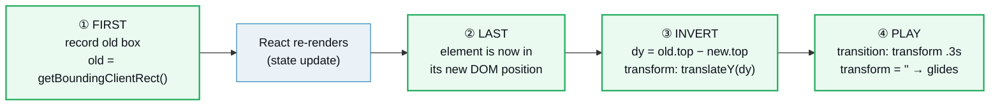
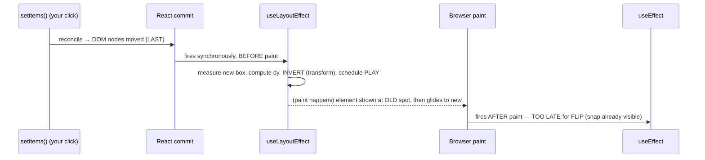

# CSS Animations in React (FLIP Technique)

> **Companion demo:** [`css_animations.html`](./css_animations.html) — open in a browser.
> It renders a reorderable list that glides (not snaps) using FLIP, plus a
> dark/light card that cross-fades on a state change. The gold-check clicks
> "move up" on Beta and asserts the order becomes [Beta, Alpha, Gamma].

---

## 0. TL;DR — the one idea

React has **no animation layer**. It mutates the DOM; the browser paints. You opt
into smoothness with CSS, and there are two very different problems:

1. **A property changes value** (color, size, opacity) → just add
   `transition: background 0.3s` and toggle the class/style on state. The browser
   fills the in-between frames. This is the 90% case.
2. **An element changes position** (a list reorders, a card expands, a grid
   reflows) → CSS transitions are **blind** to this. React re-renders, the box
   snaps to its new slot, and there is nothing to transition. **FLIP** fixes it by
   converting the position change into a `transform`, which the GPU animates cheaply.



FLIP = **F**irst, **L**ast, **I**nvert, **P**lay — coined by Paul Lewis (2015). It
is the engine inside Framer Motion's `layout` prop, `react-flip-toolkit`, and the
native View Transitions API. The whole trick: **measure before, invert with a
transform, animate the transform away.**

---

## 1. How it works — the two patterns

### Pattern A — state-driven CSS transitions (no measuring)

When only a *value* changes, you don't need FLIP. Drive the change from state and
let the `transition` CSS property interpolate:

```jsx
function ThemeCard() {
  var s = React.useState(true);
  var dark = s[0], setDark = s[1];
  return (
    <div
      onClick={function () { setDark(!dark); }}
      style={{
        background: dark ? '#0d1117' : '#f6f8fa',
        color:       dark ? '#e6edf3' : '#24292f',
        // THE one line that makes it animate:
        transition: 'background 0.3s ease, color 0.3s ease'
      }}
    >
      {dark ? '🌙 Dark' : '☀️ Light'}
    </div>
  );
}
```

React flips the `background`/`color` values on re-render; the browser sees the old
and new values differ with a `transition` declared, so it tweens between them.
Works for any **animatable CSS property** (`opacity`, `transform`, `width`,
`box-shadow`, …). No refs, no measuring, no `useLayoutEffect`.

### Pattern B — FLIP (animating a position/layout change)

When React reorders a keyed list, the DOM nodes **physically move**. There's no
property changing value to transition — the element is just somewhere else now.
FLIP turns that jump into a smooth glide:

```jsx
function FlipList() {
  var s = React.useState([
    { id: 1, text: 'Alpha' }, { id: 2, text: 'Beta' }, { id: 3, text: 'Gamma' }
  ]);
  var items = s[0], setItems = s[1];
  var positionsRef = React.useRef({});   // last-known box of each item, by id

  React.useLayoutEffect(function () {
    items.forEach(function (item) {
      var el = document.querySelector('[data-item-id="' + item.id + '"]');
      if (!el) return;

      var oldRect = positionsRef.current[item.id];     // FIRST
      var newRect = el.getBoundingClientRect();         // LAST

      if (oldRect) {
        var dy = oldRect.top - newRect.top;
        if (dy !== 0) {
          // INVERT — make it look like it never moved
          el.style.transition = 'none';
          el.style.transform  = 'translateY(' + dy + 'px)';
          el.offsetHeight; // force reflow → commit the inverted start state
          // PLAY — animate the transform away
          requestAnimationFrame(function () {
            el.style.transition = 'transform 0.3s ease';
            el.style.transform  = '';
          });
        }
      }
      positionsRef.current[item.id] = newRect;          // remember for next time
    });
  });

  function moveUp(index) {
    if (index === 0) return;
    var next = items.slice();
    var tmp = next[index - 1]; next[index - 1] = next[index]; next[index] = tmp;
    setItems(next);
  }
  // ...render <li key={item.id} data-item-id={item.id}> …
}
```

#### FLIP, step by step

| step | when | what the code does |
|---|---|---|
| **F**irst | *before* the change (stored from the previous render) | `positionsRef.current[id]` holds each item's old `getBoundingClientRect()` |
| **L**ast | after React re-renders, inside `useLayoutEffect` | read `el.getBoundingClientRect()` again — the element is already in its new slot |
| **I**nvert | same tick, before paint | `dy = old.top − new.top`; set `transform: translateY(dy)` so it *visually* sits back at the old spot |
| **P**lay | next animation frame | set `transition: transform .3s` and clear `transform` → the box glides from old to new |

The user only ever sees the **Play** frame onward: the element appears at its old
position and animates to the new one. The snap (Last) and the teleport back
(Invert) happen in the same synchronous `useLayoutEffect` tick, **before paint**,
so they're invisible.

---

## 2. Mechanism / internals — why it's `useLayoutEffect` and `transform`

### Why measure in `useLayoutEffect`, not `useEffect`

`useLayoutEffect` runs **synchronously after all DOM mutations, but before the
browser paints**. `useEffect` runs *after* paint. For FLIP that ordering is
load-bearing:



If you used `useEffect`, the browser would paint the new (snapped) layout first,
then your transform would kick in — the user sees a flash/jump. `useLayoutEffect`
blocks paint until your inverted transform is in place, so the snap never reaches
the screen. (Cost: `useLayoutEffect` is synchronous and blocks paint — only use it
when you genuinely read layout, which FLIP does. See
[`use_layout_effect`](./use_layout_effect.html).)

### Why `transform` (and not `top`/`left`)

Animating `top`, `left`, `width`, or `height` triggers **layout** on every frame —
the browser re-computes the position of that element *and every sibling*, then
re-paints. That's expensive and janky. `transform: translate(...)` /
`scale(...)` run on the **compositor** thread: they move an already-painted layer
without touching layout. So FLIP deliberately uses `transform` to express the
inverted delta — you get 60fps motion for free.

### Why `el.offsetHeight` (the forced reflow)

```js
el.style.transition = 'none';
el.style.transform  = 'translateY(' + dy + 'px)';   // INVERT
el.offsetHeight;                                    // ← force reflow
el.style.transition = 'transform 0.3s ease';        // PLAY
el.style.transform  = '';
```

Without the forced reflow, the browser may **batch** the `transform` write and the
later `transform = ''` into one style change — no transition fires, the element
just appears at the new spot. Reading a layout property (`offsetHeight`,
`getBoundingClientRect()`) in between forces the browser to flush pending style
writes, so the inverted position is *committed* before you start the transition.
(A single `requestAnimationFrame` often works too; the forced reflow is the
bulletproof version.)

### Stable `key`s are what makes FLIP possible

React reconciles a list by `key`. With **stable keys** (`key={item.id}`), reordering
makes React **move the same DOM node** to a new position — so `getBoundingClientRect()`
returns a *different* box than last time, and the delta is non-zero. FLIP animates.

With **unstable keys** (`key={index}`), React doesn't move nodes — it reuses the
node in place and just updates its text. The box never changes position, `dy` is
always 0, and **nothing animates**. This is the #1 silent FLIP failure (see
[Killer Gotchas](#4-killer-gotchas)). The `data-item-id` attribute is how the
effect re-finds the same physical node after the reorder.

---

## 3. CSS transition properties — the reference

For **Pattern A** (value changes), these are the knobs. `transition` is shorthand
for four sub-properties:

| property | example | meaning |
|---|---|---|
| `transition-property` | `background, color` (or `all`) | which properties animate |
| `transition-duration` | `0.3s` | how long the tween takes |
| `transition-timing-function` | `ease`, `ease-out`, `cubic-bezier(.4,0,.2,1)` | the easing curve |
| `transition-delay` | `0s` | wait before starting (great for staggered exits) |

```css
/* one-liner shorthand: property duration timing delay */
.card { transition: background 0.3s ease 0s, color 0.3s ease; }
```

**Picking a duration & easing:**

- **UI feedback** (hover, toggle): `120–250ms`, `ease-out` — fast, snappy.
- **Layout / enter** (FLIP play, expanding card): `250–450ms`, `ease` or a custom
  `cubic-bezier` with slight overshoot for a "springy" feel.
- **Page-level / shared-element** crossfades: `400–600ms`.
- Avoid `>600ms` for anything interactive — it starts to feel sluggish.

**What animates cheaply (compositor-friendly):** `transform` (`translate`/`scale`/
`rotate`), `opacity`, `filter`. These never trigger layout. **What's expensive:**
`top`/`left`/`width`/`height`/`margin`/`padding` — each frame triggers layout +
paint. Always prefer expressing motion as a `transform` (that's exactly what FLIP
does).

---

## 4. Killer Gotchas

| trap | symptom | fix |
|---|---|---|
| **Measuring in `useEffect`** | user sees a flash/jump — the snapped layout paints, *then* the transform applies | measure in **`useLayoutEffect`** (fires before paint). This is the single most common FLIP bug. |
| **Unstable `key`s** (`key={index}`) | nothing animates — items just swap text in place | use a stable id (`key={item.id}`). FLIP needs React to *move* the same DOM node; index keys make it reuse nodes in place, so the box never changes and `dy === 0`. |
| **Forgetting the forced reflow** | the transition doesn't fire — the element appears directly at the new spot | after writing the inverted `transform` with `transition:'none'`, force a flush (`el.offsetHeight` or `getBoundingClientRect()`) before setting the transition + clearing the transform. Or use a double `requestAnimationFrame`. |
| **First render animates from (0,0)** | on mount every item flies in from off-screen | on the **first** run `oldRect` is undefined → skip the invert/play, just record positions (the demo guards `if (oldRect)`). |
| **Position cache goes stale** | wrong delta after a parent re-mounts / window resizes | re-measure whenever the container size changes (`ResizeObserver`), and clear the ref if the component identity changes. |
| **Animating `top`/`width`** instead of `transform` | jank on low-end devices — every frame triggers layout of siblings | express the motion as `transform: translate/scale`; only those run on the compositor. |
| **Mount/unmount can't be transitioned by CSS alone** | React removes the node instantly — no exit animation plays | keep the node mounted, add an "exit" class to trigger the transition, and call `setItems(...)` to actually remove it on `transitionend`. (Or use AnimatePresence / View Transitions.) |
| **`transform` conflicts with existing styles** | your FLIP `translateY` clobbers an item's own `transform` (e.g. a hover scale) | read/restore the element's existing transform, or compose with a wrapper element so FLIP owns `transform` exclusively. |
| **Scrolling during FLIP** | `getBoundingClientRect()` is viewport-relative; mid-animation scroll shifts the math | FLIP is for layout changes, not scroll; disable FLIP during momentum scroll or recompute on `scroll`. |

---

### Cheat sheet

```jsx
// Pattern A — value change: drive from state, let CSS interpolate
<div
  onClick={() => setOn(!on)}
  style={{ background: on ? '#61dafb' : '#30363d',
           transition: 'background 0.3s ease' }}   // ← the one line
/>

// Pattern B — FLIP: position change → animate a transform
var positionsRef = React.useRef({});
React.useLayoutEffect(function () {                 // ① must be layout effect
  items.forEach(function (item) {
    var el = document.querySelector('[data-item-id="' + item.id + '"]');
    if (!el) return;
    var oldRect = positionsRef.current[item.id];    // FIRST
    var newRect = el.getBoundingClientRect();       // LAST
    if (oldRect) {
      var dy = oldRect.top - newRect.top;
      if (dy !== 0) {
        el.style.transition = 'none';               // INVERT
        el.style.transform  = 'translateY(' + dy + 'px)';
        el.offsetHeight;                            // ← forced reflow
        requestAnimationFrame(function () {         // PLAY
          el.style.transition = 'transform 0.3s ease';
          el.style.transform  = '';
        });
      }
    }
    positionsRef.current[item.id] = newRect;        // remember for next time
  });
});
// render:  <li key={item.id} data-item-id={item.id}> …  ← stable key is mandatory
```

**Decision ladder:**
1. Only a value changes (color/opacity/size) → **CSS `transition`** on state toggle. Done.
2. An element changes position/layout → **hand-rolled FLIP** in `useLayoutEffect`.
3. Need exit animations, drag, spring physics, shared elements across routes →
   **Framer Motion** (`<motion.div layout>`) — it wraps FLIP + springs +
   `AnimatePresence` for you ([`framer_motion_core`](./framer_motion_core.html)).
4. Cross-page / shared-element transitions the browser does for you →
   **View Transitions API** (`document.startViewTransition()`,
   [`view_transitions`](./view_transitions.html)).

---

## 🔗 Cross-references

- [`use_layout_effect`](./use_layout_effect.html) — **the prerequisite hook.** FLIP *must* measure in `useLayoutEffect` (fires synchronously after DOM mutation, before paint), not `useEffect` (fires after paint, too late). This bundle is the canonical "why" for that timing difference.
- [`use_ref_dom`](./use_ref_dom.html) — `useRef` holds the positions cache (`positionsRef.current[id]`) across renders without triggering re-renders, and `document.querySelector`/`getBoundingClientRect()` is the DOM-measurement skill FLIP is built on.
- [`view_transitions`](./view_transitions.html) — the native `document.startViewTransition()` API is *FLIP done by the browser* across the whole page (crossfades + shared elements). Reach for it instead of hand-rolled FLIP when you're animating route/layout changes.
- [`framer_motion_core`](./framer_motion_core.html) — `<motion.div layout>` runs FLIP for you (measure → invert → play), plus springs, gestures, and `AnimatePresence` exit animations. The library to reach for once hand-rolled FLIP gets complex.

## Sources

- Paul Lewis — "FLIP Your Animations" (2015), the original FLIP technique article. <https://aerotwist.com/blog/flip-your-animations/>
- React docs — `useLayoutEffect` reference: "fires before the browser repaints the screen… synchronously after all DOM mutations." <https://react.dev/reference/react/useLayoutEffect>
- Motion (formerly Framer Motion) — "Layout Animation | React FLIP & Shared Element": the `layout` prop implements FLIP automatically. <https://motion.dev/docs/react-layout-animations>
- Josh W. Comeau — "Animating the Unanimatable": a detailed walk-through of FLIP for list reordering in React. <https://www.joshwcomeau.com/react/animating-the-unanimatable/>
- CSS-Tricks — "Animating Layouts with the FLIP Technique": step-by-step FLIP with `getBoundingClientRect`. <https://css-tricks.com/animating-layouts-with-the-flip-technique/>
- MDN — `transition` CSS property & `getBoundingClientRect()`. <https://developer.mozilla.org/en-US/docs/Web/CSS/transition> · <https://developer.mozilla.org/en-US/docs/Web/API/Element/getBoundingClientRect>
