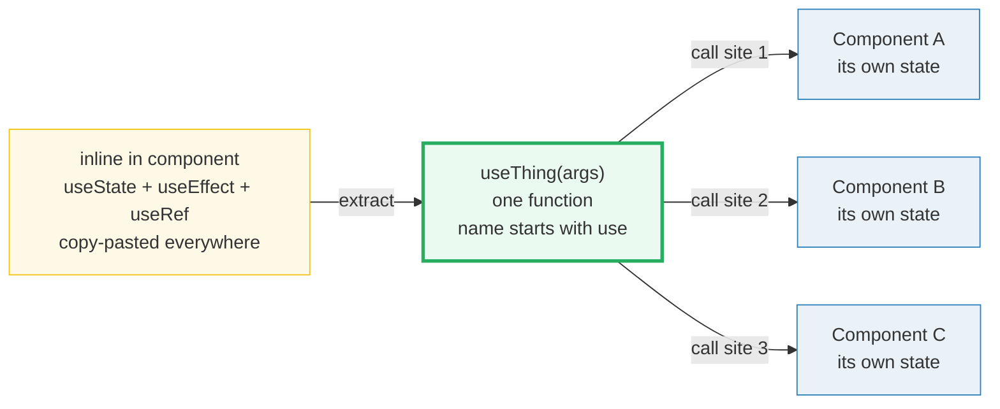
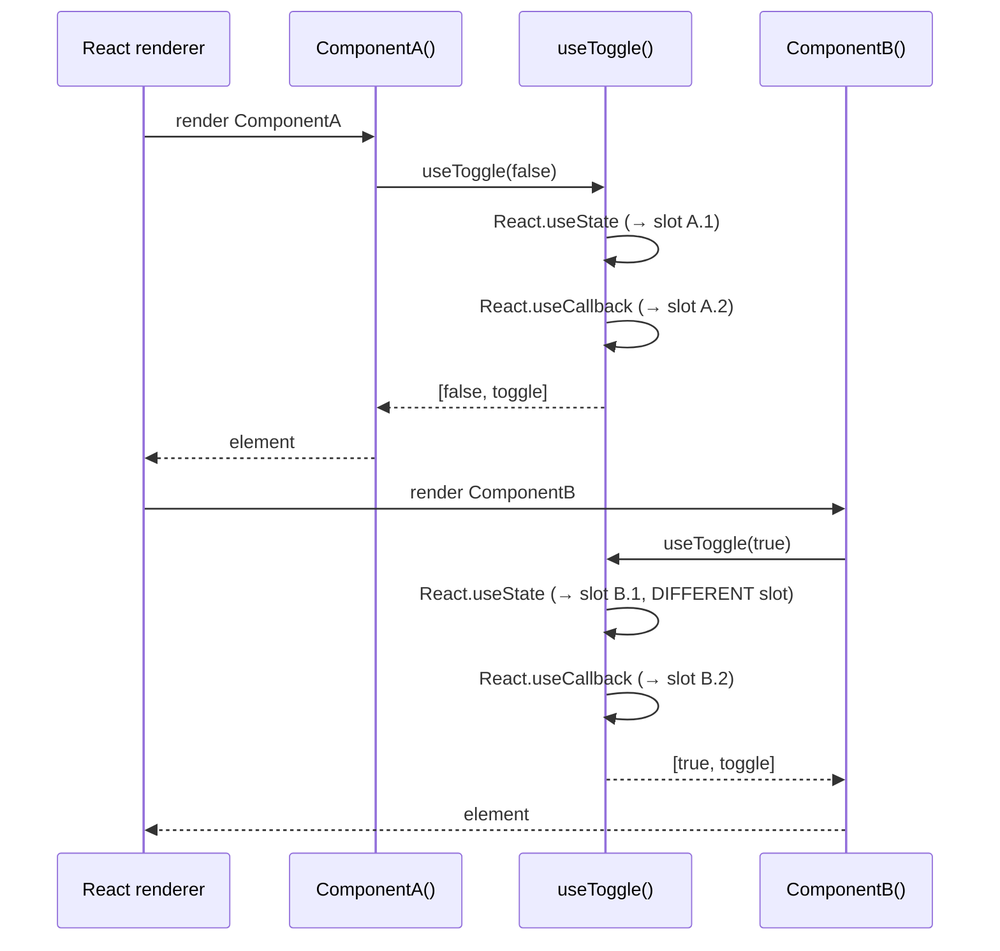

# Custom Hooks — reusable stateful logic

> **Companion demo:** [`custom_hooks.html`](./custom_hooks.html) — open in a browser.
> **React version:** 19.2.7 via ESM CDN + Babel standalone.

---

## 0. TL;DR — the one idea

> **The analogy:** built-in hooks (`useState`, `useEffect`, `useRef`, …) are
> Lego bricks. A **custom hook** is a small assembly you build out of those
> bricks — a self-contained unit of *stateful logic* you can snap into many
> components. The hook owns the wiring; each caller owns its own private state.



A custom hook is a **plain JavaScript function** whose name starts with `use` and
that may call other hooks. It does **not** inherit or share state — every
component that calls it gets its own independent slot. That is the whole point:
**shared logic, private state.**

---

## 1. How it works — the two rules

### Rule 1: the name must start with `use`

```javascript
// GOOD — the linter & Fast Refresh recognize this as a hook
function useToggle(initial) {
  var state = React.useState(initial);          // calls a real hook
  var toggle = React.useCallback(function () {
    state[1](function (v) { return !v; });
  }, []);
  return [state[0], toggle];
}

// BAD — looks like a regular function; linter cannot catch hook violations,
// and Fast Refresh will not hot-reload it correctly
function toggle(initial) { /* … same body … */ }
```

The `use` prefix is **load-bearing**. `eslint-plugin-react-hooks` keys off it
to enforce the Rules of Hooks inside the function, and React's Fast Refresh
uses it to decide whether a file edit should preserve component state.

### Rule 2: it may call other hooks (and must obey their rules)

```javascript
function usePrevious(value) {
  var ref = React.useRef(value);                 // a hook
  React.useEffect(function () {                  // another hook
    ref.current = value;
  }, [value]);
  return ref.current;
}
```

Inside a custom hook, the same Rules of Hooks apply: **call hooks at the top
level only**, never inside loops, conditions, or nested functions. React tracks
hook state by **call order**, so conditional calls corrupt that bookkeeping.

### Return shape — your choice

| Shape | When | Example |
|-------|------|---------|
| Single value | The hook exports one thing | `useNow() → Date` |
| `[value, setter]` array | Caller wants to rename parts | `const [on, flip] = useToggle(false)` |
| `{ a, b, c }` object | Many fields, caller picks | `const { count, inc, dec } = useCounter(0)` |

**Convention:** arrays for one concept (so callers can rename), objects for
many fields (so callers can omit what they don't need).

---

## 2. Mechanism — hooks compose like Lego

A custom hook does not "own" state the way a class instance field does. Each
hook call inside it is resolved against **the component currently rendering**.
When `ComponentA` calls `useToggle()`, the `useState` inside `useToggle` is
charged to `ComponentA`'s hook list. When `ComponentB` calls `useToggle()`,
it gets a *different* `useState` slot in `ComponentB`'s list.



This is why custom hooks are "just functions": React attributes every internal
hook call to whichever component is currently rendering. There is no shared
state, no singleton, no provider needed.

### The call-order invariant

React stores a component's hooks in a linked list, walked in **declaration
order**. Extracting hooks into a custom hook does not change that list — it
just groups a few consecutive entries behind a function call. If you later
wrap one of those calls in an `if`, you break the list, and state silently
shifts between hooks. The linter exists to prevent exactly this.

---

## 3. Common custom hooks catalog

| Hook | Wraps | Common use case |
|------|-------|-----------------|
| `useToggle(initial)` | `useState` | boolean on/off flags — modals, switches, accordions |
| `usePrevious(value)` | `useRef` + `useEffect` | access the previous value of any state/prop |
| `useCounter(initial)` | `useState` + `useCallback` | increment / decrement / reset with stable callbacks |
| `useDebounce(value, ms)` | `useState` + `useEffect` | delay a rapidly-changing value (search-as-you-type) |
| `useLocalStorage(key, init)` | `useState` + `useEffect` | persist state across reloads; lazy-init from storage |
| `useFetch(url)` | `useState` + `useEffect` | data fetching with `{data, loading, error}` |
| `useMediaQuery(query)` | `useState` + `useEffect` | subscribe to CSS breakpoints, re-render on change |
| `useEventListener(target, event, fn)` | `useRef` + `useEffect` | attach/detach listeners with correct cleanup |
| `useWindowSize()` | `useState` + `useEffect` | reactive `window.innerWidth / innerHeight` |
| `useMounted()` | `useRef` + `useEffect` | guard against setState-after-unmount warnings |

### `useToggle` — the canonical first hook

```javascript
function useToggle(initial) {
  var state = React.useState(initial);
  var value = state[0];
  var setValue = state[1];
  var toggle = React.useCallback(function () {
    setValue(function (v) { return !v; });        // functional update — safe
  }, []);
  return [value, toggle];                          // array — caller renames
}

// usage
var open = useToggle(false);
// open[0] === false; open[1]() flips it
```

### `usePrevious` — the ref + effect pattern

```javascript
function usePrevious(value) {
  var ref = React.useRef(value);
  React.useEffect(function () {
    ref.current = value;                           // runs AFTER paint
  }, [value]);
  return ref.current;                              // returns the PREVIOUS value
}
```

The effect runs *after* render commits, so on render N the ref still holds the
value from render N−1. That one-line ordering difference is the entire trick.

### `useCounter` — stable callbacks via `useCallback`

```javascript
function useCounter(initial) {
  var state = React.useState(initial);
  var count = state[0];
  var setCount = state[1];
  var increment = React.useCallback(function () { setCount(function (c) { return c + 1; }); }, []);
  var decrement = React.useCallback(function () { setCount(function (c) { return c - 1; }); }, []);
  var reset    = React.useCallback(function () { setCount(initial); }, [initial]);
  return { count: count, increment: increment, decrement: decrement, reset: reset };
}
```

`useCallback` with `[]` deps makes `increment`/`decrement` **stable** — they
keep the same identity across renders, so memoized children do not re-render
needlessly. `reset` depends on `initial`, so it only re-creates when `initial`
changes.

---

## 4. When to extract a custom hook

Extract when **any** of these is true:

- You call the same 2+ hooks with the same wiring in more than one component.
- A component's body is dominated by state/effect plumbing instead of JSX.
- You want to unit-test stateful logic in isolation (a hook is a function).
- Two unrelated components need to "remember the previous value" / "debounce"
  / "subscribe to a media query" — copy-paste is a smell.

Do **not** extract prematurely:

- A single `useState` used in one place — wrapping it adds indirection.
- Pure transforms with no hook calls — those are just helper functions, not
  hooks; drop the `use` prefix and name them plainly.

### The "two components" rule of thumb

If only one component ever uses the logic, keep it inline. The moment a second
component needs it — or the first component becomes hard to read — extract.
Custom hooks are a **refactoring tool**, not an architectural prerequisite.

---

## Killer Gotchas

| Trap | Symptom | Fix |
|------|---------|-----|
| **Name doesn't start with `use`** | Linter silent on violations; Fast Refresh loses state on edit | Always prefix with `use` — `useToggle`, not `toggle` |
| **Conditional hook call inside** | State jumps between hooks; "rendered fewer hooks than expected" crash | Move conditions outside the hook call, or call two different hooks and branch on the result |
| **Forgetting `useCallback` deps** | Stale closures — callbacks capture old state | List every reactive value in the deps array; let the linter catch omissions |
| **Treating the hook as a singleton** | "Why does Component B see Component A's state?" | Each call site gets its own state; to share state use Context or lift it up |
| **Side effects during render** | Double-fires in StrictMode, inconsistent state | Side effects belong in `useEffect` inside the hook, never in the body |
| **Returning a new object/array every render** | Memoized children re-render every time | Wrap factories in `useMemo` / `useCallback`, or return primitives |
| **Cleanup missing in `useEffect`** | Listeners/timeouts leak; setState-after-unmount warnings | Always return a cleanup function from effects that subscribe |
| **`useEffect` deps cause loops** | Infinite render loop; "Maximum update depth exceeded" | Don't setState unconditionally from an effect whose deps include the set value |
| **Calling a hook inside a callback** | "Invalid hook call" error | Hooks run while the component renders, never inside event handlers or timeouts |
| **Breaking call order by early return** | State desync; hooks count mismatch | Put all hook calls before any `return` statement |

### Cheat sheet

```javascript
// --- shape 1: single value
function useNow() {
  var s = React.useState(function () { return new Date(); });
  React.useEffect(function () {
    var id = setInterval(function () { s[1](new Date()); }, 1000);
    return function () { clearInterval(id); };         // cleanup!
  }, []);
  return s[0];
}

// --- shape 2: [value, setter] array
function useToggle(initial) {
  var s = React.useState(initial);
  var toggle = React.useCallback(function () { s[1](function (v) { return !v; }); }, []);
  return [s[0], toggle];
}

// --- shape 3: { fields } object
function useCounter(initial) {
  var s = React.useState(initial);
  var inc = React.useCallback(function () { s[1](function (c) { return c + 1; }); }, []);
  var dec = React.useCallback(function () { s[1](function (c) { return c - 1; }); }, []);
  var rst = React.useCallback(function () { s[1](initial); }, [initial]);
  return { count: s[0], increment: inc, decrement: dec, reset: rst };
}

// --- composition: hooks calling hooks
function useFancyCounter(initial) {
  var c = useCounter(initial);          // custom hook inside custom hook
  var prev = usePrevious(c.count);      // another custom hook
  return Object.assign({}, c, { prev: prev });
}
```

---

## 🔗 Cross-references

- [frontend/react: State & Hooks (useState)](../frontend/react/react_state_hooks.html) — the primitive `useToggle` and `useCounter` wrap; start here if hooks are new
- [frontend/react: Effects & Lists (useEffect)](../frontend/react/react_effects_lists.html) — the effect primitive `usePrevious`, `useDebounce`, and `useFetch` depend on
- [useReducer](./use_reducer.html) — the dispatch model; wrap it in a custom hook to ship reusable state machines
- [use_context](./use_context.html) — when a custom hook's state must be *shared* across the tree, lift it into Context
- [use_ref_dom](./use_ref_dom.html) — `useRef` mechanics that power `usePrevious` and `useEventListener`
- [use_layout_effect](./use_layout_effect.html) — the synchronous-effect variant some measurement hooks need instead of `useEffect`

---

## Sources

1. **React Docs — Reusing Logic with Custom Hooks**: https://react.dev/learn/reusing-logic-with-custom-hooks (official tutorial, custom hook extraction, 2024)
2. **React Docs — Rules of Hooks**: https://react.dev/warnings/invalid-hook-call-warning (why the `use` prefix and call order matter)
3. **React Docs — `useEffect` reference**: https://react.dev/reference/react/useEffect (the ref+effect pattern behind `usePrevious`)
4. **React Docs — Extracting state logic into a reducer**: https://react.dev/learn/extracting-state-logic-into-a-reducer (pairing custom hooks with reducers)
5. **Kent C. Dodds — React Hooks: useCustomHook**: https://kentcdodds.com/blog/react-hooks-fundamentals (when and why to extract custom hooks)
