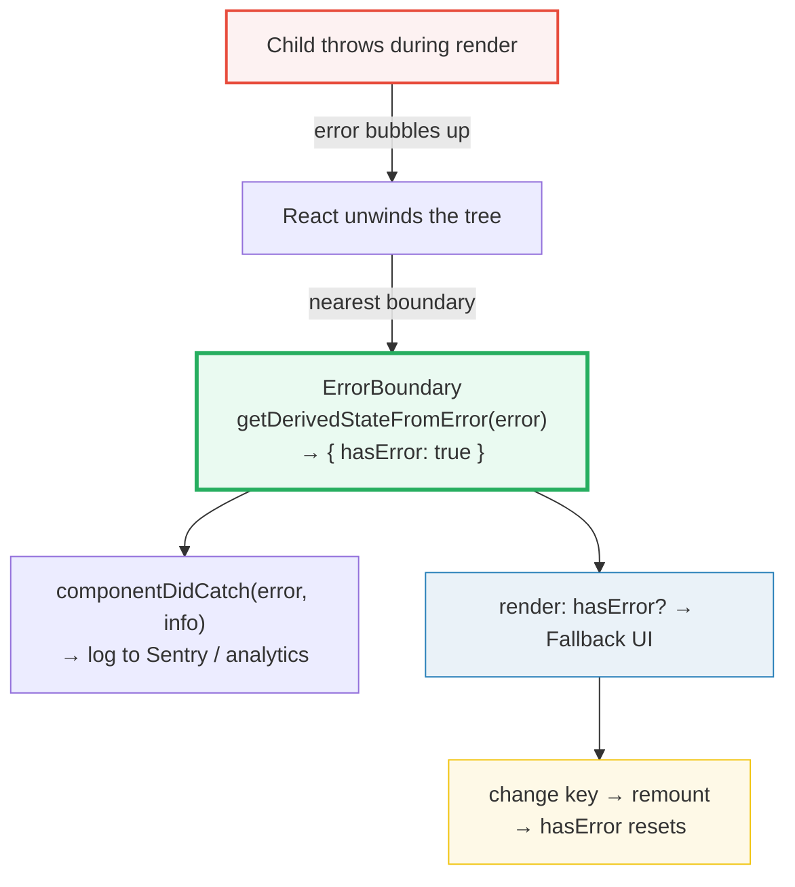
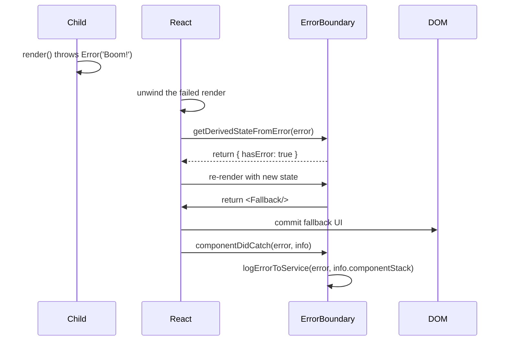

# Error Boundaries — the catch net

> **Companion demo:** [`error_boundaries.html`](./error_boundaries.html) — open in a browser.
> **React version:** 19.2.7 via ESM CDN + Babel standalone.

---

## 0. TL;DR — the one idea

> **The analogy:** `try/catch` but for rendering. A thrown error in a component's
> render unmounts the **entire** React tree — the whole screen goes white. An
> **error boundary** is a class component that wraps a subtree and catches those
> render-phase errors, showing a fallback UI instead of crashing the app.



A class component becomes an error boundary by defining **either** (or both) of:
- `static getDerivedStateFromError(error)` — **pure**, returns the new state
- `componentDidCatch(error, info)` — **side effect**, logs the error

**There is no hook equivalent.** Only class components can be error boundaries.

---

## 1. How it works

### The minimal error boundary

```jsx
class ErrorBoundary extends React.Component {
  constructor(props) {
    super(props);
    this.state = { hasError: false };
  }

  // PURE: React calls this when a child throws during render.
  // Return the state update that switches to fallback UI.
  static getDerivedStateFromError(error) {
    return { hasError: true };
  }

  // SIDE EFFECT: React calls this after committing the fallback.
  // Use it to log to Sentry, analytics, etc.
  componentDidCatch(error, info) {
    logErrorToService(error, info.componentStack);
  }

  render() {
    if (this.state.hasError) {
      return this.props.fallback || <div>Something went wrong.</div>;
    }
    return this.props.children;
  }
}

// Usage — wrap any subtree:
<ErrorBoundary fallback={<h1>💥</h1>}>
  <MyWidget />
</ErrorBoundary>
```

### The two lifecycle methods — what each does

| Method | Called when | Purpose | Pure? | Called during |
|--------|-------------|---------|-------|---------------|
| `static getDerivedStateFromError(error)` | A child throws during render | Return `{ hasError: true }` to trigger fallback | **YES** — no side effects | render phase |
| `componentDidCatch(error, info)` | After the fallback commits | Log to Sentry, analytics, `console.error` | **NO** — side effects OK | commit phase |

> **Why split?** `getDerivedStateFromError` runs during the render phase (must be
> pure — no `console.log`, no network calls). `componentDidCatch` runs after
> commit (safe for side effects). React calls them in this order: first
> `getDerivedStateFromError` (to compute the new state), then re-renders with the
> fallback, then `componentDidCatch` (to log).

### Recovering — the `key` trick

An error boundary stays in the error state until it unmounts. The canonical
recovery pattern: **change the `key` prop** to force a remount:

```jsx
function App() {
  const [resetKey, setResetKey] = React.useState(0);
  return (
    <>
      <ErrorBoundary key={resetKey}>
        <FlakyComponent />
      </ErrorBoundary>
      <button onClick={() => setResetKey(k => k + 1)}>Reset</button>
    </>
  );
}
```

Changing `key` unmounts the old boundary (with `hasError: true`) and mounts a
fresh one (`hasError: false`). The children re-render from scratch.

> **Why not `setState({ hasError: false })`?** You *can* do this from inside the
> boundary (e.g. a "Try again" button in the fallback that calls
> `this.setState({ hasError: false })`). But the children's internal state is
> already gone — they were unmounted when the error was caught. The `key` trick
> is cleaner because it resets everything uniformly.

---

## 2. The class component lifecycle (error boundary context)



The key property: **`getDerivedStateFromError` fires before the fallback is
committed** (so React can decide what to render), while **`componentDidCatch`
fires after** (so side effects run against the real DOM). If
`getDerivedStateFromError` itself throws, the error propagates to the *next*
ancestor boundary — it does NOT catch its own errors.

### `info.componentStack`

The second argument to `componentDidCatch` is an `info` object with a
`componentStack` string — a stack trace showing **which component** threw and all
its parents:

```
    in BombComponent (created by App)
    in ErrorBoundary (created by App)
    in App
```

In production, component names are minified — decode with sourcemaps the same
way you decode JavaScript stacks.

---

## 3. What catches vs what doesn't (the critical table)

Error boundaries are **not** a general-purpose `try/catch`. They only catch
errors in the **React render pipeline**:

| Error source | Caught? | Handle with |
|-------------|---------|-------------|
| Component render (JSX, function body) | **YES** | — |
| Lifecycle methods (`constructor`, `render`, `componentDidMount`, etc.) | **YES** | — |
| Child component constructors + render | **YES** | — |
| `static getDerivedStateFromError` / `componentDidCatch` (errors in the boundary itself) | **NO** | A parent boundary |
| **Event handlers** (`onClick`, `onChange`, `onSubmit`…) | **NO** | `try / catch` inside the handler |
| **Async code** (`fetch`, `await`, `.then()`) | **NO** | `.catch()` or `try / catch` in `async` |
| **`setTimeout` / `setInterval` / `requestAnimationFrame`** | **NO** | `try / catch` inside the callback |
| **`useEffect` / `useLayoutEffect` callbacks** | **NO** | `try / catch` inside the effect |

> **Why event handlers aren't caught:** event handlers run *outside* React's
> render phase. React calls your `onClick` function directly — it's not part of
> the render pipeline. If it throws, it's a regular JavaScript exception, not a
> render error. Use `try/catch`:
>
> ```jsx
> function SafeButton() {
>   const handleClick = () => {
>     try { riskyOperation(); }
>     catch (e) { setError(e.message); }
>   };
>   return <button onClick={handleClick}>Go</button>;
> }
> ```

---

## 4. React 19 error handling improvements

React 19 changed how errors are reported to reduce duplicate logs and give you
more control:

### Errors in render are NOT re-thrown

In React 18 and earlier, caught errors were re-thrown, producing duplicate
console output. React 19 fixed this:

| Error type | React 18 behavior | React 19 behavior |
|-----------|-------------------|-------------------|
| **Uncaught** (no boundary) | re-thrown → `console.error` | reported to `window.reportError` |
| **Caught** (by boundary) | re-thrown → `console.error` | reported to `console.error` (once) |

### `onCaughtError` and `onUncaughtError` root options

React 19 added two new callbacks to `createRoot` and `hydrateRoot`:

```jsx
const root = createRoot(document.getElementById('root'), {
  onUncaughtError: (error, errorInfo) => {
    // errors NOT caught by any boundary
    Sentry.captureException(error);
  },
  onCaughtError: (error, errorInfo) => {
    // errors caught by a boundary
    console.warn('Boundary caught:', error.message, errorInfo.componentStack);
  }
});
```

This lets you customize error reporting at the root level — useful for
suppressing noisy dev-mode logs or routing to different services based on
whether the error was caught.

### Still no hook equivalent

React 19 does **not** add a `useErrorBoundary` hook. The React team's
recommendation remains: write **one** `ErrorBoundary` class component and reuse
it everywhere, or use the [`react-error-boundary`](https://github.com/bvaughn/react-error-boundary)
package which wraps the pattern with a clean API (`onError`, `resetKeys`,
`useErrorBoundary` hook).

---

## Killer Gotchas

| Trap | Symptom | Fix |
|------|---------|-----|
| **Expecting boundary to catch event handler errors** | Error in `onClick` crashes the app; boundary doesn't fire | Event handlers run outside render — use `try/catch` inside the handler |
| **Expecting boundary to catch async/await errors** | `fetch().then()` rejection not caught; boundary silent | Wrap in `try/catch` (async) or `.catch()` (promise chain) |
| **Error in the boundary's own `render`** | Parent boundary catches it (or app crashes if none) | Keep fallback UI dead-simple; don't read from `this.props.children` in fallback |
| **Can't reset after error** | Boundary stays in `hasError: true` forever | Change the `key` prop to remount, or add a "Try again" button that calls `this.setState({ hasError: false })` |
| **Only one boundary at the app root** | One error blanks the entire page, even unrelated widgets | Place boundaries **granularly** around widgets, routes, panels — not just at the root |
| **`getDerivedStateFromError` with side effects** | Unpredictable behavior, double-logging | It must be **pure** — only return state. Put logging in `componentDidCatch` |
| **Forgetting `componentDidCatch` entirely** | No error telemetry in production | Define both methods: `getDerivedStateFromError` for UI, `componentDidCatch` for logging |
| **Children's state is lost on catch** | User input / scroll position gone after recovery | The boundary unmounts children on catch. Lift critical state up, or use `key` remount + restore from parent |
| **Using function component as boundary** | Boundary never catches; errors propagate | Only **class components** with the lifecycle methods work. No hook exists yet |
| **Dev mode logs are noisy** | Console fills with caught errors in development | React 19's `onCaughtError` lets you silence them; in production, caught errors are quieter |

### Cheat sheet

```jsx
// ── The minimal error boundary ──
class ErrorBoundary extends React.Component {
  state = { hasError: false };

  static getDerivedStateFromError(error) {
    return { hasError: true };          // PURE — trigger fallback
  }

  componentDidCatch(error, info) {
    logToSentry(error, info.componentStack); // SIDE EFFECT — telemetry
  }

  render() {
    if (this.state.hasError) return this.props.fallback;
    return this.props.children;
  }
}

// ── Usage: wrap subtrees granularly ──
<ErrorBoundary fallback={<ErrorScreen />}>
  <Dashboard />
</ErrorBoundary>

// ── Recovery: remount via key ──
function App() {
  const [key, setKey] = useState(0);
  return (
    <>
      <ErrorBoundary key={key}><Widget /></ErrorBoundary>
      <button onClick={() => setKey(k => k + 1)}>Reset</button>
    </>
  );
}

// ── React 19: root-level error callbacks ──
createRoot(el, {
  onCaughtError: (err, info) => Sentry.captureException(err),
  onUncaughtError: (err, info) => Sentry.captureException(err),
});

// ── Decision table ──
// render throws?          → boundary catches ✓
// event handler throws?   → try/catch in handler ✗ boundary
// async/promise rejects?  → try/catch or .catch() ✗ boundary
// effect throws?          → try/catch in effect ✗ boundary
```

---

## 🔗 Cross-references

- [use_reducer](./use_reducer.html) — `useReducer` pairs naturally with error boundaries: dispatch a `{ type: 'ERROR' }` action to show the fallback UI, or use the reducer to track error state alongside data state
- [react19_actions](./react19_actions.html) — React 19 Actions (`useActionState`, `useOptimistic`) handle async errors differently: they surface errors as state, not as thrown exceptions — no boundary needed for form submission errors
- [react_effects_lists](../frontend/react/react_effects_lists.html) — `useEffect` errors are NOT caught by boundaries: effects run after commit, outside the render pipeline — they need their own `try/catch`
- [use_context](./use_context.html) — Context providers are good candidates for boundary wrapping: if a consumer throws during render, a boundary around the provider subtree prevents a full crash

---

## Sources

1. **React Docs — Error Boundaries (Component reference)**: https://react.dev/reference/react/Component#catching-rendering-errors-with-an-error-boundary (`getDerivedStateFromError`, `componentDidCatch`, `info.componentStack`; "There is no direct equivalent for `static getDerivedStateFromError` in function components yet")
2. **React 19 Upgrade Guide — Errors in render are not re-thrown**: https://react.dev/blog/2024/04/25/react-19-upgrade-guide#errors-in-render-are-not-re-thrown (uncaught → `window.reportError`, caught → `console.error`; new `onCaughtError` / `onUncaughtError` root options)
3. **React Docs — `createRoot` options**: https://react.dev/reference/react-dom/client/createRoot (`onCaughtError`, `onUncaughtError` callbacks for custom error handling at the root level)
4. **`react-error-boundary` package**: https://github.com/bvaughn/react-error-boundary (the community-standard wrapper: `ErrorBoundary`, `useErrorBoundary`, `resetKeys` — recommended by React docs as the hook-friendly alternative)
5. **Kent C. Dodds — Use react-error-boundary to handle errors**: https://kentcdodds.com/blog/use-react-error-boundary-to-handle-errors-in-react (why a single reusable boundary class is the pragmatic approach; event handler errors need try/catch)
