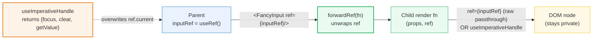
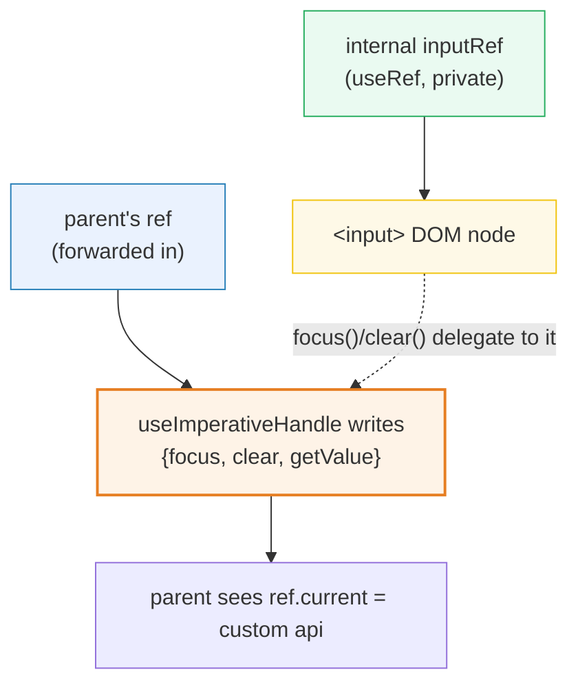

# forwardRef & useImperativeHandle

> **Companion demo:** [`forward_ref.html`](./forward_ref.html) — open in a browser. The
> embedded gold-check clicks `focus()` / `getValue()` / `clear()` on the child's
> exposed API and asserts each one drove the real DOM.

---

## 0. TL;DR — the one idea

`ref` is a **special prop** that React intercepts before your function component ever
sees it (React 18 and earlier silently drop it). `React.forwardRef` unwraps it: the
parent's `ref` arrives as the **second argument** `(props, ref)`, so the child can
attach it to a DOM node. `useImperativeHandle` then **narrows** what that ref exposes —
instead of leaking the raw `<input>`, the child returns a curated API object.



The parent ends up with `inputRef.current = { focus(), clear(), getValue() }` — a
**concierge API**, not a DOM node. The child keeps its markup private.

---

## 1. How it works

### Step 1 — `forwardRef` makes `ref` reachable

```jsx
var FancyInput = React.forwardRef(function (props, ref) {
  return <input ref={ref} className="fancy" {...props} />;
});

// parent
var inputRef = React.useRef();
<FancyInput ref={inputRef} />
// inputRef.current === the <input> DOM element
```

`forwardRef` is just a marker wrapper. When React renders a `forwardRef` element, it
passes the parent's `ref` into the render function as the 2nd argument instead of
discarding it. You can attach it straight to a DOM node (raw passthrough) **or** hand
it to `useImperativeHandle`.

### Step 2 — `useImperativeHandle` curates the API

```jsx
var FancyInput = React.forwardRef(function (props, ref) {
  var inputRef = React.useRef();

  React.useImperativeHandle(ref, function () {
    return {
      focus:    function () { inputRef.current.focus(); },
      clear:    function () { inputRef.current.value = ''; },
      getValue: function () { return inputRef.current.value; }
    };
  });

  return <input ref={inputRef} />;
});

// parent calls the custom API — never touches the DOM
inputRef.current.focus();
inputRef.current.getValue();
```

The internal `inputRef` stays **private** to the child. The parent's `ref` only sees
the three methods the factory returned — same encapsulation as a class's `public` vs
`private`.

### Signature

```
React.forwardRef(render)                          // render = (props, ref) => ReactNode
React.useImperativeHandle(ref, createHandle, deps?)  // createHandle = () => handle
```

`useImperativeHandle` is a **hook**: it runs the factory and writes the result into
`ref.current` during the commit phase. Pass a `deps` array (3rd arg) to rebuild the
handle only when deps change; omit it and it rebuilds every render (the safe default).

---

## 2. Mechanism / internals

### Why `ref` is special

Every other prop flows through `props`. `ref` (and `key`) are **reserved** — React
pulls them off the element before constructing `props`. For class components React
assigns `ref` to the instance; for function components (pre-19) there was no instance,
so `ref` had nowhere to go and React warned. `forwardRef` gives the render function a
slot to receive it explicitly.

### The two refs in a curated-handle child



The child holds **two** refs: the private `inputRef` (pointing at the DOM) and the
forwarded `ref` (pointing at the parent's API object). `useImperativeHandle` is the
bridge — its factory closes over `inputRef` so the public methods can drive the
private node.

### Order of operations on mount

1. React renders the `forwardRef` element, calls `render(props, ref)`.
2. The child's `useRef()` creates the internal ref; React attaches the `<input>` to it.
3. `useImperativeHandle` runs its factory and assigns the result to the parent's
   `ref.current` during commit (a layout-phase effect, like `useLayoutEffect`).
4. The parent now reads `ref.current.focus` — the custom API.

### React 19 — `ref` as a regular prop

React 19 lets you accept `ref` directly on function components, no wrapper:

```jsx
function FancyInput({ ref, ...props }) {        // ref is just a prop now
  return <input ref={ref} {...props} />;
}
<FancyInput ref={inputRef} />                   // works identically
```

`forwardRef` is **not deprecated** in 19 — it still works everywhere — but new code
can skip it. `useImperativeHandle` still applies: pass the `ref` prop into it the same
way. Libraries authored for 18+ compatibility keep `forwardRef` because it's the only
thing that worked before 19.

---

## 3. Killer Gotchas

| trap | symptom | fix |
|------|---------|-----|
| `ref` ignored on a plain function component (pre-19) | `ref.current` is `null`, React warns "Function components cannot be given refs" | wrap with `React.forwardRef`, or upgrade to React 19 and accept `{ ref }` as a prop |
| call `useImperativeHandle` without `forwardRef` | `ref` argument is `undefined`, the parent's ref never fills | the parent must pass `ref` THROUGH a `forwardRef` wrapper (or React 19 prop) — a raw function gets no ref to write into |
| raw passthrough **and** `useImperativeHandle` on the same `ref` | last writer wins; usually the handle clobbers the DOM node | pick one: either attach `ref` to the node, OR pass it to `useImperativeHandle` — not both |
| stale methods in the handle | parent calls `.getValue()` but reads old state | pass a `deps` array, OR keep the factory pure (read from the internal ref at call time, not capture) |
| `ref.current` is `null` on first render of the parent | child hasn't committed yet | guard calls: `if (ref.current) ref.current.focus()`, or trigger from an event (commit is done by then) |
| forwarding through a `memo`'d child | ref gets stripped | `React.memo(forwardRef(...))` — memo wraps forwardRef, not the other way; order matters |
| strict-mode double-invoke of the factory | handle factory runs twice (dev only) | harmless — `useImperativeHandle` is idempotent; production runs once |
| expecting `ref` to trigger a re-render | parent state never updates when child internals change | refs are non-reactive by design — call a `setState` in the public method if the parent must re-render |

### When you DON'T need a ref at all

Before reaching for `forwardRef`, ask if the parent can pass a callback prop instead:
`<FancyInput onEnter={handleEnter} />`. Controlled props (`value` + `onChange`) cover
most cases. Reach for a forwarded ref only when the parent must imperatively drive the
child (focus, scroll, measure, integrate with a non-React lib).

---

## Cheat sheet

```jsx
// 1. raw passthrough — parent owns the DOM node
var Box = React.forwardRef((props, ref) => <div ref={ref} {...props} />);

// 2. curated API — parent sees only what you publish
var Input = React.forwardRef(function (props, ref) {
  var el = React.useRef();
  React.useImperativeHandle(ref, function () {
    return {
      focus: function () { el.current.focus(); },
      clear: function () { el.current.value = ''; },
      get:   function () { return el.current.value; }
    };
  }, []);                              // 3rd arg = deps; [] = build once
  return <input ref={el} />;
});

// 3. React 19 — skip the wrapper, accept ref as a prop
function Input19({ ref }) {
  return <input ref={ref} />;
}

// parent (same for all three)
var r = React.useRef();
<Input ref={r} />;
r.current.focus();                     // method (curated) OR DOM node (passthrough)
```

**Mental model:** `forwardRef` is the mail slot that lets `ref` into a function
component; `useImperativeHandle` is the reception desk that decides which methods get
announced. Together they let a parent imperatively drive a child without ever seeing
its DOM.

---

## 🔗 Cross-references

- [`use_ref_dom.html`](./use_ref_dom.html) — **the foundation.** `useRef` gives a
  component access to its OWN DOM node; `forwardRef` is how that same access crosses
  the parent→child boundary. Read this first if `ref.current` feels fuzzy.
- [`compound_components.html`](./compound_components.html) — **sibling pattern.**
  Compound components share state through Context; `forwardRef` + `useImperativeHandle`
  share imperative control through a ref. Library-grade components (selects, dialogs)
  use both: Context for reactive state, a forwarded ref for the parent's imperative API.
- [`error_boundaries.html`](./error_boundaries.html) — **class-only escape hatches.**
  Error boundaries require a class component; `forwardRef` is the bridge when you need
  to wrap a class boundary around function children and still forward their refs
  cleanly (common in HOC/guard patterns).

---

## Sources

- React docs — **`forwardRef`**: https://react.dev/reference/react/forwardRef
  (verified 2026-06). Documents the `(props, ref)` signature, the React 19 ref-as-prop
  change, and the `memo(forwardRef(...))` ordering rule.
- React docs — **`useImperativeHandle`**: https://react.dev/reference/react/useImperativeHandle
  (verified 2026-06). Documents the `createHandle` factory, the optional `deps` array,
  and that the handle replaces `ref.current` during commit.
- React blog — **React 19 Upgrade Guide: ref as a prop**:
  https://react.dev/blog/2024/04/25/react-19-upgrade-guide (verified 2026-06). Confirms
  that in 19, function components can receive `ref` directly and `forwardRef` remains
  supported (not deprecated) for backwards compatibility.
