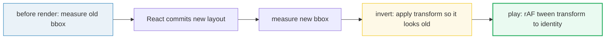

# Framer Motion Core

> **Companion demo:** [`framer_motion_core.html`](./framer_motion_core.html) — open in a browser.
> Watch a hand-rolled `requestAnimationFrame` tween loop reproduce `<motion.div animate>`, `variants`, and `whileHover` end-to-end.

---

## 0. TL;DR — the one idea

Framer Motion (now just **"Motion"**, `motion/react`) is a declarative skin over **one** imperative mechanism: a `requestAnimationFrame` loop that reads the current animated value, eases toward the target, and writes `el.style` every frame. React re-renders only when the **target** changes; the per-frame writes bypass React entirely.

```mermaid
graph LR
    A["<motion.div animate={{x:80}} />"] -->|prop change| B["motion component stores target"]
    B --> C["useEffect detects change"]
    C --> D["read current value from DOM"]
    D --> E["start rAF loop"]
    E --> F["frame: eased = easeOut(t)*to-from<br/>el.style.transform = translateX(eased px)"]
    F -->|t &lt; 1| E
    F -->|t = 1| G["animation complete"]
    H["React re-render"] -.->|only on target change| A
    style A fill:#eaf2f8,stroke:#2980b9
    style E fill:#eafaf1,stroke:#27ae60,stroke-width:2px
    style F fill:#fef9e7,stroke:#f1c40f
    style H fill:#fbeaea,stroke:#c0392b
```



The whole library is optimisations on top of this loop: motion values (no React state), springs (a different integrator in the same loop), layout animations (FLIP — measure, invert, play), `AnimatePresence` (defer unmount until exit tween finishes). Master the loop and every Motion API becomes obvious.

---

## 1. The motion component API

`motion.div` is a `<div>` plus animation props. Motion ships a component for every HTML/SVG element (`motion.span`, `motion.circle`, …) and `motion.create(Component)` to wrap your own.

```jsx
import { motion } from "motion/react";

<motion.div
  initial={{ opacity: 0, x: -20 }}   // first-frame values (enter animation origin)
  animate={{ opacity: 1, x: 0 }}      // target; re-tweens on every change
  exit={{ opacity: 0 }}               // target before unmount (needs AnimatePresence)
  transition={{ duration: 0.4, ease: "easeOut" }}
  whileHover={{ scale: 1.05 }}        // gesture target stacked on top of animate
  style={{ x: 0 }}                    // style accepts independent transform values
/>
```

| prop | purpose | re-tweens when |
|---|---|---|
| `initial` | origin of the enter animation (or `false` to disable) | mount |
| `animate` | the live target | every render where this prop changes |
| `exit` | target on unmount | element removed inside `<AnimatePresence>` |
| `transition` | timing (`type`, `duration`, `ease`, `delay`, `staggerChildren`) | every animation |
| `variants` | named target objects, switchable by string label | label changes |
| `whileHover` / `whileTap` / `whileFocus` / `whileDrag` / `whileInView` | gesture- or viewport-driven targets | gesture starts/ends |
| `layout` / `layoutId` | FLIP animation of size/position | layout changes |
| `style` | normal style + `useMotionValue` values + independent transforms | value change |

**The performance trick:** Motion writes `transform` and `opacity` straight to the DOM on every frame — it does **not** call `setState`. A 60fps animation causes zero React re-renders. Use `useMotionValue` for values that change every frame if you want the same property in your own code.

---

## 2. Variants — named animation states

A `variant` is a named target object. Instead of passing `animate={{...}}` you pass `animate="label"` and Motion looks up the label in `variants`. The win: **children inherit the parent's active label automatically**, so you orchestrate from one place.

```jsx
const list = {
  hidden: { opacity: 0 },
  visible: { opacity: 1, transition: { staggerChildren: 0.08 } }   // staggered
};
const item = {
  hidden: { opacity: 0, y: 16 },
  visible: { opacity: 1, y: 0 }
};

<motion.ul variants={list} initial="hidden" animate="visible">
  <motion.li variants={item} />   {/* inherits "visible" from parent */}
  <motion.li variants={item} />
</motion.ul>
```

Variants unlock four features raw `animate` can't:
1. **Propagation** — children follow the parent's label without re-stating it.
2. **Staggering** — `staggerChildren`, `delayChildren` on the parent.
3. **Dynamic values** — variant is a function `(custom) => target`, fed by the `custom` prop.
4. **Transition per state** — each named target can carry its own `transition`.

```jsx
const variants = {
  visible: (i) => ({ opacity: 1, transition: { delay: i * 0.1 } })
};
<motion.li custom={2} variants={variants} animate="visible" />
```

---

## 3. Gestures — whileHover, whileTap, whileFocus, whileDrag, whileInView

Gesture props are temporary targets layered over `animate`. While the gesture is active the component tweens to the gesture target; on release it tweens back to the `animate` target. They accept either a target object or a variant label.

```jsx
<motion.button whileHover={{ scale: 1.05 }} whileTap={{ scale: 0.95 }} />
<motion.section whileInView={{ opacity: 1 }} viewport={{ once: true, amount: 0.4 }} />
```

| gesture | fires on | typical use |
|---|---|---|
| `whileHover` | pointer enters | `scale: 1.05`, highlight colour |
| `whileTap` | pointer down | `scale: 0.95` — confirms the press |
| `whileFocus` | element gains focus | outline / ring |
| `whileDrag` | `drag` is active | shadow / tilt |
| `whileInView` | enters viewport (IntersectionObserver) | scroll-triggered reveal |

`whileInView` powers scroll-reveal sections; pair it with `viewport={{ once: true }}` so the animation doesn't replay on scroll-back.

---

## 4. Transitions — tween vs spring

The `transition` prop selects the integrator inside the rAF loop. Two families:

```jsx
// Tween — time-based, ends exactly at `duration`
<motion.div animate={{ x: 200 }} transition={{ duration: 0.5, ease: [0.22, 1, 0.36, 1] }} />

// Spring — physics-based, no fixed duration; settles when velocity ≈ 0
<motion.div animate={{ x: 200 }} transition={{ type: "spring", stiffness: 200, damping: 20 }} />
```

| | tween | spring |
|---|---|---|
| `type` | default (omit) or `"tween"` | `"spring"` |
| duration | explicit (`duration` seconds) | emergent — from stiffness/damping |
| feel | precise, designable | natural, organic, overshoots |
| interrupts | jump to new tween | inherits velocity — **no jank on re-interrupt** |
| best for | UI state changes, fades, slides | drags, gestures, physical motion |

The killer feature of springs: **velocity handoff**. When you re-target mid-flight a spring carries the current velocity into the new animation, so interrupted gestures feel smooth. A tween restarts from rest, which is why interrupting a long tween looks janky.

Other transition options that work for both: `delay`, `repeat` (`Infinity`, `reverse`, `loop`), `repeatDelay`, `ease` (named or cubic-bezier array).

---

## 5. AnimatePresence — exit animations

React unmounts children synchronously, so you cannot normally animate a component before it leaves the tree. `AnimatePresence` defers the unmount until every child's `exit` animation finishes.

```jsx
<AnimatePresence>
  {isOpen && (
    <motion.div
      key="modal"
      initial={{ opacity: 0, scale: 0.9 }}
      animate={{ opacity: 1, scale: 1 }}
      exit={{ opacity: 0, scale: 0.9 }}
    />
  )}
</AnimatePresence>
```

Rules:
- The conditional child must have a **stable, unique `key`** — AnimatePresence tracks children by key.
- `AnimatePresence` only animates **direct** children.
- For list reordering / shared-element transitions, use `layout` or `layoutId` (next section) — `AnimatePresence` is only for mount/unmount.

---

## 6. Layout animations — `layout` and `layoutId`

Set `layout` and Motion auto-animates any change to the element's size or position caused by a re-render. The technique is **FLIP** (First, Last, Invert, Play):



```jsx
{tabs.map(t => (
  <motion.button key={t} onClick={select(t)} layout>
    {t}
    {t === selected && <motion.div layoutId="underline" className="underline" />}
  </motion.button>
))}
```

`layoutId` is the magic for shared-element transitions: two elements with the same `layoutId` in different positions crossfade and translate between each other (think a card morphing into a detail view).

Pitfalls:
- **Don't `layout` a subtree with thousands of nodes** — every layout change measures every child.
- Pass `layoutDependency` to skip measurements on renders you know didn't change layout.
- Inside scrollable or `position: fixed` parents, mark them with `layoutScroll` / `layoutRoot` so Motion measures their offset.

---

## 7. Re-implementing the core (what the demo proves)

The demo in [`framer_motion_core.html`](./framer_motion_core.html) reduces Motion to ~20 lines:

```js
function easeOut(t) { return 1 - Math.pow(1 - t, 3); }

function rafAnimate(from, to, duration, set) {
  var startTime = performance.now();
  function frame(now) {
    var t = Math.min((now - startTime) / duration, 1);
    set(from + (to - from) * easeOut(t));
    if (t < 1) requestAnimationFrame(frame);
  }
  requestAnimationFrame(frame);
}

// motion.div animate={{ x: pos }} becomes:
React.useEffect(function () {
  var el = ref.current;
  var m = (el.style.transform || "").match(/-?\d+\.?\d*/);
  var from = m ? parseFloat(m[0]) : 0;
  rafAnimate(from, pos, 400, function (v) { el.style.transform = "translateX(" + v + "px)"; });
}, [pos]);
```

That's the whole library, minus: motion values (skip the React state hop), springs (replace the easing fn with a force integrator), layout (add FLIP measurements), and `AnimatePresence` (defer unmount until the rAF loop's `onComplete`).

---

## 8. Killer Gotchas

| trap | symptom | fix |
|---|---|---|
| animating non-`transform` / non-`opacity` props | jank, skips frames | Motion can't compositor-layer `width`, `top`, `margin`; animate `x/y/scale` and `opacity` instead |
| `AnimatePresence` exit never plays | component vanishes instantly | child must have a unique `key` and be a **direct** child of `<AnimatePresence>` |
| `motion.create(Component)` called in render | animations break, state resets every render | create the wrapped component **outside** the component (module scope), not inside render |
| interrupting a long `tween` | visible jump when re-targeted mid-flight | switch to `type: "spring"` — springs inherit velocity on interrupt |
| `whileInView` keeps replaying on scroll | reveal animation loops annoyingly | add `viewport={{ once: true }}` |
| `layout` on huge lists | page freezes on every state change | scope `layout` to individual items, use `layoutDependency` to skip no-op renders |
| variant label typo | child silently doesn't animate | label must be a key of `variants`; Motion won't warn — check spelling |
| `initial="hidden"` but no `variants` on this element | nothing renders (opacity 0 forever) | `variants` must be on the same component, or rely on parent propagation |
| interrupting a spring with `repeat: Infinity` | memory leak / loop never stops | set the animation's `repeat: 0` before unmount, or use `useAnimate` for imperative control |
| `style={{ x: 0 }}` vs `animate={{ x: 0 }}` | motion-value style doesn't animate on change | `style` values are the source of truth (use `useMotionValue`); `animate` is the target Motion tweens toward |

---

### Cheat sheet

```jsx
// Tween
<motion.div animate={{ x: 100 }} transition={{ duration: 0.4, ease: "easeOut" }} />

// Spring (preferred for gestures)
<motion.div animate={{ x: 100 }} transition={{ type: "spring", stiffness: 200, damping: 20 }} />

// Variants with stagger
const list = { visible: { transition: { staggerChildren: 0.08 } } };
const item = { hidden: { opacity: 0 }, visible: { opacity: 1 } };
<motion.ul variants={list} initial="hidden" animate="visible">
  <motion.li variants={item} />   {/* inherits parent label */}
</motion.ul>

// Gestures
<motion.button whileHover={{ scale: 1.05 }} whileTap={{ scale: 0.95 }} />

// Scroll reveal
<motion.section whileInView={{ opacity: 1 }} viewport={{ once: true, amount: 0.4 }} />

// Exit + shared layout
<AnimatePresence>{open && <motion.div key="m" exit={{ opacity: 0 }} />}</AnimatePresence>
<motion.div layoutId="underline" />

// Motion value — animates without React re-render
const x = useMotionValue(0);
<motion.div style={{ x }} />
animate(x, 100, { duration: 0.4 });   // imperative

// Keyframes
<motion.div animate={{ x: [0, 100, 50, 100] }} transition={{ duration: 1.2, times: [0, 0.4, 0.7, 1] }} />
```

| one-liner | does |
|---|---|
| `import { motion } from "motion/react"` | the import (was `framer-motion`) |
| `motion.create(C)` | wrap a custom component (was `motion.custom`) |
| `initial={false}` | disable enter animation |
| `layout` | FLIP animate size/position |
| `layoutId="x"` | shared-element transition between two elements |
| `useMotionValue(0)` | animated value that bypasses React state |
| `useAnimate()` | imperative scope — `animate(scope, target, opts)` |
| `<AnimatePresence>` | enables `exit` on unmounting children |

---

## 🔗 Cross-references

- [`css_animations.html`](./css_animations.html) — CSS transitions animate CSS properties directly; Framer Motion orchestrates the same browser primitives with React state and rAF. Use CSS for simple hover/focus; reach for Motion when state drives the animation.
- [`spring_physics.html`](./spring_physics.html) — springs vs tweens in depth. The spring integrator replaces `easeOut` in the rAF loop; velocity handoff is why springs win for interruptible gestures.
- [`animation_orchestration.html`](./animation_orchestration.html) — `variants` + `staggerChildren` + `AnimatePresence` for sequencing. How to choreograph enter/exit across a list without a timeline library.
- [`view_transitions.html`](./view_transitions.html) — the native `ViewTransition` API. Motion's `layoutId` shared-element transitions are the React-friendly equivalent; the browser API does the same FLIP for route changes.

---

## Sources

- Motion — React motion component (official API reference for `animate`, `variants`, gestures, `layout`, `transition`): <https://motion.dev/docs/react-motion-component>
- Motion — React animation (`initial`, `animate`, `exit`, variants, keyframes): <https://motion.dev/docs/react-animation>
- Motion — React transitions (`type: tween` vs `type: spring`, `ease`, `delay`, `repeat`): <https://motion.dev/docs/react-transitions>
- Motion — React gestures (`whileHover`, `whileTap`, `whileFocus`, `whileDrag`, `whileInView`): <https://motion.dev/docs/react-gestures>
- Motion — React layout animations (FLIP, `layout`, `layoutId`): <https://motion.dev/docs/react-layout-animations>
- React — `useRef` (the ref primitive Motion's motion values build on): <https://react.dev/reference/react/useRef>
- React — `useEffect` (dependency-driven re-tween, what `animate` triggers): <https://react.dev/reference/react/useEffect>
