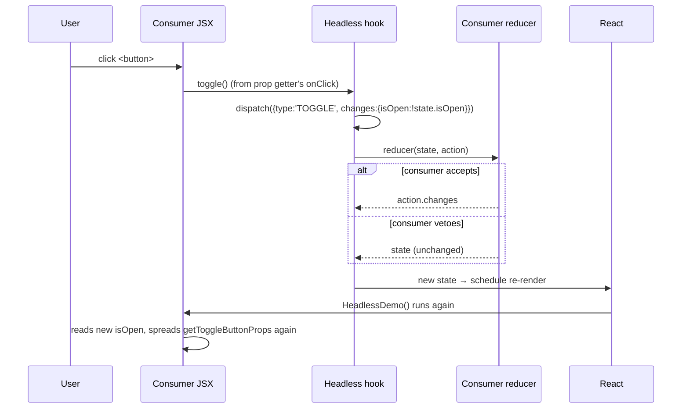

# Headless UI Pattern — logic without markup

> **Companion demo:** [`headless_ui.html`](./headless_ui.html) — open in a browser.
> **React version:** 19.2.7 via ESM CDN + Babel standalone.
> **Builds on:** [`use_reducer.html`](./use_reducer.html) — the state reducer pattern IS
> `useReducer` turned inside-out so the consumer decides the next state.

---

## 0. TL;DR — the one idea

> **The analogy:** a regular component is a pre-assembled car — you can pick the
> paint, but the engine and chassis are fixed. A **headless** component is an
> engine + drivetrain: you bring your own chassis (DOM), you can reflash the ECU
> (state reducer), and the engine hands you labelled hoses (prop getters) so you
> don't have to know which wire is which.

A headless component owns **state + behavior plumbing** (event handling, ARIA,
keyboard, focus, IDs) but renders **zero markup**. The consumer owns the DOM.
Two mechanisms connect them:

1. **State reducer** — the consumer passes a custom `(state, action) → newState`
   to *override any transition*.
2. **Prop getters** — the component exposes `getToggleButtonProps()` /
   `getMenuProps()` / `getItemProps()` that bundle the right a11y + event props;
   the consumer spreads them onto the right node.

```mermaid
graph LR
    C["consumer<br/>writes JSX + classes"] -->|spreads| PG["prop getters<br/>getToggleButtonProps()"]
    PG -->|aria + onClick + ids| DOM["DOM element<br/>rendered by consumer"]
    DOM -->|user event| H["headless component<br/>owns state + plumbing"]
    H -->|proposes changes| SR["state reducer<br/>(consumer-supplied)"]
    SR -->|accept / veto / rewrite| H
    style H fill:#eafaf1,stroke:#27ae60,stroke-width:2px
    style SR fill:#fef9e7,stroke:#f1c40f,stroke-width:2px
    style PG fill:#eaf2f8,stroke:#2980b9
    style C fill:#f5eef8,stroke:#8e44ad
```



**The split:** the component handles *plumbing* (correctness you don't want to
think about), the consumer handles *appearance* and *behavior* (via the reducer).
This is why react-table, downshift, Radix UI, and Headless UI all adopted it:
one logic core, infinite styling freedom.

---

## 1. How it works

### The two halves

| Half | Who owns it | What it does |
|------|-------------|--------------|
| **state reducer** | consumer passes a custom `(state, action) → newState` | Control over EVERY transition — intercept, block, or rewrite proposed changes |
| **prop getters** | component exposes `getXxxProps(extra)` helpers | Spread the right a11y + event props onto the right element without knowing internals |
| **render** | consumer writes JSX, picks tags & classes | 100% styling freedom — Tailwind, CSS-in-JS, plain CSS |
| **plumbing** | component keeps it (a11y, keyboard, focus, IDs) | Correctness the consumer doesn't have to think about |

### The state reducer contract

```javascript
// The component proposes a change; the consumer's reducer decides the verdict.
function useToggle(userReducer) {
  const reducer = userReducer
    ? userReducer                       // consumer steers every transition
    : (state, action) => action.changes; // default: accept proposed changes

  const [state, dispatch] = React.useReducer(reducer, { isOpen: false });
  const toggle = () =>
    dispatch({ type: 'TOGGLE', changes: { isOpen: !state.isOpen } });

  return { isOpen: state.isOpen, toggle };
}
```

The component dispatches `{type, changes}` — the proposed next state. The
reducer has three options:

- **accept** → `return action.changes` (default)
- **veto** → `return state` (ignore the proposal, keep current state)
- **rewrite** → `return { ...action.changes, extra: true }` (modify the proposal)

### The prop getter convention

```javascript
// The component bundles the right props; the consumer's `extra` always wins.
const getToggleButtonProps = (extra) =>
  Object.assign(
    {
      type: 'button',
      'aria-expanded': state.isOpen,
      'aria-pressed': state.isOpen,
      onClick: toggle,
    },
    extra || {} // consumer overrides compose on top
  );

// Consumer spreads them — no need to know which aria attribute goes where:
<button {...getToggleButtonProps({ className: 'btn-primary' })}>
  {state.isOpen ? 'OPEN' : 'CLOSED'}
</button>
```

`Object.assign(base, extra)` is the secret: defaults are baked in, the consumer's
`extra` always overrides. So a consumer can pass its own `onClick` (to also fire
analytics) and the component's `onClick` is replaced — full composability.

---

## 2. Mechanism — inversion of control via the reducer



The trick is **who calls the reducer**. In a normal `useReducer`, the component
owns the reducer. In the headless pattern, the component *executes* the reducer
but the *consumer provides it* — so the consumer can intercept any transition
without forking the component. This is inversion of control applied to state.

### Why this works with `useReducer`

`React.useReducer(reducer, init)` accepts **any** reducer function. The headless
hook just forwards the consumer's reducer. Because `dispatch` is stable and the
reducer is pure, React's batching and StrictMode double-invocation behave
correctly — the consumer's reducer is treated exactly like a normal one.

---

## 3. Real-world examples

| Library | What's headless | Prop getters it exposes |
|---------|-----------------|-------------------------|
| **react-table** (TanStack Table) | sorting, pagination, grouping, row models | `getTableProps()`, `getColumnProps()`, `getRowProps()`, `getCellProps()` |
| **downshift** | autocomplete / combobox / select a11y + keyboard | `getInputProps()`, `getItemProps()`, `getMenuProps()`, `getToggleButtonProps()` |
| **Radix UI** | primitives (Dialog, Menu, Popover, Tabs) | `Trigger`, `Content`, `Item` are render-prop / `asChild` components |
| **Headless UI** (@headlessui/react) | Tailwind's sibling: Menu, Listbox, Combobox, Switch | `<Menu.Button>`, `<Menu.Items>` — compound components that forward props |
| **react-aria** (Adobe) | the most complete a11y hooks layer | `useButton()`, `useDialog()`, `useSelect()` return prop getters |

The pattern spans two API styles: **prop-getter hooks** (downshift, react-aria,
react-table v7) and **compound components** (Radix, Headless UI, react-table v8).
Both deliver the same deal: behavior and a11y are solved once, the consumer
renders freely.

---

## 4. The prop getter convention in depth

Every element that needs wired behavior gets its own getter. The naming is
descriptive — `get[ElementName]Props`:

```javascript
const {
  isOpen,
  getToggleButtonProps,  // → the <button> that opens/closes
  getMenuProps,          // → the <ul>/<div> that holds items
  getItemProps,          // → each <li>, called per item: getItemProps({ item, index })
  getInputProps,         // → for combobox: the <input> with aria + keyboard
  getLabelProps,         // → the <label> wired via aria-labelledby
} = useSelect({ items });
```

**Rules consumers follow:**

1. **Always spread** — don't cherry-pick `onClick`; you'll miss focus handlers,
   `aria-activedescendant`, and keyboard logic the component added.
2. **Pass `extra` last** — `getXxxProps({ className: 'mine' })` so your override
   composes on top of the defaults.
3. **One getter per element** — never spread `getMenuProps()` onto a `<li>`. The
   roles and aria attributes are element-specific.
4. **Forward refs** — production getters accept a `ref` in `extra` so the
   component can measure/focus the node.

---

## Killer Gotchas

| Trap | Symptom | Fix |
|------|---------|-----|
| **Cherry-picking from a getter** | Keyboard/aria breaks silently, screen readers can't navigate | Always *spread* `{...getXxxProps()}`, don't destructure just `onClick` |
| **Forgetting `extra` arg** | Consumer can't add className/id/onClick | Accept `(extra = {})` and `Object.assign(base, extra)` so consumer overrides compose |
| **Mutating `action.changes`** | Reducer becomes impure, double-fires in StrictMode, stale UI | Return a *new* object: `{ ...action.changes, extra: true }` |
| **Side effects in the reducer** | Refs/counters drift, render warnings in StrictMode | The reducer must be pure — move effects to the consumer's event handler, not the reducer |
| **Wrong getter on wrong element** | aria roles mismatch, focus jumps | `getMenuProps` → list container, `getItemProps` → each item, `getToggleButtonProps` → trigger button |
| **Not forwarding the ref** | Component can't focus/measure the node | Accept `ref` in `extra` and pass it through (or use `useMergeRefs`) |
| **Returning `undefined`** | React throws "reducer returned undefined" | Always return either `state` (veto) or a full state object |
| **Recreating the consumer reducer every render** | `useReducer` re-initializes, state resets | Wrap the consumer reducer in `useCallback` (or define it outside the component) |
| **Prop name collisions** | Consumer's `onClick` silently replaces component's | Document that consumer overrides win; if you need both, expose a hook to merge |

### Cheat sheet

```javascript
// The headless hook shape
function useHeadlessThing({ userReducer, ...opts }) {
  const reducer = userReducer ?? ((s, a) => a.changes); // consumer override point
  const [state, dispatch] = React.useReducer(reducer, initial);

  const action = (type, changes) => dispatch({ type, changes });

  const getRootProps   = (extra) => Object.assign({ /* a11y + ids */ }, extra);
  const getTriggerProps= (extra) => Object.assign({ /* onClick + aria-expanded */ }, extra);
  const getItemProps   = (extra) => Object.assign({ /* role, id, onClick */ }, extra);

  return { state, getRootProps, getTriggerProps, getItemProps };
}

// Consumer: own the JSX + behavior, lean on the hook for plumbing
function MyMenu() {
  const { state, getTriggerProps } = useHeadlessThing({
    userReducer: (s, a) =>
      a.type === 'CLOSE' && /* some condition */ ? s  // VETO a close
      : a.changes                                       // accept
  });
  return <button {...getTriggerProps({ className: 'btn' })}>Toggle</button>;
}
```

---

## 🔗 Cross-references

- [use_reducer](./use_reducer.html) — the foundation: the state reducer pattern is literally `useReducer` with the consumer's function forwarded in
- [custom_hooks](./custom_hooks.html) — headless components are usually delivered as custom hooks (`useToggle`, `useSelect`, `useCombobox`)
- [compound_components](./compound_components.html) — the alternative headless API: Radix/Headless UI use `<Menu.Button>`/`<Menu.Items>` instead of prop-getter hooks
- [render_props](./render_props.html) — the older sibling: render props invert rendering, prop getters invert prop-wiring; both are "inversion of control" patterns
- [use_context](./use_context.html) — compound headless components (Radix, Headless UI) wire the shared state through Context internally

---

## Sources

1. **Kent C. Dodds — The State Reducer Pattern**: https://kentcdodds.com/blog/the-state-reducer-pattern (the original formulation; control state transitions from outside the component)
2. **Kent C. Dodds — Implementation Details / Compound Components**: https://kentcdodds.com/blog/compound-components (the prop-getter + compound evolution of the same idea)
3. **React Docs — useReducer**: https://react.dev/reference/react/useReducer (the reducer primitive the whole pattern is built on; `dispatch` is stable, reducer must be pure)
4. **TanStack Table — Headless UI**: https://tanstack.com/table/latest/docs/introduction (the most widely used headless table: "fully agnostic UI — bring your own markup")
5. **downshift — Prop Getters**: https://www.downshift-js.com/use-select (canonical prop-getter autocomplete/combobox library; documents `getItemProps`/`getToggleButtonProps`)
6. **Radix UI — Primitives Overview**: https://www.radix-ui.com/primitives/docs/overview/introduction (compound-component flavor of headless: unstyled, accessible primitives)
