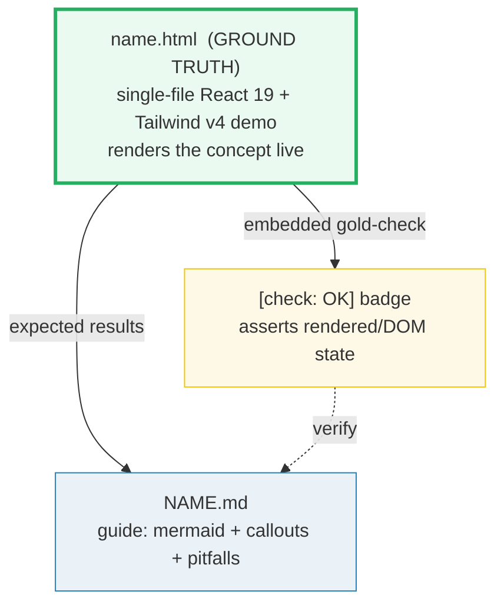

# HOW_TO_RESEARCH — React Deep Dive "Concept-as-a-Bundle" Workflow

> Adapted from [`../skills/concept-builder/SKILL.md`](../skills/concept-builder/SKILL.md).
> This section uses the **rendered-ground-truth** variant: the `.html` IS the
> ground truth (it renders the concept live with React 19 via CDN), with an
> embedded `[check: OK]` gold-check proving the rendered/DOM state.

## 0. The one rule

> **Every concept is a set of files that cite each other, all deriving from ONE
> ground-truth artifact. Nothing is ever hand-waved.**



A **concept bundle** = `name.html` + `NAME.md`. No `.py`, no `_output.txt` —
the live React demo is the ground truth.

## 1. Focus

Advanced React from first principles: **hooks mastery → component patterns →
concurrent React → performance → animations → TanStack Router deep dive.**
36 bundles across 6 phases. See [`TODO.md`](./TODO.md).

**Companion to:** [`../frontend/`](../frontend/index.html) — where `frontend/react/`
(4 bundles) teaches basics (CDN, components, useState, useEffect), this section
goes deeper: useReducer, Context, compound components, Suspense, useTransition,
Framer Motion, TanStack Router internals.

## 2. The roles of each file

| File | Role | Hard rules |
|---|---|---|
| **`name.html`** | GROUND TRUTH. A working, single-file demo of the concept. Loads React 19 ESM + Babel standalone + Tailwind v4 via CDN. Renders the concept live. | Opens from `file://`. **Embeds a gold-check** that asserts rendered/DOM state. Dark palette `#0d1117`, React cyan accent `#61dafb`. Full GitHub URLs for `.md` links. Back-link to `./index.html`. |
| **`NAME.md`** | Static guide. What / why (internals) / gotchas. | ≥1 mermaid diagram. ≥1 code snippet. Pitfalls table + cheat sheet + `## Sources` (web-verified ≥2). |

## 3. CDN setup (every `.html`)

```html
<!-- Tailwind v4 Play CDN -->
<script src="https://cdn.jsdelivr.net/npm/@tailwindcss/browser@4"></script>
<!-- Babel Standalone — compiles JSX → React.createElement -->
<script src="https://cdn.jsdelivr.net/npm/@babel/standalone@8.0.3/babel.min.js"></script>
```

React 19 ESM is loaded dynamically inside the runner script:
```js
import("https://esm.sh/react@19.2.7?dev")
import("https://esm.sh/react-dom@19.2.7/client?dev")
```

**React 19 dropped UMD builds** — must use ESM `import()` and assign to `window`.

## 4. JSX-in-textarea pattern (critical)

JSX is NOT valid plain JS. The repo's `just check` runs `node --check` on every
inline `<script>`. So **JSX NEVER lives in a script element**. Instead:

1. JSX source lives in a `<textarea>` (RCDATA keeps tags literal).
2. At runtime, `Babel.transform(jsxSource, {presets:[["react",{runtime:"classic"}]]})`
   compiles it to plain JS.
3. The compiled JS is executed via indirect eval `(0, eval)(code)`.
4. The only inline `<script>` elements are valid classic JS.

```html
<textarea id="jsx-source" class="codearea" spellcheck="false">
function App() {
  const [state, dispatch] = React.useReducer(reducer, initialState);
  // ... JSX ...
}
</textarea>
```

**Babel runtime:** force `{runtime:'classic'}` (→ `React.createElement`).
Babel 8 defaults to `'automatic'` which can't resolve inside eval.

## 5. The gold-check (the falsifiable anchor)

Every `.html` proves it behaves as claimed:

```html
<span id="goldcheck" class="goldcheck">[check: …]</span>
<script>
  // After React renders + user interactions dispatched programmatically:
  var el = root.querySelector('[data-testid="result"]');
  var ok = el && el.textContent === "expected value";
  badge.textContent = "[check] " + (ok ? "OK" : "FAIL");
  badge.style.color = ok ? "#2ecc71" : "#e74c3c";
</script>
```

- React + Babel load **async** — poll via `requestAnimationFrame` before reporting FAIL.
- The gold-check dispatches **real DOM events** (`element.click()`) to test interactions.
- For useReducer demos: dispatch actions, assert the rendered state.

## 6. The `.html` style guide

### Styling
- **Tailwind v4** utility classes for ALL layout, spacing, typography, colors.
- Use arbitrary values for section-specific colors: `bg-[#0d1117]`, `text-[#61dafb]`.
- Minimal `<style>` block only for: `#root:empty` placeholder, `.codearea` textarea,
  `.goldcheck` badge, `.src` code output, `.badge` links. These CANNOT be Tailwind
  utilities because they style non-DOM elements (textarea styling, empty pseudo).
- **Accent color:** React cyan `#61dafb` everywhere.

### Required elements (in order)
1. `<header>` — title + gold-check badge + badge links + back-link
2. `.guide-callout` div — pairs this demo with the `.md` guide
3. `<main>` — concept panels
4. Gold-check `<script>` — valid classic JS, passes `node --check`

### Badge links
```html
<a class="badge md" href="https://github.com/quanhua92/tutorials/blob/main/react/NAME.md">📖 guide (.md)</a>
```
No `.badge.py` — this section is HTML-only.

### Table overflow
Every `<table>` must be wrapped: `<div style="overflow-x:auto;min-width:0"><table>...</table></div>`

### Cross-links
- To frontend/react/: `../frontend/react/react_state_hooks.html`
- To section siblings: `./use_context.html`
- `.md` links: full GitHub URLs only.

## 7. The `.md` structure

```markdown
# [Concept Name]

> **Companion demo:** [`name.html`](./name.html) — open in a browser.

---

## 0. TL;DR — the one idea

[≥1 mermaid diagram]

## 1. How it works
[step-by-step, with code snippets]

## 2. Mechanism / internals
[why it works, mental model]

## 3. Killer Gotchas
| trap | symptom | fix |
|------|---------|-----|

### Cheat sheet
[one-block reference]

## 🔗 Cross-references
- [Sibling bundle](./sibling.html) — one-line why

## Sources
[URLs, web-verified ≥2]
```

## 8. Naming & layout

- `.html` → `lower_snake_case` (e.g. `use_reducer.html`).
- `.md` → `UPPER_SNAKE_CASE` (e.g. `USE_REDUCER.md`).
- One stem per concept; all files share it.
- Bundles live **flat** in `react/` (no subdirectories).

## 9. Verification discipline

```bash
# the .html <script> is syntactically valid
python3 -c "import re;open('/tmp/_j.js','w').write('\n\n'.join(m.group(1) for m in re.finditer(r'<script>(.*?)</script>',open('react/name.html').read(),re.S)))"
node --check /tmp/_j.js && echo "JS OK"
# gold-check present
grep -q "\[check" react/name.html && echo "GOLD OK"
```

## 10. Web search is mandatory

For every React API, version, CDN URL, and behavioral claim: web-search the
official docs (react.dev, tanstack.com) + ≥1 other authoritative source. Verify
in ≥2 places. Record URLs in `## Sources`. NEVER guess a version or CDN URL.

## 11. Common bugs to AVOID

- **JSX in a script element** — breaks `node --check`. Always use textarea.
- **Babel `automatic` runtime** — can't resolve inside eval. Force `{runtime:'classic'}`.
- **Missing `className`** — React uses `className`, not `class`.
- **CDN version drift** — pin specific versions. React 19.2.7, Babel 8.0.3.
- **Relative links** — `.md` links in `.html` MUST be full GitHub URLs.
- **Back-link** — `.html` links to `./index.html` (this section's dashboard).
- **No `.py` badge** — this section is HTML-only. Only show `.badge.md`.
