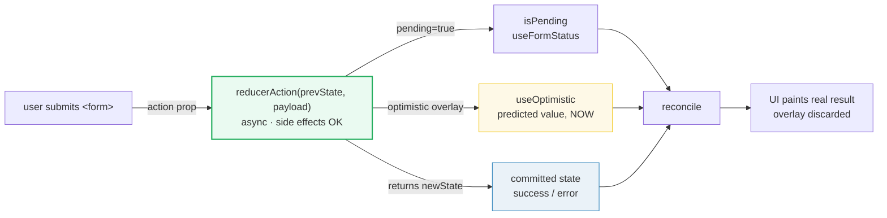
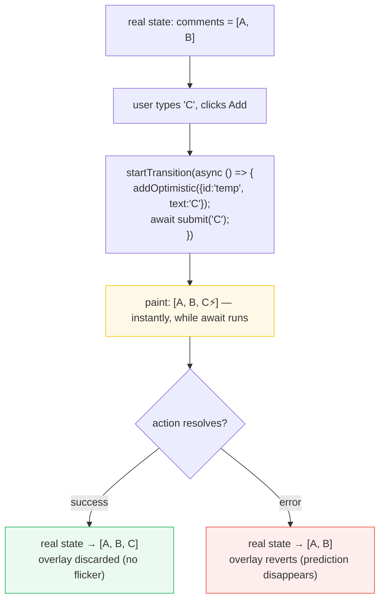

# React 19 Actions — useActionState · useFormStatus · useOptimistic

> **Companion demo:** [`react19_actions.html`](./react19_actions.html) — open in a browser.
> **React version:** 19.2.7 via ESM CDN + Babel standalone.

---

## 0. TL;DR — the one idea

> **The analogy:** `useState` is a single light bulb. `useReducer` is a gearbox
> of *pure* transitions. **Actions** are a gearbox that is allowed to *do work* —
> POST to a server, await a fetch — and report back `pending`, the `result`, and
> any `error` through three purpose-built hooks.



React 19 introduces **Actions** — async functions you pass to `<form action={fn}>`
or wrap with `startTransition` — plus three hooks that read the resulting
lifecycle. The trio collapses what used to be 3-4 hand-rolled `useState` pieces
(fields + pending + error + try/catch/finally) into one declarative block.

---

## 1. The three hooks

### `useActionState` — formerly `useFormState`

Manages the state produced by an async **Action**. Think of it as
*useReducer for side effects*.

```jsx
import { useActionState } from 'react';

async function addToCartAction(prevState, payload) {
  const result = await api.post(payload);     // side effect — ALLOWED here
  return { count: result.count, error: null }; // becomes the new prevState
}

function Checkout() {
  const [state, dispatchAction, isPending] = useActionState(addToCartAction, { count: 0, error: null });
  //         ^^^^   ^^^^^^^^^^^^^^   ^^^^^^^^
  //     current    pass to <form     true while
  //     state      action> or wrap   reducerAction runs
  //                in startTransition
}
```

**Returns a 3-tuple** (vs `useReducer`'s 2-tuple):

| # | name | role |
|---|------|------|
| 1 | `state` | initially `initialState`, then the last value returned by `reducerAction` |
| 2 | `dispatchAction` | stable dispatcher — pass to `<form action>` or wrap in `startTransition` |
| 3 | `isPending` | `true` while any dispatched Action is running |

**Critical contract:** `dispatchAction` must run **inside a `startTransition`**
or be passed to an **Action prop** (`<form action>`, `<button action>`). Called
bare, React logs *"An async function with useActionState was called outside of a
transition."* and `isPending` will not flip.

### `useFormStatus` — the no-prop-drilling bridge

Lets any **child** of a `<form>` read that form's pending state — without
receiving a single prop.

```jsx
function SubmitButton() {
  const { pending } = useFormStatus();
  return <button disabled={pending}>{pending ? 'Submitting…' : 'Submit'}</button>;
}

function Form() {
  return (
    <form action={serverAction}>
      {/* SubmitButton "just knows" the form is submitting */}
      <SubmitButton />
    </form>
  );
}
```

It reads from React's internal `<form action>` context, so it only works for
forms whose `action` is a function (an Action). `pending` is `true` from the
moment the form is submitted until the Action resolves.

### `useOptimistic` — predicted value, instantly

Layers a *predicted* value on top of the real one during the pending window.
React shows the prediction immediately and **auto-reverts** to the real value
when the surrounding Transition completes.

```jsx
function Comments({ realComments, submitAction }) {
  const [optimisticComments, addOptimistic] = useOptimistic(realComments);

  async function handleAdd(text) {
    startTransition(async () => {
      addOptimistic({ id: 'temp', text, pending: true }); // shown NOW
      await submitAction(text);                            // real write
      // on resolve, React reverts to realComments automatically
    });
  }

  return optimisticComments.map(c => <li key={c.id}>{c.text}</li>);
}
```

The overlay is **discardable by design** — if the action fails, the prediction
disappears and only the confirmed state remains.

---

## 2. The form action lifecycle

```mermaid
sequenceDiagram
    participant U as User
    participant F as &lt;form action={dispatchAction}&gt;
    participant R as reducerAction (async)
    participant OS as useOptimistic
    participant React as React

    U->>F: submit
    F->>React: wrap in startTransition
    React->>OS: addOptimistic(pred) — paint prediction
    React->>R: reducerAction(prevState, formData)
    R-->>React: await fetch… (isPending = true)
    Note over F: useFormStatus().pending === true
    R-->>React: return newState
    React->>OS: revert overlay → real value
    React-->>U: paint committed result (success / error)
```

1. **Submit** — `<form action={dispatchAction}>` intercepts the submit and wraps
   it in a Transition automatically (no manual `startTransition` needed).
2. **Optimistic layer** — `addOptimistic(...)` paints a prediction inside the
   same Transition.
3. **Async work** — `reducerAction(prevState, formData)` runs the side effect.
   `isPending` and `useFormStatus().pending` are both `true`.
4. **Resolve** — `reducerAction` returns the new state; React reverts the
   optimistic overlay and paints the committed result.

> **On the demo page:** the lifecycle is *simulated* with `useReducer`
> (`idle → pending → success`) because the React-internal `<form action>`
> context is fragile inside an indirect-eval sandbox. The state machine is
> identical; only the wiring differs.

---

## 3. useActionState vs useReducer

They look alike — `(state, action) → newState` — but serve different purposes:

| Aspect | `useReducer` | `useActionState` |
|--------|-------------|------------------|
| **Reducer purity** | MUST be pure — no `fetch`, no timers, no `await` | `reducerAction` MAY be async & run side effects |
| **Return value** | `[state, dispatch]` (2 items) | `[state, dispatchAction, isPending]` (3 items) |
| **Dispatch contract** | call anywhere | must run inside `startTransition` or an Action prop |
| **Queuing** | batched; reducer calls processed in parallel-friendly order | **sequential** — each call waits for the previous result (it needs `prevState`) |
| **Built-in pending flag** | no — you wire `isPending` yourself | yes — third return value |
| **StrictMode** | reducer runs twice (purity check) | `reducerAction` runs once (side effects allowed) |
| **Error model** | throwing breaks the render | known errors → return as state; unknown throws → nearest Error Boundary, queued actions cancelled |
| **Best for** | UI state machines (todos, steppers, filters) | form submissions, mutations, server actions |

> Rule of thumb from the React docs: **`useReducer` for UI state (pure);
> `useActionState` for Action state (side-effecting).**

---

## 4. The optimistic updates pattern



**The contract:**

1. `useOptimistic(realValue)` returns `[optimisticValue, addOptimistic]`.
   Initially `optimisticValue === realValue`.
2. Call `addOptimistic(predictedValue)` **inside a Transition** (directly, or via
   an Action). The prediction is layered on top and painted immediately.
3. When the Transition ends, React discards the prediction and reverts to
   `realValue`. If you updated `realValue` during the action, the revert is
   invisible (no flicker); if the action failed, the prediction cleanly
   disappears.

**Why it matters:** users see their change *instantly* instead of staring at a
spinner. The UI feels fast even when the network isn't.

---

## Killer Gotchas

| Trap | Symptom | Fix |
|------|---------|-----|
| **Calling `dispatchAction` bare** | `isPending` never flips; console warns *"async function called outside of a transition"* | Wrap in `startTransition(() => dispatchAction())`, or pass `dispatchAction` to `<form action>` / `<button action>` |
| **`formData` is the 2nd arg** | `formData.get('name')` is `undefined` | With `useActionState`, signature is `(prevState, formData)` — `prevState` is inserted as arg 1 |
| **Optimistic update outside a Transition** | `addOptimistic(...)` throws *"update outside render"* or no-ops | Call it inside `startTransition` (or inside the Action body) |
| **Sequential queuing surprise** | N rapid submits take N×latency, not 1× | `useActionState` waits for each `prevState` to feed the next call. For parallel, use `useState` + `useTransition` directly, or `AbortController` to cancel the prior action |
| **Throwing inside `reducerAction`** | All queued actions cancelled, Error Boundary mounts | Return `{success:false, error}` for *known* errors; only `throw` for truly unexpected bugs |
| **`useFormStatus` outside a form** | `pending` is always `false` | It only reads the parent `<form action={fn}>` context — the form must use a function `action`, and the hook must be called by a descendant of that form |
| **Mutating `optimisticValue`** | Overlay breaks / reconciliation flickers | Treat it as read-only; drive it only through `addOptimistic` and let React revert it |
| **Expecting automatic reset** | State carries over between submissions | `useActionState` has no built-in reset — dispatch a reset signal, or remount via `key`, or rely on `<form action>` which resets inputs after submit |
| **`reducerAction` impure in `useReducer`** | Double-fires in StrictMode, stale data | That's the signal you wanted `useActionState` — `useReducer` reducers must stay pure |

### Cheat sheet

```jsx
import { useActionState, useFormStatus, useOptimistic, startTransition } from 'react';

// 1. useActionState — async reducer + free isPending
async function submitAction(prevState, formData) {
  try {
    const res = await api.save(formData.get('name'));
    return { status: 'success', name: res.name, error: null };
  } catch (e) {
    return { status: 'error', name: '', error: e.message }; // known error → state
  }
}
function Form() {
  const [state, dispatchAction, isPending] = useActionState(submitAction, { status: 'idle', name: '', error: null });
  return <form action={dispatchAction}> … </form>; // action prop wraps in Transition
}

// 2. useFormStatus — child reads parent form's pending, no props
function SubmitButton() {
  const { pending } = useFormStatus();
  return <button disabled={pending}>{pending ? 'Submitting…' : 'Submit'}</button>;
}

// 3. useOptimistic — predicted value during the pending window
function Name({ realName, saveAction }) {
  const [optimistic, addOptimistic] = useOptimistic(realName);
  function onClick() {
    startTransition(async () => {
      addOptimistic(realName + ' (saving…)'); // shown now
      await saveAction(realName);             // reconciles on resolve
    });
  }
  return <span>{optimistic}</span>;
}
```

---

## 🔗 Cross-references

- [useReducer](./use_reducer.html) — the pure-state sibling; `useActionState` is literally "useReducer that may do side effects". Start here if the reducer shape is unfamiliar.
- [frontend/react: State & Hooks (useState)](../frontend/react/react_state_hooks.html) — the single-setState origin this whole stack evolves from.
- [error_boundaries](./error_boundaries.html) — where unknown throws from a `reducerAction` land; Actions + Error Boundaries are the recommended error UX.
- [use_transition](./use_transition.html) — Actions ARE Transitions under the hood; `startTransition` is the bridge when you call `dispatchAction` manually. *(planned)*

---

## Sources

1. **React Docs — `useActionState`**: https://react.dev/reference/react/useActionState — official reference (reducerAction contract, 3-tuple return, sequential queuing, error model).
2. **React Docs — `<form>` with Actions**: https://react.dev/reference/react-dom/components/form — `action` prop wraps submission in a Transition; `formData` passed to the action.
3. **React Docs — `useOptimistic`**: https://react.dev/reference/react/useOptimistic — optimistic overlay reverts on Transition end.
4. **React Blog — React 19 (Dec 2024)**: https://react.dev/blog/2024/12/05/react-19 — Actions, `useActionState` (renamed from `useFormState`), `useFormStatus`, `useOptimistic` introduced as stable.
