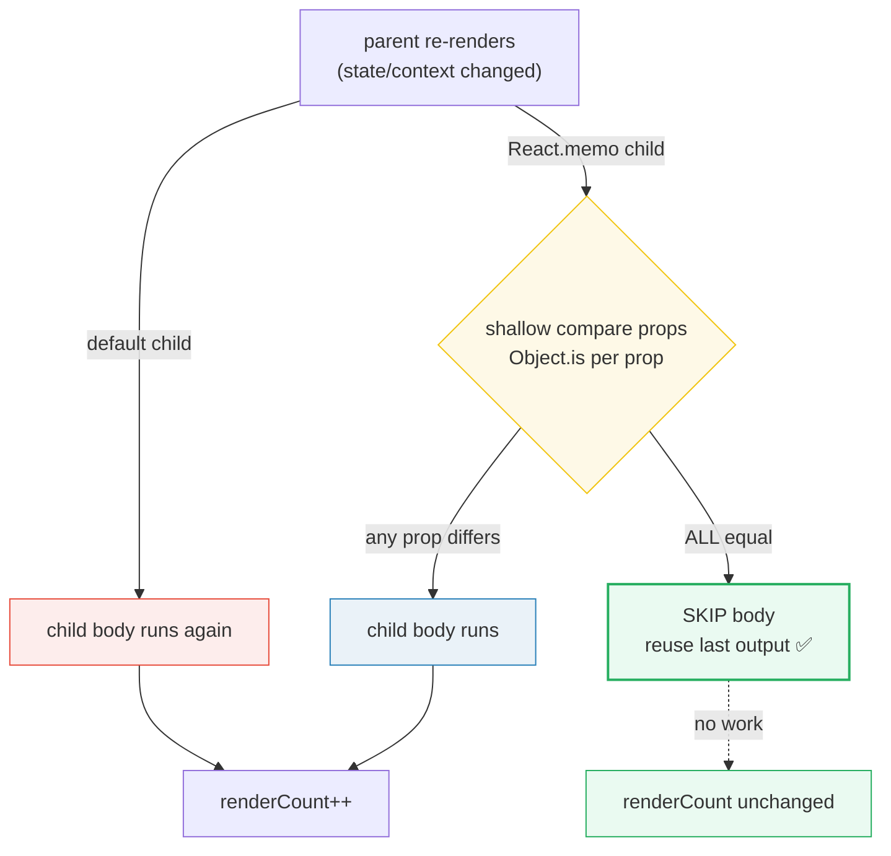
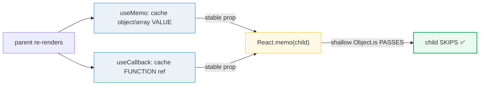
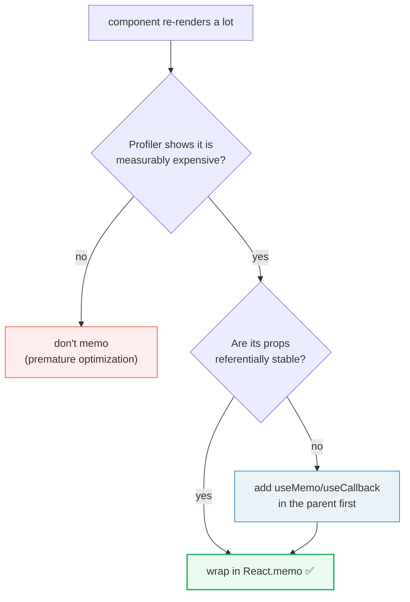

# React.memo — the prop-guarded re-render skip

> **Companion demo:** [`react_memo.html`](./react_memo.html) — open in a browser.
> **React version:** 19.2.7 via ESM CDN + Babel standalone.

---

## 0. TL;DR — the one idea

> **The analogy:** every parent re-render is a photocopier that, by default, prints
> a fresh copy of every child — even children nobody edited. `React.memo` staples
> a "check the envelope first" note onto a component: React compares the old props
> to the new props with a shallow `Object.is` check, and if nothing changed it
> **reuses the last rendered output and skips the component body entirely**.



`React.memo(Component)` returns a new component. Before each re-render React runs
`Object.is(prevProps[k], nextProps[k])` for **every** prop `k`. If every comparison
is `true`, React bails out: the component's function body never runs, its hooks
never execute, and its children keep their previous output. `memo` is purely a
**performance** optimization — the un-memoized app renders identically, just slower.

---

## 1. How it works

### The signature

```javascript
// (1) wrap a component — default shallow compare on ALL props
const MemoChild = React.memo(function Child(props) {
  return <div>{props.title}</div>;
});

// (2) optional 2nd arg: custom areEqual(prevProps, nextProps)
//     return TRUE  → skip the re-render (props considered equal)
//     return FALSE → re-render
const MemoRow = React.memo(Row, (prev, next) => prev.id === next.id);
```

### The demo, annotated

```javascript
var renderCount = { child: 0 }; // module-level counter, NOT state

var MemoChild = React.memo(function Child(props) {
  renderCount.child++;          // runs ONLY when React actually re-renders
  return <div data-testid="child">render #{renderCount.child}: {props.title}</div>;
});

function MemoParent() {
  const [count, setCount]   = React.useState(0); // child depends (via title)
  const [other, setOther]   = React.useState(0); // child does NOT depend
  return (
    <div>
      {/* title is a STRING built only from count → stable when only `other` changes */}
      <MemoChild title={'Count is ' + count} />
      <button data-testid="inc-count" onClick={() => setCount(c => c + 1)}>count+1</button>
      <button data-testid="inc-other" onClick={() => setOther(o => o + 1)}>other+1</button>
      <p>Child rendered: {renderCount.child} times</p>
    </div>
  );
}
```

| action | parent re-renders? | `title` prop | shallow compare | child body runs? | render count |
|--------|--------------------|--------------|-----------------|------------------|--------------|
| initial mount | yes (first) | `'Count is 0'` | n/a (no prev)   | yes              | 1            |
| click `other+1` | **yes** | `'Count is 0'` (same) | ✅ equal  | **no (skipped)** | stays 1      |
| click `count+1` | **yes** | `'Count is 1'` (diff) | ❌ differs | yes              | 2            |
| click `other+1` | **yes** | `'Count is 1'` (same) | ✅ equal  | **no (skipped)** | stays 2      |

That table is the entire concept. The live demo in
[`react_memo.html`](./react_memo.html) drives all four rows automatically and
asserts the render count after each click.

---

## 2. Mechanism — what "shallow compare" really means

`React.memo`'s default comparator is equivalent to:

```javascript
function shallowEqual(prev, next) {
  if (prev === next) return true;            // same object reference
  const prevKeys = Object.keys(prev);
  const nextKeys = Object.keys(next);
  if (prevKeys.length !== nextKeys.length) return false;
  for (const k of prevKeys) {
    if (!Object.is(prev[k], next[k])) return false;
  }
  return true;
}
```

`Object.is` is **referential** equality with two fixes over `===`: `Object.is(NaN, NaN)`
is `true`, and `Object.is(+0, -0)` is `false`. It does **not** look inside objects or
arrays. This is where every memo bug lives:

```javascript
// ❌ Every render builds a NEW object → Object.is fails → memo re-renders anyway
<MemoChild style={{ color: 'red' }} />          // {} !== {}
<MemoChild config={{ enabled: true }} />
<MemoChild items={[1, 2, 3]} />

// ❌ Every render creates a NEW function reference → Object.is fails
<MemoChild onClick={() => doThing()} />

// ✅ Stable references — Object.is passes → memo skips
const style = { color: 'red' };                 // hoisted / module scope
const handleClick = React.useCallback(doThing, []); // cached ref
const config = React.useMemo(() => ({ enabled: true }), []);
```

This is why **memo, `useMemo`, and `useCallback` are a trio**. `React.memo` defines
the *check*; `useMemo`/`useCallback` in the *parent* make the props pass that check.
Wrap a child in `memo` while passing fresh inline objects/handlers and you have paid
the memo compare cost for zero benefit — the child re-renders every time anyway.

### The memo + hooks trio



### Custom comparator — compare only what matters

```javascript
// Deep object props where only `id` matters for the rendered output:
const UserRow = React.memo(Row, function areEqual(prev, next) {
  return prev.user.id === next.user.id;   // return true → SKIP
});
```

⚠️ The return convention is **inverted** from what most people expect: return `true`
when props are *equal* (to skip), `false` when they *differ* (to re-render). This is
the opposite of `shouldComponentUpdate` in class components. Use a custom comparator
only when the default shallow compare is wrong for your data shape — e.g. a prop that
is a new object every render but whose relevant field hasn't changed. Prefer fixing
the prop stability upstream with `useMemo` when you can.

---

## 3. When to memo — and when NOT to

`React.memo` is not free. Every re-render of a memoized component pays a **compare
cost** (iterate all prop keys, run `Object.is` each). You only win when the compare
is cheaper than the render it skips. Profile, don't guess.

| Situation | Memo? | Why |
|-----------|-------|-----|
| child is measurably expensive (large list, heavy render, deep tree) | ✅ yes | the skip saves more than the compare costs |
| child re-renders often with unchanged props | ✅ yes | the skip fires frequently → big payoff |
| child is cheap (a few divs) | ❌ no | compare cost ≥ render cost; pure overhead |
| child's props are always new objects/functions | ❌ no | memo never skips; you pay compare for nothing — fix the props first |
| props change on nearly every parent render anyway | ❌ no | the skip rarely fires |
| the component is `PureComponent`-equivalent and you need correctness from referential updates | ⚠️ no | memo is optimization, not correctness — never rely on it for behavior |

### The decision flow



Rule of thumb from the React team: **don't memo by default.** Reach for `memo` only
when the Profiler shows a specific component is slow *and* it re-renders often with
unchanged props. In React 19, the compiler (when adopted) can automate much of this,
making hand-applied `memo`/`useMemo`/`useCallback` unnecessary in compiler-optimized
codebases.

---

## 4. Killer Gotchas

| trap | symptom | fix |
|------|---------|-----|
| inline object/array prop | `memo` child re-renders every time | `useMemo(() => ({...}), [deps])` or hoist the literal out of render |
| inline function prop | `memo` child re-renders every time | `useCallback(fn, [deps])` in the parent |
| children as props | `memo` still re-renders — `<MemoChild>{jsx}</MemoChild>` passes a new element each render | the `children` prop is a fresh React element object every render; lift it or memoize it |
| custom comparator returns the wrong way | component never re-renders (or always does) | return `true` to **skip** (equal), `false` to **re-render** — opposite of intuition |
| relying on memo for correctness | bug when a future refactor removes the memo | memo is an **optimization hint**, not a guarantee; React may still re-render; never depend on it for behavior |
| memo + context | child re-renders even though props are stable | `React.memo` does **not** block re-renders caused by context the child consumes — context bypasses props entirely |
| memoizing the wrong layer | no perf gain | memo the **expensive subtree's root**, not every leaf — measure first |
| `key` changes | memoized list items re-render despite memo | a changing `key` forces remount, which bypasses memo entirely |

---

## 5. Cheat sheet

```javascript
// 1. basic — shallow Object.is compare on every prop
const MemoChild = React.memo(Child);

// 2. custom comparator — return true to SKIP, false to re-render
const MemoRow = React.memo(Row, (prev, next) => prev.id === next.id);

// 3. the trio — memo checks, useMemo/useCallback make props pass the check
function Parent() {
  const [count, setCount] = useState(0);
  const [other, setOther] = useState(0);
  const handleClick = useCallback(() => setCount(c => c + 1), []);  // stable fn
  const config = useMemo(() => ({ label: 'hi' }), []);              // stable obj
  return <MemoChild onClick={handleClick} config={config} value={count} />;
}

// 4. memo does NOT stop context-triggered re-renders
const MemoConsumer = React.memo(function C() {
  const v = useContext(ThemeContext); // context change → re-renders, memo or not
  return <div>{v}</div>;
});

// 5. memo does NOT stop remount — a changing key remounts, bypassing memo
{items.map(it => <MemoRow key={it.id} item={it} />)} // stable id → memo works
```

| question | answer |
|----------|--------|
| Does `memo` deep-compare props? | **No.** `Object.is` per prop — referential only. |
| Does `memo` block context re-renders? | **No.** Context consumers re-render on context change regardless of `memo`. |
| Does `memo` block `key`-change remounts? | **No.** A new `key` remounts the component. |
| Is `memo` required for correctness? | **No.** It is a performance hint; never rely on it for behavior. |
| When must I pair it with `useMemo`/`useCallback`? | Whenever you pass an object, array, or function as a prop. |
| Return value of the custom comparator? | `true` = props equal → **skip**; `false` = props differ → **re-render**. |

---

## 🔗 Cross-references

- [`./use_memo_callback.html`](./use_memo_callback.html) / [`USE_MEMO_CALLBACK.md`](./USE_MEMO_CALLBACK.md) — `useMemo`/`useCallback` keep props referentially stable so `React.memo`'s shallow compare actually passes. **The trio.**
- [`./compound_components.html`](./compound_components.html) / [`COMPOUND_COMPONENTS.md`](./COMPOUND_COMPONENTS.md) — compound components memoize the root and pass stable context; `memo` prevents the root's own props from causing needless child re-renders.
- [`../frontend/react/react_components_props.html`](../frontend/react/react_components_props.html) — the props model that `memo` compares against; if props are not referentially equal, `memo` cannot help.
- `re_render_profiling` (planned) — the Profiler/commit-reason tooling you should use to *decide whether* to memo; never guess.

---

## Sources

- React docs — [`React.memo`](https://react.dev/reference/react/memo) (reference, semantics of shallow compare, custom comparator, pitfalls). Verified 2026-06.
- React docs — [`skipTryCatchCall`, render bailout & "You might not need memo" guidance under `memo`](https://react.dev/reference/react/memo#usage) (when to memo, that it is optimization not correctness, pairing with `useCallback`). Verified 2026-06.
- MDN — [`Object.is`](https://developer.mozilla.org/en-US/docs/Web/JavaScript/Reference/Global_Objects/Object/is) (the exact equality `React.memo`'s default shallow compare uses per prop). Verified 2026-06.
