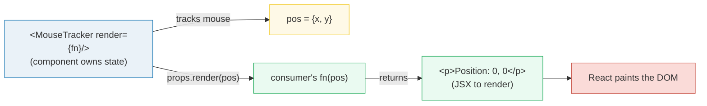
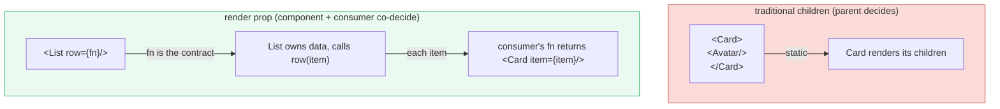
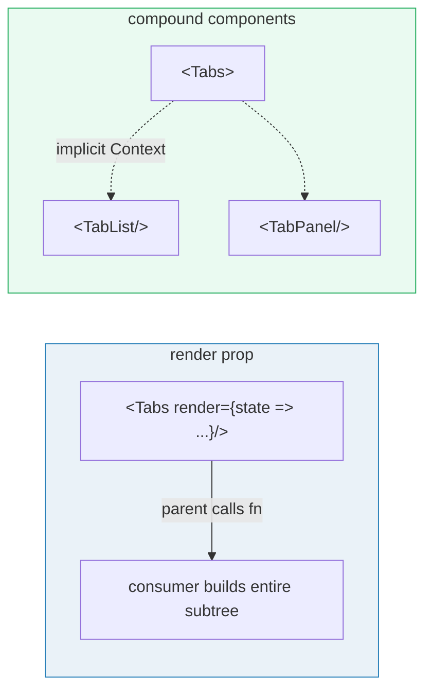

# Render Props

> **Companion demo:** [`render_props.html`](./render_props.html) — open in a browser.
> The gold-check drives the live React demo: 0 → 1 → 2 → 1 → 0, proving both the
> `render` prop and the children-as-function form work end-to-end.

---

## 0. TL;DR — the one idea

A **render prop** is a prop whose value is a function. The component owns the
state and calls that function with the state; the consumer's function returns
the JSX. The component decides *what data exists*; the consumer decides *how to
show it*. This is **inversion of control** — the same move React makes for
`Array.map(item => <li/>)` and `<Context.Consumer>{value => ...}</Context.Consumer>`.



Two equivalent forms:

```jsx
// Form A: an explicit `render` prop (the React docs classic)
<MouseTracker render={pos => <p>Position: {pos.x}, {pos.y}</p>} />

// Form B: `children` as a function (react-spring, downshift, Framer Motion)
<Counter>{(count, helpers) => <button onClick={helpers.inc}>{count}</button>}</Counter>
```

Inside the component, both look identical — a function you call:

```jsx
function MouseTracker(props) {
  const [pos, setPos] = React.useState({ x: 0, y: 0 });
  return <div onMouseMove={e => setPos({ x: e.clientX, y: e.clientY })}>
    {props.render(pos)}     // ← consumer's function decides the JSX
  </div>;
}
```

---

## 1. How it works — the two forms

### Form A: the `render` prop

The component declares a prop conventionally named `render` and calls it with
its internal state. The consumer supplies a function that turns state into JSX.

```jsx
function MouseTracker(props) {
  const [pos, setPos] = React.useState({ x: 0, y: 0 });
  function handleMove(e) {
    setPos({ x: Math.round(e.clientX), y: Math.round(e.clientY) });
  }
  return (
    <div onMouseMove={handleMove} style={{ height: 200, border: '1px solid' }}>
      {props.render(pos)}                  {/* ← delegation */}
    </div>
  );
}

// Consumer supplies the renderer
<MouseTracker render={pos => (
  <p>Position: {pos.x}, {pos.y}</p>
)} />
```

The name `render` is a convention, not a requirement. Any prop works:
`row={item => <Card item={item}/>}`, `item={...}`, `header={...}`.

### Form B: `children` as a function

Same mechanism — `children` happens to be the most natural prop to overload
because JSX already supports it between the tags.

```jsx
function Counter(props) {
  const [count, setCount] = React.useState(0);
  const helpers = {
    increment: () => setCount(c => c + 1),
    decrement: () => setCount(c => c - 1),
    reset:     () => setCount(0),
  };
  return props.children(count, helpers);   // ← children is the render fn
}

// Reads naturally as a block
<Counter>
  {(count, helpers) => (
    <div>
      <p>{count}</p>
      <button onClick={helpers.increment}>+</button>
      <button onClick={helpers.reset}>Reset</button>
    </div>
  )}
</Counter>
```

### Multi-arg and multi-value

You can pass anything across the boundary — state, helpers, bound DOM props:

```jsx
// downshift ships a big bag of helpers via children-as-function
<Downshift onChange={handleChange}>
  {({ getInputProps, getItemProps, isOpen, highlightedIndex }) => (
    <div>
      <input {...getInputProps()} />
      {isOpen && items.map((item, i) => (
        <div {...getItemProps({ item, index: i })}
             style={{ background: i === highlightedIndex ? '#eee' : null }}>
          {item.label}
        </div>
      ))}
    </div>
  )}
</Downshift>
```

This is why downshift, react-spring, react-motion, and Framer Motion all chose
the render-prop form: they need to hand consumers **state + ready-made DOM
handlers** without forcing a specific markup.

---

## 2. Mechanism — inversion of control

The mental model: instead of the parent unilaterally deciding what children
exist, the **child component hands control of rendering back to the parent** by
calling a parent-supplied function.



Why this is powerful:

1. **Separation of concerns.** The component owns *state and behavior* (the
   "what data" layer); the consumer owns *presentation* (the "how to show it"
   layer). They can evolve independently.
2. **No hidden coupling.** The consumer explicitly opts in by passing a
   function — there is no magic import, no context lookup, no HOC wrapper chain.
3. **Composable.** Render props stack: `<A render={a => <B render={b => ...} />}/>`
   threads state from two sources through one consumer.
4. **Testable.** You can call the component's render function with any state and
   assert the JSX it returns — no React renderer needed.

### Why hooks replaced most use cases

Before hooks (React 16.8, Feb 2019), if you wanted to share stateful logic you
had three options: **HOCs**, **render props**, or a shared class component. Hooks
collapsed all three into one:

```jsx
// 2017 — render prop
function WithMouse({ render }) {
  const [pos, setPos] = useState({ x: 0, y: 0 });
  // ...
  return render(pos);
}
<WithMouse render={pos => <MyComp pos={pos} />} />

// 2019 — custom hook
function useMouse() {
  const [pos, setPos] = useState({ x: 0, y: 0 });
  // ...
  return pos;
}
function MyComp() {
  const pos = useMouse();          // ← no rendering delegation needed
  return <p>{pos.x}, {pos.y}</p>;
}
```

A custom hook gives you the **state** without forcing a boundary on the
**rendering**. For most app code, that's exactly what you want.

---

## 3. When to use what — render props vs hooks vs compound components

| situation | reach for | why |
|---|---|---|
| share **stateful logic** in app code | **custom hook** | no rendering boundary, simplest ergonomics |
| library exposes state **+ DOM handlers** to consumer | **render prop** (children-as-fn) | consumer must control markup (downshift, react-spring) |
| consumer supplies a **row / cell / item** renderer | **render prop** (`row={...}`) | virtualized lists, data tables |
| **parent** coordinates siblings via implicit context | **compound components** + Context | `<Tabs><Tab/><Tab/></Tabs>` — Tab doesn't need props from Tabs |
| **many components** must read shared state | **`useContext`** | avoids prop drilling through a deep tree |
| consumer needs to **inject behavior at one boundary** | **render prop** | surgical, one prop, no API surface |

### Render props vs hooks

| dimension | render prop | custom hook |
|---|---|---|
| rendering control | consumer decides JSX | consumer owns all JSX |
| ergonomics | nested `fn => fn =>` gets noisy | just `useX()` |
| composition | stacks but can pyramid | flat — call N hooks |
| library interop | lets consumer pass DOM props | harder to inject bound handlers |
| when to use | you control a **rendering boundary** | you only share **state/logic** |

### Render props vs compound components

Both share state from a parent to children. The difference is **who drives**:



- **Render prop**: the consumer **builds the whole subtree** and the component
  only injects state. Flexible, but the consumer carries the layout.
- **Compound components**: the consumer **assembles pre-built children**
  (`<TabList>`, `<Tab>`, `<TabPanel>`) that read shared context. The library
  owns the layout; the consumer picks which pieces to render.

---

## 4. Killer Gotchas

| trap | symptom | fix |
|---|---|---|
| **inline render fn breaks `React.memo` / `PureComponent`** | every parent render re-runs the child even when nothing changed | wrap the consumer's function in `useCallback`, or hoist it out of render |
| **shallow compare sees a new function reference** | `PureComponent`'s `shouldComponentUpdate` returns `true` every time | memoize the render fn with `useCallback`/`useMemo`, or pass a stable reference |
| **children-as-fn + `React.memo` on the wrapper** | `React.memo(Wrapper)` never sees the same `children` twice → memo is useless | don't memoize the wrapper; memoize an inner component instead |
| **returning `undefined`** | React 18+ warns / renders nothing where you expected a placeholder | the render fn must return `null`, `false`, or an element — never `undefined` |
| **pyramid of doom** | `<A>{a => <B>{b => <C>{c => ...}</C>}</B>}</A>` becomes unreadable | switch to hooks (custom `useA()`/`useB()`) or compound components |
| **prop name collisions** | consumer's component already has a `render` prop | use `children` as function, or rename (`row`, `cell`, `item`) |
| **forgetting to call the render fn** | component renders `[Function]` or `undefined` | always invoke: `props.render(state)`, not `props.render` |
| **calling the render fn during render AND passing it down** | double re-render, hooks-order bugs | the render fn must be pure — don't call hooks inside it |
| **TypeScript inference drift** | generic render props (`<T,>` ) are awkward | prefer the children-as-fn form for generics, or use a hook |

### Perf note (the headline gotcha)

```jsx
// ❌ new function identity every render → defeats React.memo on MouseTracker
function App() {
  return <MouseTracker render={pos => <p>{pos.x}, {pos.y}</p>} />;
}

// ✅ stable identity
function App() {
  const renderPos = useCallback(pos => <p>{pos.x}, {pos.y}</p>, []);
  return <MouseTracker render={renderPos} />;
}
```

If `MouseTracker` is wrapped in `React.memo`, the second version re-renders
only when `pos` changes. The first version re-renders on every parent render.

---

## Cheat sheet

```jsx
// === Form A: render prop ===
function MouseTracker({ render }) {
  const [pos, setPos] = useState({ x: 0, y: 0 });
  return <div onMouseMove={e => setPos({ x: e.clientX, y: e.clientY })}>
    {render(pos)}
  </div>;
}
<MouseTracker render={pos => <p>{pos.x}, {pos.y}</p>} />

// === Form B: children as function ===
function Counter({ children }) {
  const [n, setN] = useState(0);
  return children(n, { inc: () => setN(n + 1), reset: () => setN(0) });
}
<Counter>{(n, { inc, reset }) => <button onClick={inc}>{n}</button>}</Counter>

// === Pick the right tool ===
//   share stateful logic           → custom hook (useX())
//   consumer must control markup   → render prop / children-as-fn
//   many children read shared ctx  → useContext + compound components
//   inject a row/cell renderer     → render prop (row={item => ...})

// === Perf: memoize the render fn ===
const renderRow = useCallback(item => <Row item={item} />, []);
<List row={renderRow} />
```

---

## 🔗 Cross-references

- [`./compound_components.html`](./compound_components.html) — the sibling
  pattern: parent coordinates children via Context instead of a render fn.
- [`./use_context.html`](./use_context.html) — how render props and compound
  components share state implicitly (without prop drilling).
- [`./custom_hooks.html`](./custom_hooks.html) — what replaced ~80% of render
  props; reach for a hook when you only share state, not rendering.
- [`../frontend/react/react_components_props.html`](../frontend/react/react_components_props.html) —
  the basics: props can be any value, including a function. This is the
  foundation render props stand on.
- [`./use_memo_callback.html`](./use_memo_callback.html) — `useCallback`:
  critical for keeping render-prop identities stable across renders.

---

## Sources

- **React docs — "Render Props"** (react.dev/learn): canonical description of the
  pattern, `props.render(state)` and children-as-function forms, and the
  "use hooks instead when possible" guidance.
  <https://react.dev/learn/render-props> · archived
  <https://web.archive.org/web/20240304000000/https://react.dev/learn/render-props>
- **Kent C. Dodds — "Use a Render Prop!"** (2018): the widely-cited essay that
  argued render props beat HOCs for sharing stateful logic; also the historical
  reason react-spring/downshift adopted children-as-function.
  <https://kentcdodds.com/blog/use-a-render-prop>
- **React docs — `Context.Consumer`**: the only Context API that historically
  required a render-prop (children-as-function) form before the `useContext`
  hook existed.
  <https://react.dev/reference/react/createContext#consumer>
- **react-spring / downshift docs**: real-world libraries that ship
  children-as-function APIs (`{style => ...}`, `{getItemProps, ...}`).
  <https://react-spring.dev/> · <https://www.downshift-js.com/>
