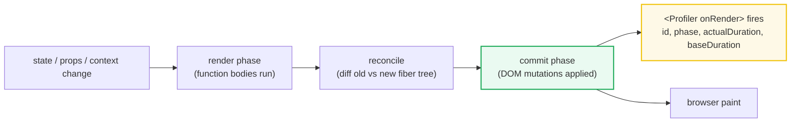

# Re-render Profiling

> **Companion demo:** [`re_render_profiling.html`](./re_render_profiling.html) — open in a browser.
> A live simulator of the React DevTools Profiler: click a button, watch the
> commit timeline record *which* components rendered and *why*.

---

## 0. TL;DR — the one idea

Understanding **why** a component re-rendered is the #1 React performance skill.
There are only **four** root causes. Every wasted render traces to one of them.



A **commit** is one full render+paint cycle. The React DevTools **Profiler**
records every commit and shows three views:

| view | what it shows |
|------|---------------|
| **Flamegraph** | the component tree for one commit; each bar's width = render time; **gray bars = skipped** (memo) |
| **Ranked chart** | components sorted by their own render time (ignores children) — fastest way to find the hot spot |
| **Commit reasons** | *why* each component rendered — enable "Record why each component rendered" |

Click any bar to see its reason. The reason is one of the four below.

---

## 1. The four re-render reasons

| # | reason | trigger | who re-renders |
|---|--------|---------|----------------|
| 1 | **parent re-rendered** | any ancestor rendered | all **non-memoized** descendants — this is the default cascade |
| 2 | **state changed** | a `useState` / `useReducer` setter fired | that component + its non-memoized descendants |
| 3 | **context changed** | a `Provider` value updated | **every `useContext` consumer** — this **bypasses `React.memo`** |
| 4 | **props changed** | parent passed a new reference or value | the child — a `React.memo` child only if the prop fails a shallow `Object.is` compare |

That's the whole list. There is no fifth reason. (Hooks like `useSyncExternalStore`
produce re-renders too, but they collapse to #2 — the store notified, the hook
returned a new value, React treats it as a state change.)

> **The cascade rule (#1):** when a component re-renders, React re-renders **all**
> descendants by default — regardless of whether the prop changed. A child only
> escapes if it is wrapped in `React.memo` **and** its props are referentially
> equal. This is why "parent re-rendered" is the most common reason in any real app.

---

## 2. Using the DevTools Profiler

1. Install the **React Developer Tools** browser extension.
2. Open the **Profiler** tab.
3. Click **● Record**, perform the slow interaction, click **⏹ Stop**.
4. Pick the **tallest commit** in the top bar chart — that's your worst frame.
5. In the **flamegraph**, find the widest bar — that's the component that cost the most.
6. Toggle **"Record why each component rendered"** (gear icon) *before* recording
   to annotate every component with its commit reason.

### Reading the flamegraph

- A **wide, colored bar** = that component did real work rendering.
- A **narrow gray bar** = the component was **skipped** (`React.memo` / `useMemo` won) — exactly what you want.
- The flamegraph is **nested**: a parent bar always contains its children's bars
  (even skipped ones). So the *total* commit time = the width of the root bar.
- Compare against the **ranked chart** when you only care about *self time*
  (the component's own work, excluding descendants).

### The `<Profiler>` API (programmatic)

For in-app / CI telemetry, wrap a subtree with the built-in `<Profiler>`:

```jsx
function onRender(id, phase, actualDuration, baseDuration, startTime, commitTime) {
  // phase: "mount" | "update" | "nested-update"
  // actualDuration: ms spent rendering THIS commit (lower = memoization working)
  // baseDuration:   ms it would take with NO memoization (worst case)
  console.log(id, phase, actualDuration, "/", baseDuration, "ms");
}

<Profiler id="sidebar" onRender={onRender}>
  <Sidebar />
</Profiler>
```

If `actualDuration` stays near `baseDuration` across updates, your memoization
isn't helping. If it drops well below after mount, it is.

> ⚠️ Profiling adds overhead and is **disabled in production builds by default**.
> To profile production, you need a special profiling-enabled build. The
> DevTools extension works out-of-the-box in development.

---

## 3. Optimization strategies (mapped to the reason)

| symptom the Profiler shows | fix | blocks reason |
|----------------------------|-----|---------------|
| child renders on every parent update | `React.memo(Child)` + stable props | #1 parent, #4 props |
| memoized child still re-renders | `useCallback` / `useMemo` the props you pass it | #4 props |
| one context value re-renders the whole tree | **split** into several contexts, or `useMemo` the value + split the fast-changing slice | #3 context |
| a root-level state cascades through everything | **move state down** to the leaf that owns it | #1 parent |
| a heavy child blocks the main thread on update | `useDeferredValue` / `useTransition` (concurrent) | defers, not blocks |
| nothing above applies and it's still slow | the component is just doing too much work — memoize the computation (`useMemo`) or virtualize | self-time |

> **Order of operations:** ALWAYS profile first. Memoization is not free — every
> `useMemo`/`useMemo`/`memo` adds a dependency-check and cache-store cost. Only
> add it where the Profiler proves a render is wasted AND expensive.

---

## 4. Killer Gotchas

| trap | symptom | fix |
|------|---------|-----|
| **memo child still re-renders** | inline `() => {}` or `{}` props are new refs every render | `useCallback` / `useMemo` the prop so its reference is stable |
| **every consumer re-renders constantly** | `value={{a, b}}` literal on the Provider is a new object each render | `useMemo` the value; better, **split** the context so fast-changing fields don't notify slow consumers |
| **memo blocks a needed update** | a memoized child doesn't reflect new data | memo does a shallow compare — you either changed a prop (good) or broke referential equality; don't memo across genuinely-changing inputs |
| **profiling in production shows nothing** | `<Profiler onRender>` never fires | profiling is off in prod by default; use the profiling-enabled build, or measure in dev |
| **"just memoize everything"** | app gets slower, not faster | memo has a cost — profile, then memoize only proven-wasted renders |
| **context update ignores memo** | a `React.memo` component re-renders even though props are stable | it consumes a context whose value changed — memo never blocks context (#3). Split or move the consumer. |
| **state hoisted "for sharing"** | typing in one input re-renders the whole form | move the per-field state down into the leaf input component |

### Cheat sheet

```jsx
// 1. block the parent cascade + prop wiggle on a pure child
const MemoChild = React.memo(function Child(props) { /* ... */ });

// 2. give memo a chance: stabilize the props you pass
const onClick = React.useCallback(handleClick, [dep]);
const config  = React.useMemo(() => ({ a, b }), [a, b]);
<MemoChild onClick={onClick} config={config} />

// 3. narrow context blast radius — split the fast-changing slice
const ThemeContext   = React.createContext(null);   // rarely changes
const SelectionContext = React.createContext(null); // changes often

// 4. shrink the cascade — own the state where it's used
function Form() { return <input /> }              // input state below, not here
function Field() {
  const [v, setV] = React.useState('');           // local → only Field re-renders
  return <input value={v} onChange={e => setV(e.target.value)} />;
}

// 5. measure, don't guess
<Profiler id="x" onRender={(id, phase, actual, base) => console.log(phase, actual, base)} />
```

---

## 🔗 Cross-references

- [`react_memo`](./react_memo.html) — `React.memo` itself: the shallow prop compare that prevents re-renders; profiling tells you **where** to add it.
- [`use_memo_callback`](./use_memo_callback.html) — `useMemo` / `useCallback`: the tools that keep prop references stable so `React.memo` can actually skip.
- [`use_context`](./use_context.html) — Context re-renders every consumer on value change; this is reason #3 and the case for splitting context.
- [`use_external_store`](./use_external_store.html) — `useSyncExternalStore` updates are re-renders too; profile them with the same Profiler.

---

## Sources

- [`<Profiler>` — React reference (react.dev)](https://react.dev/reference/react/Profiler) — the `onRender(id, phase, actualDuration, baseDuration, startTime, commitTime)` API, verified 2026-06.
- [Render and Commit — react.dev](https://react.dev/learn/render-and-commit) — the three-phase lifecycle (trigger → render → commit) the Profiler instruments.
- [Introducing the React Profiler — React Blog](https://legacy.reactjs.org/blog/2018/09/10/introducing-the-react-profiler.html) — canonical description of the flamegraph, ranked chart, and component chart views.
- [Why React Re-Renders — Josh W. Comeau](https://www.joshwcomeau.com/react/why-react-re-renders/) — the descendant-cascade rule in depth.
