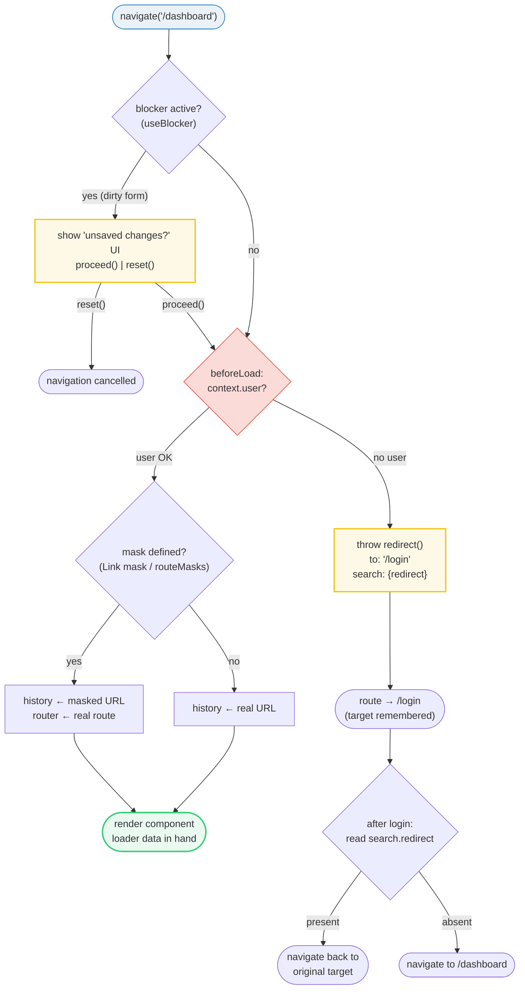
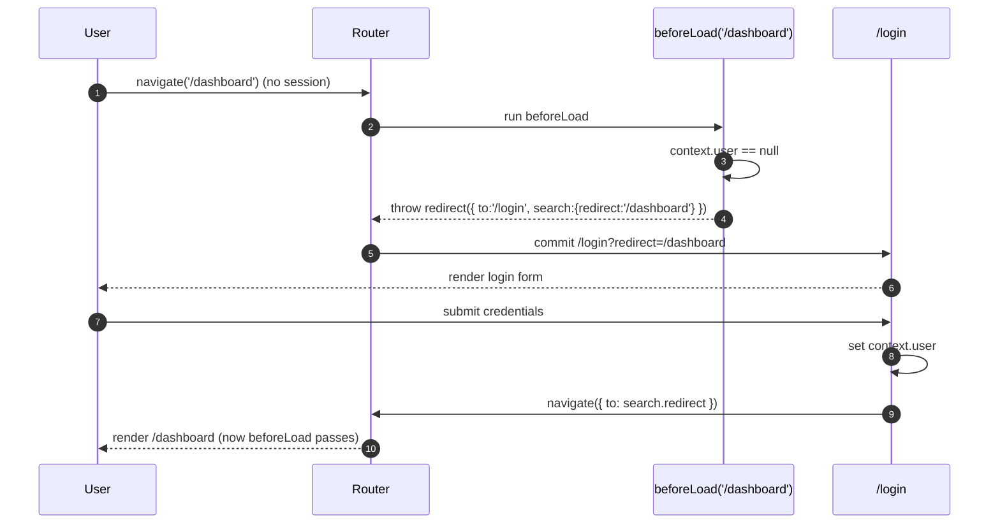
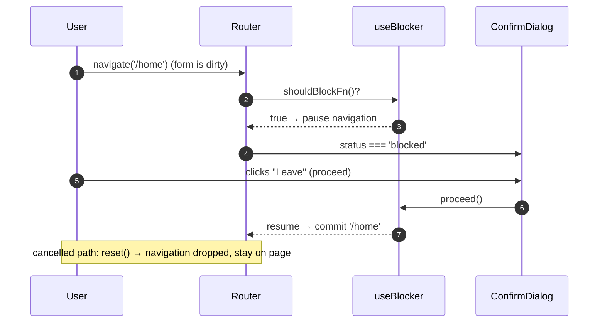
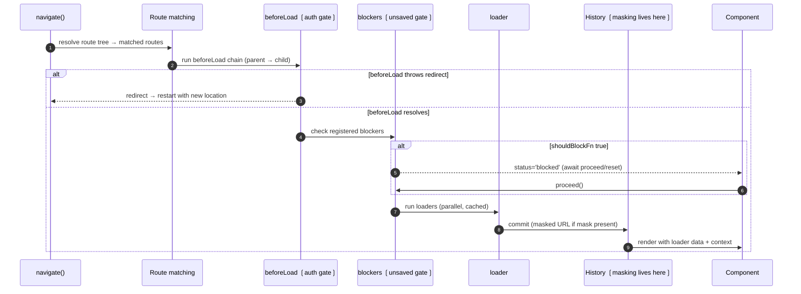

# Router Advanced Patterns

> **Companion demo:** [`router_advanced_patterns.html`](./router_advanced_patterns.html) — open in a browser.
> A live React 19 simulator of the three production router gates — **authenticated
> routes**, **navigation blocking**, and **location masking** — wired into one state
> machine, with a gold-check that walks the full `home → login → dashboard → editor
> → block → force → home` flow.

---

## 0. TL;DR — the one idea

> **The analogy:** a route is not a component, it's a **customs checkpoint**. Three
> gates can run around every navigation: `beforeLoad` (the bouncer — checks your auth
> and can `throw redirect()` to throw you out), a **blocker** (the "are you sure you
> want to leave?" prompt for unsaved changes), and **masking** (which decides what the
> address bar *says* vs. which route *renders*). The order is fixed:
> **block check → auth check → commit URL → render**. Get the order wrong and you'll
> either lose unsaved work or let unauthenticated users straight into private pages.



The router is the *only* component that knows where the user is headed *before*
content renders — so every gate that should run "before paint" belongs here, not in
a `useEffect` inside the page component. By then it's too late: the page already
mounted, the form is already half-edited, the private data already fetched.

---

## 1. How it works — the three gates

### 1A. Authenticated routes (`beforeLoad` + `throw redirect()`)

`beforeLoad` runs **first** in the route lifecycle (before `loader`, before the
component). It can read the router `context` (your auth state), and it can **abort
the entire navigation** by throwing a `redirect()`. The redirect carries a `search`
param — the standard pattern is to stash `location.href` (or `pathname`) there so the
login page can send the user straight back after they authenticate.

```ts
// file: src/routes/dashboard.tsx
import { createFileRoute, redirect } from '@tanstack/react-router'

export const Route = createFileRoute('/dashboard')({
  // 1️⃣ beforeLoad: the auth gate. Throw = abort the navigation.
  beforeLoad: ({ context, location }) => {
    if (!context.user) {
      throw redirect({
        to: '/login',
        search: { redirect: location.href }, // remember the destination
      })
    }
    // (optional) return merges into context for loader + component
    return { user: context.user }
  },
  component: DashboardPage,
})
```

```ts
// file: src/routes/login.tsx — the redirect-back half
export const Route = createFileRoute('/login')({
  validateSearch: (search) =>
    z.object({ redirect: z.string().optional() }).parse(search),
  component: LoginPage,
})

function LoginPage() {
  const { redirect } = Route.useSearch()
  const navigate = useNavigate()
  async function onLoginSuccess(user: User) {
    setUserInContext(user)
    // 2️⃣ honor the remembered destination, else a sane default
    navigate({ to: redirect ?? '/dashboard' })
  }
  // ...
}
```

The two halves form a **round-trip**: `beforeLoad` records the target in the URL,
the login page reads it back and navigates there. Nothing lives in component state
that a refresh would wipe — the *URL itself* is the memory.



### 1B. Navigation blocking (`useBlocker`)

Blocking lets you **pause** a navigation while the user decides. The v1 API is the
`useBlocker` hook: you give it a `shouldBlockFn` (returns `true` to pause) and, if you
want to drive a custom dialog instead of `window.confirm`, you flip `withResolver:
true` and read back `{ proceed, reset, status }`. `proceed()` commits the paused
navigation; `reset()` cancels it. The hook also covers tab-close/refresh via
`enableBeforeUnload`.

```tsx
import { useBlocker } from '@tanstack/react-router'

function EditorPage() {
  const [isDirty, setIsDirty] = useState(false)

  const { proceed, reset, status } = useBlocker({
    shouldBlockFn: () => isDirty, // only block when there are unsaved edits
    withResolver: true,           // expose proceed/reset, don't auto window.confirm
    enableBeforeUnload: isDirty,  // also catch tab close + reload
  })

  return (
    <>
      <Form onChange={() => setIsDirty(true)} onSave={() => setIsDirty(false)} />
      {status === 'blocked' && (
        <ConfirmDialog
          title="You have unsaved changes — leave anyway?"
          onConfirm={proceed} // = the "Force navigate" button in the demo
          onCancel={reset}    // = "Stay here"
        />
      )}
    </>
  )
}
```

> **Note on `beforeLeave`:** older docs and some tutorials reference a route-level
> `beforeLeave` option. In current TanStack Router v1 the canonical API for blocking
> is `useBlocker` (and the `<Block>` render-prop component). Treat `beforeLeave` as
> the conceptual ancestor — same idea (a guard that runs on leave), different shape.



### 1C. Location masking (clean URL, different route)

Masking writes one URL to history / the address bar while the router **renders a
different route**. Classic case: opening a modal like `/photos/$id/modal` but showing
the user the clean `/photos/$id`. The masked URL is the one that gets shared,
bookmarked, and reloaded; the real route is what actually paints.

```tsx
import { Link, createRouteMask, createRouter } from '@tanstack/react-router'

{/* Imperative: mask per-link */}
<Link
  to="/photos/$photoId/modal"
  params={{ photoId: 5 }}
  mask={{ to: '/photos/$photoId', params: { photoId: 5 } }}
>
  Open photo
</Link>
```

```ts
{/* Declarative: mask every matching navigation app-wide */}
const photoModalMask = createRouteMask({
  routeTree,
  from: '/photos/$photoId/modal',
  to: '/photos/$photoId',
  params: (prev) => ({ photoId: prev.photoId }),
})

const router = createRouter({ routeTree, routeMasks: [photoModalMask] })
```

Under the hood, masking stores the *real* location inside `location.state.__tempLocation`
and persists the masked URL to history. The router reads `__tempLocation` back on
parse, so the real route renders. When a masked URL is shared or reloaded the mask
data is lost by design — the URL resolves to whatever it literally says.

---

## 2. Mechanism / internals — the route lifecycle, where the gates live

All three gates are just **hooks into the same navigation lifecycle**. The pipeline
below is the full sequence; the gates from this bundle are highlighted.



| gate | runs | abort power | where state is kept |
|------|------|-------------|---------------------|
| **`beforeLoad`** | before loaders, before render | `throw redirect()` / `throw error` | router `context` (typed) |
| **`useBlocker`** | after match, before commit | `shouldBlockFn` → pause until `proceed`/`reset` | component state (`isDirty`) |
| **masking** | at history commit | none (purely cosmetic on the URL) | `location.state.__tempLocation` |

Because `beforeLoad` and blockers both run **before** the loader and render, a thrown
redirect or a paused blocker means the destination component never mounts — no
private data fetch, no loading flicker, no half-painted page.

---

## 3. Route guards composition — combining gates on one route

Real pages stack these gates. The rule: **most-specific to least-specific, each gate
is independent**. `beforeLoad` returns a merged `context` that flows down the route
tree, so a parent route's auth check covers all children — you don't re-auth on every
leaf.

```ts
// file: src/routes/_authed.tsx — the auth layout route
export const Route = createFileRoute('/_authed')({
  beforeLoad: ({ context, location }) => {
    if (!context.user) {
      throw redirect({ to: '/login', search: { redirect: location.href } })
    }
  },
})

// file: src/routes/_authed/editor.tsx — auth inherited, blocker local
export const Route = createFileRoute('/_authed/editor')({
  component: EditorPage, // ← EditorPage calls useBlocker() internally
})
```

| guard type | scope | typical placement |
|------------|-------|-------------------|
| **auth** (`beforeLoad` redirect) | a whole branch | layout route (`/_authed`) — covers all descendants |
| **role/permission** (`beforeLoad`) | a single route or branch | the protected route, reads `context.user.role` |
| **unsaved-changes** (`useBlocker`) | a single page | inside the component that owns the dirty form |
| **masking** (`createRouteMask`) | any matching navigation | declared once on the router |

A route that needs all three is normal: the layout route provides auth, the page
component installs a blocker, and a `<Link mask>` on the entry point keeps the URL
clean. They don't conflict because they live at different points in the lifecycle.

---

## 4. `beforeLoad` vs `beforeLeave` vs `useBlocker`

These names get conflated. Here's the actual distinction:

| API | when it fires | direction | current status | use for |
|-----|---------------|-----------|----------------|---------|
| **`beforeLoad`** | before loaders + render, on the *destination* route | entering | ✅ current (v1) | auth, redirects, context setup, permission checks |
| **`beforeLeave`** | on the *current* route, before leaving it | leaving | ⚠️ conceptual / superseded | the idea behind blocking; in v1 use `useBlocker` |
| **`useBlocker`** | after match, before commit, anywhere in the tree | entering + leaving | ✅ current (v1) | unsaved-changes prompts, payment-step guards |
| **`loader`** | after `beforeLoad` resolves | entering | ✅ current (v1) | data fetching (not a guard — can throw to error boundary) |

**Mental model:** `beforeLoad` is a *doorman* at the destination (can reject you at
the door). `useBlocker` is a *bungee cord* on the current page (can keep you from
leaving). `loader` is the *waiter* — runs after you're already let in.

---

## 5. Killer Gotchas

| trap | symptom | fix |
|------|---------|-----|
| auth check inside `useEffect` | private page flashes for a frame, data fetch fires, then redirects | move the check into `beforeLoad` — it runs before render, period |
| `redirect` without `search.redirect` | after login, user lands on a default page, not where they wanted | stash `location.href`/`pathname` in the `search` param and read it back on `/login` |
| `shouldBlockFn` always returns `true` | every navigation is blocked, including the one that saves the form | gate it on real dirty state: `() => isDirty`; clear `isDirty` on save |
| `enableBeforeUnload` always on | browser "leave page?" dialog on every reload, even with a clean form | make it conditional: `enableBeforeUnload: isDirty` |
| `window.confirm` inside `shouldBlockFn` with `withResolver: true` | the return value is ignored — blocker never resolves | with `withResolver: true`, drive `proceed()`/`reset()` from your own UI; drop `window.confirm` |
| masked URL reloaded locally, still masked | the "real" route doesn't restore on refresh | by design local reload keeps the mask; set `unmaskOnReload: true` on router/mask if you want unmasking |
| masked URL shared to another user | they see the *masked* destination, not the modal | intended — masking data is local-only; shareable URLs always resolve literally |
| blocking + redirect race | auth `beforeLoad` throws but the blocker already showed its dialog | `beforeLoad` runs first; blockers only engage after the destination matches, so a redirect short-circuits cleanly |
| redirect target is itself guarded | login redirects to `/dashboard`, which redirects back to `/login` → loop | only redirect to routes the user can now access; default to a known-safe page |

---

### Cheat sheet

```ts
// ── AUTH: beforeLoad + throw redirect() ──────────────────────────────
beforeLoad: ({ context, location }) => {
  if (!context.user) {
    throw redirect({ to: '/login', search: { redirect: location.href } })
  }
  return { user: context.user }   // merges into context for loader + component
}

// login page reads the remembered target
const { redirect } = Route.useSearch()
navigate({ to: redirect ?? '/dashboard' })

// ── BLOCKING: useBlocker + resolver ──────────────────────────────────
const { proceed, reset, status } = useBlocker({
  shouldBlockFn: () => isDirty,
  withResolver: true,
  enableBeforeUnload: isDirty,    // also catch tab close / reload
})
// status === 'blocked' → render your confirm UI → proceed() or reset()

// ── MASKING: clean URL, different route ──────────────────────────────
<Link to="/photos/$id/modal" params={{ id }} mask={{ to: '/photos/$id', params: { id } }} />

// declarative, app-wide:
createRouteMask({ routeTree, from: '/photos/$id/modal', to: '/photos/$id' })
```

**Gate ordering (memorize this):** `match → beforeLoad (auth/redirect) → blockers
(unsaved) → loaders (fetch) → commit URL (masking) → render`. A throw in
`beforeLoad` cancels everything downstream; a paused blocker holds the navigation
until resolved.

---

## 🔗 Cross-references

- [`router_loader_lifecycle.html`](./router_loader_lifecycle.html) — `beforeLoad` sits
  at step 1 of the `beforeLoad → loader → component` pipeline; this bundle is what
  you put *inside* that step to guard it.
- [`router_nested_context.html`](./router_nested_context.html) — auth `context` flows
  down the route tree the same way `beforeLoad` return values merge; put auth on a
  layout route and every descendant inherits it.
- [`router_fundamentals.html`](./router_fundamentals.html) — the route tree + matching
  primitives that all three gates run on top of.
- [`../frontend/tanstack-start/api_endpoints_middleware.html`](../frontend/tanstack-start/api_endpoints_middleware.html)
  — server-side middleware is the same idea on the backend: gates that run before a
  request commits. Auth + blocking extend the *client* route lifecycle symmetrically.

---

## Sources

- TanStack Router — **Navigation Blocking** (v1 docs):
  <https://tanstack.com/router/latest/docs/guide/navigation-blocking>
- TanStack Router — **Route Masking** (v1 docs):
  <https://tanstack.com/router/latest/docs/guide/route-masking>
- TanStack Router — **Authenticated Routes** (guide + example):
  <https://tanstack.com/router/latest/docs/guide/authenticated-routes>
  · <https://tanstack.com/router/latest/docs/framework/react/examples/authenticated-routes>
- TanStack Router — **Navigation Blocking** (live example):
  <https://tanstack.com/router/latest/docs/framework/react/examples/navigation-blocking>
- TanStack Router — **Location Masking** (live example):
  <https://tanstack.com/router/latest/docs/framework/react/examples/location-masking>
