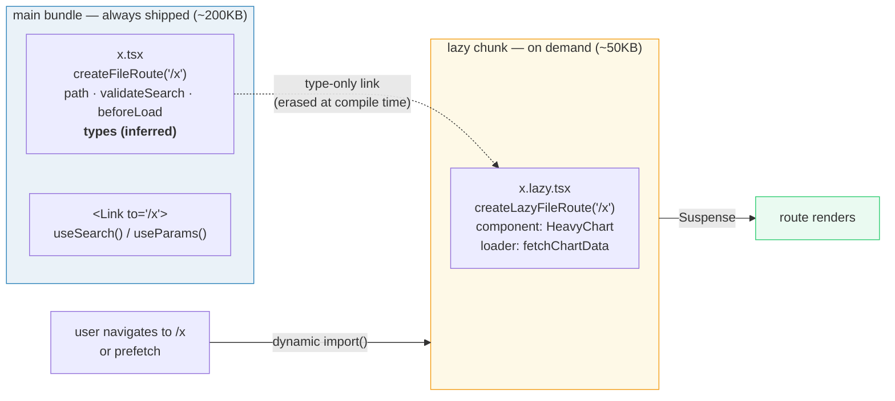
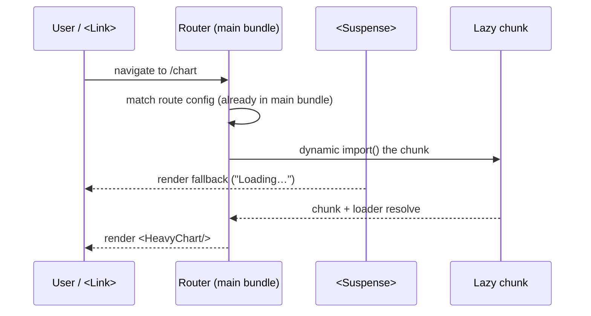

# Route-Level Code Splitting with `createLazy`

> **Companion demo:** [`router_code_splitting.html`](./router_code_splitting.html) — open in a browser.
> Watch the chart chunk fetch on demand and the bundle bar grow from ~200KB → ~250KB.

---

## 0. TL;DR — the one idea

A route is split across **two files**. The non-lazy file stays in the **main bundle**
(so `<Link>` and `useSearch` stay type-safe); the lazy file becomes its **own chunk** holding
the component + loader, fetched only when the route is visited.



The contract: **config + types in the main bundle, component + loader in the chunk.**
Links type-check everywhere; heavy code is paid for only when used.

---

## 1. How it works — the two-file split

Every code-split route is two files that TanStack's file-based routing stitches together
at build time.

```tsx
// routes/analytics/chart.tsx — NON-LAZY → main bundle
// Holds the route CONFIG only. This file is imported eagerly so every <Link to="/chart">
// and useSearch() in the app can type-check.
import { createFileRoute } from '@tanstack/react-router'
import { z } from 'zod'

export const Route = createFileRoute('/analytics/chart')({
  validateSearch: z.object({ range: z.enum(['7d', '30d']).optional() }),
  beforeLoad: ({ context }) => {
    if (!context.auth.can('read:analytics')) throw redirect({ to: '/login' })
  },
  // NO component, NO loader here.
})
```

```tsx
// routes/analytics/chart.lazy.tsx — LAZY → its own chunk
// Holds the component AND the loader. This whole file becomes a dynamically-imported
// chunk; it is fetched when the user navigates to /chart (or when it's prefetched).
import { createLazyFileRoute } from '@tanstack/react-router'

export const Route = createLazyFileRoute('/analytics/chart')({
  component: HeavyChart,              // ~the chart library, only downloaded now
  loader: async ({ params, context }) => fetchChartData(params),
})
```

At build time the `.lazy.tsx` file is wired to its non-lazy sibling by the matching
route path (`/analytics/chart`). The bundler turns `chart.lazy.tsx` into a separate chunk;
the main bundle keeps only a thin reference to it.

### The four-step runtime flow



1. **Match** — the route config is in the main bundle, so the router matches `/chart`
   instantly and runs `validateSearch` + `beforeLoad` **before** any chunk is fetched.
2. **Import** — the router issues a `dynamic import()` for the lazy chunk.
3. **Suspend** — while the chunk + its loader resolve, `<Suspense>` shows the fallback.
4. **Render** — once resolved, the lazy `component` mounts with the loader's data.

---

## 2. Mechanism — `createLazyFileRoute` vs `createFileRoute`

Both helpers return a `Route` object, but they own **different fields**:

| field | `createFileRoute` (main bundle) | `createLazyFileRoute` (lazy chunk) |
|---|---|---|
| `path` / route id | ✅ owns it | references it (same path) |
| `validateSearch` | ✅ | ❌ |
| `beforeLoad` | ✅ | ❌ |
| `params` / `search` **types** | ✅ (inferred) | reuses them |
| `component` | ❌ | ✅ |
| `loader` | ❌ | ✅ |
| `pendingComponent` / `errorComponent` | ✅ (can stay or move) | ✅ (can move) |

The split is a **layering**: the non-lazy route provides *routing* decisions and *types*;
the lazy route provides *the heavy rendering*. Because TypeScript erases types at compile
time, putting them in the main bundle costs **zero bytes on the wire** while keeping the
whole app type-safe.

### Why this beats `React.lazy`

`React.lazy(() => import('./Heavy'))` splits **one component** and needs a manual
`<Suspense>` wrapper at the call site. `createLazyFileRoute` is different in three ways:

| | `React.lazy` | `createLazyFileRoute` |
|---|---|---|
| granularity | one component | a whole route (**component + loader**) |
| boundary | wherever you place it | the route boundary (router manages it) |
| loader | not supported | bundled into the same chunk as the component |
| Suspense | you wrap manually | router auto-wraps every lazy route |
| type-safety | none special | route types stay in the main bundle |

See [`./lazy_suspense.html`](./lazy_suspense.html) for the component-level story;
this bundle is the route-level upgrade.

---

## 3. `<Suspense>` integration

The router automatically wraps every lazy route's component in a `<Suspense>` boundary.
The fallback comes from the route tree — declared close to the route, not scattered across
the app:

```tsx
// non-lazy file (main bundle) — fallback is cheap, keep it here
export const Route = createFileRoute('/analytics/chart')({
  beforeLoad: ...,
  pendingComponent: () => <div>Loading chart…</div>,  // shown while the chunk loads
})
```

`pendingComponent` is the Suspense fallback. Because it lives in the main bundle, the
fallback paints **instantly** — you never get a blank screen while the chunk downloads.
The chunk's own `loader` then runs; if you want a *separate* fallback for loader time, use
`defaultPendingComponent` / `defaultPendingMinMs` for smoothness (see
[`./router_loader_lifecycle.html`](./router_loader_lifecycle.html)).

---

## 4. Prefetch interaction — load the chunk before the click

Code splitting trades initial bundle size for a fetch **on first navigation**. Prefetching
removes that cost by fetching the chunk the moment a `<Link>` signals intent — *before* the
click lands. This is where this bundle and
[`./router_navigation_preload.html`](./router_navigation_preload.html) meet: prefetching loads
**both** the lazy chunk **and** its loader data.

```tsx
<Link to="/analytics/chart" preload="intent" preloadDelay={50}>
  Chart
</Link>
```

- `preload="intent"` — fetch on hover (desktop) / tap-start (mobile).
- `preload="viewport"` — fetch when the link scrolls into view.
- `router.preloadRoute({ to: '/chart' })` — imperative (e.g. on app boot).

After a prefetch, the chunk is cached; navigating to `/chart` is then **instant** — no
Suspense flash, because the lazy component is already resolved. The demo's "prefetch" button
does exactly this: hit it, then click Chart, and the chart mounts on the first frame.

---

## 5. Bundle analysis — what you actually save

Splitting pays off when a route pulls in heavy, route-specific code (chart libs, editors,
maps, markdown renderers). The win is the difference between the main bundle and the
main-bundle-plus-rarely-visited-route:

```
without splitting   main bundle ──────────────────────── 280KB  (always)
with splitting      main bundle ──────────── 200KB (always)
                    chart chunk ───           50KB  (only /chart visitors)
                    editor chunk ───          80KB  (only /editor visitors)
```

A user who only visits the home route downloads **200KB instead of 360KB+**. The first
visit to `/chart` pays one extra ~50KB round-trip (mitigated by prefetch). Subsequent
visits are free (chunk is cached by the browser).

Rule of thumb: split routes whose code is **(a)** large and **(b)** rarely visited. Don't
split tiny routes — the HTTP overhead and Suspense flash cost more than they save.

---

## 6. Killer Gotchas

| trap | symptom | fix |
|------|---------|-----|
| putting `component` in the non-lazy file | the heavy code ships in the **main** bundle — no split happens | move `component` + `loader` to `*.lazy.tsx`; keep only config in `*.tsx` |
| putting `validateSearch` / `beforeLoad` in the lazy file | `<Link>` / `useSearch` lose types, or search isn't validated before the chunk loads | these must stay in the **non-lazy** file — they run *before* the chunk is fetched |
| splitting a route that's on the critical path | a Suspense flash on the very first navigation, or a waterfall (chunk → loader → render) | preload the route on app boot (`router.preloadRoute`) or don't split it |
| no `pendingComponent` | blank screen while the chunk downloads (looks broken) | always provide a `pendingComponent` in the non-lazy file — it's cheap and instant |
| expecting `loader` to run without the chunk | data isn't fetched until the chunk arrives | correct — the loader lives in the chunk. To fetch data eagerly, preload (see [`./router_navigation_preload.html`](./router_navigation_preload.html)) |
| renaming the path in only one file | the lazy and non-lazy routes drift apart; types break or the chunk never matches | change the path in **both** `x.tsx` and `x.lazy.tsx` (or rely on file-based routing to keep them in sync) |
| over-splitting tiny routes | many small chunks = many HTTP requests; slower than one bundle | split only heavy/rare routes; keep small, always-used routes in the main bundle |
| `React.lazy` where you need the loader | you re-implement data fetching per component | use `createLazyFileRoute` — it splits component **and** loader together |

---

### Cheat sheet

```tsx
// ── main bundle: routing decisions + types (always shipped) ──────────────
// routes/analytics/chart.tsx
import { createFileRoute } from '@tanstack/react-router'
export const Route = createFileRoute('/analytics/chart')({
  validateSearch, beforeLoad,
  pendingComponent: () => <div>Loading chart…</div>,   // Suspense fallback (cheap)
})

// ── lazy chunk: the heavy stuff (fetched on demand / prefetch) ───────────
// routes/analytics/chart.lazy.tsx
import { createLazyFileRoute } from '@tanstack/react-router'
export const Route = createLazyFileRoute('/analytics/chart')({
  component: HeavyChart,
  loader: async ({ params }) => fetchChartData(params),
})

// ── prefetch so the first navigation is instant ──────────────────────────
<Link to="/analytics/chart" preload="intent" />        // declarative
router.preloadRoute({ to: '/analytics/chart' })        // imperative
```

**Remember:** config + types → main bundle; component + loader → chunk. That's the whole model.

---

## 🔗 Cross-references

- [`./lazy_suspense.html`](./lazy_suspense.html) / [`LAZY_SUSPENSE.md`](./LAZY_SUSPENSE.md) — `React.lazy` splits **one component**; `createLazy` splits a whole **route** (component + loader) and keeps types in the main bundle.
- [`./router_navigation_preload.html`](./router_navigation_preload.html) / [`ROUTER_NAVIGATION_PRELOAD.md`](./ROUTER_NAVIGATION_PRELOAD.md) — prefetching is what makes split routes feel instant: it loads the chunk (and its loader) on hover/viewport, before the click.
- [`./router_fundamentals.html`](./router_fundamentals.html) / [`ROUTER_FUNDAMENTALS.md`](./ROUTER_FUNDAMENTALS.md) — the route tree, matching, and `<Link>` that this splitting layer sits on top of.
- [`./router_loader_lifecycle.html`](./router_loader_lifecycle.html) / [`ROUTER_LOADER_LIFECYCLE.md`](./ROUTER_LOADER_LIFECYCLE.md) — the loader that ships *inside* the lazy chunk: `beforeLoad → loader → render` and the `pendingMinMs` smoothing.

---

## Sources

- TanStack Router — Code Splitting (official docs, verified 2026-06):
  https://tanstack.com/router/latest/docs/framework/react/guide/code-splitting
- TanStack Router — `createLazyFileRoute` API reference:
  https://tanstack.com/router/latest/api/reference/createLazyFileRoute
- TanStack Router — Navigation & Preloading (preload loads lazy chunks + loader data):
  https://tanstack.com/router/latest/docs/framework/react/guide/preloading
