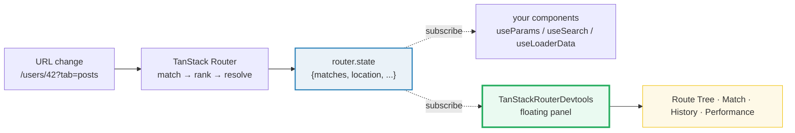
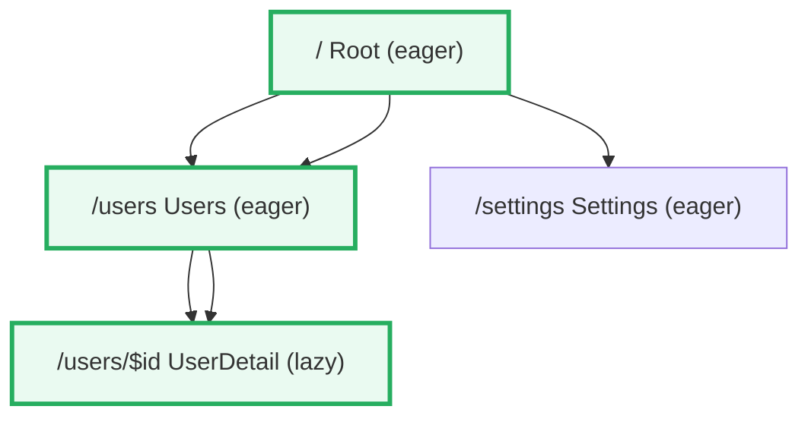

# TanStack Router DevTools

> **Companion demo:** [`router_devtools.html`](./router_devtools.html) — open in a browser. A live, simulated four-tab DevTools panel (Route Tree, Match, History, Performance) rendered with React 19 via CDN.

---

## 0. TL;DR — the one idea

Drop one component once, dev-only, and you get an X-ray of the entire router.

```tsx
import { TanStackRouterDevtools } from '@tanstack/router-devtools';

function RootComponent() {
  return (
    <>
      <Outlet />
      {process.env.NODE_ENV === 'development' && (
        <TanStackRouterDevtools position="bottom-right" />
      )}
    </>
  );
}
```

`<TanStackRouterDevtools/>` **subscribes to `router.state`** and mirrors it into a floating panel. It is read-only — it never dispatches navigations or mutates state. It only makes the decisions the router already made (match → params → search → loader → render) **visible**.



The panel is just another subscriber to `router.state`. That is the whole trick: **there is no second source of truth** — DevTools reads the exact object your hooks read.

---

## 1. How it works

### 1.1 Mount it once, dev-only

```bash
npm install @tanstack/router-devtools
```

```tsx
// src/routes/__root.tsx (or wherever your root component lives)
import { TanStackRouterDevtools } from '@tanstack/router-devtools';
import { Outlet, createRootRoute } from '@tanstack/react-router';

export const Route = createRootRoute({
  component: RootComponent,
});

function RootComponent() {
  return (
    <>
      <Outlet />
      {import.meta.env.DEV && <TanStackRouterDevtools position="bottom-right" />}
    </>
  );
}
```

- Mount it **once**, inside the router tree (the root component is the natural spot).
- It auto-detects the router from context, but you can pass it explicitly: `<TanStackRouterDevtools router={router} />`.
- `position` controls where the floating logo trigger sits: `"top-left" | "top-right" | "bottom-left" | "bottom-right"` — default **`bottom-left`**. Click the logo to open the panel.

### 1.2 The four tabs

| tab | surface | data source |
|-----|---------|-------------|
| **Route Tree** | full parent→child tree, eager/lazy badges, matched chain highlighted | `router.routeTree` + `router.state.matches` |
| **Match** (current route) | pathname, params, validated search, context, loader status, matched chain | `router.state.matches[]` (the leaf) |
| **History** (navigation timeline) | past navigations, preload hit/miss, redirect chains | `router.history` + internal nav log |
| **Performance** | match time, loader exec time, render time | per-match timing instrumentation |

---

## 2. Mechanism / internals

DevTools is **a `router.state` subscriber that renders a UI**. Conceptually:

```ts
// simplified — what DevTools is, under the hood
function TanStackRouterDevtools({ router }: { router: Router }) {
  // subscribe to the router's state — re-renders on every transition
  const state = router.state;

  return (
    <FloatingPanel>
      <RouteTreeView routeTree={router.routeTree} matches={state.matches} />
      <MatchView match={state.matches[state.matches.length - 1]} />
      <HistoryView history={router.history} />
      <PerfView matches={state.matches} />
    </FloatingPanel>
  );
}
```

Three consequences fall out of "it just subscribes":

1. **It is always truthful.** The values you see in the Match tab (params, search, context) are the same objects `useParams()`, `useSearch()`, `Route.useRouteContext()` hand your components. No drift.
2. **It updates on every transition.** Loader resolves, search changes, redirects — all flow through `router.state`, so the panel re-renders each time.
3. **It costs nothing in prod.** The dev-only guard means the package is tree-shaken out of production builds; users never download it.

### 2.1 Route Tree visualization



- The tree mirrors the **compiled** route tree (what `router.routeTree` holds after `createRouter`), not the file system.
- **Eager vs lazy** is shown as a badge: `lazy` routes are code-split (`createLazy` / `lazy()` splits); eager routes are bundled into the main chunk.
- The **matched chain** (e.g. `[Root, Users, UserDetail]`) is highlighted — these are exactly the `state.matches` entries React will render, in order, through `<Outlet/>`.

### 2.2 Match Inspector

This is the tab you will live in. For URL `/users/42?tab=posts`:

| field | value | where it comes from |
|-------|-------|---------------------|
| `pathname` | `/users/42` | `state.location.pathname` |
| `params` | `{ id: '42' }` | extracted from `$id` segment during matching |
| `search` | `{ tab: 'posts' }` | **post-`validateSearch`** — validated, typed, defaulted |
| `context` | `{ user: 'admin', theme: 'dark' }` | merged parent→child route context (`beforeLoad` / `context`) |
| `loader` | `loaded` (or `loading` / `stale` / `error`) | lifecycle of the matched route's `loader` |
| `chain` | `Root → Users → UserDetail` | `state.matches.map(m => m.routeId)` |

> **The search row shows VALIDATED search**, not the raw query string. If `validateSearch` coerces `?page=2` to a number and `?sort` to `'desc' | 'asc'`, that is what you see. This is why the Match tab is the fastest way to debug "why is my `useSearch()` returning the wrong shape" — you see the post-validation object the router actually committed to.

### 2.3 Navigation History

A timeline of past navigations with three signals:

- **`from → to`** — the path transition.
- **preload `hit` / `miss`** — did the intent-hover (or `defaultPreload: 'intent'`) already warm the loader before the click? `hit` = instant navigation, `miss` = loader ran on click.
- **redirect chains** — when a `beforeLoad` throws `redirect({to})`, the panel shows the hop, so `A → (redirect) → B` is visible instead of mysteriously landing on `B`.

### 2.4 Performance

Three timings per match:

| metric | measures |
|--------|----------|
| **Route match** | URL → ranked candidate list → matched node (the pure matching pass) |
| **Loader exec** | awaited time of the matched route's `loader` (network + parse) |
| **Component render** | time from match resolved → route components mounted/painted |

When a navigation feels slow, the Performance tab tells you **which stage** owns the latency: match is microseconds (a bug if large), loader is usually network, render is usually a heavy component.

---

## 3. Dev-only conditional rendering (do not skip this)

The package is dev-only by contract. Two equivalent guards:

```tsx
// Vite / most bundlers
{import.meta.env.DEV && <TanStackRouterDevtools />}

// portable / CRA-style
{process.env.NODE_ENV === 'development' && <TanStackRouterDevtools />}
```

Either way the bundler strips the branch in production, so:

- No DevTools code in the prod bundle.
- No floating logo for end users.
- No runtime subscription to `router.state` in prod.

If you forget the guard, the panel works fine but you ship ~tens of KB of debugging UI to production. Use the guard.

---

## 4. Chrome extension & the unified DevTools panel

TanStack also ships DevTools as a **Chrome extension** and as a **unified panel** that houses Router, Query, Store, and Virtual devtools together:

- **Unified panel** (`@tanstack/devtools`, https://tanstack.com/devtools/latest): one floating button, tabs for each TanStack library you have mounted. If you use Router + Query together, this avoids two floating logos fighting for the corner.
- **Chrome extension**: attaches to any page running TanStack libraries without you mounting anything — useful for inspecting apps you don't own the source of.

The Router DevTools tab inside either surface mirrors the same `router.state` as the in-app `<TanStackRouterDevtools/>` component — same data, different host.

---

## 5. Killer Gotchas

| trap | symptom | fix |
|------|---------|-----|
| **Forgot the dev guard** | DevTools ships to production; floating logo visible to users, ~tens of KB extra | Wrap in `import.meta.env.DEV &&` or `process.env.NODE_ENV === 'development'` |
| **Mounted outside the router** | `Error: useRouter must be used within a RouterProvider` / blank panel | Mount inside the root component (inside `<RouterProvider/>`), or pass `router={router}` explicitly |
| **`search` looks "wrong"** | `useSearch()` returns typed/defaulted values, not raw query | The Match tab shows **validated** search (post-`validateSearch`). That is the truth, not the URL string |
| **Two panels / two logos** | Router + Query both float, overlap in the corner | Use the unified `@tanstack/devtools` panel, or set distinct `position` values |
| **`position` not respected** | Logo appears `bottom-left` despite prop | Re-check the value — only `top-left|top-right|bottom-left|bottom-right` are allowed; typos fall back to the default |
| **Loader shows `stale` forever** | Match tab loader status never reaches `loaded` | `stale` means the data is cached but flagged expired (`staleTime` elapsed). Either navigate again or lower `staleTime` — the panel is correct |
| **Perf times look zero** | Match/Loader/Render all ~0ms | Instrumentation is coarse; for sub-ms flows the numbers round. Use the React DevTools Profiler for render depth, Router DevTools for "which stage" |
| **Chrome extension sees nothing** | Extension panel empty on a page that clearly uses Router | The in-app component and extension read the same state, but the extension needs the page NOT to have customized the global; mount the in-app component for guaranteed visibility |

---

## 6. Cheat sheet

```tsx
// install
npm install @tanstack/router-devtools

// mount once, dev-only, inside the router
import { TanStackRouterDevtools } from '@tanstack/router-devtools';

function RootComponent() {
  return (
    <>
      <Outlet />
      {import.meta.env.DEV && (
        <TanStackRouterDevtools position="bottom-right" />
      )}
    </>
  );
}

// or pass the router explicitly (works outside RouterProvider context)
<TanStackRouterDevtools router={router} />
```

| want to know… | look at |
|---------------|---------|
| which routes exist + eager vs lazy | **Route Tree** tab |
| why THIS url matched, and the chain | **Route Tree** → matched-chain highlight |
| the params the router extracted | **Match** → `params` |
| the VALIDATED search (post-schema) | **Match** → `search` |
| the merged route context | **Match** → `context` |
| loader state (loading/loaded/stale/error) | **Match** → `loader` |
| whether intent-hover prefetched | **History** → preload `hit`/`miss` |
| where a navigation spent time | **Performance** → match / loader / render |
| one panel for Router + Query | `@tanstack/devtools` (unified) |

**The mental model in one line:** DevTools is a `router.state` subscriber that paints — everything it shows is exactly what your hooks received.

---

## 🔗 Cross-references

- [`router_fundamentals.html`](./router_fundamentals.html) — the higher-level pipeline (route tree → history → matching → render). DevTools visualizes **this** pipeline, so learn it first.
- [`router_route_tree.html`](./router_route_tree.html) — how the tree is compiled, linearized, ranked, and matched. The Route Tree tab mirrors the output of stages 2–4 here.
- [`router_loader_lifecycle.html`](./router_loader_lifecycle.html) — the `loading → loaded → stale → error` lifecycle the Match tab's `loader` status reports on.
- [`router_navigation_preload.html`](./router_navigation_preload.html) — intent-based preloading. The History tab's `preload: hit/miss` badge is the observable result of this feature.

---

## Sources

- TanStack Router — DevTools (official): https://tanstack.com/router/latest/docs/framework/react/devtools
- TanStack Router — How to Debug Common Router Issues (official): https://tanstack.com/router/latest/docs/how-to/debug-router-issues
- TanStack DevTools (unified panel): https://tanstack.com/devtools/latest
- TanStack Router — `@tanstack/router-devtools` package: https://github.com/TanStack/router/tree/main/packages/router-devtools
