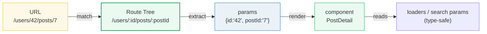
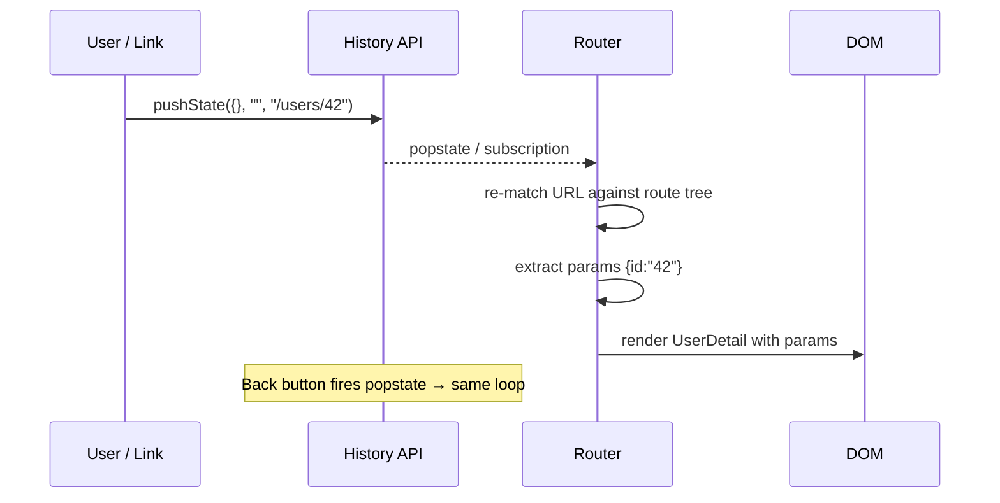

# Router Fundamentals — the mental model

> **Companion demo:** [`router_fundamentals.html`](./router_fundamentals.html) — open in a browser.
> **React version:** 19.2.7 via ESM CDN + Babel standalone.

---

## 0. TL;DR — the one idea

> **The analogy:** a router is a switchboard operator. It listens to the URL (the
> incoming call number), looks up which route in the route tree (the directory)
> matches, extracts the params (the extension), and connects it to a component.



A router connects URLs to UI. **Three core concepts** do all the work: a **route
tree** (hierarchical route definitions), **history** (the browser's URL state),
and **matching** (finding which route fits a URL and extracting params).

This bundle builds a **minimal router from scratch** so the mental model is
concrete — then maps it onto TanStack Router's real implementation.

---

## 1. The three core concepts

| Concept | Role | Plain JS equivalent |
|---------|------|---------------------|
| **Route tree** | A hierarchical structure of route definitions (nested like a filesystem). | An array (flat) or nested object of `{path, component}` |
| **History** | The browser's URL state. The router listens to changes and re-matches. | `history.pushState()` + the `popstate` event |
| **Matching** | Given a URL, walk the tree and find the route whose pattern fits; extract params. | A pattern matcher that splits on `/` and compares segment by segment |

### Route tree

Routes are nested. `/users/$id/posts` means "a specific user's post list" — the
`posts` route is a child of the `$id` route, which is a child of `users`. In real
TanStack Router this nesting is explicit (code-based `getParentRoute`) or inferred
from the filesystem (`routes/users.$id.posts.tsx`).

### History

The browser gives you the [History API](https://developer.mozilla.org/en-US/docs/Web/API/History_API):
`pushState(state, "", url)` adds an entry, `replaceState` swaps the current one,
and the `popstate` event fires on back/forward. TanStack Router wraps this in a
history abstraction (browser, hash, or memory) so it can listen to URL changes and
re-run matching.

```javascript
// "navigate" in its rawest form — what every Link/button ultimately calls:
history.pushState({}, "", "/users/42/posts/7");
// → router hears the change → re-matches → renders PostDetail
```

### Matching

Given a URL, the router splits it into segments and walks the route tree to find
the first pattern that fits. Dynamic segments (`:id` / `$id`) capture values into
a typed `params` object.

```javascript
// /users/42/posts/7  matches  /users/:id/posts/:postId
// → { id: "42", postId: "7" }
```

---

## 2. Path patterns & param extraction — how matching works

The matcher splits both the pattern and the URL on `/`, then compares segment by
segment. A segment starting with `:` is a **param** — it captures that position's
value. Everything else must match literally.

```javascript
function matchRoute(pattern, pathname) {
  if (pattern === '*') return { params: {} };          // catch-all
  const patternParts = pattern.split('/').filter(Boolean);
  const pathParts    = pathname.split('/').filter(Boolean);
  if (patternParts.length !== pathParts.length) return null;  // depth must match

  const params = {};
  for (let i = 0; i < patternParts.length; i++) {
    if (patternParts[i].startsWith(':')) {
      params[patternParts[i].slice(1)] = pathParts[i];   // capture :param
    } else if (patternParts[i] !== pathParts[i]) {
      return null;                                        // literal mismatch
    }
  }
  return { params };
}
```

### The matching table

| URL | pattern | component | params |
|-----|---------|-----------|--------|
| `/` | `/` | Home | `{}` |
| `/users` | `/users` | UserList | `{}` |
| `/users/42` | `/users/:id` | UserDetail | `{id:"42"}` |
| `/users/42/posts` | `/users/:id/posts` | UserPosts | `{id:"42"}` |
| `/users/42/posts/7` | `/users/:id/posts/:postId` | PostDetail | `{id:"42", postId:"7"}` |
| `/anything/else` | `*` | NotFound | `{}` |

> **Why order matters:** the flat list tries patterns top-to-bottom and the first
> match wins. Real TanStack Router doesn't rely on array order — it **compiles**
> the tree into a deterministic structure and ranks matches, so specificity is
> automatic (see [router_route_tree](./router_route_tree.html)).

### Real TanStack Router syntax

```typescript
// code-based: each route declares its path + component + (typed) params
const postDetailRoute = createRoute({
  getParentRoute: () => userPostsRoute,
  path: '/$postId',                  // relative to parent → /users/$id/posts/$postId
  component: PostDetail,
  // params are INFERRED and typed from the path — no manual extraction
});

// file-based: the filename IS the route
//   routes/users.$id.posts.$postId.tsx
```

---

## 3. History management — the URL as state

The URL **is** application state. The router's job is to keep the UI in sync with
it. Three operations cover everything:



| Operation | API | Effect |
|-----------|-----|--------|
| **Navigate** (push) | `pushState(state, "", url)` | Adds a history entry; router re-matches |
| **Replace** | `replaceState(state, "", url)` | Swaps current entry (no back) |
| **Back / Forward** | `history.back()` / fires `popstate` | Router re-matches the restored URL |

TanStack Router exposes these as `navigate()`, `<Link>`, and `router.history`. It
abstracts over `createBrowserHistory` (default), `createHashHistory`, and
`createMemoryHistory` (for tests/SSR) — same matcher, different storage.

---

## 4. TanStack Router vs React Router

Both are client-side routers; the divergence is in **type safety** and **search
params**.

| Feature | TanStack Router | React Router (v6/v7) |
|---------|-----------------|----------------------|
| **Param types** | Inferred from path at compile time — `params.postId` is `string`, typos error | Untyped strings; you parse manually |
| **Search params** | First-class: validated by schema (Zod/Valibot), typed, with defaults | `URLSearchParams` — strings, manual parsing |
| **Links** | Type-safe `to` — bad paths/params are compile errors | String `to`, validated at runtime at best |
| **Route definition** | Code-based **or** file-based (flat, inferred) | File-based (v7) or JSX `<Route>` tree |
| **Loaders** | Per-route `loader` + `beforeLoad` with typed context | Per-route `loader` (v6.4+/v7) |
| **Type inference scope** | Deep — params, search, context, loader data all flow through | Shallow |
| **Mental model** | "The route tree is the app contract; turn it into typed APIs" | "Match a URL, render a component" |

> The headline differentiator: **types flow from the route definition through
> params, search params, loaders, and links.** Change a path param and every
> `<Link>` and `useParams()` that referenced it fails to compile. See
> [router_type_inference](./router_type_inference.html).

---

## 5. TanStack Router's key features (built on the 3 concepts)

- **Type-safe** — params, search params, context, and loader data are all inferred.
- **Code-based or file-based** — define routes in code OR use the file convention.
- **Search params as first-class** — `?filter=active` is validated and typed (see
  [router_search_validation](./router_search_validation.html)).
- **Loaders** — each route can load data before rendering; the result is typed and
  cached by the router.
- **Nested routes & context** — child routes inherit parent params/context.
- **Code splitting** — `createLazy` splits a route's component out of the bundle.

---

## Killer Gotchas

| Trap | Symptom | Fix |
|------|---------|-----|
| **Array-order matching** (toy routers) | A broad pattern shadows a specific one | Real TanStack Router compiles the tree and **ranks** matches by specificity — don't rely on array order in real apps |
| **Untyped params** | `params.postID` (typo) silently `undefined` at runtime | TanStack infers from the path — the typo is a compile error. In a toy router, double-check key names |
| **Forgetting `*` / splat** | Unknown URLs render nothing (blank screen) | Always register a catch-all / `notFoundComponent` |
| **Mutating `history` directly** | Router misses the change (no re-match) | Navigate via `navigate()` / `<Link>` so the router's subscription fires |
| **Search params as raw strings** | `?count=5` is `"5"` not `5`; no validation | Use TanStack's `validateSearch` with a schema — get typed, defaulted, coerced values |
| **Trailing slashes / case** | `/users/` ≠ `/users`, matching fails | TanStack normalizes (`trailingSlash` option); the toy matcher does not |
| **Param values are always strings** | `id: "42"` not `42` — arithmetic breaks | Coerce (`Number(params.id)`) or validate via schema loaders |

### Cheat sheet

```javascript
// ---- Minimal router (this bundle's model) ----
const routes = [{ path: '/users/:id/posts/:postId', component: PostDetail }];
// match: split on '/', compare segments, capture :params
// history: pushState + popstate → re-match → render

// ---- Real TanStack Router ----
const route = createRoute({
  getParentRoute: () => parentRoute,
  path: '/users/$id/posts/$postId',          // $param (file-style) in code too
  component: PostDetail,
  validateSearch: zodSchema,                  // typed ?search params
  loader: ({ params }) => fetchPost(params.id, params.postId),  // typed data
});
// navigate({ to: '/users/$id/posts/$postId', params: { id: 42, postId: 7 } })
//   → all type-checked at compile time
```

---

## 🔗 Cross-references

- [router_route_tree](./router_route_tree.html) — how the tree is compiled and ranked for matching (why array order doesn't matter in real TanStack Router)
- [router_type_inference](./router_type_inference.html) — how route definitions propagate types to params, search, loaders, and links
- [router_search_validation](./router_search_validation.html) — Zod/Valibot schemas turn `?query=` strings into validated, typed, defaulted state
- [TanStack Start overview](../frontend/tanstack-start/tanstack_start_overview.html) — the basics; TanStack Start builds on this router with SSR + server functions
- [use_external_store](./use_external_store.html) — the React hook a real router uses to subscribe to history changes
- [custom_hooks](./custom_hooks.html) — wrap router state (`useParams`, `useSearch`) as composable hooks

---

## Sources

1. **TanStack Router — Route Trees**: https://tanstack.com/router/v1/docs/routing/route-trees (nested route tree matches URL → component tree)
2. **TanStack Router — Overview / Type Safety**: https://tanstack.com/router/latest/docs/overview (100% inferred TypeScript, typesafe navigation, search params, loaders)
3. **TanStack Router — History Types**: https://tanstack.com/router/latest/docs/guide/history-types (browser/hash/memory history abstraction)
4. **TanStack Router — Search Params**: https://tanstack.com/router/v1/docs/guide/search-params (search params as first-class validated state)
5. **MDN — History API**: https://developer.mozilla.org/en-US/docs/Web/API/History_API (`pushState`, `replaceState`, `popstate`)
