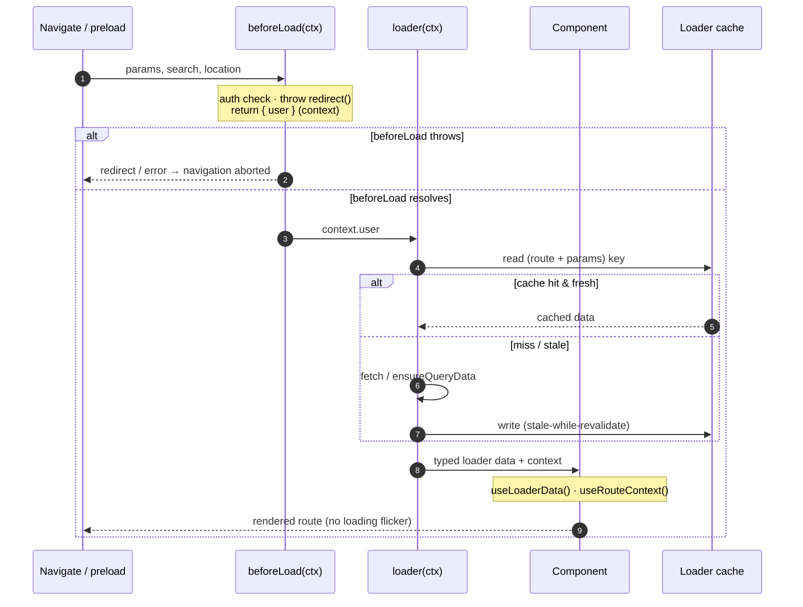
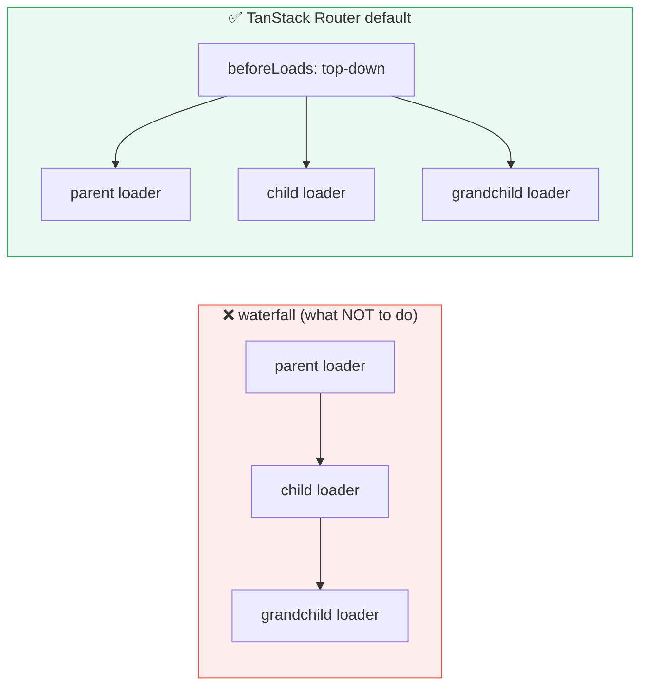

# Router Loader Lifecycle

> **Companion demo:** [`router_loader_lifecycle.html`](./router_loader_lifecycle.html) — open in a browser.
> A live React simulation of the `beforeLoad → loader → component` pipeline with a
> timeline that tracks each step's status (`pending → running → done`) and a
> gold-check that asserts the component only shows data **after** the loader resolves.

---

## 0. TL;DR — the one idea

> **The analogy:** TanStack Router is a **staged gate**, not a render-then-fetch
> pipeline. Three stages run in a strict order before the route component mounts —
> `beforeLoad` (the bouncer: auth, redirects, context), `loader` (the fetcher: gets
> the data), and the `component` (the reader: consumes data already in hand). The
> component never renders with empty hands, and a thrown `redirect()` in
> `beforeLoad` aborts the whole navigation.



The router is the **only** thing that knows where the user is headed *before*
content renders — so it's the right place to start the fetch. `useEffect`-in-the-
component is too late: it renders empty, then fetches, then re-renders. The loader
pipeline collapses that to one render with data already present.

---

## 1. How it works — the three stages

```ts
// file: src/routes/users.$id.tsx
import { createFileRoute, redirect } from '@tanstack/react-router'

export const Route = createFileRoute('/users/$id')({
  // 1️⃣ beforeLoad — the gatekeeper. Runs FIRST. Can abort via throw.
  beforeLoad: async ({ params, location }) => {
    const user = await getCurrentUser()
    if (!user) {
      throw redirect({ to: '/login', search: { redirect: location.pathname } })
    }
    return { user } // ← becomes `context` for loader + component
  },

  // 2️⃣ loader — the fetcher. Runs AFTER beforeLoad. Reads context.user.
  loader: async ({ params, context }) => {
    const res = await fetch(`/api/users/${params.id}`)
    if (!res.ok) throw new Error('not found')
    return res.json() as Promise<User> // ← typed; cached per route+params
  },

  // 3️⃣ component — the reader. Data is already in hand.
  component: UserDetailsPage,
})

function UserDetailsPage() {
  const user = Route.useLoaderData()      // typed loader result
  const { user: session } = Route.useRouteContext() // { user } from beforeLoad
  return <h1>{user.name} · viewed by {session.name}</h1>
}
```

### The order is non-negotiable

```
beforeLoad(ctx)  ──resolves──▶  loader(ctx)  ──resolves──▶  Component renders
     │                              │
     │  can throw redirect()        │  reads ctx.context
     │  can throw error             │  can throw to error boundary
     ▼                              ▼
   aborts nav                   data cached
```

| stage | input (`ctx`) | output | failure mode |
|------|---------------|--------|--------------|
| `beforeLoad` | `params, search, location, ...` | any value → `context` | `throw redirect()` → abort; `throw error` → boundary |
| `loader` | `params, search, context, deps, ...` | data → `useLoaderData()` | `throw` → error boundary |
| `component` | `Route.useLoaderData()`, `Route.useRouteContext()` | JSX | standard React errors |

### Why `beforeLoad` is separate from `loader`

You **could** do auth in the loader. But splitting them gives you:

1. **Context that flows down the tree.** A parent's `beforeLoad` return value is
   merged into `context` and visible to every child route's `beforeLoad` and
   `loader` — so you check auth *once* at the layout, not in every leaf loader.
2. **Parallel loaders, sequential beforeLoad.** `beforeLoad` runs top-down (parent
   → child) so children see parent context. `loader`s then run in **parallel**
   across the matched route tree. Mixing auth into loaders would serialize them.
3. **Redirects before any fetch.** Auth fails → `throw redirect()` → no wasted
   network call, no flash of loading UI for data you'll never render.

---

## 2. Parallel vs waterfall (and how not to waterfall)

By default, **parent and child loaders run in parallel** once all `beforeLoad`s
have resolved. This is the opposite of a naive nested-fetch waterfall.



You accidentally create a waterfall when a **child loader depends on parent loader
data** and you wait for it. The fix is usually: move the shared dependency into
`beforeLoad` (which is inherently top-down) and keep the loaders independent, or
express the dependency explicitly so the router can still schedule sensibly.

The one exception is `loaderDeps` — it makes a loader depend on **parent search
params**, which is a controlled, declared dependency, not an accidental one.

---

## 3. Caching & stale-while-revalidate

Loader results are cached per **route + params + deps**. The cache honors
`staleTime` (how long data is considered fresh) and revalidates in the background
when stale — the classic **stale-while-revalidate** pattern.

```ts
const router = createRouter({
  routeTree,
  defaultPreload: 'intent',           // preload on hover/focus
  defaultPreloadStaleTime: 0,         // a preload always primes the cache
  defaultStaleTime: 30_000,           // data fresh for 30s
  // per-route: beforeLoad/loader can override
})

createFileRoute('/users/$id')({
  loader: async ({ params }) => fetchUser(params.id),
  staleTime: 60_000, // override: this route's data is fresh for 60s
})
```

- **fresh** (`age < staleTime`) → cache hit, no fetch, instant render.
- **stale** (`age >= staleTime`) → return cached data immediately, refetch in
  background, swap when the new data resolves.
- **expired / gcTime passed** → cache entry is garbage-collected; next visit
  refetches with a loading state.

Preloading (on hover/focus) exploits this: the loader runs *before* the click, so
the click navigates into a **warm cache** and feels instant. Set
`defaultPreloadStaleTime: 0` so a preload always triggers a real fetch that primes
the cache (otherwise a recent preload could be served stale and never prime).

---

## 4. `loaderDeps` — the controlled re-run gate

A loader re-runs when its **deps** change (deep equality). Without `loaderDeps`,
the router is conservative: it re-runs only when params change. With it, you
declare which **search params** the loader cares about.

```ts
createFileRoute('/users')({
  // the search schema defines ?q= and ?page=
  validateSearch: z.object({ q: z.string().default(''), page: z.number().default(0) }),
  loaderDeps: ({ search }) => ({ q: search.q, page: search.page }),
  loader: async ({ deps }) => {
    // re-runs ONLY when `q` or `page` changes — not on every unrelated search key
    return fetchUsers(deps.q, deps.page)
  },
})
```

| change | loader re-runs? |
|--------|-----------------|
| `params.id` changes | **yes** (always) |
| `search.q` / `search.page` change (declared in `loaderDeps`) | **yes** |
| `search.tab` changes (NOT in `loaderDeps`) | **no** — component re-renders with same data |
| cache fresh | **no** — served from cache regardless |

`loaderDeps` is the difference between "fetch on every keystroke" and "fetch only
when the filter actually changed."

---

## 5. TanStack Query integration (the recommended pattern)

The loader is an **event handler**, not a data store. Point it at TanStack Query
so you get fine-grained caching, background refetch, and mutations — then read
from the Query cache in the component.

```ts
createFileRoute('/users/$id')({
  // loader primes the Query cache BEFORE render
  loader: async ({ params, context }) =>
    context.queryClient.ensureQueryData({
      queryKey: ['users', params.id],
      queryFn: () => fetchUser(params.id),
    }),
  component: UserDetails,
})

function UserDetails() {
  const { id } = Route.useParams()
  // component reads from the SAME cache the loader primed → synchronous, cached
  const { data: user } = useSuspenseQuery({
    queryKey: ['users', id],
    queryFn: () => fetchUser(id),
  })
  return <h1>{user.name}</h1>
}
```

**Why split it this way?**
- The **loader** starts the fetch as early as possible (on navigation, or on
  hover via preload) and blocks render until data exists → no loading flicker.
- The **component** reads via `useSuspenseQuery` → inherits the Query cache's
  background refetch, invalidation on mutation, and optimistic updates.

Set `defaultPreloadStaleTime: 0` so preloads always prime the cache instead of
serving a recent-but-stale entry. See the deep dive in
[`../frontend/tanstack-start/loaders_data.html`](../frontend/tanstack-start/loaders_data.html).

---

## 6. Redirect from `beforeLoad`

`beforeLoad` is the canonical place for auth guards. Throw a `redirect()` to abort
the navigation and send the user elsewhere — the route component **never mounts**.

```ts
beforeLoad: async ({ location }) => {
  const session = await getSession()
  if (!session) {
    throw redirect({
      to: '/login',
      search: { redirect: location.pathname }, // bounce back after login
      // headers: { 'Cache-Control': 'no-store' } // SSR flavor
    })
  }
  return { session }
}
```

- **Throw, don't return.** A returned redirect is ignored; a *thrown* one is
  caught by the router and turns into a real navigation.
- **BeforeLoad, not loader.** Auth in `loader` means you've already committed to
  the route's data fetch; auth in `beforeLoad` short-circuits before any fetch.
- **Works during preload.** A `redirect()` thrown during an intent-based preload
  cancels the preload cleanly — the user never sees a flash of the guarded route.

---

## 3. Killer Gotchas

| trap | symptom | fix |
|------|---------|-----|
| **Returning instead of throwing a redirect** | redirect silently ignored, guarded route still renders | `throw redirect({...})` — must be a throw, not a return |
| **Auth in `loader`, not `beforeLoad`** | wasted fetch on guarded routes; no shared context for children | move auth to `beforeLoad`, return `{ session }` as context |
| **Expecting child loaders to see parent *loader* data** | `context` is missing the parent's fetched data | `context` only carries `beforeLoad` returns, not loader data — restructure or refetch |
| **Forgetting `loaderDeps`** | loader doesn't re-run when a search filter changes | declare the search keys in `loaderDeps: ({ search }) => ({...})` |
| **`defaultPreloadStaleTime` left default with Query** | preload serves stale entry, cache never primed → first real nav still fetches | set `defaultPreloadStaleTime: 0` so preloads always prime the Query cache |
| **Throwing a plain Error in `loader`** | blank route, no UI | wire an `errorComponent` on the route (or a parent) to render the catch |
| **Heavy sync work in `beforeLoad`** | blocks the whole pipeline | `beforeLoad` is awaited end-to-end — keep it async and cheap |
| **Mutating the cached loader return** | stale UI, hard-to-trace bugs | treat loader results as immutable; refetch to update |

### Cheat sheet

```ts
createFileRoute('/users/$id')({
  // 1 · gatekeeper: auth, redirect, context (top-down, sequential)
  beforeLoad: async ({ params, location }) => {
    const session = await getSession()
    if (!session) throw redirect({ to: '/login', search: { redirect: location.href } })
    return { session }               // → context.session everywhere below
  },

  // declare which search params re-trigger the loader
  loaderDeps: ({ search }) => ({ tab: search.tab }),
  staleTime: 60_000,                 // route-level cache freshness

  // 2 · fetcher: runs after beforeLoad, reads context, primes Query cache
  loader: async ({ params, context, deps }) =>
    context.queryClient.ensureQueryData({
      queryKey: ['users', params.id, deps.tab],
      queryFn: () => fetchUser(params.id, deps.tab),
    }),

  // 3 · reader: data already in hand — no useEffect, no loading flicker
  component: () => {
    const user = Route.useLoaderData()
    const { session } = Route.useRouteContext()
    return <UserView user={user} viewer={session} />
  },

  errorComponent: ({ error }) => <RouteError error={error} />, // loader throws land here
})

// router-level: preload on hover + always prime the cache
createRouter({
  routeTree,
  defaultPreload: 'intent',
  defaultPreloadStaleTime: 0,
  defaultStaleTime: 30_000,
  context: { queryClient }, // provide QueryClient to all loaders
})
```

---

## 🔗 Cross-references

- [router_search_validation](./router_search_validation.html) — `validateSearch`
  turns `?q=` strings into typed, defaulted state; that's what `loaderDeps`
  reads to decide when to re-fetch.
- [router_navigation_preload](./router_navigation_preload.html) — intent-based
  preloading fires the loader *before* the click; the warm cache is why preloaded
  nav feels instant.
- [router_nested_context](./router_nested_context.html) — how `beforeLoad`
  return values merge down the route tree into the `context` every child reads.
- [router_fundamentals](./router_fundamentals.html) — the router core this
  pipeline plugs into (matching, the route tree, history).
- [../frontend/tanstack-start/loaders_data](../frontend/tanstack-start/loaders_data.html) —
  the basics of loaders and the cold-vs-preloaded latency race; this bundle is the
  full lifecycle view (`beforeLoad → loader → component`).

---

## Sources

- TanStack Router — Data Loading guide (loaders, `beforeLoad`, `loaderDeps`, caching, preloading):
  https://tanstack.com/router/latest/docs/framework/react/guide/data-loading
- TanStack Router — `beforeLoad` API reference (context, redirects, `throw redirect()`):
  https://tanstack.com/router/latest/docs/framework/react/api/router/RouteOptionType#beforeload
- TanStack Router — Redirecting guide (`throw redirect()` from `beforeLoad`):
  https://tanstack.com/router/latest/docs/framework/react/guide/redirecting
- TanStack Router + TanStack Query integration (loader primes cache via `ensureQueryData`):
  https://tanstack.com/router/latest/docs/framework/react/guide/external-data-loading
- Dominik Dorfmeister (TkDodo) — TanStack Router and React Query (the event-handler
  mental model, `defaultPreloadStaleTime: 0`):
  https://tkdodo.eu/blog/tanstack-router-and-query
