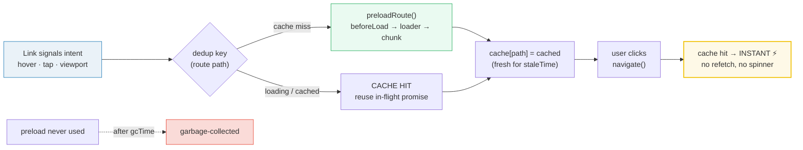
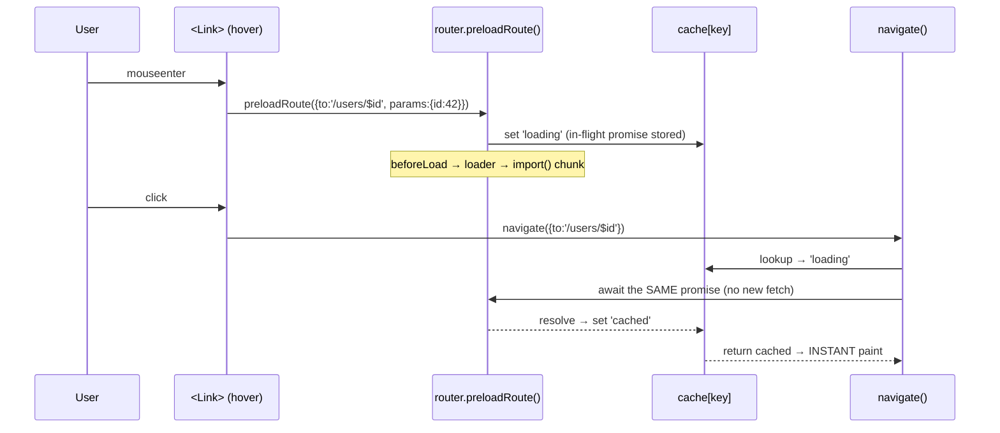
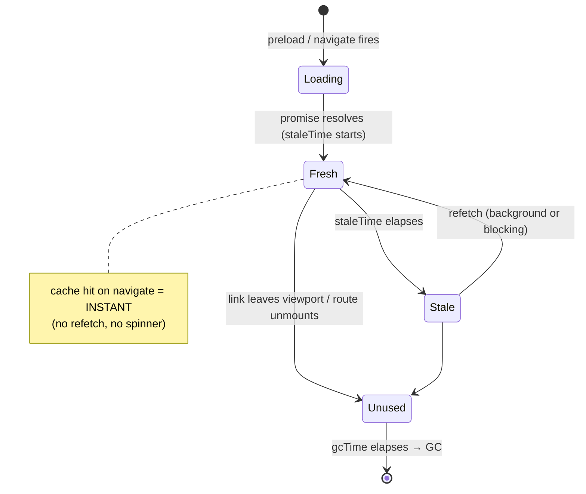

# Router Navigation & Preloading

> **Companion demo:** [`router_navigation_preload.html`](./router_navigation_preload.html) — open in a browser.
> A live React 19 playground that simulates the full preloading pipeline (trigger → dedup → cache → instant navigation) and proves it with a gold-check.

---

## 0. TL;DR — the one idea

A normal `<Link>` is **click-then-fetch**: the user clicks, the router runs the
route's `beforeLoad → loader`, downloads the lazy JS chunk, and *then* paints.
**Preloading** inverts the timeline: the router starts that exact same work the
moment a link signals **intent** (hover / tap / scrolls into view). By the time
the click lands, the result is already in the cache and the navigation is
**INSTANT** — same loaders, same data, just moved earlier in time.



The whole feature is one sentence: **move the fetch earlier, dedup by route, cache
the result, reuse it on click.** Everything else (`staleTime`, `gcTime`,
`preloadDelay`) is cache policy on top of that core.

---

## 1. Preload triggers — when does the fetch start?

TanStack Router's `<Link>` takes a single `preload` prop. It is a **string union**,
not a boolean:

```tsx
<Link to="/users/$id" params={{ id: 42 }} preload="intent">
  View User
</Link>
```

| value        | trigger                                                                                          | event source                                          |
|--------------|--------------------------------------------------------------------------------------------------|-------------------------------------------------------|
| `false`      | never preload (default)                                                                          | —                                                     |
| `'intent'`   | preload on **hover** (desktop) AND **tap** (mobile)                                              | `mouseenter` + `pointerdown`/`touchstart`             |
| `'viewport'` | preload when the link **scrolls into view**                                                      | `IntersectionObserver`                                |
| `true`       | legacy alias for `'viewport'` (kept for back-compat — prefer the string form)                    | —                                                     |

> **`'intent'` is one strategy, not two.** Hover (desktop) and tap (mobile) share
> the *same* code path — TanStack attaches listeners for both `mouseenter` and
> `pointerdown`/`touchstart` and routes them through one `preloadRoute()` call.
> There is no separate `preloadIntent: 'hover'` vs `'tap'` knob; the device's
> available events decide which fires. (The companion demo splits them into two
> strategies purely for teaching — in real TanStack they are unified.)

### `preloadDelay` — the debounce

`'intent'` waits `preloadDelay` ms (default **0**) before firing. This prevents
a "swipe across the nav" from firing N preloads. Bump it to ~80–150ms if your
nav has many links or your loaders are expensive.

```tsx
<Link preload="intent" preloadDelay={100}>Users</Link>
```

### `'viewport'` — eager by design

`'viewport'` uses an `IntersectionObserver` and preloads **every link that is
visible**. Great for a short landing nav; costly on a long link farm (every
scroll position preloads whatever's on screen). Use it when the set of visible
links is small and high-probability.

### App-wide default

Don't repeat `preload="intent"` on every link — set it once:

```tsx
const router = createRouter({
  routeTree,
  defaultPreload: 'intent',
  defaultPreloadDelay: 50,
});
```

---

## 2. The deduplication mechanism

This is the part that makes preloading *safe* rather than wasteful. The dedup key
is the **resolved route path** (route id + serialized params/search).

```
cache key  =  to + JSON.stringify(params) + JSON.stringify(search)
```

Three cases, all handled by one lookup:

1. **Two links, same route** → only the first triggers a fetch; the second sees
   `cache[key]` truthy and logs a CACHE HIT. One network request, two UI sources.
2. **Preload in-flight when click lands** → the click's `navigate()` does NOT
   start a parallel fetch. It awaits the existing in-flight promise and reuses
   the result. No double fetch, no race.
3. **Click while cached + fresh** → instant. `navigate()` reads the cached entry,
   skips the loader entirely, and commits the new route in the same tick.



The in-flight promise is **stored against the cache key**, so any later caller
(click, a second link, a manual `router.preloadRoute()`) joins the same promise.
This is structurally identical to TanStack Query's dedup — same idea, applied to
route dependencies instead of query functions.

---

## 3. Cache policy — `staleTime` vs `gcTime`

Preloads write into the same loader cache as normal navigations. Two timers govern
its lifecycle:

| option        | meaning                                                                     | default                       |
|---------------|-----------------------------------------------------------------------------|-------------------------------|
| `staleTime`   | how long an entry is considered **fresh** (a fresh hit skips the refetch)   | **navigations: `0`**; **preloads: `30_000`** |
| `gcTime`      | how long an **unused** entry survives in memory before garbage collection   | `300_000` (5 min)             |



### Why navigations and preloads have *different* `staleTime` defaults

- **Navigations default to `0`** — when you click, you want the freshest data, so
  the loader always re-runs (the cached entry just avoids a re-render flash via
  `staleReloadMode`).
- **Preloads default to `30_000`** — a preload is *speculative* (the user might
  never click), so we cache its result optimistically for 30s. If the click lands
  within that window, it's instant AND we skip a redundant refetch.

Override per-link:

```tsx
<Link preload="intent" staleTime={5000} gcTime={60000}>
  View User
</Link>
```

### `staleReloadMode: 'background' | 'blocking'`

When a stale entry is hit on navigate, what happens?

- `'background'` (default) — paint the stale data immediately, refetch in the
  background, then re-render when it resolves. Feels instant; data may be briefly
  outdated.
- `'blocking'` — show a spinner, wait for the refetch, then paint. Always fresh;
  slower perceived navigation.

---

## 4. Prefetch vs preload — the vocabulary trap

These two words are used interchangeably in the wild, but in TanStack's docs they
mean different things:

| term        | what it loads                                              | API                                  |
|-------------|------------------------------------------------------------|--------------------------------------|
| **preload** | route **data** (loader/beforeLoad results) + dependencies  | `<Link preload="intent">`            |
| **prefetch**| traditionally the **JS chunk** / asset (link rel=preload)  | handled implicitly by the dep graph  |

In TanStack Router, `preload` covers **both** — it loads the lazy route module
(via `import()` for `createLazy`-split routes) AND runs the loader, because both
are needed to paint. The docs call the whole thing "preloading"; older React
ecosystem articles may say "prefetching" for the chunk-only case. Don't get
tripped up: in TanStack, `preload` = "everything needed to render that route."

### Manual preload

You don't need a `<Link>` to preload — the router exposes an imperative API:

```tsx
// preload on your own trigger (e.g. a custom menu open)
router.preloadRoute({ to: '/users/$id', params: { id: 42 } });

// or inside a loader, to preload a likely-next route
loader: async ({ params }) => {
  const user = await fetchUser(params.id);
  // speculatively preload the detail route the user will probably click next
  router.preloadRoute({ to: '/users/$id/posts', params: { id: params.id } });
  return { user };
}
```

---

## 5. Performance impact — when is it worth it?

Preloading trades **bandwidth/CPU for perceived latency**. The math:

```
perceived_navigation_time = click → paint
without preload  =  T(loader) + T(chunk) + T(render)
with preload hit =  T(render)        // loader + chunk already done during hover
```

For a route with a 200ms loader + 300ms chunk download, a hover ~500ms before the
click makes navigation feel **zero-latency**. The costs:

- **Bandwidth**: every preloaded route that is *never clicked* is wasted bytes.
  Mitigate with `'intent'` (hover is a strong signal) + reasonable `preloadDelay`.
- **Server load**: loaders run on the server (SSR) or hit your API. A bot
  crawling links or a user tabbing through the nav can spike load. Mitigate with
  `staleTime` (dedup across hovers) and rate-limiting at the loader level.
- **Client CPU**: `beforeLoad` can do auth checks, schema validation, etc.
  Expensive `beforeLoad` on every hover is a footgun — keep it cheap.

**Rule of thumb:**
- High-probability next routes (nav items, the obvious next step in a flow) →
  `preload="intent"`.
- Above-the-fold nav on a landing page → `preload="viewport"` (small set).
- Deep, rarely-visited routes → don't preload (let `createLazy` code-split
  them; the chunk download on click is acceptable).

---

## 6. Killer Gotchas

| trap | symptom | fix |
|------|---------|-----|
| **`staleTime: 0` on preloads** | every hover refetches; no benefit from the cache | set `staleTime` ≥ a few seconds on preloaded links (default `30_000` exists for a reason) |
| **Expensive `beforeLoad` on hover** | UI jank when swiping across nav; server load spike | keep `beforeLoad` cheap; bump `preloadDelay` to ~100ms; cache auth result |
| **`preload="viewport"` on a link farm** | dozens of preloads fire on scroll; bandwidth blowup | reserve `'viewport'` for small, high-probability nav sets |
| **Side effects in the loader** | preloads trigger them *before* the user actually navigates (analytics, mutations) | loaders must be pure reads; move side effects to `onEnter`/component mount |
| **`useSearch` updates on hover** | search-param state "changes" before the click (the preload runs the route's search validation) | expected — preloading runs `beforeLoad` + search parsing; don't put UI-affecting side effects there |
| **`gcTime` too long** | memory bloat from many speculatively preloaded routes | lower `gcTime` for routes with large payloads; default 5min is usually fine |
| **Expecting `preload=true`** | modern TanStack wants the string union (`'intent'`/`'viewport'`); `true` is a legacy alias | use the explicit string form for clarity and forward-compat |
| **Two preloads, different `search`** | they DON'T dedup — the cache key includes serialized search params | intentional; if you want them to share, normalize the search shape first |
| **Preload cancelled on unmount** | link leaves the DOM mid-hover and the preload is aborted (if configured) | usually desired; if you need it to complete, use manual `router.preloadRoute()` |

---

### Cheat sheet

```tsx
// per-link — the 90% case
<Link to="/users/$id" params={{ id: 42 }} preload="intent" preloadDelay={50}>
  View User
</Link>

// app-wide default — set once on the router
createRouter({
  routeTree,
  defaultPreload: 'intent',
  defaultPreloadDelay: 50,
  // defaultStaleTime: 0,        // navigations always refetch
  // defaultPreloadStaleTime: 30_000,  // preloads cached 30s
  // defaultGcTime: 300_000,     // unused entries GC'd after 5min
});

// manual / imperative
await router.preloadRoute({ to: '/users/$id', params: { id: 42 } });

// the decision matrix
preload=false       // off — pay-per-click
preload='intent'    // hover/tap → preload     (best default for nav)
preload='viewport'  // visible → preload       (landing pages, small sets)
```

| prop             | type                                  | default | purpose                                  |
|------------------|---------------------------------------|---------|------------------------------------------|
| `preload`        | `false \| 'intent' \| 'viewport'`     | `false` | trigger policy                           |
| `preloadDelay`   | `number` (ms)                         | `0`     | debounce before `'intent'` fires         |
| `staleTime`      | `number` (ms)                         | nav `0` / preload `30_000` | freshness window           |
| `gcTime`         | `number` (ms)                         | `300_000` | unused-entry retention before GC       |
| `staleReloadMode`| `'background' \| 'blocking'`          | `'background'` | stale-hit paint behavior        |

---

## 🔗 Cross-references

- [`router_loader_lifecycle`](./router_loader_lifecycle.html) — what actually runs
  during a preload: the `beforeLoad → loader → component` pipeline and its cache.
  Preloading is just "run this lifecycle speculatively."
- [`router_search_validation`](./router_search_validation.html) — search params are
  part of the dedup key, and `beforeLoad`/search parsing run *during* preload (why
  `useSearch` "updates" on hover before the click).
- [`router_nested_context`](./router_nested_context.html) — preloading respects the
  full matched route chain: every parent `beforeLoad`/`loader` in the tree
  preloads, not just the leaf.
- [`router_fundamentals`](./router_fundamentals.html) — the matching + route-tree
  model that preloading sits on top of (you can't preload what you can't match).
- [`../frontend/tanstack-start/navigation_links`](../frontend/tanstack-start/navigation_links.html) —
  the basics of `<Link>` + active state; this bundle is the preloading engine on
  top of those fundamentals.

---

## Sources

- **TanStack Router — Preloading (official docs)**
  https://tanstack.com/router/v1/docs/guide/preloading
  *(the `preload`/`preloadIntent` model, `preloadDelay`, `preloadRoute()`, dedup)*
- **TanStack Router — Data Loading (official docs)**
  https://tanstack.com/router/latest/docs/guide/data-loading
  *(`staleTime` defaults: `0` for navigations, `30_000` for preloads; `gcTime`)*
- **TanStack Router — Navigation (official docs)**
  https://tanstack.com/router/v1/docs/guide/navigation
  *(hover-to-preload intent, default 50ms delay, Link navigation options)*
- **TanStack Router — RouterOptions API**
  https://tanstack.com/router/v1/docs/api/router/RouterOptionsType
  *(`defaultPreload`, `defaultPreloadDelay`, `defaultStaleTime`, `defaultGcTime`)*
- **TanStack Router — LinkOptions API**
  https://tanstack.com/router/v1/docs/api/router/LinkOptionsType
  *(the `preload`/`staleTime`/`gcTime` prop shapes on `<Link>`)*

*All URLs web-verified 2026-06 against tanstack.com (official docs, v1/latest).*
