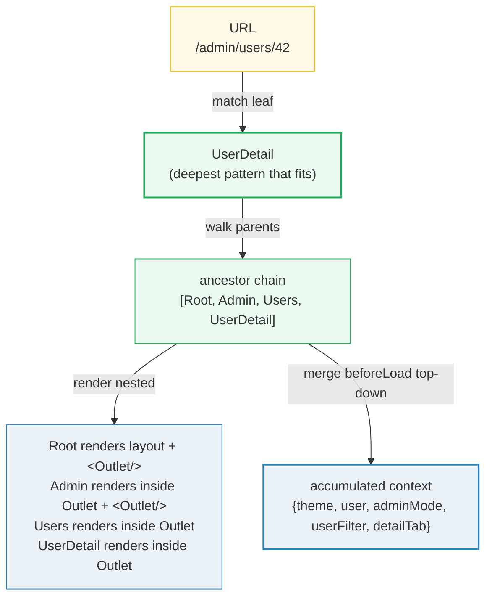
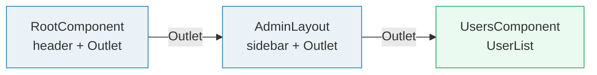

# Nested Routes, Outlet & Context Flow

> **Companion demo:** [`router_nested_context.html`](./router_nested_context.html) — open in a browser.
> **React version:** 19.2.7 via ESM CDN + Babel standalone.
> **Builds on:** [`../frontend/tanstack-start/nested_outlet_context.md`](../frontend/tanstack-start/NESTED_OUTLET_CONTEXT.md) — the basics of `<Outlet>` + context. This bundle goes to the full hierarchy and the context-accumulation mechanism.

---

## 0. TL;DR — the one idea

> **The analogy:** a matched URL is a set of **Russian nesting dolls**, not a single doll. The
> router matches the **leaf** route, but renders the leaf *inside* every one of its ancestors.
> Each ancestor is a **layout** with an `<Outlet/>` hole where the next doll sits. While it
> assembles the dolls, each route also pours its **context** (from `beforeLoad`) into the shared
> pool — so the leaf ends up swimming in the union of *every* ancestor's context.



A match produces **two parallel things**: a **render chain** (which components mount, nested via
`<Outlet/>`) and a **context object** (the top-down merge of every route's `beforeLoad` return).
Both derive from the same ancestor chain. Navigate to a shallower route and the chain shrinks —
the lost routes' components unmount **and** their context keys disappear.

---

## 1. How it works

### 1a. Layout routes — a parent that renders `<Outlet/>`

A route becomes a **layout** the moment its `component` renders an `<Outlet/>`. The Outlet is the
slot where the matched child renders. From the docs: *"Nested routing means that routes can be
nested within other routes, including the way they render. So how do we tell our routes where to
render this nested content? **Through the use of Outlets.**"*

```tsx
// __root.tsx — the outermost layout (always in the chain)
createFileRoute('/__root')({
  component: RootComponent,
});
function RootComponent() {
  return (
    <div className="app-shell">
      <Header />
      <Outlet />        {/* ← Admin (or any top route) renders here */}
    </div>
  );
}

// admin.tsx — a layout route: sidebar + Outlet
createFileRoute('/admin')({
  component: AdminLayout,
});
function AdminLayout() {
  return (
    <div className="admin">
      <Sidebar />
      <Outlet />        {/* ← /admin/users, /admin/settings render here */}
    </div>
  );
}
```

### 1b. `<Outlet/>` — the nesting mechanism

`<Outlet/>` is not a placeholder you fill manually. The router reads the matched chain
`[Root, Admin, Users, …]` and renders them **recursively**: `RootComponent` renders, and its
`<Outlet/>` is replaced by `AdminLayout`, whose `<Outlet/>` is replaced by the next route, and so
on until the leaf. If a parent forgets `<Outlet/>`, the child never appears (a classic bug — see
Gotchas).



### 1c. `beforeLoad` — provide context that flows down

`beforeLoad` runs before the route's `loader`, receives the **already-merged parent context**, and
returns an object that is merged into **this** route's context. From the docs: *"This happens by
passing a context to a route via the `beforeLoad` option. **This context will be available to all
the route's child routes.** The resulting context is then merged down the route match tree."*

```tsx
createFileRoute('/__root')({
  beforeLoad: () => ({ theme: 'dark', user: getCurrentUser() }),
});

createFileRoute('/admin')({
  beforeLoad: ({ context }) => ({ ...context, adminMode: true }),
  //                          ^ spread inherited, then add your keys
});

createFileRoute('/admin/users')({
  beforeLoad: ({ context }) => ({
    ...context,
    userFilter: 'active',          // context.adminMode came from /admin
  }),
  loader: ({ context }) => fetchUsers(context.adminMode, context.userFilter),
});
```

### 1d. Context merging — the accumulation rule

Context accumulates **top-down** as a plain object merge. Each level spreads the inherited context
and adds (or overrides) its own keys:

| level | inherited (input) | adds | merged context (output) |
|---|---|---|---|
| Root | `{}` | `theme, user` | `{ theme, user }` |
| Admin | `{ theme, user }` | `adminMode` | `{ theme, user, adminMode }` |
| Users | `{ theme, user, adminMode }` | `userFilter` | `{ theme, user, adminMode, userFilter }` |
| UserDetail | `{ theme, user, adminMode, userFilter }` | `detailTab` | `{ theme, user, adminMode, userFilter, detailTab }` |

> Later keys **win** on collision — a child's `beforeLoad` can override a parent's value by
> returning the same key. Use `...context` first, then your keys, to inherit-and-augment.

### 1e. Parent → child loader dependencies

Because context is fully merged by the time each `loader` runs, a child loader can depend on a
parent's resolved data with no prop drilling and no extra fetching:

```tsx
createFileRoute('/admin/users/$id')({
  beforeLoad: ({ context, params }) => ({
    ...context,
    // parent context.user + context.adminMode are already available
    detailTab: params.tab ?? 'overview',
  }),
  loader: ({ context, params }) =>
    // context.users may have been fetched by an ancestor's loader
    fetchUserDetail(params.id, context.detailTab),
  component: UserDetail,
});
```

This is the whole point of route context: **data resolved high in the tree is visible lower down**,
typed end-to-end.

---

## 2. Mechanism / internals

### Two outputs of one match

When the router matches a URL it produces a single `routeMatch` for the leaf, then reconstructs the
**full match array** by walking the leaf's ancestors. That array drives both outputs:

```
match = router.matchRoute('/admin/users/42')
// → [match(Root), match(Admin), match(Users), match(UserDetail)]

// Output A — RENDER: each match.component wraps the next via its <Outlet/>
<RootComponent>
  <AdminLayout>          // Root's <Outlet/> = AdminLayout
    <UsersComponent>     // Admin's <Outlet/> = UsersComponent
      <UserDetail/>      // Users' <Outlet/> = UserDetail (leaf)
    </UsersComponent>
  </AdminLayout>
</RootComponent>

// Output B — CONTEXT: beforeLoad ran top-down, each return merged into context
context = {}
  → Root.beforeLoad   → { theme, user }                       // merged in
  → Admin.beforeLoad  → { theme, user, adminMode }            // spread + add
  → Users.beforeLoad  → { theme, user, adminMode, userFilter }
  → UserDetail.beforeLoad → { ..., detailTab }                // leaf sees all
```

### When `beforeLoad` runs vs `loader`

`beforeLoad` runs **once per match, top-down, before any loader**, during route resolution. It is
the *only* function that can **augment the route context type** (see docs: *"right now, beforeLoad
is the only function that can augment the Route Context"*). It is the right place for:

- **auth gates** — `throw redirect({ to: '/login' })` or `throw new Error('forbidden')`
- **deriving context** for descendants (e.g. `{ adminMode: checkRole(user) }`)
- **cheap synchronous** or cached lookups that children depend on

`loader` runs after, per-match, and receives the fully-merged `context` but **cannot change it**.
Heavy/async fetching belongs in `loader`; cross-route sharing belongs in `beforeLoad`.

### Opting out of nesting (pathless / un-nested routes)

Not every route should inherit a parent's layout. TanStack offers two escape hatches:

- **Pathless layout route** (`_path` / `_layout`): participates in the path *and* context chain but
  renders `<Outlet/>`-style children without adding a URL segment.
- **Un-nested route** (`_` suffix on a segment, e.g. `posts_.$id.tsx` → `/posts/$id`): renders its
  **own** component instead of rendering inside the parent's Outlet. From the docs: *"Non-nested
  routes can be created by suffixing a parent file route segment with a `_` and are used to un-nest
  a route from its parents and render its own component."*

---

## 3. Killer Gotchas

| trap | symptom | fix |
|------|---------|-----|
| parent layout missing `<Outlet/>` | navigating to `/admin/users` only ever shows `/admin` (child never mounts) | add `<Outlet/>` in the parent's `component`; the child renders *inside* it |
| child `beforeLoad` doesn't `...context` | parent keys vanish at the leaf — `context.user` is `undefined` | always spread first: `({ context }) => ({ ...context, myKey })` |
| key collision silently overrides | parent's `theme:'dark'` is clobbered by child's `theme:'light'` with no error | merge order is child-wins on duplicate keys; namespace or rename |
| context empty in child | `context` is `{}` even though parent set keys — often after a `validateSearch` rewrite / redirect | re-run `beforeLoad` on the resolved match; avoid mutating context outside `beforeLoad`; see router issue #3578 |
| expecting `loader` to change context | child sets a key in `loader` but sibling can't see it | only `beforeLoad` augments context; `loader` data is per-match, accessed via `useLoaderData()` |
| deep `beforeLoad` re-fetching on every navigation | descendants re-run heavy work because a parent re-resolves | keep `beforeLoad` cheap (sync/cached); do fetching in `loader` with `staleTime`, or hoist to a parent |
| navigate to a shallower route, child data lingers | stale child component/context briefly visible | the router unmounts non-matched chain routes; ensure your effect cleanup runs (it does by default) |
| forgot `__root` is always in the chain | surprised that `Root`'s layout/context shows on *every* page | `__root` wraps everything — it's the global layout; that's the feature, not a bug |
| un-nesting intended but layout still wraps | `posts.$id.tsx` nests under `posts`'s layout | rename to `posts_.$id.tsx` (the `_` un-nests: renders its own component) |

---

### Cheat sheet

```tsx
// 1. LAYOUT ROUTE — component renders <Outlet/> where the child appears
createFileRoute('/admin')({
  component: AdminLayout,           // <div><Sidebar/><Outlet/></div>
});

// 2. beforeLoad — the ONLY place to augment context; runs top-down, pre-loader
createFileRoute('/admin')({
  beforeLoad: ({ context }) => ({ ...context, adminMode: true }),
  //                           ^ spread inherited, then add/override keys
});

// 3. CHILD LOADER — receives the FULLY merged context (no prop drilling)
createFileRoute('/admin/users')({
  beforeLoad: ({ context }) => ({ ...context, userFilter: 'active' }),
  loader: ({ context }) => fetchUsers(context.adminMode, context.userFilter),
});

// 4. AUTH GATE in beforeLoad — throw to redirect / block
createFileRoute('/admin')({
  beforeLoad: ({ context, location }) => {
    if (!context.user) throw redirect({ to: '/login', search: { redirect: location.href } });
    return {};
  },
});

// 5. OPT OUT of nesting — suffix a segment with _ to render your own component
//    posts_.$id.tsx  →  /posts/$id  (NOT rendered inside posts' <Outlet/>)

// rule: chain = matched leaf + all ancestors; context = ∪ beforeLoad returns, child wins on dup
```

---

## 🔗 Cross-references

- [`router_fundamentals.html`](./router_fundamentals.html) — the higher-level mental model: route tree + history + matching at 10,000ft (this bundle zooms into what the matched chain actually *does*).
- [`router_route_tree.html`](./router_route_tree.html) — stage 2–4 of the pipeline: how the leaf's ancestor chain is computed by the compiler/linearizer/matcher (the chain this bundle renders and merges context across).
- [`router_loader_lifecycle.html`](./router_loader_lifecycle.html) — the exact order `beforeLoad` → `loader` runs per match, parallelism, and how context reaches `loader` arguments (the lifecycle this bundle relies on).
- [`../frontend/tanstack-start/nested_outlet_context.html`](../frontend/tanstack-start/nested_outlet_context.html) — the application-level basics of `<Outlet/>` + context; start there before the internals here.

---

## Sources

- TanStack Router Docs — **Router Context**: *"This type can be augmented via any route's `beforeLoad` option as it is merged down the route match tree. To constrain the type of the root router context…"* https://tanstack.com/router/latest/docs/framework/react/guide/router-context
- TanStack Router Docs — **Data Loading**: *"This happens by passing a context to a route via the `beforeLoad` option. This context will be available to all the route's child routes. The resulting context is then merged down the route match tree."* https://tanstack.com/router/latest/docs/framework/react/guide/data-loading
- TanStack Router Docs — **Outlets**: *"Nested routing means that routes can be nested within other routes, including the way they render… how do we tell our routes where to render this nested content? Through the use of Outlets."* https://tanstack.com/router/latest/docs/framework/react/guide/outlets
- TanStack Router Docs — **Routing Concepts** (non-nested via `_` suffix; pathless layouts): *"Non-nested routes can be created by suffixing a parent file route segment with a `_` and are used to un-nest a route from its parents and render its own component."* https://tanstack.com/router/latest/docs/framework/react/routing/routing-concepts
- TkDodo — **Context Inheritance in TanStack Router**: *"right now, `beforeLoad` is the only function that can augment the Route Context."* https://tkdodo.eu/blog/context-inheritance-in-tan-stack-router
