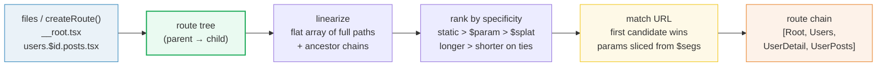
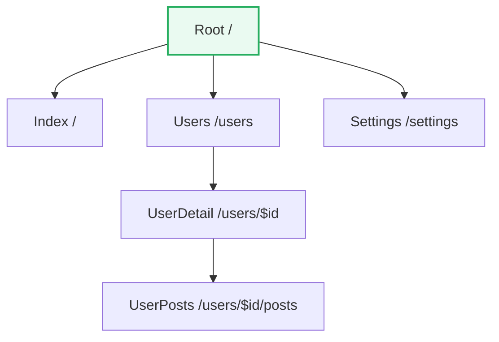
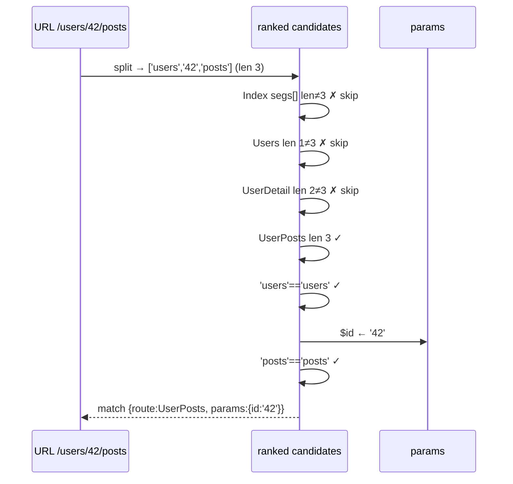

# Route Tree Internals — Compile · Linearize · Rank · Match

> **Companion demo:** [`router_route_tree.html`](./router_route_tree.html) — open in a browser.
> A live React 19 playground that builds a route tree from file conventions,
> linearizes + ranks it, and matches URLs in real time.

---

## 0. TL;DR — the one idea

A URL never reaches a component directly. TanStack Router turns your route
**definitions** (file conventions or `createRoute()` calls) into a parent-child
**route tree**, flattens that tree into a **ranked candidate list**, and matches
the incoming URL segment-by-segment. The matched node's **ancestor chain**
becomes the rendered route-context stack.



---

## 1. The pipeline, end to end

### Stage 1 — Compile: file convention → tree node

The TanStack bundler plugin (Vite/Webpack/Rollup) walks `src/routes/`, reads
filenames, and emits a generated `routeTree.gen.ts`. Each file becomes a tree
node with a full path and a parent pointer:

```
routes/
  __root.tsx            →  Route('/')                         (Root)
  index.tsx             →  Route('/')                         (Index, child of Root)
  users.tsx             →  Route('/users')                    (Users, child of Root)
  users.$id.tsx         →  Route('/users/$id')                (UserDetail, child of Users)
  users.$id.posts.tsx   →  Route('/users/$id/posts')          (UserPosts, child of UserDetail)
  settings.tsx          →  Route('/settings')                 (Settings, child of Root)
```

The `.` in `users.$id.posts.tsx` is the **nesting operator** — it says "this is
a child of `users.$id`". Dotted-flat and directory forms (`users/$id/posts.tsx`)
are equivalent; the plugin normalizes both into the same tree.

### Stage 2 — Tree construction (parent → child)



`Root` (`__root`) is special: it is the implicit wrapper present in **every**
match chain, but it is never the terminal leaf. Code-based routing builds the
identical tree by hand with `rootRoute.addChildren([...])`.

### Stage 3 — Linearize (tree → flat array)

The tree is walked depth-first into a flat list. Each entry carries its **full
path**, its **segments**, and its **ancestor chain** — because matching needs to
return not just "which leaf" but "which stack of layouts wraps it":

```
[ {name:'Root',       segments:[],            chain:[Root]},
  {name:'Index',      segments:[],            chain:[Root, Index]},
  {name:'Users',      segments:['users'],     chain:[Root, Users]},
  {name:'UserDetail', segments:['users',$id], chain:[Root, Users, UserDetail]},
  {name:'UserPosts',  segments:['users',$id,'posts'], chain:[Root,…,UserPosts]},
  {name:'Settings',   segments:['settings'],  chain:[Root, Settings]} ]
```

This is the array the matcher actually scans. Linearization happens once (build
time / router creation); matching happens on every navigation.

### Stage 4 — Rank by specificity

Before matching, candidates are sorted so the **most specific** pattern is tried
first. Each segment gets a rank — `static=0`, `$param=1`, `$splat=2` — and
routes compare their rank arrays position-by-position. When a prefix ties, a
**longer** path beats a shorter one (a sentinel pads the missing positions):

```mermaid
graph LR
  subgraph same length — static wins
    A1["/users/new<br/>rank [0,0]"] -->|tried first| M1{{"/users/new"}}
    A2["/users/$id<br/>rank [0,1]"] -->|fallback| M1
  end
```

This is what lets `/users/new` (a real static route) win over `/users/$id` for
the URL `/users/new`, even though both have two segments. The companion demo's
`rankRoutes()` is a faithful, readable version of this rule.

### Stage 5 — Match (URL → leaf + params)

Given `/users/42/posts`, the matcher splits into segments `['users','42','posts']`
and walks the ranked list:



The returned node's `chain` — `[Root, Users, UserDetail, UserPosts]` — is the
route-context stack React renders as nested outlets.

---

## 2. Mechanism / internals

### Param extraction

A `$param` segment matches exactly **one** URL segment (the text until the next
`/`) and is stored under its name in `params`. Once parsed, a param is visible
to **every child route** in the chain — that's why `UserPosts` can read `id`
without redeclaring it. A trailing bare `$` is a **splat**: it consumes
everything remaining into `params._splat`.

| segment kind | example file | matches | captures |
|---|---|---|---|
| static | `users.tsx` | `users` exactly | — |
| `$param` | `users.$id.tsx` | one segment | `params.id` |
| `$` (splat) | `files.$.tsx` | one **or more** trailing segments | `params._splat` |
| `{-$opt}` | `{-$locale}.tsx` | zero or one segment | `params.locale` (may be `undefined`) |

### Resolving candidate ambiguity: `params.parse` + `params.priority`

When several dynamic routes could match the same URL, TanStack tries routes that
define `params.parse` **before** equivalent routes without it, and `params.priority`
(higher first) orders competing parsed candidates. A `parse` returning `false`
falls through to the next candidate:

```tsx
// /posts/123  → numeric route wins (parse succeeds)
// /posts/hello → parse returns false → falls through to /posts/$slug
export const Route = createFileRoute('/posts/$postId')({
  params: {
    priority: 10,
    parse: ({ postId }) => /^\d+$/.test(postId) ? { postId: Number(postId) } : false,
  },
})
```

Priority only reorders **competing parsed** candidates — it never overrides
normal specificity, so a static route still beats a dynamic one regardless.

### The route-context chain

Matching returns a node; the node's ancestor chain is what gets rendered. Each
ancestor contributes its `component` as a wrapping layout (with an `<Outlet/>`
for the child), and its `beforeLoad`/`loader` context merges downward. This is
why `Root` is always present (global layout, e.g. a nav bar) even though it is
never the leaf match.

---

## 3. Killer Gotchas

| trap | symptom | fix |
|------|---------|-----|
| `__root` is in every chain but never the leaf | matching `/` returns `Index`, not `Root` | exclude `Root` from candidate set; it wraps, it doesn't resolve |
| static route shadowed by a param | `/users/new` hits `/users/$id` with `id='new'` | the plugin **auto-ranks** static first; if it doesn't, check for a typo'd filename or a stale `routeTree.gen.ts` |
| forgot to regenerate the route tree | new route file not matching | rerun dev server / the generator plugin; `routeTree.gen.ts` is build output, never hand-edit |
| `.` vs `/` confusion | `users.posts.tsx` nests under `users`, not `users/$id` | `.` nests by **path concatenation**; use `users.$id.posts.tsx` (or `users/$id/posts.tsx`) for the param parent |
| splat vs param | `files.$.tsx` captures `/files/a/b/c` as `_splat='a/b/c'`; `files.$name.tsx` would **not** match (wrong segment count) | `$` = many segments, `$name` = exactly one |
| two dynamic routes, same shape | `/posts/$id` and `/posts/$slug` both match `/posts/123` — ambiguous | give one a `params.parse` + `params.priority`, or rename; the router needs a deterministic order |
| params are strings by default | `params.id` is `"42"`, not `42` | coerce in `params.parse`, or in the loader; TypeScript will reflect the parsed type |
| optional param unexpectedly `undefined` | `{-$tab}` route renders with `tab === undefined` on the short URL | guard with `params.tab ? … : …`; the type is `string \| undefined` |

---

### Cheat sheet

```ts
// 1. file convention → node (build-time, via plugin)
//    users.$id.posts.tsx  ⇒  Route('/users/$id/posts', parent: '/users/$id')

// 2. linearize once → ranked candidate list (router creation)
//    rank per segment: static=0, $param=1, $splat=2; longer wins ties

// 3. match every navigation → first candidate whose segments all fit
//    $param  → params[name] = segment       (one segment)
//    $       → params._splat = rest joined   (one or more)
//    static  → must equal segment literally

// 4. result = { route, params } ; route.chain = [Root, …, leaf]
//    that chain is the rendered outlet/context stack

// disambiguate same-shape dynamic routes
createFileRoute('/posts/$postId')({
  params: {
    priority: 10,
    parse: ({ postId }) => /^\d+$/.test(postId) ? { postId: Number(postId) } : false,
  },
})
```

---

## 🔗 Cross-references

- [`router_fundamentals.html`](./router_fundamentals.html) — the higher-level mental model: route tree + history + matching at 10,000ft (this bundle is the deep dive into stage 2–4).
- [`router_type_inference.html`](./router_type_inference.html) — how the compiled tree propagates `params`/`search`/`loader` types from definition to `useParams()`.
- [`router_nested_context.html`](./router_nested_context.html) — what the matched `chain` actually does: `<Outlet/>`, parent→child context flow, layout composition.
- [`../frontend/tanstack-start/file_based_routing.html`](../frontend/tanstack-start/file_based_routing.html) — the file-convention basics (`.` nesting, `$` params, `__root`); start here before the tree internals.
- [`../frontend/tanstack-start/router_type_safety.html`](../frontend/tanstack-start/router_type_safety.html) — application-level type safety that rests on this compiled tree.

---

## Sources

- TanStack Router Docs — **Route Trees**: "TanStack Router uses a nested route tree to match up the URL with the correct component tree to render." https://tanstack.com/router/latest/docs/routing/route-trees
- TanStack Router Docs — **Path Params**: "Path params are used to match a single segment… defined by using the `$` character prefix… static routes still match before dynamic, optional, or wildcard routes." https://tanstack.com/router/latest/docs/guide/path-params
- TanStack Router Docs — **File-Based Routing** (plugin generates `routeTree.gen.ts` from `src/routes/`): https://tanstack.com/router/latest/docs/routing/file-based-routing
- TanStack Router Docs — **Code-Based Routing** (same tree concept, manual `createRoute` + `addChildren`): https://tanstack.com/router/latest/docs/routing/code-based-routing
