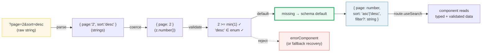
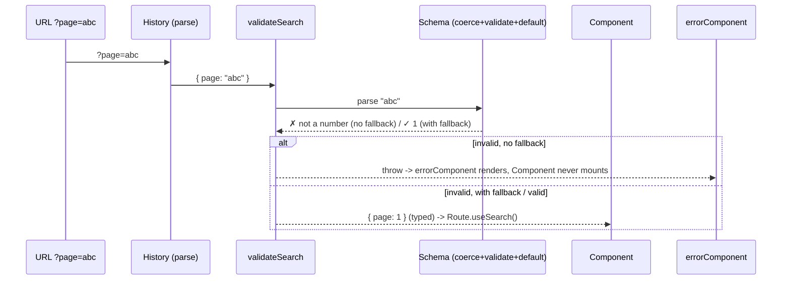

# Router Search Validation

> **Companion demo:** [`router_search_validation.html`](./router_search_validation.html) — open in a browser.
> Edit `page` / `sort` / `filter` and watch a from-scratch schema validator run the full parse → coerce → validate → default pipeline, live.

---

## 0. TL;DR — the one idea

A URL search string (`?page=2&sort=desc`) is raw text. `URLSearchParams` hands you `{ page: "2", sort: "desc" }` — every value is a **string**, nothing is checked, nothing has a default. TanStack Router's `validateSearch` replaces that with a **schema** (Zod / Valibot / ArkType / a custom function). The router runs a pipeline — **parse → coerce → validate → default** — and the component reads `route.useSearch()` to get a real `{ page: number, sort: "asc"|"desc", filter?: string }`. You write *one* schema; the router guarantees a typed, validated, defaulted object on every navigation, and rejects (or recovers from) invalid URLs instead of silently passing `"2"` through.



The schema is the **single source of truth**: it defines the types, the constraints, the defaults, and — through TypeScript inference — the type every consumer sees.

---

## 1. How it works — the four-stage pipeline

`validateSearch` runs on **every match** of the route (initial load, navigation, and link preloads). The input is whatever the history layer parsed out of the URL; the output is the typed object the route exposes.

### Stage 1 — parse
The history layer turns the search string into a plain object of raw values. At this point everything is a string (or string array), exactly like `Object.fromEntries(new URLSearchParams(location.search))`.

### Stage 2 — coerce
The declared types convert the raw strings. `z.number()` parses `"2"` into `2`; `z.coerce.boolean()` turns `"true"`/`"false"` into a boolean. This is where the URL's string-only world becomes typed.

### Stage 3 — validate
Constraints are checked against the coerced value: `.min(1)`, `.int()`, `z.enum([...])`, `.regex(...)`, `.refine(...)`. A failure raises a validation error — the route either throws to `errorComponent`, or recovers via `fallback`/`.catch`.

### Stage 4 — default
Missing keys are filled from the schema. `.default(x)` applies when the key is *absent*; `fallback(schema, x)` / `.catch(x)` apply when the value is *invalid*. Defaults keep URLs shareable — `?sort=desc` works without spelling out every optional param.

```tsx
import { createFileRoute } from '@tanstack/react-router'
import { z } from 'zod'                         // Zod v4: pass the schema directly

const searchSchema = z.object({
  page:   z.number().int().min(1).default(1),   // coerce + validate + default
  sort:   z.enum(['asc', 'desc']).default('asc'),
  filter: z.string().optional(),                // optional → undefined when absent
})

export const Route = createFileRoute('/posts')({
  validateSearch: searchSchema,                 // (schema | adapter | custom fn)
  component: PostsPage,
})

function PostsPage() {
  const { page, sort, filter } = Route.useSearch()
  //    ^? { page: number, sort: 'asc'|'desc', filter: string | undefined }
}
```

---

## 2. Schema definition — the single source of truth

`validateSearch` accepts four shapes. Each is the contract the router enforces and the type it infers.

| shape | when | signature |
|---|---|---|
| **Zod v4 schema** | `import { z } from 'zod'` (v4) | `validateSearch: z.object({...})` — no adapter needed |
| **Zod v3 adapter** | `@tanstack/zod-adapter` | `validateSearch: zodValidator(schema)` |
| **Valibot adapter** | `@tanstack/valibot-adapter` | `validateSearch: valibotValidator(schema)` |
| **ArkType schema** | `arktype` (no adapter) | `validateSearch: type({...})` |
| **Custom function** | total control | `validateSearch: (raw) => typedResult` (throw on invalid) |

```tsx
// Zod v4 — recommended, the schema IS the validator
const zodSchema = z.object({
  page: z.number().int().positive().default(1),
  sort: z.enum(['asc', 'desc']).default('asc'),
})

// Valibot — modular, tree-shakeable
import { valibotValidator } from '@tanstack/valibot-adapter'
import * as v from 'valibot'
const valibotSchema = v.object({
  page: v.fallback(v.pipe(v.number(), v.integer(), v.minValue(1)), 1),
  sort: v.fallback(v.picklist(['asc', 'desc']), 'asc'),
})
createFileRoute('/posts')({ validateSearch: valibotValidator(valibotSchema) })

// ArkType — string-schema, TypeScript-first
import { type } from 'arktype'
const arkSchema = type({
  page: 'number.integer > 0 = 1',
  sort: "'asc' | 'desc' = 'asc'",
})
createFileRoute('/posts')({ validateSearch: arkSchema })

// Custom function — no library
createFileRoute('/posts')({
  validateSearch: (raw) => {
    const page = Number(raw.page)
    if (isNaN(page) || page < 1) throw new Error('page must be a positive integer')
    return { page, sort: raw.sort === 'desc' ? 'desc' : 'asc' }
  },
})
```

### Zod vs Valibot vs ArkType

| | Zod | Valibot | ArkType |
|---|---|---|---|
| **bundle** | larger, all-in-one | tiny, tree-shakeable (pipeable) | medium, TS-first |
| **syntax** | method chain (`z.number().min(1)`) | pipe (`v.pipe(v.number(), v.minValue(1))`) | string schema (`'number > 0'`) |
| **TanStack adapter** | v3: `zodValidator` · v4: none | `valibotValidator` (always) | none (schema directly) |
| **defaults on missing** | `.default(x)` | `v.fallback(schema, x)` | `= x` in the string |
| **recovery on invalid** | `.catch(x)` / `fallback(schema, x)` | `v.fallback(...)` | `@format`/`onUndeclaredKey` |
| **type inference** | excellent | excellent | excellent (parses the string literal) |

---

## 3. Coercion — turning URL strings into real types

The URL is a string-only medium. Without coercion, `?page=2` gives you `"2"` and `?inStock=true` gives you `"true"` — both strings. The schema's job is to cross that boundary.

```tsx
const schema = z.object({
  page:    z.number().int().min(1).default(1),      // "2"      -> 2
  inStock: z.coerce.boolean().default(true),         // "false"  -> false
  tags:    z.array(z.string()).optional(),           // ?tags=a&tags=b -> ['a','b']
  price:   z
    .string()
    .transform((v) => parseInt(v, 10))
    .pipe(z.number().min(0))
    .optional(),                                      // "9.99"   -> 9 (transform pipeline)
})
```

`z.number()` (Zod v4 in `validateSearch`) coerces strings automatically. For unions or messy input, use `.transform(...).pipe(...)` to sanitize before the final constraint check. TanStack Router invokes the validator *after* its own URL parse, so you always start from `{ [key: string]: unknown }`.

---

## 4. Defaults — missing vs invalid

Two distinct failure modes need two distinct helpers. Mixing them up is the #1 search-param bug.

| situation | key absent | key present but invalid |
|---|---|---|
| **Zod** | `.default(x)` | `.catch(x)` or `fallback(schema, x)` |
| **Valibot** | `v.optional(schema, x)` | `v.fallback(schema, x)` |
| **ArkType** | `= x` (in string) | `@format` / `.onUndeclaredKey` |

```tsx
import { fallback } from '@tanstack/zod-adapter'    // Zod v3 helper (still useful)

const schema = z.object({
  // .default: only fills when page is MISSING from the URL
  page: z.number().int().positive().default(1),

  // fallback: fills when page is missing OR invalid (resilient)
  page: fallback(z.number().int().positive(), 1),

  // .catch: only fills when validation THROWS (keeps the route alive)
  page: z.number().int().positive().catch(1),
})
```

**Rule of thumb:** public, user-shareable URLs → use `fallback`/`.catch` so a malformed link still renders. Internal admin routes → plain `.default()` + an `errorComponent` so bad input is loud.

---

## 5. Error handling — reject, recover, or reset

When validation throws and there's no `fallback`/`.catch`, the route fails to match and the router surfaces `errorComponent`. The component never mounts; `route.useSearch()` is only called on success.

```tsx
export const Route = createFileRoute('/search')({
  validateSearch: z.object({
    query: z.string().min(1, 'Search query is required'),
    page:  z.number().int().positive('Page must be a positive number'),
  }),
  errorComponent: ({ error }) => {
    const router = useRouter()
    return (
      <div>
        <h2>Invalid Search Parameters</h2>
        <p>{error.message}</p>
        <button onClick={() => router.navigate({ to: '/search', search: { query: '', page: 1 } })}>
          Reset Search
        </button>
      </div>
    )
  },
  component: SearchPage,
})
```

The recovery pattern: `errorComponent` renders the message and offers a `router.navigate({ search: validDefaults })` to land the user on a known-good URL. For data that should *never* break the route (pagination, sort), use `fallback` instead and skip the error UI entirely.

---

## 6. URL serialization — the reverse pipeline

Validation is one direction (URL → object); navigation is the other (object → URL). TanStack Router serializes the validated search back into the URL whenever you call `navigate({ search })` or render a `<Link search={...}>`. The schema defines what's serialized:

- **defaulted values** are often omitted to keep URLs clean (depending on adapter config),
- **optional `undefined`** values are dropped,
- **arrays/objects** are encoded (`?tags=a&tags=b`, or JSON-encoded for complex types),
- `encodeURIComponent` is applied automatically — never hand-build the query string.

```tsx
// read
const { page, sort } = Route.useSearch()           // { page: 2, sort: 'desc' }

// write (validated against the SAME schema before it hits the URL)
router.navigate({ to: '/posts', search: { page: page + 1, sort } })
<Link to="/posts" search={{ page: 1, sort: 'asc' }}>First page</Link>
```

Because both directions share the schema, round-tripping `URL → validate → object → navigate → URL` never loses type information.

---

## 7. Killer Gotchas

| trap | symptom | fix |
|------|---------|-----|
| **`.default()` doesn't recover invalid input** | `?page=abc` still throws even though you set `.default(1)` | `.default()` only fills *missing* keys. Use `fallback(schema, x)` or `.catch(x)` for *invalid* values. |
| **`z.number()` without coercion (Zod v3)** | `?page=2` fails — `"2"` is not a number | Use `@tanstack/zod-adapter`'s `zodValidator`, or upgrade to Zod v4 (auto-coerces in `validateSearch`). |
| **No `errorComponent`, no `fallback`** | one bad shared link → blank route / crash | always pair a strict schema with `fallback` (resilient) or `errorComponent` (loud). Pick per route. |
| **Forgetting `.optional()`** | every navigation must spell out the param | a key without `.optional()`/`.default()` is *required*; its absence is a validation error. |
| **Array params parse as a single string** | `?tags=a,b` → `"a,b"` not `['a','b']` | `z.union([z.array(z.string()), z.string().transform(s => s.split(','))])` or `z.preprocess`. |
| **Type says `number`, value is still string** | `route.useSearch().page` typed as `number` but `"2"` at runtime | the validator must actually *coerce*; a `validateSearch` fn that returns `Number(x)` is required for the type to be truthful. |
| **Schema too slow** | noticeable lag on navigation with many fields | keep `validateSearch` synchronous and cheap; do expensive `refine`/async checks in the `loader`, not the schema. |
| **Defaults not applied in the URL** | user sees `?page=1` when they expected it omitted | serialization keeps whatever the schema returns; configure the adapter or post-process in `validateSearch` to drop defaults. |

### Cheat sheet

```tsx
// 1. define the schema (single source of truth)
const search = z.object({
  page:   fallback(z.number().int().min(1), 1),     // missing OR invalid -> 1
  sort:   z.enum(['asc', 'desc']).default('asc'),   // missing -> 'asc'
  filter: z.string().optional(),                    // optional -> undefined
})

// 2. attach it to the route
export const Route = createFileRoute('/posts')({
  validateSearch: search,                           // Zod v4 (v3: zodValidator(search))
  errorComponent: ({ error }) => <ResetOn error={error} />,
  component: Posts,
})

// 3. read typed search
const { page, sort, filter } = Route.useSearch()    // page: number, sort: 'asc'|'desc', filter?: string

// 4. write validated search
router.navigate({ to: '/posts', search: { page: page + 1, sort } })
```



---

## 🔗 Cross-references

- [`path_search_params.html`](../frontend/tanstack-start/path_search_params.html) — the basics of path & search params (frontend bundle); this deep dive is the validation schema engine layered on top.
- [`router_type_inference.html`](./router_type_inference.html) — how the `validateSearch` *return type* becomes the inferred search type that flows to `<Link>`, `useNavigate`, and `useSearch`.
- [`router_fundamentals.html`](./router_fundamentals.html) — route tree, history, and matching: the runtime that invokes `validateSearch` on every match.
- [`router_loader_lifecycle.html`](./router_loader_lifecycle.html) — *(planned)* `beforeLoad → loader → component`: where validated `search` becomes the input to data loading and caching.

---

## Sources

- [Validate Search Parameters with Schemas — TanStack Router Docs](https://tanstack.com/router/latest/docs/how-to/validate-search-params) (Zod v3/v4, Valibot, ArkType adapters; `fallback` vs `.default` vs `.catch`; `errorComponent` recovery; array/object transforms)
- [Search Params — TanStack Router Docs](https://tanstack.com/router/latest/docs/guide/search-params) (the parse/validate/default model, `validateSearch` placement, search middleware)
- [How to Set Up Basic Search Parameters — TanStack Router Docs](https://tanstack.com/router/latest/docs/how-to/setup-basic-search-params) (foundation: reading/typing search params before adding schema validation)
- [Search Params Are State — TanStack Blog](https://tanstack.com/blog/search-params-are-state) (why search params are state, how validation ties the URL to a typed object and nested sub-routes amend it)
