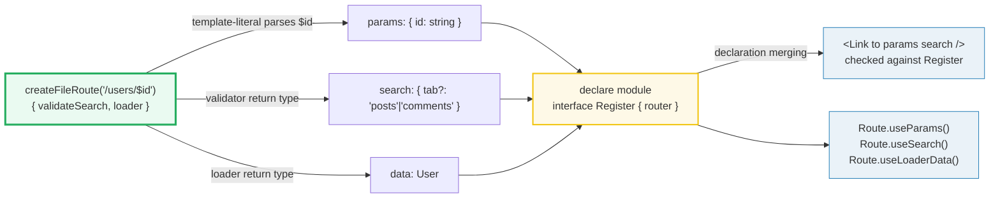

# Router Type Inference

> **Companion demo:** [`router_type_inference.html`](./router_type_inference.html) — open in a browser.
> Drive the Link Builder and watch a simulated TS checker validate `params`/`search` against a route's inferred type signature, live.

---

## 0. TL;DR — the one idea

A route **definition** is the single source of truth for every type in TanStack Router. You write the path string, a `validateSearch` schema, and a `loader` function; TypeScript infers types from each and **pipes them through the entire routing experience** — `<Link>`, `useNavigate`, `useParams`, `useSearch`, `useLoaderData`, and context are all checked against the exact route signature. You write *fewer* types and get *more* confidence as the app grows.



The whole feature rests on three TypeScript mechanisms: **template-literal types** (parse the path), **generic inference** (from `validateSearch`/`loader` arguments and return types), and **declaration merging** (publish the router's types into the library so exported hooks/components see them).

---

## 1. How route types are defined

Every route is created with `createFileRoute` (file-based) or `new Route({ getParentRoute })` (code-based). The path string is a literal type, so TanStack's types parse it at compile time.

```tsx
// routes/users.$id.tsx
import { createFileRoute } from '@tanstack/react-router'
import { zodValidator } from '@tanstack/zod-adapter'
import { z } from 'zod'

export const Route = createFileRoute('/users/$id')({
  // params.id is inferred as `string` from the `$id` in the path
  validateSearch: zodValidator(
    z.object({ tab: z.enum(['posts', 'comments']).optional() })
  ),
  // params is typed as { id: string }; return type becomes the loader data type
  loader: ({ params }) => fetchUser(params.id),
  component: UserComponent,
})
```

From this one definition, TypeScript derives:

| source | inferred type |
|---|---|
| `'/users/$id'` (path literal) | `params = { id: string }` |
| `validateSearch` schema | `search = { tab?: 'posts' \| 'comments' }` |
| `loader` return | `data = User` (whatever `fetchUser` resolves to) |

### Narrowing a path param

A `$id` is a `string` by default. To make it a `number` (or any parsed type), add a `params.parse` on the route that owns the segment. Once parsed, **every child route sees the narrowed type** — `dashboardId: number` defined on `/dashboard/$dashboardId` shows up as `number` inside `/dashboard/$dashboardId/widget/$widgetId`.

```tsx
createFileRoute('/dashboard/$dashboardId')({
  params: { parse: (d) => ({ dashboardId: Number(d.dashboardId) }) },
  // ...
})
// child: Route.useParams() → { dashboardId: number, widgetId: string }
```

---

## 2. How types propagate through the chain

Types move in two directions: **inward** (a consumer's props are *constrained* by the route) and **downward** (parent params/search/context *accumulate* into children).

### 2a. Crossing the module boundary — the `Register` trick

Top-level exports like `<Link>`, `useNavigate`, and `useParams` don't know about *your* router — they live in `@tanstack/react-router`. To give them your types, TanStack uses **declaration merging** on an exported `Register` interface:

```tsx
const router = createRouter({ routeTree, context })

declare module '@tanstack/react-router' {
  interface Register {
    router: typeof router
  }
}
```

Now every exported hook/component reads `Register['router']` and resolves its generics against your exact route tree. This is the seam that turns a generic library component into one typed for *your* app.

### 2b. Consumption — the type chain

```tsx
// ✅ Valid: id is string, tab is 'posts' | 'comments'
<Link to="/users/$id" params={{ id: '42' }} search={{ tab: 'posts' }} />

// ❌ Error: 'name' doesn't exist in params { id }
<Link to="/users/$id" params={{ name: '42' }} />

// ❌ Error: 'videos' is not assignable to 'posts' | 'comments'
<Link to="/users/$id" params={{ id: '42' }} search={{ tab: 'videos' }} />
```

Inside the route's own component, the hooks are typed by that route's signature *with no hint needed*:

```tsx
function UserComponent() {
  const params = Route.useParams()         // { id: string }
  const search = Route.useSearch()         // { tab?: 'posts' | 'comments' }
  const user  = Route.useLoaderData()      // User
}
```

### 2c. Hierarchical accumulation

Parents enrich children: parsed **path params**, validated **search params**, and **router context** all merge down the tree. A `?debug` boolean declared on the root route's `validateSearch` is available to every leaf via `useSearch()`; a `beforeLoad` that returns `{ hello: 'world' }` is visible to descendants via `useRouteContext()`. The child's type is the **intersection** of everything above it.

---

## 3. The TypeScript generics behind the scenes

Three mechanisms do the heavy lifting:

1. **Template-literal types** turn the path string into a params shape.
   ```ts
   type ExtractParams<T> =
     T extends `${string}$${infer P}/${infer Rest}` ? { [K in P]: string } & ExtractParams<`/${Rest}`>
     : T extends `${string}$${infer P}` ? { [K in P]: string }
     : {}
   // '/users/$id' → { id: string }
   // '/dashboard/$dashboardId/widget/$widgetId/' → { dashboardId: string; widgetId: string }
   ```
2. **Generic inference** from function arguments/returns. The `loader`'s `LoaderFnContext` is parameterized by the route's params + context, so `({ params }) => ...` is already typed; the return type flows back out as the loader-data type. `validateSearch` works the same way — its return type *is* the search type.
3. **Declaration merging** (`Register`) publishes the fully-resolved router type so module-level exports can consume it. Without this, `<Link>` would be generic over an unknown router.

The route object itself is a deeply-parameterized generic (roughly `Route<TRegister, TParent, TPath, ..., TLoaderFn, ...>`) that carries params, search, context, and loader types as type arguments. Walking the tree unions/intersects these to build each consumer's exact props.

> **The "component context problem":** React context can't carry changing types through the tree, so context-based hooks need a `from` hint (the route's id/path) to know their position. `Route.useXxx()` sidesteps this because the `Route` object already encodes its own types.

---

## 4. `validateSearch` integration

`validateSearch` is how URL search params become **both** validated-at-runtime and typed-at-compile-time. It accepts any **Standard Schema** validator (Zod, Valibot, ArkType, or a plain `(input) => parsed` function). The validator's output type becomes the route's search type.

```tsx
createFileRoute('/users')({
  validateSearch: zodValidator(z.object({
    filter: z.string().optional(),
    page: z.number().default(1),
  })),
  // → search typed as { filter?: string; page: number }
})
```

Because search params accumulate down the tree, a leaf route's search is the merge of its own `validateSearch` with every ancestor's. `useSearch()` in the leaf returns the **intersection** — and a `<Link>` targeting that leaf must satisfy the whole merged shape.

> **Search Middleware:** to keep default values (e.g. `?page=1`) out of the URL, register `search.middlewares` like `stripSearchParams({ page: 1 })`. This transforms what's written to the URL without changing the type.

---

## 5. Loader return types

The `loader` runs before the component mounts; its return type flows into the component via `Route.useLoaderData()`.

```tsx
export const Route = createFileRoute('/posts/$postId')({
  loader: ({ params }) => fetchPost(params.postId),   // Promise<Post>
  component: PostComponent,
})

function PostComponent() {
  const post = Route.useLoaderData()                  // typed as Post
}
```

### The prefetch gotcha (performance)

If a loader only calls `queryClient.ensureQueryData(...)` (prefetch) and its return value is **never read**, TypeScript still infers the loader-data type and carries it through the route tree. For large types and many routes this slows the editor. The fix: don't return the promise — make the loader resolve to `void`:

```tsx
// ❌ loader data inferred (heavy) even though never consumed
loader: ({ context, params }) => context.queryClient.ensureQueryData(opts(params.id))

// ✅ inferred as Promise<void> — cheap
loader: async ({ context, params }) => {
  await context.queryClient.ensureQueryData(opts(params.id))
}
```

---

## 6. Killer Gotchas

| trap | symptom | fix |
|------|---------|-----|
| **Code-based routing without `getParentRoute`** | parent's params/search/context vanish from children ("lost to the JS void") | pass `getParentRoute: () => parentRoute` on every child so it knows all parent types |
| **Missing `Register` declaration** | `<Link>`, `useNavigate`, `useParams` are untyped / fall back to `any` | add `declare module '@tanstack/react-router' { interface Register { router: typeof router } }` |
| **`LinkProps` used bare** | TS grinds to a halt — it's a huge union of every route's params+search | use `as const satisfies LinkProps` (or `LinkProps<RegisteredRouter, '/exact/path'>`) to narrow |
| **`<Link to=".." />` / `to="."`** | search resolves to a union of **all** routes — slow linear check | narrow with `from={Route.fullPath}` or an absolute `to` |
| **Inferring loader data you never read** | editor lag on large route trees | `await` inside the loader so it resolves to `void` |
| **`from` that lies** | TS passes but runtime throws ("hook called from the wrong route") | keep `from` consistent with the route actually rendering; use `strict: false` for shared components |
| **`useLoaderData()` returning `any`** | type widening, usually from a circular or unresolvable loader return | give the loader an explicit return type or ensure `ensureQueryData` carries a tagged query key |

### Cheat sheet

```tsx
// 1. define — the path string + validateSearch + loader ARE the types
export const Route = createFileRoute('/users/$id')({
  validateSearch: zodValidator(z.object({ tab: z.enum(['posts','comments']).optional() })),
  loader: ({ params }) => fetchUser(params.id),
})

// 2. register — publish types into the library
declare module '@tanstack/react-router' {
  interface Register { router: typeof router }
}

// 3. consume — checked against the route signature
<Link to="/users/$id" params={{ id: '42' }} search={{ tab: 'posts' }} />

// 4. inside the component — typed by THIS route, no hint needed
const { id }   = Route.useParams()       // string
const { tab }  = Route.useSearch()       // 'posts' | 'comments' | undefined
const user     = Route.useLoaderData()   // User

// 5. shared component — relax to a union of all routes
const search = useSearch({ strict: false })
```

---

## 🔗 Cross-references

- [`router_type_safety.html`](../frontend/tanstack-start/router_type_safety.html) — the basics of type-safe routing (frontend bundle); this deep dive explains the type *machinery* behind it.
- [`router_fundamentals.html`](./router_fundamentals.html) — route tree, history, and matching: the runtime model these types describe.
- [`router_route_tree.html`](./router_route_tree.html) — route compilation & linearization: how the tree the type system walks is built.
- [`router_search_validation.html`](./router_search_validation.html) — Zod/Valibot schemas, defaults, and search middleware in depth.

---

## Sources

- [Type Safety — TanStack Router Docs](https://tanstack.com/router/latest/docs/guide/type-safety) (declaration merging / `Register`, the component-context problem, `from`/`strict:false`, performance recommendations)
- [Data Loading — TanStack Router Docs](https://tanstack.com/router/latest/docs/guide/data-loading) (`Route.useLoaderData()` typing, the prefetch-to-`void` perf fix)
- [useLoaderData hook — TanStack Router API](https://tanstack.com/router/latest/docs/api/router/useLoaderDataHook)
- [Context Inheritance in TanStack Router — TkDodo's blog](https://tkdodo.eu/blog/context-inheritance-in-tan-stack-router) (params/search/context accumulate down the tree at the type level)
- [A milestone for TypeScript Performance in TanStack Router — TanStack Blog](https://tanstack.com/blog/tanstack-router-typescript-performance) (narrowing `LinkProps`, `to=".."` unions, object `addChildren`)
