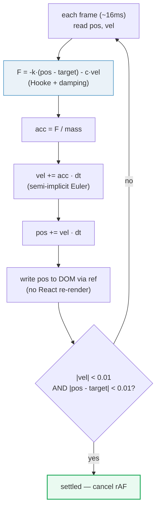

# Spring Physics

> **Companion demo:** [`spring_physics.html`](./spring_physics.html) — open in a browser.
> A live `<SpringDemo/>` runs the exact solver documented here; an embedded gold-check
> proves the ball springs 50 → 80 % and settles.

---

## 0. TL;DR — the one idea

A **tween** animates a value with a fixed *duration* + an *easing curve*. A **spring**
animates a value with **physics**: each frame the solver computes a restoring force
from Hooke's law plus a damper, integrates, and repeats until the system settles.
Because a spring carries **velocity**, it overshoots, bleeds energy, and re-aims
smoothly when you interrupt it — which is why it feels natural and why Framer Motion
uses it as the default transition type.



---

## 1. How it works — the equation

The spring is a **damped harmonic oscillator**. Two forces act on the mass every frame:

```
F = -k·x - c·v

  k = stiffness      pull back toward the target (Hooke's law: F = -kx)
  x = displacement   position - target
  c = damping        friction proportional to velocity (F = -cv)
  v = velocity

  acceleration = F / mass
  velocity    += acceleration · dt
  position    += velocity · dt
```

Each animation frame (~16 ms) the loop:

1. reads the current `pos` and `vel` from refs,
2. computes `force = -stiffness * (pos - target) - damping * vel`,
3. integrates with **semi-implicit Euler** (velocity first, then position),
4. writes `pos` straight to the DOM via a ref (no React state, no re-render),
5. requests the next frame **only if** the system still has energy
   (`|vel| > 0.01 || |pos - target| > 0.01`).

The smallest working solver (this is exactly what the demo runs):

```js
const k = 100, c = 12, m = 1, dt = 1 / 60;
let pos = 50, vel = 0, target = 80;

function step() {
  const F = -k * (pos - target) - c * vel;   // F = -kx - cv
  const a = F / m;
  vel += a * dt;                              // semi-implicit Euler (stable)
  pos += vel * dt;
  ball.style.left = pos + '%';
  if (Math.abs(vel) > 0.01 || Math.abs(pos - target) > 0.01) {
    requestAnimationFrame(step);              // keep going while energised
  }
}
requestAnimationFrame(step);
```

There is no `duration`, no `easeInOut`. The motion *emerges* from the physics.

---

## 2. Mechanism / internals

### Why semi-implicit Euler (not explicit)

The naive integrator (`pos += vel*dt; vel += a*dt`) is **explicit Euler** — it leaks
energy and eventually explodes for stiff springs. The fix is one line: update
`vel` *first*, then advance `pos` with the new velocity. This is **semi-implicit
(symplectic) Euler**, and it's stable as long as `dt < 2/ω` where `ω = √(k/m)`.
For `k=100, m=1` that threshold is `0.2 s`; at `dt = 1/60 ≈ 0.016 s` we are far
inside the safe zone. This is the same trick Framer Motion's `spring()` and
react-spring use internally.

### The three knobs

| param | symbol | raise it → | observable effect |
|---|---|---|---|
| **stiffness** | `k` | stronger pull | faster, snappier, more oscillation |
| **damping** | `c` | more friction | less overshoot, settles sooner |
| **mass** | `m` | heavier object | sluggish, slower acceleration |

The **damping ratio** `ζ = c / (2·√(k·m))` tells you the character at a glance:

- `ζ < 1` → **underdamped**: overshoots and bounces (most UI springs live here, ζ ≈ 0.5–0.8)
- `ζ = 1` → **critically damped**: fastest settle with **no** overshoot
- `ζ > 1` → **overdamped**: slow crawl to target, no bounce

### Named presets

These mirror the canonical preset names popularised by react-spring, expressed
here in `stiffness` / `damping` form (the vocabulary Framer Motion exposes):

| preset | stiffness | damping | ζ* | feel |
|---|---|---|---|---|
| Gentle | 100 | 12 | 0.60 | soft, natural — close to Framer's default |
| Wobbly | 180 | 12 | 0.45 | playful, bouncy |
| Stiff | 210 | 20 | 0.69 | snappy, business-like |
| Slow | 280 | 60 | 1.79 | heavy, no overshoot |
| Molasses | 280 | 120 | 3.58 | very slow crawl |

*ζ computed for `mass = 1`. Framer Motion's documented defaults are
`stiffness: 100, damping: 10, mass: 1` (ζ ≈ 0.5).

### Spring vs tween

| | spring | tween (duration + easing) |
|---|---|---|
| model | physics (`F = -kx - cv`) | time-mapped curve (cubic-bezier) |
| duration | **emergent** — settles when `|v| ≈ 0` | fixed (`300ms`) |
| interruption | keeps velocity → smooth re-aim | restarts curve (can jump) |
| overshoot | physical, only when underdamped | only if the easing curve allows |
| determinism | depends on frame timing | exact, frame-independent |
| best for | gestures, drag, swipe, UI feedback | choreographed sequences, loops, loading |

---

## 3. Killer Gotchas

| trap | symptom | fix |
|---|---|---|
| **React clobbers imperative style** | ball snaps back to its JSX `style` on the next re-render | don't put the animated property in JSX `style` — mutate the DOM via a `ref`; the demo's ball has no `left` in JSX at all |
| **explicit Euler** | spring diverges / explodes for high stiffness | update `vel` *before* `pos` (semi-implicit); or sub-step when `dt` is large |
| **stale closure over tuning** | changing stiffness/damping doesn't change the running loop | list `[target, stiffness, damping]` in the effect's deps so React tears down and restarts the loop |
| **rAF runs forever** | CPU spin after the ball looks still | stop requesting frames once `|vel| < ε AND |pos - target| < ε` |
| **animating via state** | 60 `setState`/s → React reconciles 60×/s, janky | animate via `ref` + direct DOM write; state is only for the *target* and *tuning* |
| **variable `dt`** | tab in background → huge `dt` → explosion on refocus | clamp `dt` to e.g. `min(real, 1/30)` or use a fixed-step accumulator |
| **ignoring reduced motion** | vestibular discomfort for sensitive users | gate the loop behind `matchMedia('(prefers-reduced-motion: reduce)')` and snap instead |
| **wrong units for `mass`** | `mass: 0` → divide-by-zero `NaN` | default `mass = 1`; never let mass reach 0 |

---

### Cheat sheet

```js
// Minimal 60fps spring — semi-implicit Euler, imperative DOM write.
function useSpring(target, { stiffness = 100, damping = 12, mass = 1 } = {}) {
  const ref = React.useRef(null);
  const pos = React.useRef(target);
  const vel = React.useRef(0);
  const raf = React.useRef(0);
  React.useEffect(() => {
    const dt = 1 / 60;
    const step = () => {
      const F = -stiffness * (pos.current - target) - damping * vel.current;
      vel.current += (F / mass) * dt;            // velocity first (stable)
      pos.current += vel.current * dt;
      if (ref.current) ref.current.style.transform = `translateX(${pos.current}px)`;
      if (Math.abs(vel.current) > 0.01 || Math.abs(pos.current - target) > 0.01)
        raf.current = requestAnimationFrame(step);
    };
    raf.current = requestAnimationFrame(step);
    return () => cancelAnimationFrame(raf.current);
  }, [target, stiffness, damping, mass]);
  return ref;
}

// Framer Motion equivalent — same physics, library does the loop:
// <motion.div animate={{ x: target }} transition={{ type: 'spring', stiffness: 100, damping: 12 }} />
```

**Pick a preset by feel:** need playful → raise stiffness, keep damping low
(ζ ≈ 0.5). Need professional → push damping toward critical (ζ ≈ 0.7–1.0).
Need weight → raise mass or lower stiffness. Never tune by guessing `duration`.

---

## 🔗 Cross-references

- [`framer_motion_core`](./framer_motion_core.html) — Framer Motion's
  `transition={{ type: 'spring', stiffness, damping, mass }}` runs this exact
  solver; this bundle is the physics underneath it.
- [`css_animations`](./css_animations.html) — CSS transitions are tweens
  (duration + easing), not physics; use them for FLIP/state toggles where
  determinism beats naturalness.
- [`animation_orchestration`](./animation_orchestration.html) — sequencing
  springs with variants, `staggerChildren`, and `AnimatePresence` exits.
- [`use_transition`](./use_transition.html) — `useTransition` defers *rendering*
  work; springs handle the *visual* layer. Pair them: transition the state,
  spring the pixels.

---

## Sources

- Maxime Heckel — *The physics behind spring animations* (Hooke's law, damping,
  Framer Motion defaults `stiffness: 100 / damping: 10 / mass: 1`):
  <https://blog.maximeheckel.com/posts/the-physics-behind-spring-animations/>
- motion.dev docs — *React transitions* / *spring()*: physics-based springs
  configured via `stiffness`, `damping`, `mass`:
  <https://motion.dev/docs/react-transitions> · <https://motion.dev/docs/spring>
- Wikipedia — *Hooke's law* (the restoring force `F = -kx`):
  <https://en.wikipedia.org/wiki/Hooke%27s_law>
- Android Developers — *Animate movement using spring physics* (`SpringForce`,
  stiffness & damping ratio): <https://developer.android.com/develop/ui/views/animations/spring-animation>
