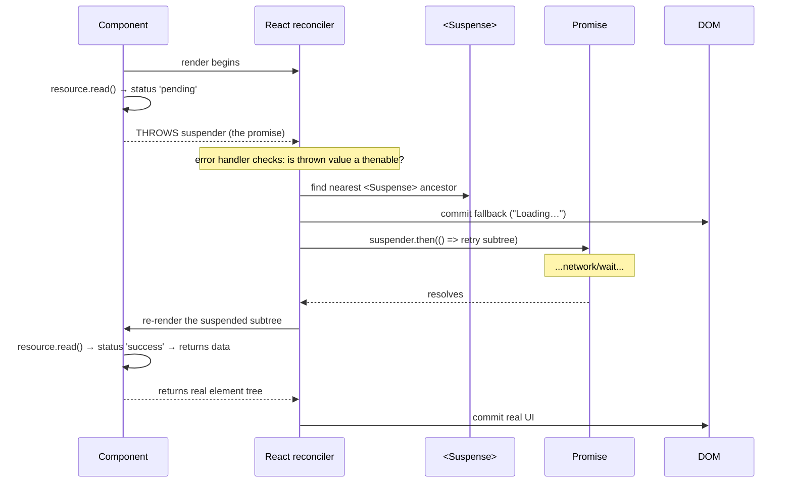

# Suspense Patterns — throw a promise, catch a fallback

> **Companion demo:** [`suspense_patterns.html`](./suspense_patterns.html) — open in a browser.
> **React version:** 19.2.7 via ESM CDN + Babel standalone.

---

## 0. TL;DR — the one idea

> **The analogy:** `useEffect` + `useState` is you driving the loading state with
> your hands on the wheel ("mount → fetch → setIsLoading → setData"). `<Suspense>`
> is a tow truck — the component says "I'm not ready" by **throwing a promise**,
> and React tows it to the nearest `fallback` until the promise resolves.

```mermaid
graph TD
    R["component renders"] -->|reads resource| RD["resource.read() / use(promise)"]
    RD -->|not ready| TH["THROWS the promise"]
    TH -->|React catches| FB["nearest &lt;Suspense fallback&gt; renders"]
    FB -->|meanwhile| P["promise resolves (data ready)"]
    P -->|React retries subtree| R2["component re-renders"]
    R2 -->|read() returns| OK["real UI paints"]
    style TH fill:#fef9e7,stroke:#f1c40f,stroke-width:2px
    style FB fill:#eaf2f8,stroke:#2980b9
    style OK fill:#eafaf1,stroke:#27ae60
```

When a component reads a resource that isn't ready, it **throws a promise**
during render. React catches it, renders the nearest `<Suspense fallback>`, and
re-renders the suspended subtree when the promise settles. Loading state becomes
a **property of the tree**, not a flag you manage — no `isLoading`, no
`useEffect`+`setState` race conditions, no conditional rendering spaghetti.

---

## 1. How it works — the throw-promise contract

### The resource cache pattern (this demo)

The canonical pre-`use()` wrapper that turns any promise into a suspendable
resource:

```javascript
function createResource(promise) {
  let status = 'pending';
  let result;
  const suspender = promise.then(
    (r) => { status = 'success'; result = r; },
    (e) => { status = 'error'; result = e; }
  );
  return {
    read() {
      if (status === 'pending') throw suspender; // <-- THE throw
      if (status === 'error')   throw result;    // errors bypass Suspense → ErrorBoundary
      return result;
    }
  };
}

function DataViewer({ resource }) {
  const data = resource.read();    // throws while pending, returns when resolved
  return <div>Loaded: {data}</div>;
}

<Suspense fallback={<div>Loading…</div>}>
  <DataViewer resource={resource} />
</Suspense>
```

The `read()` function is the entire mechanism. While `status === 'pending'`, it
**throws the (same) promise**. React's reconciler has a special branch in its
error handler: if the thrown value `then`-able (has a `.then`), it's not a real
error — it's a suspension. React walks up to the nearest `<Suspense>`, commits
its `fallback`, and attaches a `.then()` to the thrown promise so it retries the
subtree on resolution.

### Why the promise must be cached

```javascript
// ❌ WRONG — re-creates the promise on every render → infinite suspend loop
function Bad() {
  const data = createResource(fetch('/api')).read();
  return <div>{data}</div>;
}

// ✅ RIGHT — lazy initializer caches the resource across re-renders
function Good() {
  const [resource] = useState(() => createResource(fetch('/api')));
  const data = resource.read();
  return <div>{data}</div>;
}
```

Every render calls `read()`. If you build a fresh promise each time, you build a
fresh *pending* promise each time — so it suspends forever. **The promise must
outlive a single render.** `useState(() => ...)` (lazy init) or `useRef` or a
module-level cache (`fetch` frameworks, Relay, SWR) all solve this.

---

## 2. Mechanism — inside the reconciler



1. **Render begins.** React calls the component function.
2. **Throw.** `read()` (or `use()`) hits the pending branch and throws the promise.
3. **Catch + classify.** React's error handler checks `typeof thrown.then === 'function'`.
   If yes → suspension (not an error). If no → real error → ErrorBoundary.
4. **Find boundary.** React walks up to the nearest `<Suspense>` and commits its `fallback`.
5. **Subscribe.** React attaches `.then()` to the thrown promise.
6. **Resolve + retry.** When the promise settles, React re-renders the suspended
   subtree. Now `read()` returns the data.

> **React 19 note:** `createRoot().render()` handles Suspense natively — no
> `unstable_ConcurrentMode` flag (that was React 16/17 experimental). The
> throw-promise path is on by default in every React 18+ app.

---

## 3. The three faces of Suspense

### Face 1 — `React.lazy` (code splitting)

```javascript
const MarkdownEditor = React.lazy(() => import('./MarkdownEditor'));

function App() {
  return (
    <Suspense fallback={<Spinner />}>
      <MarkdownEditor />   {/* suspends until the chunk downloads */}
    </Suspense>
  );
}
```

`React.lazy` returns a component whose render throws the dynamic `import()`
promise. This is the simplest, most common Suspense use: **split a heavy route
or widget into its own chunk** and let Suspense show a spinner while it streams.
The import is cached after the first load, so navigating back is instant.

> See the dedicated bundle: [`lazy_suspense`](./lazy_suspense.html).

### Face 2 — `use(promise)` (React 19, data fetching)

```javascript
import { use, Suspense } from 'react';

function Albums({ promise }) {
  const albums = use(promise);  // suspends if pending, returns if resolved
  return <ul>{albums.map(a => <li key={a.id}>{a.title}</li>)}</ul>;
}

function Page() {
  // The promise MUST be created outside the suspending component (or cached),
  // so it's stable across re-renders. A parent or data layer typically owns it.
  const [promise, setPromise] = useState(() => fetchAlbums());
  return (
    <>
      <button onClick={() => setPromise(fetchAlbums())}>Refresh</button>
      <Suspense fallback={<Spinner />}>
        <Albums promise={promise} />
      </Suspense>
    </>
  );
}
```

`use()` is React 19's first-class way to read a promise during render. It throws
the promise if pending (Suspense catches it) and returns the resolved value
otherwise. It also accepts a **Context**, making it the only hook you can call
inside conditionals/loops (because it's a render-time read, not a registration).

> **`use()` vs manual `resource.read()`:** `use(promise)` handles the caching of
> the *resolution* for you (it memoizes per-promise), but **you** must still keep
> the promise referentially stable across renders — creating it in the
> suspending component re-suspends forever. The lazy-initializer pattern (Face 2
> example) or a data-fetching library solves this.

### Face 3 — resource cache + manual throw (this demo)

When you can't use `React.lazy` (e.g. in eval'd code with no dynamic import) or
want explicit control, the `createResource()` wrapper from §1 is the building
block. Every data-fetching library that integrates with Suspense (Relay, Apollo,
SWR, React Query) implements this same `read()`-throws-promise contract under the
hood.

---

## 4. Nested Suspense — the nearest ancestor wins

```javascript
<Suspense fallback={<PageSpinner />}>
  <Header />
  <Suspense fallback={<MainSpinner />}>
    <Main />
    <Suspense fallback={<SidebarSpinner />}>
      <Sidebar />   {/* only this suspends → only sidebar shows spinner */}
    </Suspense>
  </Suspense>
</Suspense>
```

When `<Sidebar />` suspends, React shows `<SidebarSpinner />` — **not** the outer
fallbacks. `<Header />` and `<Main />` stay mounted and interactive. This lets
you **isolate loading regions**: one slow component doesn't blank out the whole
page. Only if a component suspends with **no** `<Suspense>` ancestor does React
bubble all the way up to the root (which has an implicit fallback of nothing).

---

## 5. Suspense + ErrorBoundary — the complete async UI pair

A thrown **error** (not a promise) bypasses Suspense and bubbles to the nearest
**class** ErrorBoundary. Together they cover the full async lifecycle:

```javascript
class ErrorBoundary extends React.Component {
  state = { error: null };
  static getDerivedStateFromError(error) { return { error }; }
  render() {
    if (this.state.error) return <this.props.fallback error={this.state.error} />;
    return this.props.children;
  }
}

<ErrorBoundary fallback={<ErrorView />}>
  <Suspense fallback={<Spinner />}>
    <DataViewer resource={resource} />  {/* pending → Spinner, rejects → ErrorView */}
  </Suspense>
</ErrorBoundary>
```

| Event | Who catches it | Result |
|-------|----------------|--------|
| promise **pending** (thrown) | `<Suspense>` | shows `fallback`, retries on resolve |
| promise **rejects** / component throws Error | `<ErrorBoundary>` | shows error fallback, stays until remount |
| component renders normally | neither | real UI |

> React 19 does **not** ship a built-in `<ErrorBoundary>` component yet — you
> still write the class. (Function-component error boundaries are not available;
> `getDerivedStateFromError` requires a class.) See
> [`error_boundaries`](./error_boundaries.html).

---

## Killer Gotchas

| Trap | Symptom | Fix |
|------|---------|-----|
| **Uncached promise** | Infinite suspend loop / flicker; `use(fetch())` re-fetches every render | Cache the promise: `useState(() => fetch())`, `useRef`, or a data lib (SWR/React Query). The promise must be referentially stable. |
| **Creating the promise inside the suspending component** | Re-suspends forever, data never shows | Lift promise creation to a parent or lazy initializer — the *consumer* calls `use(p)`/`read()`, the *owner* creates `p`. |
| **Error vs promise confusion** | Rejected fetch crashes the app past Suspense | A rejected promise thrown by `read()` becomes a real error → wrap `<Suspense>` in an `<ErrorBoundary>`. Suspense only catches *thenables*, not Errors. |
| **No `<Suspense>` ancestor** | App goes blank / root suspends with no fallback | Always wrap suspendable content in `<Suspense>`. A suspension with no boundary bubbles to the root. |
| **Conditional `use(promise)` after a state change** | "Cannot read properties of undefined" / stale data | Unlike other hooks, `use()` CAN be called conditionally — but the promise you pass must already be settled or suspended-against. Don't construct it inline conditionally. |
| **Expecting fallback on refetch** | Old data stays during refetch instead of spinner | By default, re-suspending shows the fallback again. To *keep old data* during refetch, wrap the state update in `useTransition` (concurrent feature) — the old UI persists until the new resource resolves. |
| **`React.lazy` without Suspense** | Blank screen while chunk loads | Every `<LazyComponent/>` must have a `<Suspense>` ancestor. |
| **Thinking Suspense fetches** | You write `<Suspense>` and wait for data, nothing happens | `<Suspense>` does NOT start a fetch. Something upstream must create the promise (parent, route loader, `fetch` library). Suspense only *waits*. |

### Cheat sheet

```jsx
// 1. Code splitting (most common)
const Lazy = React.lazy(() => import('./Lazy'));
<Suspense fallback={<Spinner />}><Lazy /></Suspense>

// 2. Data fetching (React 19)
const data = use(cachedPromise);          // inside a <Suspense> boundary

// 3. Manual resource cache (this demo / pre-use())
const [r] = useState(() => createResource(fetch()));
const v = r.read();                       // throws while pending

// 4. Nested boundaries isolate loading
<Suspense fallback={<Outer/>}>
  <Static/>
  <Suspense fallback={<Inner/>}><Async/></Suspense>
</Suspense>

// 5. Complete async lifecycle
<ErrorBoundary fallback={<Err/>}>
  <Suspense fallback={<Spinner/>}>
    <Async/>
  </Suspense>
</ErrorBoundary>

// 6. Keep old UI during refetch (no flicker)
const [isPending, startTransition] = useTransition();
startTransition(() => setResource(createResource(fetch())));
```

---

## 🔗 Cross-references

- [`lazy_suspense`](./lazy_suspense.html) — the dedicated code-splitting bundle: `React.lazy` + dynamic `import()` for route-level chunking, the most common Suspense use case
- [`use_transition`](./use_transition.html) — `useTransition` + Suspense = keep the old UI visible during refetch (no fallback flicker); urgent vs non-urgent updates
- [`error_boundaries`](./error_boundaries.html) — the mandatory partner: Suspense catches thrown *promises*, ErrorBoundary catches thrown *errors*; together they cover the async lifecycle
- [frontend/react: effects & lists](../frontend/react/react_effects_lists.html) — `useEffect` syncs with the world (imperative fetch→setState); Suspense is the declarative counterpart — "render this, or that fallback"
- [`use_memo_callback`](./use_memo_callback.html) — memoizing the promise/resource so it stays referentially stable across re-renders (avoids the infinite-suspend trap)

---

## Sources

1. **React Docs — `<Suspense>`**: https://react.dev/reference/react/Suspense (behavior: "Suspense will automatically switch to fallback when children suspends, and back to children when the data is ready"; nested boundaries; fallback rendering rules)
2. **React Docs — `use`**: https://react.dev/reference/react/use (React 19 hook: reads a Promise or Context during render, suspends if the Promise is pending, integrates with Suspense)
3. **React Docs — `lazy`**: https://react.dev/reference/react/lazy (`React.lazy(() => import())` returns a component that suspends until the dynamic import resolves; must be wrapped in `<Suspense>`)
4. **React 19 Release Blog**: https://react.dev/blog/2024/12/05/react-19 (the `use` hook shipped stable in React 19; `createRoot` enables Suspense natively — no concurrent-mode flag)
5. **Epic React — How Suspense Works Under the Hood**: https://www.epicreact.dev/how-react-suspense-works-under-the-hood-throwing-promises-and-declarative-async-ui-plbrh (explains the throw-promise mechanism: "in JavaScript, you can synchronously stop a function by throwing; React leverages this to pause rendering until the data is ready")
