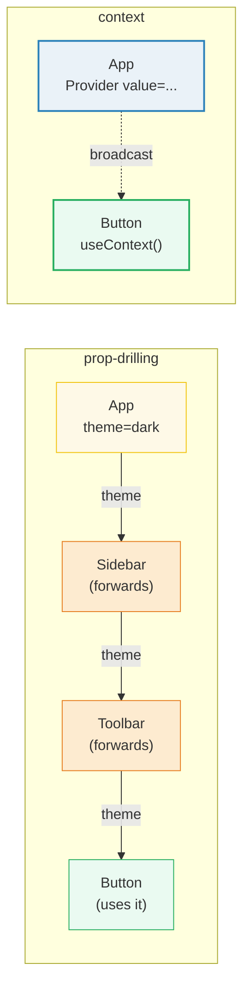
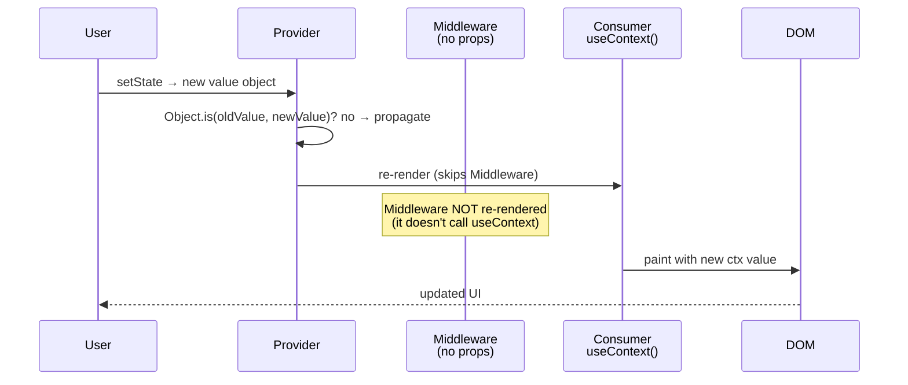

# Context API — the prop-drilling escape hatch

> **Companion demo:** [`use_context.html`](./use_context.html) — open in a browser.
> **React version:** 19.2.7 via ESM CDN + Babel standalone.

---

## 0. TL;DR — the one idea

> **The analogy:** prop-drilling is handing a message down a chain of people who
> don't care about it. Context is a PA system — one broadcast from the top,
> anyone in the building hears it.



A `Provider` at the top of the tree holds a `value`; any descendant reads it
with `useContext(Ctx)` without intermediate props. The `defaultValue` passed to
`createContext` is used ONLY when no Provider is found above the consumer.

---

## 1. How it works

### The three pieces

```javascript
// 1. create the context (module scope, once)
var ThemeContext = React.createContext({ theme: 'dark', toggle: function () {} });

// 2. wrap the tree in a Provider, set the value
<ThemeContext.Provider value={{ theme: theme, toggle: toggle }}>
  <App />
</ThemeContext.Provider>

// 3. read it anywhere deep in the tree
var ctx = React.useContext(ThemeContext);  // ctx.theme === 'dark'
```

| Piece | Role | What it does |
|-------|------|-------------|
| `createContext(default)` | Creates a context object | Returns `{ Provider, Consumer, ... }`; the `default` is the fallback when no Provider is found |
| `<Ctx.Provider value={v}>` | Supplies the value to descendants | The nearest Provider to a consumer wins; `value` changes trigger re-renders of all consumers |
| `useContext(Ctx)` | Reads the value + subscribes | Returns the nearest Provider's `value`; re-renders when that `value` changes |

### The default value is a fallback, not an initial value

```javascript
var Ctx = createContext('fallback');

// Inside a component with NO <Ctx.Provider> above it:
var v = useContext(Ctx);   // v === 'fallback'   ← default used

// Inside a component WITH a Provider above it:
// <Ctx.Provider value={'real'}>
//   <Consumer/>
// </Ctx.Provider>
var v = useContext(Ctx);   // v === 'real'        ← default IGNORED
```

The default is mainly useful for testing components in isolation (rendered
without their Provider) and for contexts that legitimately have a sensible
standalone default.

### Memoize the value to avoid re-rendering every consumer

```javascript
function App() {
  var themePair = useState('dark');
  var theme = themePair[0];
  var setTheme = themePair[1];

  // BAD: new object identity every render → every consumer re-renders even
  //      when App re-renders for an unrelated reason.
  // var value = { theme: theme, toggle: toggle };

  // GOOD: stable identity unless theme or toggle change.
  var toggle = useCallback(function () {
    setTheme(function (t) { return t === 'dark' ? 'light' : 'dark'; });
  }, []);
  var value = useMemo(function () { return { theme: theme, toggle: toggle }; }, [theme, toggle]);

  return <ThemeContext.Provider value={value}><Tree /></ThemeContext.Provider>;
}
```

---

## 2. Mechanism — the subscription model

Context uses a **subscription** model. When a component calls `useContext(Ctx)`,
React adds it as a subscriber to that context. When the Provider's `value`
changes (by `Object.is` reference), React walks the subscription list and
re-renders every consumer — **skipping the intermediate components** that don't
read the context.



1. The Provider's `value` prop changes (new object identity).
2. React compares old vs. new with `Object.is` — different → propagate.
3. React re-renders **only** the consumers of that context, skipping
   intermediate components that don't call `useContext`.
4. Each consumer reads the new value via `useContext(Ctx)`.

> **The performance gotcha:** because consumers re-render on *every* `value`
> change, an unmemoized object value (e.g. `value={{ a, b }}` inline in JSX)
> creates a new identity each render and re-renders ALL consumers even when the
> underlying data didn't change. Always memoize.

---

## 3. Context splitting — multiple independent contexts

A single Provider re-renders all its consumers when its value changes. To avoid
a theme toggle re-rendering every user-profile consumer, **split concerns into
separate contexts** — each Provider is independent.

```javascript
var ThemeContext  = createContext('dark');
var UserContext   = createContext(null);
var LocaleContext = createContext('en');

// Nest them (order doesn't matter for correctness)
<UserContext.Provider value={user}>
  <ThemeContext.Provider value={theme}>
    <LocaleContext.Provider value={locale}>
      <App />
    </LocaleContext.Provider>
  </ThemeContext.Provider>
</UserContext.Provider>
```

Now a theme change re-renders only `ThemeContext` consumers; `UserContext` and
`LocaleContext` consumers are untouched. This is the standard scaling pattern —
the more frequently a value changes, the more it benefits from its own context.

---

## Killer Gotchas

| Trap | Symptom | Fix |
|------|---------|-----|
| **Unmemoized value** | Every consumer re-renders on ANY parent render, even unrelated | Wrap object/function values in `useMemo`/`useCallback` so identity is stable |
| **Inline object value** | `value={{ a, b }}` in JSX → new identity every render | Lift to a memoized variable: `const value = useMemo(...)` |
| **Expecting default to be the initial value** | `defaultValue` ignored when a Provider exists | The default is ONLY for consumers with no Provider above them |
| **Provider outside the consumer** | Consumer reads the default instead of the real value | Ensure the Provider wraps the consumer in the component tree |
| **One mega-context** | A theme toggle re-renders user/locale consumers too | Split into separate contexts (Theme, User, Locale) — each independent |
| **Using context for everything** | Tight coupling, hard to test, re-render storms | Use context for genuinely global, rarely-changing values; keep local state local |
| **Changing `value` identity needlessly** | Cascading re-renders down the tree | Split state that changes together into one context; split state that changes apart |
| **Consumer not updating** | Old value shown after Provider update | Confirm the new `value` is a new `Object.is`-distinct identity |

### Cheat sheet

```javascript
// Declare (module scope, once)
var ThemeContext = createContext({ theme: 'dark', toggle: function () {} });

// Provide (wrap the tree)
var value = useMemo(function () { return { theme: theme, toggle: toggle }; }, [theme, toggle]);
<ThemeContext.Provider value={value}>
  <App />
</ThemeContext.Provider>

// Consume (any descendant)
var ctx = useContext(ThemeContext);
// ctx.theme, ctx.toggle — no props passed down

// Default is the fallback ONLY when no Provider is found above the consumer.
```

---

## 🔗 Cross-references

- [use_memo_callback](./use_memo_callback.html) — memoize the context `value` so consumers don't re-render needlessly
- [compound_components](./compound_components.html) — context is the glue that lets compound children share implicit state without props
- [custom_hooks](./custom_hooks.html) — wrap `useContext` in a custom hook (e.g. `useTheme()`) to add error checking and ergonomics
- [frontend/react: components & props](../frontend/react/react_components_props.html) — the prop-drilling problem context solves; start here for the basics

---

## Sources

1. **React Docs — useContext**: https://react.dev/reference/react/useContext (subscription model, re-render behavior, 2024)
2. **React Docs — createContext**: https://react.dev/reference/react/createContext (Provider, defaultValue, Consumer)
3. **React Docs — Passing Data Deeply with Context**: https://react.dev/learn/passing-data-deeply-with-context (official tutorial, when to use context)
4. **React Docs — Scaling Up with Reducer and Context**: https://react.dev/learn/scaling-up-with-reducer-and-context (combining useReducer + Context)
