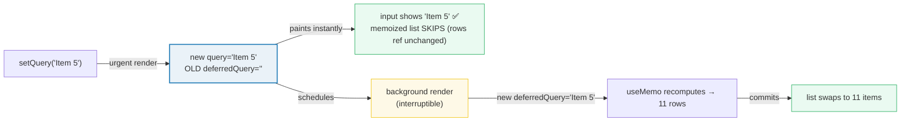
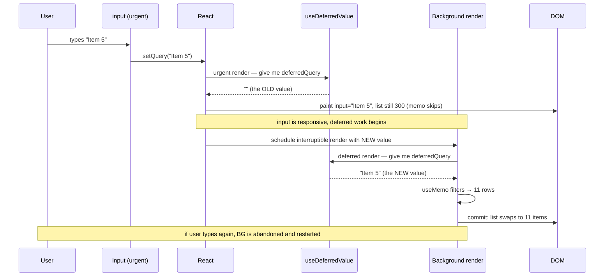
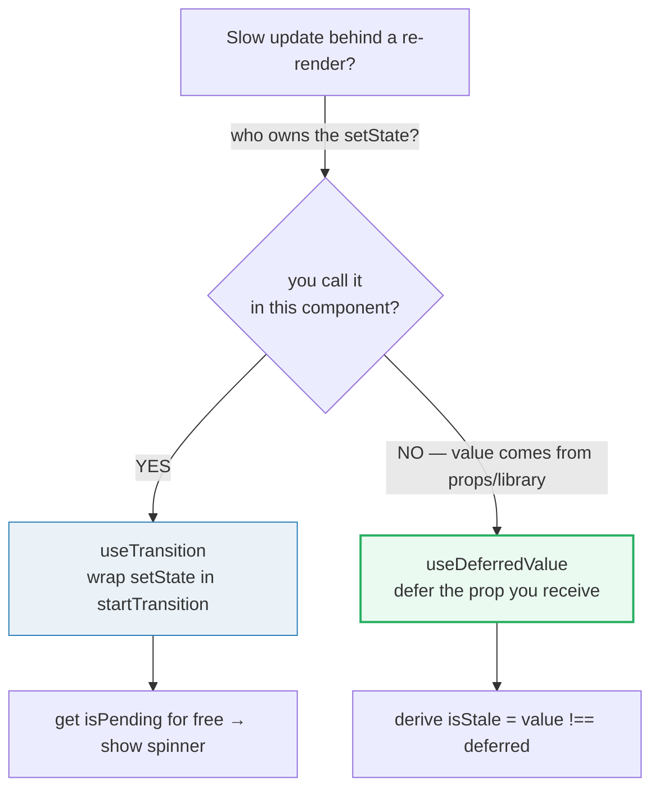

# useDeferredValue — defer the re-render

> **Companion demo:** [`use_deferred_value.html`](./use_deferred_value.html) — open in a browser.
> **React version:** 19.2.7 via ESM CDN + Babel standalone.

---

## 0. TL;DR — the one idea

> **The analogy:** every value has a "live" needle and a deferred one.
> `useDeferredValue` hands you the lagging needle. React paints the urgent render
> with the OLD needle (so the UI stays responsive), then quietly re-renders in the
> background with the NEW needle and swaps it in when ready. It is the
> **declarative** sibling of `useTransition` (which is **imperative**).



```javascript
const deferredQuery = React.useDeferredValue(query);
// First (urgent) render:   query="Item 5", deferredQuery=""   ← old value, fast
// Background render:        query="Item 5", deferredQuery="Item 5" ← catches up
```

`useDeferredValue(value)` returns a **lagging copy** of `value`. On the initial
render the deferred value equals `value`. On updates, React first re-renders with
the deferred value **unchanged** (the urgent render), then starts an
**interruptible** background re-render with the new value. Typing into the input
interrupts that background render and restarts it — the heavy work never blocks
the keystrokes.

---

## 1. How it works

### The signature (React 19)

```javascript
const deferredValue = React.useDeferredValue(value, initialValue?);
```

| Parameter | Required | Purpose |
|-----------|----------|---------|
| `value` | yes | The value you want to defer. Any type. |
| `initialValue` | no (React 19) | Value used **only** on the initial render. If omitted, the first render does not defer (no previous value to show). |

**Returns:** `currentValue`. During the initial render it is `initialValue`
(or `value` if omitted). During updates React returns the **old** value first,
then the **new** value once the background render commits.

### The demo, annotated

```javascript
function SearchApp() {
  const [query, setQuery] = React.useState('');
  // The star of the show: a lagging copy of `query`.
  const deferredQuery = React.useDeferredValue(query);

  // The expensive filter only recomputes when deferredQuery actually changes.
  const rows = React.useMemo(() => {
    if (!deferredQuery) return ITEMS;
    const q = deferredQuery.toLowerCase();
    return ITEMS.filter(it => it.label.toLowerCase().includes(q));
  }, [deferredQuery]);

  // True in the window between the urgent render and the background render.
  const isStale = query !== deferredQuery;

  return (
    <>
      <input value={query} onChange={e => setQuery(e.target.value)} />
      <SlowList rows={rows} stale={isStale} />
    </>
  );
}
```

### Why `React.memo` + `useMemo` are the companion pieces

`useDeferredValue` only buys you time if the **urgent** render is cheap. While
`deferredQuery` is unchanged, `useMemo` returns the **same cached array
reference**, so a `React.memo`-wrapped child sees identical props and **skips
re-rendering entirely**. The slow filter then runs only on the background render.

```javascript
const SlowList = React.memo(function SlowList({ rows }) { /* ... */ });
// urgent render:  rows ref unchanged → SlowList SKIPS ✅
// background render: useMemo recomputes → new rows → SlowList re-renders
```

> ⚠️ Without `React.memo`, the child re-renders on the urgent render anyway,
> defeating the optimization. This is the #1 gotcha (see below).

---

## 2. Mechanism — the two-step render



1. **Keystroke** → `setQuery` schedules an update.
2. **Urgent render:** React calls the component with `query="Item 5"` but
   `deferredQuery` still `""`. The input paints the new value immediately; the
   memoized list sees the same `rows` ref and **skips**.
3. **Background render:** React starts an interruptible render where
   `deferredQuery` is now `"Item 5"`. `useMemo` recomputes → 11 rows.
4. **Commit:** when the background render finishes (and nothing newer superseded
   it), React swaps the list to 11 items.
5. **Interruption:** if the user types again mid-background-render, React
   **abandons** it and restarts with the latest value. The list only re-renders
   for the final query once typing settles.

### Integration with `<Suspense>`

`useDeferredValue` is wired into Suspense. If the background render **suspends**
(e.g. new data not loaded), the user does **not** see the fallback — they keep
seeing the **old deferred value** until the new data resolves. That is the
"show stale content while fresh content loads" pattern:

```javascript
const deferredQuery = useDeferredValue(query);
<Suspense fallback={<h2>Loading…</h2>}>
  <SearchResults query={deferredQuery} />
</Suspense>;
```

---

## 3. useDeferredValue vs useTransition — pick the entry point

Both hooks express the **same** concurrent idea (split urgent from deferrable
work). The difference is **who holds the steering wheel**.

| Criterion | `useTransition` | `useDeferredValue` |
|-----------|-----------------|--------------------|
| **Style** | Imperative | Declarative |
| **What you control** | the **update** (wrap `setState` in `startTransition`) | the **value** (read a lagging copy) |
| **Signature** | `const [isPending, startTransition] = useTransition()` | `const deferred = useDeferredValue(value)` |
| **You know the moment it changes** | ✅ yes — you call `startTransition(fn)` | ❌ no — React decides when to apply it |
| **`isPending` flag?** | ✅ provided | ❌ derive it: `value !== deferred` |
| **Best when** | YOU trigger the state change (a button, a tab switch) | the value arrives from **props**, a parent, or a library you don't control |
| **Optimizes a child whose props you don't set** | ❌ awkward | ✅ natural |
| **Inside the other?** | updates inside a transition make `useDeferredValue` return the new value immediately (already deferred) | — |

### When to use which



- **`useTransition`** when the non-urgent update originates in your own event
  handler (e.g. switching tabs that re-renders a heavy route). You get
  `isPending` to show inline feedback.
- **`useDeferredValue`** when the value flows in from outside — a prop from a
  parent you don't control, `useSearchParams`, a third-party hook. You can't wrap
  someone else's `setState` in a transition, but you *can* lag the value.

> **One-line rule:** if you can wrap the `setState`, use `useTransition`; if you
> can only read the result, use `useDeferredValue`.

---

## 4. Stale rendering — it is a feature, not a bug

Between the urgent render and the background commit, the screen shows data that
does **not** match the latest input. This "staleness" is the whole point: the UI
stays responsive by deliberately painting old content first.

```javascript
const isStale = query !== deferredQuery;
<div style={{ opacity: isStale ? 0.5 : 1, transition: 'opacity .2s' }}>
  <SlowList rows={rows} />
</div>
```

Visual cues you can layer on:

- **Dim** the stale region (`opacity: 0.5`) while `isStale`.
- Add a **CSS transition** on the dim so it fades in gradually (avoids a flash on
  fast machines, still visible on slow ones).
- Show a small **"updating…"** badge tied to `isStale`.

The background render is **interruptible** and **device-adaptive**: on a fast
machine it commits almost instantly (no visible lag); on a slow one it lags
proportionally. Unlike `debounce`/`throttle`, there is **no fixed delay** to tune
and the work is never blocking — typing always preempts the deferred render.

---

## Killer Gotchas

| Trap | Symptom | Fix |
|------|---------|-----|
| **No `React.memo` on the slow child** | The list still re-renders on every keystroke; `useDeferredValue` "did nothing" | Wrap the child in `React.memo`. Without it, the urgent render re-renders the child regardless of the deferred value |
| **Inline object/array as the value** | Endless background re-renders, CPU pinned | Pass **primitives** or values created **outside render**. `useDeferredValue({a:1})` makes a new object every render → never `Object.is`-equal → re-defers forever |
| **Expecting it to cancel network requests** | Extra fetches still fire | `useDeferredValue` defers **rendering**, not data fetching. Debounce/throttle the *request*; defer the *display* |
| **Treating the deferred value as authoritative** | Logic reads `deferred` assuming it is current | It is **stale by design**. Compare `value !== deferred` before acting, or read the live `value` for correctness-sensitive branches |
| **Using it for correctness, not perf** | "It works with the hook, breaks without" | That's a bug elsewhere. `useDeferredValue` is a performance tool — the app must be correct with or without it |
| **Nesting it inside a transition** | Deferral silently vanishes | Updates already inside `startTransition` are deferred; `useDeferredValue` then returns the new value immediately and spawns no background render |
| **Forgetting `initialValue` (React 19) on first paint** | Initial render is not deferred / hydration mismatch | Pass `useDeferredValue(value, initial)` when the initial render itself should start deferred |
| **`Object.is` surprises** | `NaN`/`+0`/`-0` edge cases | `Object.is(NaN, NaN)` is `true` (unlike `===`); deferred comparison uses `Object.is` |
| **Effects fire late on the background render** | Effect seems to run "after" expected | Background-render Effects run only after that render **commits**; if it suspends, they run after data loads |

### Cheat sheet

```javascript
// 1. Defer a value coming from props / a library you don't control
const deferredQuery = useDeferredValue(query);

// 2. Keep the urgent render cheap: stable rows ref + memoized child
const rows = useMemo(() => heavyFilter(data, deferredQuery), [deferredQuery]);
const SlowList = React.memo(function SlowList({ rows }) { /* ... */ });

// 3. Show that the visible data is stale
const isStale = query !== deferredQuery;
<div style={{ opacity: isStale ? 0.5 : 1 }}><SlowList rows={rows} /></div>

// 4. React 19: defer starting from the initial render
const deferred = useDeferredValue(value, initialValue);

// 5. Keep old content visible while Suspense loads the new (no fallback flash)
<Suspense fallback={<Loading />}><Results query={deferredQuery} /></Suspense>
```

---

## 🔗 Cross-references

- [use_transition](./use_transition.html) — the **imperative** sibling. Wrap your own `setState` in `startTransition` when you own the update; reach for `useDeferredValue` when the value arrives from outside
- [use_memo_callback](./use_memo_callback.html) — `useMemo` + `React.memo` are the **companion** that makes the urgent render cheap so deferral can actually skip the child
- [suspense_patterns](./suspense_patterns.html) — `useDeferredValue` is integrated with `<Suspense>`: keep showing the stale deferred value instead of flashing the fallback while fresh data loads

---

## Sources

1. **React Docs — useDeferredValue**: https://react.dev/reference/react/useDeferredValue (signature with `initialValue`, two-step render, interruptible background re-render, 2024)
2. **React Docs — useDeferredValue usage (defer re-rendering / show stale content)**: https://react.dev/reference/react/useDeferredValue#deferring-re-rendering-for-a-part-of-the-ui (the `React.memo` + `useDeferredValue` pattern, stale-content dimming)
3. **React Docs — useTransition**: https://react.dev/reference/react/useTransition (the imperative counterpart; "updates inside a Transition" interaction with `useDeferredValue`)
4. **React 19 release notes**: https://react.dev/blog/2024/12/05/react-19 (concurrent hooks, `initialValue` support on `useDeferredValue`)
5. **React Docs — debounce/throttle vs deferring a value (Deep Dive)**: https://react.dev/reference/react/useDeferredValue (why deferred re-renders are interruptible and device-adaptive, unlike fixed-delay techniques)
