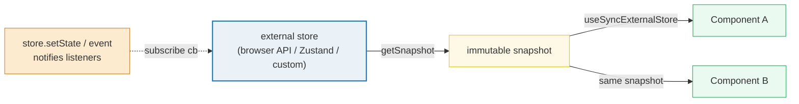
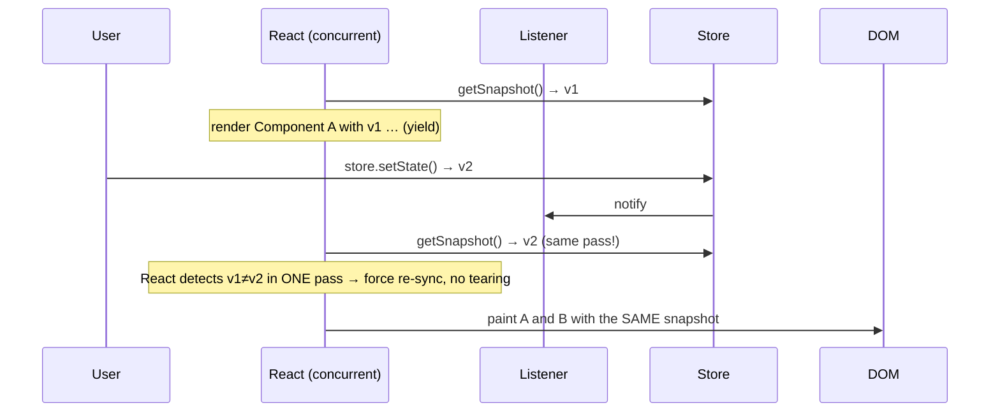

# useSyncExternalStore — the external-store bridge

> **Companion demo:** [`use_external_store.html`](./use_external_store.html) — open in a browser.
> **React version:** 19.2.7 via ESM CDN + Babel standalone.

---

## 0. TL;DR — the one idea

> **The analogy:** `useState`/`useReducer` own a value *inside* React. Context is a
> PA system *inside* the React tree. `useSyncExternalStore` is a window onto the
> world *outside* React — a browser API, a custom store, Zustand, Redux, a WebSocket.
> You give React a `subscribe` function and a `getSnapshot` function; it reads the
> snapshot, listens for changes, and re-renders the instant the store fires.



React's contract is just three functions. Get them right and any external source
becomes reactive, SSR-safe, and **tear-free** under concurrent rendering.

---

## 1. How it works — the `subscribe` / `getSnapshot` contract

```javascript
var snapshot = React.useSyncExternalStore(subscribe, getSnapshot, getServerSnapshot);
```

| Argument | Signature | What it does |
|----------|-----------|--------------|
| `subscribe` | `(onStoreChange) => unsubscribe` | Register a listener; **return** a cleanup that removes it. React calls it on mount and when it changes identity. |
| `getSnapshot` | `() => snapshot` | Return the current snapshot. Must be **immutable & cached** — same data ⇒ same reference (`Object.is`). |
| `getServerSnapshot` | `() => snapshot` | Optional, 3rd arg. The snapshot used during SSR and the first client render before hydration. |

### A store from scratch (mini-Zustand)

The whole mechanism is just **state + a `Set` of listeners**:

```javascript
function createStore(initialState) {
  var state = initialState;
  var listeners = new Set();
  return {
    getState: function () { return state; },
    setState: function (updater) {
      state = typeof updater === 'function' ? updater(state) : updater;
      listeners.forEach(function (l) { l(); });   // notify React
    },
    subscribe: function (listener) {
      listeners.add(listener);
      return function () { listeners.delete(listener); };  // unsubscribe
    }
  };
}

var store = createStore({ count: 0 });
```

### Wiring it to a component

```javascript
function StoreCounter() {
  // React calls store.subscribe(reactOnStoreChange), then store.getState()
  var state = React.useSyncExternalStore(store.subscribe, store.getState);
  return <div>Count: {state.count}</div>;
}
```

`subscribe` and `getSnapshot` must be **stable** (or you re-subscribe every render).
Pass module-scope functions or wrap them in `useCallback` so their identity holds.

### Subscribing to a browser API

The same contract works for `window` events, with no manual `useEffect`:

```javascript
function useWindowWidth() {
  function subscribe(cb) {
    window.addEventListener('resize', cb);
    return function () { window.removeEventListener('resize', cb); };
  }
  return React.useSyncExternalStore(subscribe, function () { return window.innerWidth; });
}
// innerWidth is a primitive — Object.is-stable, no caching needed.
```

---

## 2. Mechanism — the tearing problem (why this hook exists)

**Tearing** is when different parts of the UI show *different* snapshots of the same
data during a single render. Before React 18, if you read an external mutable value
inside a component, a concurrent render could be paused mid-tree: by the time React
resumed, the value had changed, so a sibling rendered the *new* value while the first
half showed the *old* one.



`useSyncExternalStore` solves it by tracking the snapshot's version during a render
pass. If `getSnapshot()` returns a value that changed **since the pass began**, React
restarts the render from the top with the new value — so every component ends up
reading one consistent snapshot. This is exactly what React 18 added, and why
Zustand/Jotai/Valtio rewired their internals onto this hook.

---

## 3. Context vs useSyncExternalStore vs Zustand

| Criterion | Context | useSyncExternalStore | Zustand (et al.) |
|-----------|---------|----------------------|------------------|
| **Where state lives** | Inside React's tree | Anywhere outside React | A module-level store (outside React) |
| **Source of truth** | `<Provider value={…}>` | `subscribe` + `getSnapshot` you supply | `create()` store; uses `useSyncExternalStore` internally |
| **Who can update it** | A component via `setState`/`dispatch` | Anyone with access to the store (event handlers, timers, other frameworks) | Any code calling the store's setter |
| **Re-render scope** | All consumers of that Context | Only components subscribed to that store | Only selectors whose slice changed |
| **Selecting a slice** | Re-renders on any `value` change unless you split context | Re-renders unless `getSnapshot` returns a stable ref | Built-in selector + `Object.is` equality |
| **SSR** | Renders fine; default value used | Needs `getServerSnapshot` for hydration consistency | Handles it internally |
| **Tearing-safe** | Yes (internal) | Yes (built for it) | Yes (via this hook) |
| **Best for** | App-wide, rarely-changing, React-owned config | Bridging a non-React source into React | App state with ergonomic selectors |

> **Rule of thumb:** if you control the state and it's consumed only by React, use
> Context or `useReducer`. If the state is owned by the browser or a non-React system,
> use `useSyncExternalStore`. If you want store ergonomics without writing one, use
> Zustand/Jotai — they build on this hook.

---

## Killer Gotchas

| Trap | Symptom | Fix |
|------|---------|-----|
| **`getSnapshot` returns a new object each call** | `The result of getSnapshot should be cached…` warning → **infinite re-render loop** | Cache the snapshot; return the same reference when data is unchanged (module-scope var or `useRef`) |
| **Mutating instead of replacing the snapshot** | React sees the same reference (`Object.is` true) → no re-render | Always return a *new* immutable object/array from `setState`; never mutate `state` in place |
| **Unstable `subscribe`/`getSnapshot` identity** | Re-subscribes every render; listeners leak / flicker | Pass stable functions (module scope or `useCallback`), or inline only if they close over nothing reactive |
| **Missing `getServerSnapshot`** | Hydration mismatch warnings; SSR shows different data than first client paint | Pass a 3rd arg returning the server-consistent initial value |
| **`subscribe` not returning unsubscribe** | Listener accumulates; memory leak + stale callbacks after unmount | `subscribe` MUST return a cleanup that removes the listener |
| **Reading the snapshot outside `getSnapshot`** | Tearing — component reads a value React didn't track | Always read through the value returned by the hook; never read the store field directly in render |
| **Object snapshot without selector** | Whole object re-renders all subscribers even for unrelated changes | Return a stable ref, or use a selector that returns a primitive so `Object.is` can short-circuit |
| **Using it for React-owned state** | Over-engineering, loses `useReducer` testability | Keep React-owned state in `useState`/`useReducer`; reserve this hook for truly external sources |

### The infinite-loop trap, in detail

```javascript
// ❌ getSnapshot builds a NEW object every call → React thinks data changed → re-render → again
var snap = useSyncExternalStore(subscribe, function () {
  return { width: window.innerWidth, height: window.innerHeight };
});
// Object.is({width:1000,height:800}, {width:1000,height:800}) === false  → loop forever
```

```javascript
// ✅ cache the object; rebuild only when a tracked value changes
var cached = null, lastKey = '';
function getSnapshot() {
  var key = window.innerWidth + 'x' + window.innerHeight;
  if (key !== lastKey) { lastKey = key; cached = { width: window.innerWidth, height: window.innerHeight }; }
  return cached;
}
var snap = useSyncExternalStore(subscribe, getSnapshot);
```

Primitive snapshots (numbers, strings) are `Object.is`-stable for free — only object/array
snapshots need this caching discipline.

### Cheat sheet

```javascript
// A minimal external store
function createStore(initial) {
  var state = initial;
  var listeners = new Set();
  return {
    getState: function () { return state; },
    setState: function (u) {
      state = typeof u === 'function' ? u(state) : u;       // immutable replace
      listeners.forEach(function (l) { l(); });
    },
    subscribe: function (l) {                               // MUST return unsubscribe
      listeners.add(l);
      return function () { listeners.delete(l); };
    }
  };
}

// Subscribe (stable fns!)
var state = React.useSyncExternalStore(store.subscribe, store.getState);

// SSR
var state = React.useSyncExternalStore(subscribe, getSnapshot, getServerSnapshot);

// Browser API (primitive snapshot — no caching needed)
var width = React.useSyncExternalStore(
  function (cb) { window.addEventListener('resize', cb); return function () { window.removeEventListener('resize', cb); }; },
  function () { return window.innerWidth; }
);
```

---

## 🔗 Cross-references

- [use_context](./use_context.html) — Context is React-internal state; `useSyncExternalStore` is for external state. The two are complementary, not competing.
- [use_reducer](./use_reducer.html) — the React-internal state model; pair with a store when transitions get complex and state must live outside the tree.
- [custom_hooks](./custom_hooks.html) — wrap `useSyncExternalStore` in a custom hook (e.g. `useWindowWidth()`, `useOnlineStatus()`) to encapsulate `subscribe`/`getSnapshot`.
- [frontend/react: State & Hooks](../frontend/react/react_state_hooks.html) — the `useState` baseline this builds beyond.

---

## Sources

1. **React Docs — useSyncExternalStore**: https://react.dev/reference/react/useSyncExternalStore (the `subscribe`/`getSnapshot`/`getServerSnapshot` contract, caching requirement, 2024)
2. **React Blog — React v18.0** (useSyncExternalStore & tearing): https://react.dev/blog/2022/03/29/react-v18 (the tearing problem this hook was introduced to solve)
3. **React Docs — Subscribing to a system (You Might Not Need an Effect)**: https://react.dev/learn/you-might-not-need-an-effect#subscribing-to-an-external-store (when to reach for this hook over a manual `useEffect`)
