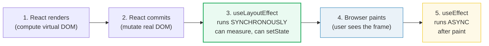
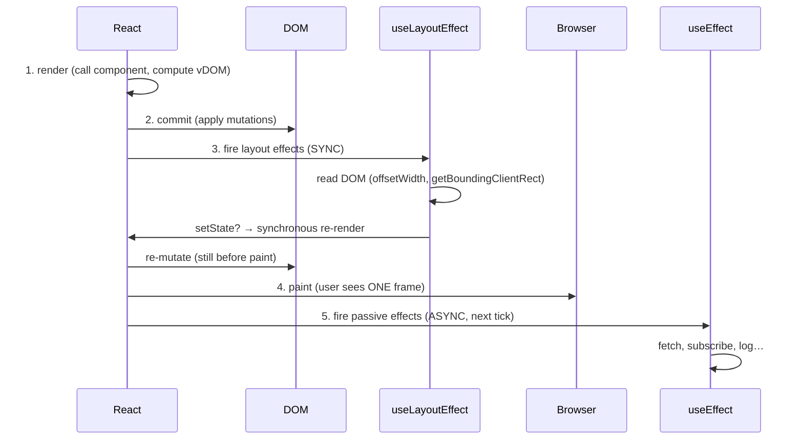
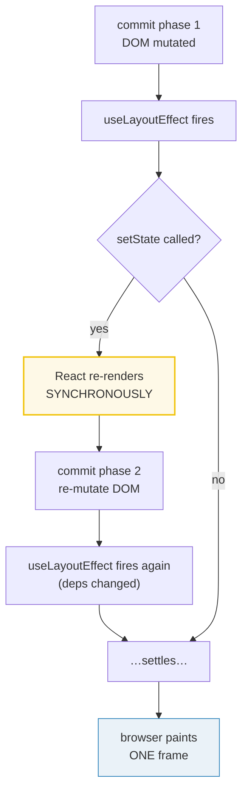
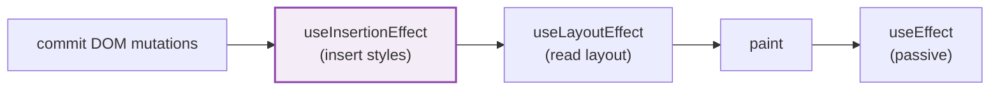

# useLayoutEffect — measure before paint

> **Companion demo:** [`use_layout_effect.html`](./use_layout_effect.html) — open in a browser.
> **React version:** 19.2.7 via ESM CDN + Babel standalone.

---

## 0. TL;DR — the one idea

> **The analogy:** `useEffect` is a "do later" sticky note — the browser
> paints first, THEN your effect runs. `useLayoutEffect` is a "do NOW" gate —
> it runs synchronously after DOM mutation but BEFORE paint, so any state it
> sets is part of the same frame the user sees. No flicker.



Both hooks share the signature `useXxxEffect(setup, deps)`. The ONLY difference
is **timing relative to paint**. `useLayoutEffect` blocks painting — use it
sparingly, only when you must measure/mutate the DOM before the user sees it.
Otherwise reach for `useEffect`.

---

## 1. How it works

### The render cycle, in order



The crucial property: steps 3–4 are **synchronous and atomic from the user's
perspective**. Anything `useLayoutEffect` mutates or re-renders is part of the
very first painted frame. With `useEffect`, the browser paints step 4 first,
THEN step 5 runs — so a `setState` in `useEffect` produces a visible intermediate
frame (a flicker).

### Measuring an element

```jsx
function LayoutEffectDemo() {
  const boxRef = React.useRef(null);
  const [size, setSize] = React.useState(100);
  const [width, setWidth] = React.useState(0);
  const [height, setHeight] = React.useState(0);

  // Measure BEFORE paint — the user never sees width=0.
  React.useLayoutEffect(() => {
    if (boxRef.current) {
      setWidth(boxRef.current.offsetWidth);
      setHeight(boxRef.current.offsetHeight);
    }
  }, [size]); // re-measure when size changes

  return <div ref={boxRef} style={{ width: size, height: size }}>…</div>;
}
```

If you swapped in `useEffect` here, the user would briefly see
`Measured: 0×0px` on the first frame before the measurement corrected it.
With `useLayoutEffect`, React reads `offsetWidth` synchronously after commit,
calls `setWidth`, re-renders, and paints the corrected measurement in one go.

### The cleanup contract

Identical to `useEffect`: if your `setup` returns a function, React calls it
before the next run and on unmount.

```jsx
React.useLayoutEffect(() => {
  const node = boxRef.current;
  // …measure, mutate, setState…
  return () => {
    // cleanup: runs synchronously BEFORE the next useLayoutEffect setup
  };
}, [size]);
```

---

## 2. Mechanism — synchronous vs asynchronous effects

### What "synchronous" really means

The browser's frame pipeline is roughly: **style → layout → paint → composite**.
`useLayoutEffect` fires after layout but before paint — it is allowed to read
layout-dependent values (`offsetWidth`, `scrollTop`, `getBoundingClientRect`)
and even force a synchronous reflow by mutating the DOM. The browser defers
painting until all layout effects have settled.

`useEffect` is scheduled on a **macrotask after paint** (a "passive" effect).
By the time it runs, the user has already seen the committed frame. React keeps
it async so effects can't block painting — this is what makes the UI feel fast.

### When `useLayoutEffect` calls `setState`



React does NOT paint between commit phase 1 and the settled state. That's why
the user never sees the intermediate render — it all collapses into one frame.

**Warning:** if your `setState` always changes state (infinite loop), React
will throw `"Maximum update depth exceeded"` after ~50 synchronous re-renders.
Guard with proper deps and conditional updates.

### SSR gotcha

On the server there is no DOM. `useLayoutEffect` neither runs nor matters, but
React prints a warning:

```
Warning: useLayoutEffect does nothing on the server…
```

Common shim — `useIsomorphicLayoutEffect`:

```jsx
const useIsomorphicLayoutEffect =
  typeof window !== 'undefined' ? React.useLayoutEffect : React.useEffect;
```

---

## 3. useLayoutEffect vs useEffect — when to use which

| Criterion | `useEffect` | `useLayoutEffect` |
|-----------|-------------|-------------------|
| **Timing** | after paint (async) | before paint (sync) |
| **Blocks paint?** | no | **yes** |
| **Reads DOM measurement?** | yes, but user may see stale value first | yes, and the user never sees the stale value |
| **`setState` inside it** | triggers a second paint (flicker) | re-renders before first paint (no flicker) |
| **Typical use** | data fetching, subscriptions, logging, analytics | measuring size/position, scroll anchoring, tooltip positioning, preventing flicker |
| **SSR-safe?** | yes | warns on server — needs `useIsomorphicLayoutEffect` shim |
| **Cost** | cheap (deferred) | expensive (blocks paint) |
| **Default choice?** | **yes — always start here** | only when `useEffect` causes visible flicker |

### The decision rule

> Start with `useEffect`. If you can SEE a flicker / wrong intermediate frame
> (e.g. a tooltip jumps into position, an animation starts from 0, the scroll
> resets before settling), switch to `useLayoutEffect`. Otherwise stay with
> `useEffect`.

---

## 4. useInsertionEffect (React 18+) — for CSS-in-JS libraries

React 18 introduced a third effect hook with even earlier timing:



| Hook | Fires | Reads DOM? | Use case |
|------|-------|-----------|----------|
| `useInsertionEffect` | before layout effects, before any read | **no** — don't read layout here | CSS-in-JS libraries (styled-components, emotion) insert `<style>` tags before measurement |
| `useLayoutEffect` | after insertion, before paint | yes — measure, mutate, setState | DOM measurement, flicker prevention |
| `useEffect` | after paint, async | yes | everything non-blocking |

`useInsertionEffect` exists so CSS-in-JS libraries can inject styles
**synchronously before any `useLayoutEffect` reads layout** — otherwise
measurement would happen against unstyled DOM. **You almost never need it in
application code.** Reach for it only if you're building a CSS-in-JS engine.

---

## Killer Gotchas

| Trap | Symptom | Fix |
|------|---------|-----|
| **Using `useLayoutEffect` for everything** | UI feels janky, paint stalls, frames dropped | Default to `useEffect`. Only switch when you actually SEE a flicker that layout-effect fixes |
| **SSR warning noise** | `Warning: useLayoutEffect does nothing on the server…` | Use `useIsomorphicLayoutEffect = typeof window !== 'undefined' ? useLayoutEffect : useEffect` |
| **Infinite loop with `setState`** | `Maximum update depth exceeded` crash | Guard with proper deps; ensure `setState` converges (new state eventually equals old) |
| **Expensive work inside it** | main thread blocked, input lag | Move non-layout work to `useEffect`; keep `useLayoutEffect` to measurement + cheap state updates |
| **Reading layout in `useEffect` and expecting no flicker** | tooltip "jumps", scroll "snaps", animation starts from wrong base value | That's literally what `useLayoutEffect` is for — switch the hook |
| **Forgetting the dependency array** | effect runs after EVERY render (and re-renders if it calls `setState`) | Pass the exact deps that should trigger re-measurement, e.g. `[size]` |
| **Reading layout with `useInsertionEffect`** | wrong measurements / warnings | `useInsertionEffect` runs before layout — don't read `offsetWidth` there; use `useLayoutEffect` |
| **Calling `setState` conditionally based on a stale ref** | layout effect sometimes skips the update | Read the ref fresh inside the effect; compare to current state and update if changed |

### Cheat sheet

```jsx
// Declare — same signature as useEffect
React.useLayoutEffect(() => {
  // read layout (runs after commit, BEFORE paint)
  if (ref.current) {
    const { width, height } = ref.current.getBoundingClientRect();
    setSize({ width, height });
  }
  return () => {
    // cleanup — runs before the next run AND on unmount
  };
}, [trigger]); // re-run when `trigger` changes

// SSR-safe shim
const useIsomorphicLayoutEffect =
  typeof window !== 'undefined' ? React.useLayoutEffect : React.useEffect;

// Decision tree
// 1. Does the effect read DOM measurements?        → maybe useLayoutEffect
// 2. Does useEffect cause a visible flicker?       → YES → useLayoutEffect
// 3. Otherwise                                     → useEffect
```

---

## 🔗 Cross-references

- [use_ref_dom](./use_ref_dom.html) — `useRef` is the read handle that `useLayoutEffect` dereferences to read layout; the two hooks are the canonical "measure and react" pair
- [custom_hooks](./custom_hooks.html) — extract the measure + `setState` dance into a `useElementSize()` custom hook that hides the layout-effect detail
- [frontend/react: useEffect & lists](../frontend/react/react_effects_lists.html) — the `useEffect` sibling: same signature, async timing; read this first
- [use_context](./use_context.html) — `useLayoutEffect` cleanup still respects the component tree; Context consumers fire layout effects bottom-up
- [use_memo_callback](./use_memo_callback.html) — `useCallback` keeps the deps of a layout effect stable, avoiding re-measure churn

---

## Sources

1. **React Docs — useLayoutEffect**: https://react.dev/reference/react/useLayoutEffect (fires synchronously after DOM mutation, before paint; when to prefer it)
2. **React Docs — useEffect**: https://react.dev/reference/react/useEffect (the sibling; runs after paint as a passive effect)
3. **React Docs — useInsertionEffect**: https://react.dev/reference/react/useInsertionEffect (React 18+; CSS-in-JS libraries; runs before layout effects)
4. **Kent C. Dodds — useLayoutEffect vs useEffect**: https://kentcdodds.com/blog/useeffect-vs-uselayouteffect (the canonical "flicker" demo and decision rule)
5. **React 19 release notes**: https://react.dev/blog/2024/12/05/react-19 (effect timing unchanged from React 18; both hooks stable in 19.2.7)
