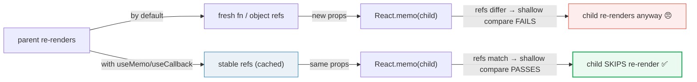
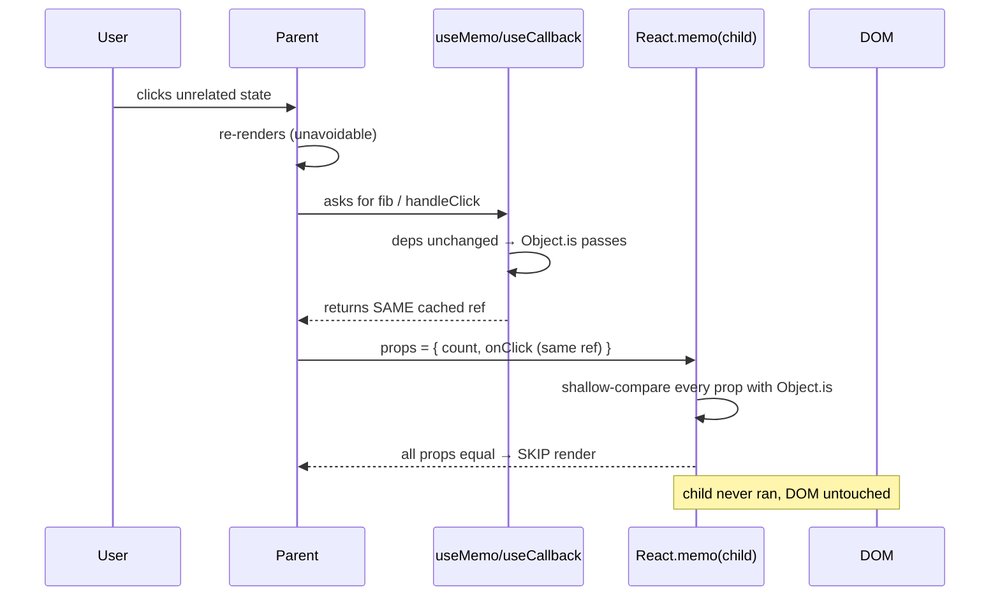
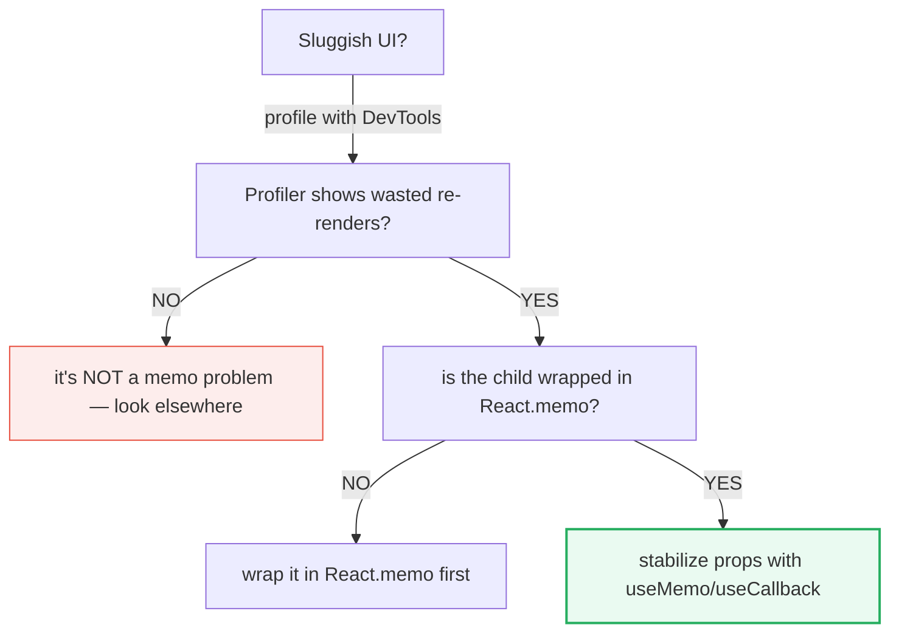

# useMemo & useCallback — caching values & functions

> **Companion demo:** [`use_memo_callback.html`](./use_memo_callback.html) — open in a browser.
> **React version:** 19.2.7 via ESM CDN + Babel standalone.

---

## 0. TL;DR — the one idea

> **The analogy:** every render is a photocopier. By default it prints fresh
> copies of every function and object — even ones nobody changed. `useMemo`
> stamps "do not reprint" on a *value*; `useCallback` stamps it on a *function*.
> They exist for one job: keeping references **stable** so a memoized child
> actually skips the re-render.



`useMemo(factory, deps)` caches the **result** of `factory()`. `useCallback(fn, deps)`
caches the **function reference** itself — it is sugar for
`useMemo(() => fn, deps)`. Both recompute/recreate only when a value in `deps`
fails a referential (`Object.is`) comparison. Neither stops the *parent* from
re-rendering; they only keep references stable so memoized *children* can skip.

---

## 1. How it works

### The two signatures

```javascript
const fib = React.useMemo(() => slowFib(count), [count]);           // caches a VALUE
const handleClick = React.useCallback(() => setOther(o => o + 1), []); // caches a FUNCTION
```

| Hook | Caches | Equivalent to | Recomputes/recreates when |
|------|--------|---------------|---------------------------|
| `useMemo(factory, deps)` | the **value** returned by `factory()` | — | a `deps` entry fails `Object.is` |
| `useCallback(fn, deps)` | the **function reference** | `useMemo(() => fn, deps)` | a `deps` entry fails `Object.is` |

### The demo, annotated

```javascript
// Deliberately expensive — O(2^n) naive recursion.
function slowFib(n) {
  if (n <= 1) return n;
  return slowFib(n - 1) + slowFib(n - 2);
}

// A child wrapped in React.memo shallow-compares its props.
const MemoChild = React.memo(function Child(props) {
  return <button onClick={props.onClick}>Clicked: {props.count}</button>;
});

function MemoDemo() {
  const [count, setCount] = React.useState(1);
  const [other, setOther] = React.useState(0);

  // fib recomputes ONLY when count changes — clicking other+1 reuses the cache.
  const fib = React.useMemo(() => slowFib(count), [count]);

  // handleClick is the SAME function instance on every render (empty deps).
  // Without useCallback, MemoChild re-renders on every parent render.
  const handleClick = React.useCallback(() => {
    setOther(o => o + 1);
  }, []);

  return <MemoChild count={other} onClick={handleClick} />;
}
```

### The dependency check

On every render React compares each `deps[i]` to the previous render's value
with `Object.is`. If **all** are the same, it returns the cached value/function.
If **any** differs, it recomputes.

```javascript
Object.is(prevCount, nextCount)  // true  → reuse cached fib
Object.is(prevCount, nextCount)  // false → recompute fib, store new cache
```

---

## 2. Mechanism — referential equality + React.memo



**Why this matters:** `React.memo(Component)` does a **shallow** prop compare
(`Object.is` on each prop). It can only skip a re-render when **every** prop is
referentially identical to last time. Primitives (`number`, `string`) compare by
value and are naturally stable. But **functions and objects are new references
on every render** — so a memoized child with an inline `onClick={() => ...}`
prop *always* re-renders. `useCallback` fixes functions; `useMemo` fixes objects
and expensive values. They are the **companion** to `React.memo`, not a
replacement for it.

```javascript
// React.memo alone is useless here — onClick is a fresh fn every render:
<MemoizedList items={items} onClick={() => doThing(id)} />

// useCallback makes onClick stable so the memo can actually short-circuit:
const handleClick = React.useCallback(() => doThing(id), [id]);
<MemoizedList items={items} onClick={handleClick} />
```

---

## 3. When to use vs when NOT to

`useMemo`/`useCallback` are **performance** tools, not correctness tools. The
component works identically without them — just maybe slower. Adding them
everywhere is a well-known anti-pattern: each call costs a deps array
comparison + cache storage on every render, which can outweigh the re-render it
"saved". Reach for them only after measuring a real problem.

| Situation | Use them? | Why |
|-----------|-----------|-----|
| A computation is genuinely expensive (sort/filter a big list, heavy math) | ✅ `useMemo` | recompute cost > cache cost |
| You pass a function/object to a `React.memo` child | ✅ `useCallback`/`useMemo` | stable refs let memo skip |
| The value is used as a dependency of another hook | ✅ `useMemo` | keeps the downstream hook stable |
| Primitive state, cheap inline functions in a leaf component | ❌ | cache overhead > savings |
| "Just in case" on every variable | ❌ | premature memoization — measure first |
| The child is NOT memoized (`React.memo`/`PureComponent`) | ❌ mostly | stable props don't help a non-memo child |

### The measurement rule

Open the **React DevTools Profiler**, record an interaction, and look for
components that re-rendered but whose props didn't actually change. *Those* are
the candidates. Don't memoize blind.



---

## 4. useMemo vs useCallback

| Criterion | `useMemo` | `useCallback` |
|-----------|-----------|---------------|
| Returns | the **value** from `factory()` | the **function** itself |
| Use when | caching a computed result or a stable **object/array** | caching a **function reference** to pass as a prop |
| Signature | `useMemo(() => x, deps)` | `useCallback(fn, deps)` |
| Relationship | the general form | `useCallback(fn, deps)` ≡ `useMemo(() => fn, deps)` |
| Typical target | expensive calc, derived object/array literal | event handler passed to memoized child |

> **Mnemonic:** `useMemo` memoizes the *answer*; `useCallback` memoizes the
> *ability to answer* (the function pointer).

---

## Killer Gotchas

| Trap | Symptom | Fix |
|------|---------|-----|
| **Memoizing without `React.memo`** | Child still re-renders, hook "did nothing" | Wrap the child in `React.memo` — stable props only help a memoized child |
| **Object/array literal as a prop** | Memoized child re-renders anyway | Wrap the literal in `useMemo(() => ({a, b}), [a, b])` — `{}` is a new ref every render |
| **Lying deps (omitting a used value)** | Stale value used inside the cached fn | Include EVERY value the fn reads, or use `eslint-plugin-react-hooks` exhaustive-deps |
| **`[]` deps on a handler that closes over state** | Handler sees stale state forever | Either add the state to deps, or use the functional updater `setX(x => ...)` |
| **Memoizing cheap values** | App gets slower, not faster | Cache overhead > savings — only memoize measured-expensive work |
| **Treating it as correctness** | "It works with useMemo, breaks without" | That's a bug elsewhere (stale closure / dep) — memoization is performance-only |
| **`Object.is` vs `===`** | `NaN`/`+0`/`-0` edge surprises | `Object.is(NaN, NaN)` is `true` (unlike `===`); memo deps use `Object.is` |
| **Forgetting `dispatch` is already stable** | Pointless `useCallback` around a `dispatch` | `dispatch` from `useReducer` and `setState` are stable by default — never need wrapping |

### Cheat sheet

```javascript
// Cache an expensive value — recompute only when `data` changes
const sorted = React.useMemo(() => heavySort(data), [data]);

// Cache a function reference — stable across renders
const onSelect = React.useCallback((id) => setActive(id), []);

// Cache an object/array literal so a memoized child skips
const style = React.useMemo(() => ({ color: theme.fg }), [theme.fg]);

// Pattern: React.memo child + stable props = skip re-render
const Row = React.memo(function Row({ item, onSelect }) { /* ... */ });
<Row item={item} onSelect={onSelect} />   // both props stable → Row skips

// Don't memoize primitives or leaf inline fns — measure first with the Profiler.
```

---

## 🔗 Cross-references

- [frontend/react: State & Hooks (useState)](../frontend/react/react_state_hooks.html) — the re-render model these hooks optimize; start there if render cycles feel unclear
- [react_memo](./react_memo.html) — `React.memo` itself: the shallow prop compare that `useMemo`/`useCallback` exist to feed with stable references
- [re_render_profiling](./re_render_profiling.html) — React DevTools Profiler workflow: find the wasted re-renders BEFORE you memoize
- [custom_hooks](./custom_hooks.html) — wrap `useMemo` + `useCallback` into a custom hook to hide memoization from the call site
- [use_reducer](./use_reducer.html) — `dispatch` is already stable, so reducer-based state rarely needs `useCallback`

---

## Sources

1. **React Docs — useMemo**: https://react.dev/reference/react/useMemo (caching a calculation, 2024)
2. **React Docs — useCallback**: https://react.dev/reference/react/useCallback (caching a function definition, 2024)
3. **React Docs — memo**: https://react.dev/reference/react/memo (shallow prop comparison that requires stable references)
4. **React Docs — You Might Not Need an Effect / performance**: https://react.dev/learn/render-and-commit (when re-renders happen and what memoization can and cannot do)
5. **Kent C. Dodds — When to useMemo and useCallback**: https://kentcdodds.com/blog/usememo-and-usecallback (the "measure first" argument against premature memoization)
