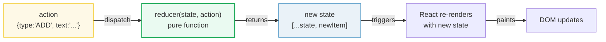
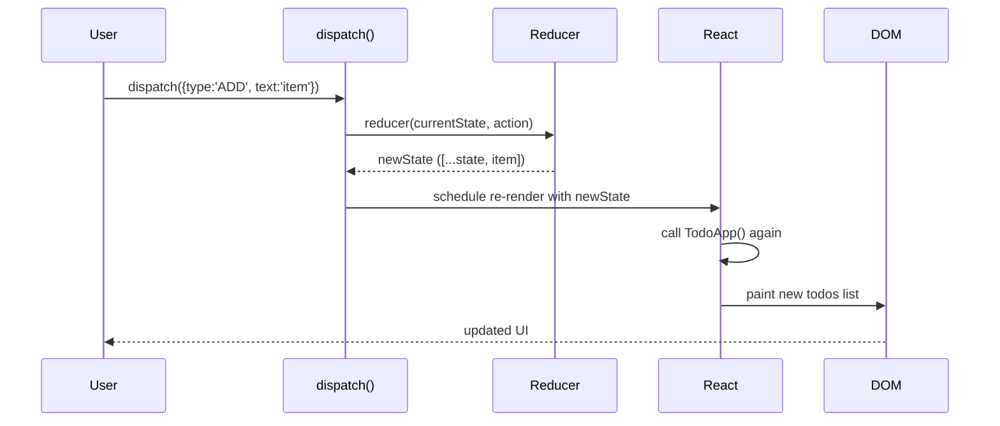

# useReducer — the dispatch model

> **Companion demo:** [`use_reducer.html`](./use_reducer.html) — open in a browser.
> **React version:** 19.2.7 via ESM CDN + Babel standalone.

---

## 0. TL;DR — the one idea

> **The analogy:** `useState` is a light switch — one value, one setter.
> `useReducer` is a gearbox — many actions, one pure function that decides
> the next state.



When state logic grows — multiple fields, conditional updates, action-driven
transitions — `N` independent setters become spaghetti. `useReducer`
centralizes all transitions in ONE pure function: `reducer(state, action) → newState`.

---

## 1. How it works

### The three pieces

```javascript
const [state, dispatch] = React.useReducer(reducer, initialState);
```

| Piece | Role | What it does |
|-------|------|-------------|
| `reducer` | Pure function `(state, action) → newState` | Contains ALL state transition logic in a switch statement |
| `dispatch` | Sends an action to the reducer | `dispatch({type: 'ADD', text: 'Learn React'})` — you never mutate state directly |
| `action` | Plain object `{type, ...payload}` | Describes WHAT happened, not HOW to update |

### The reducer contract

```javascript
function todoReducer(todos, action) {
  switch (action.type) {
    case 'ADD':
      return [...todos, { id: ++nextId, text: action.text, done: false }];
    case 'TOGGLE':
      return todos.map(t =>
        t.id === action.id ? { ...t, done: !t.done } : t
      );
    case 'DELETE':
      return todos.filter(t => t.id !== action.id);
    default:
      return todos;  // unknown action → return state unchanged
  }
}
```

**Rules:**
1. **Pure** — no side effects (no `fetch`, no `console.log`, no mutation).
2. **Immutable** — always return a NEW array/object, never `.push()` or `.splice()`.
3. **Default case** — return `state` unchanged for unknown actions.

### Dispatching actions

```javascript
function TodoApp() {
  const [todos, dispatch] = React.useReducer(todoReducer, []);

  return (
    <button onClick={() => dispatch({ type: 'ADD', text: 'New item' })}>
      Add
    </button>
  );
}
```

`dispatch` is **stable** — it never changes identity between renders (unlike
`setState` from `useState`, which also has a stable identity). This means you
can safely pass `dispatch` to child components without `useCallback`.

---

## 2. Mechanism — the render cycle



1. **Dispatch** calls the reducer with the **current** state and the action.
2. **Reducer** returns a new state object (immutable update).
3. **React** schedules a re-render with the new state.
4. The component function runs again, reading the new `todos[0]`.
5. React paints the new DOM.

### Batching

Multiple `dispatch` calls in the same event handler are **batched** — React
processes them sequentially through the reducer, then re-renders once:

```javascript
// Three dispatches, one re-render
dispatch({ type: 'ADD', text: 'A' });
dispatch({ type: 'ADD', text: 'B' });
dispatch({ type: 'TOGGLE', id: 1 });
// Reducer runs 3 times internally, React paints once
```

Each dispatch feeds the **output** of the previous reducer call as input to the
next — just like `setState(c => c + 1)` queues functional updates.

---

## 3. useState vs useReducer — when to use which

| Criterion | `useState` | `useReducer` |
|-----------|-----------|-------------|
| **State shape** | Single primitive or simple object | Complex, multi-field, nested |
| **Transitions** | Direct: `setX(newValue)` | Action-driven: `dispatch({type})` |
| **Number of update types** | 1-3 | 4+ |
| **Related fields** | Independent | Interdependent (one action updates multiple fields) |
| **Testing** | Test the component | Test the reducer in isolation (pure function!) |
| **Readability** | Simple at first, degrades | More boilerplate upfront, scales better |
| **`dispatch` stability** | `setState` is stable | `dispatch` is stable |

### The tipping point

```javascript
// useState: 3 setters, logic scattered across handlers
const [items, setItems] = useState([]);
const [filter, setFilter] = useState('all');
const [loading, setLoading] = useState(false);

function handleAdd(text) {
  setItems([...items, { text, done: false }]);
  setLoading(false);
}
function handleToggle(id) {
  setItems(items.map(i => i.id === id ? { ...i, done: !i.done } : i));
}

// useReducer: one dispatch, all logic in one place
const [state, dispatch] = useReducer(appReducer, { items: [], filter: 'all', loading: false });
// handleAdd → dispatch({type:'ADD', text})
// handleToggle → dispatch({type:'TOGGLE', id})
```

---

## 4. Advanced: lazy initialization

When the initial state is expensive to compute, pass an `init` function:

```javascript
function init() {
  return { items: JSON.parse(localStorage.getItem('todos') || '[]'), nextId: 0 };
}
const [state, dispatch] = useReducer(reducer, undefined, init);
```

The `init` function runs **once** on mount. React 19 also supports
`useReducer(reducer, initialArg)` where `initialArg` can be any value.

---

## 5. Advanced: reducer composition

For large state trees, compose reducers:

```javascript
function appReducer(state, action) {
  return {
    todos: todoReducer(state.todos, action),
    filter: filterReducer(state.filter, action),
  };
}
```

Each sub-reducer handles its own slice. Actions bubble to all sub-reducers.

---

## Killer Gotchas

| Trap | Symptom | Fix |
|------|---------|-----|
| **Mutating state** | UI doesn't update, or updates unpredictably | Always return new array/object: `[...state]`, `{...obj, key: val}`, `.map()`, `.filter()` |
| **No default case** | Unhandled action silently does nothing | Always add `default: return state` |
| **Side effects in reducer** | Stale data, double-fires in StrictMode | Reducer must be pure — move `fetch`, `localStorage`, timers to `useEffect` |
| **Forgetting payload** | `action.text` is `undefined` | Always include payload in dispatch: `dispatch({type:'ADD', text: input})` |
| **Action type typo** | Reducer falls through to default, no error | Use TypeScript or constants: `const ADD = 'ADD'` |
| **`Date.now()` for IDs** | Duplicate IDs if multiple dispatches in same ms | Use `++nextId` counter or `crypto.randomUUID()` |
| **Testing only the component** | Reducer bugs hidden behind DOM | Test the reducer function directly — it's a pure function! |

### Cheat sheet

```javascript
// Declare
const [state, dispatch] = useReducer(reducer, initialState);

// Reducer (pure, immutable)
function reducer(state, action) {
  switch (action.type) {
    case 'ADD':    return [...state, newItem];
    case 'UPDATE': return state.map(x => x.id === action.id ? {...x, ...action.changes} : x);
    case 'DELETE': return state.filter(x => x.id !== action.id);
    case 'RESET':  return initialState;
    default:       return state;
  }
}

// Dispatch (stable identity — safe to pass without useCallback)
dispatch({ type: 'ADD', payload: value });
```

---

## 🔗 Cross-references

- [frontend/react: State & Hooks (useState)](../frontend/react/react_state_hooks.html) — the single-setState model this evolves from; start there if `useReducer` feels unfamiliar
- [custom_hooks](./custom_hooks.html) — extract `useReducer` + context into a custom hook for reusable state machines
- [use_context](./use_context.html) — pass `dispatch` through Context to avoid prop-drilling
- [headless_ui](./headless_ui.html) — the state reducer pattern: expose `dispatch` to let consumers override transitions
- [react19_actions](./react19_actions.html) — React 19's `useActionState` builds on the reducer model for form submissions

---

## Sources

1. **React Docs — useReducer**: https://react.dev/reference/react/useReducer (extracting state logic, 2024)
2. **React Docs — useState vs useReducer**: https://react.dev/learn/extracting-state-logic-into-a-reducer (official migration guide)
3. **Kent C. Dodds — The State Reducer Pattern**: https://kentcdodds.com/blog/the-state-reducer-pattern (advanced headless UI pattern)
4. **React 19 release notes**: https://react.dev/blog/2024/12/05/react-19 (useReducer stability guarantees, batching)
