# useRef & DOM access — the non-reactive box

> **Companion demo:** [`use_ref_dom.html`](./use_ref_dom.html) — open in a browser.
> **React version:** 19.2.7 via ESM CDN + Babel standalone.

---

## 0. TL;DR — the one idea

> **The analogy:** `useState` is a value React *watches* — change it and React
> repaints. `useRef` is a box React *ignores* — change `.current` and React
> schedules nothing. The box still survives every re-render; React just never
> looks inside it to decide what to paint.

```mermaid
graph LR
    R["useRef(initialValue)<br/>returns { current: initialValue }"] -->|same object<br/>every render| P[".current persists<br/>across renders"]
    P -->|write X| W["ref.current = X<br/>NO re-render scheduled"]
    P -->|attach ref={myRef}| D["React assigns<br/>myRef.current = DOM node"]
    D -->|after mount| CMD["myRef.current.focus()<br/>.offsetWidth .scrollIntoView()"]
    style R fill:#eafaf1,stroke:#27ae60,stroke-width:2px
    style W fill:#fdedec,stroke:#e74c3c
    style D fill:#eaf2f8,stroke:#2980b9
    style CMD fill:#fef9e7,stroke:#f1c40f
```

`useRef` has two faces, both about reaching *outside* React's reactive loop:

1. **DOM access** — attach `ref={myRef}` to a JSX node; React assigns the live
   DOM element to `myRef.current` after mount. Then call `.focus()`, read
   `.offsetWidth`, `.scrollIntoView()` — imperative DOM APIs, no `querySelector`.
2. **Instance value** — store a timer id, a previous value, or any mutable value
   that should persist across renders but never *itself* trigger one.

---

## 1. How it works

### The declaration

```javascript
var inputRef = React.useRef(null);   // { current: null }
// ...later, after render:
// inputRef.current  ->  the <input> DOM node
```

`useRef(x)` returns an object `{ current: x }`. **The same object is returned on
every render** — its identity never changes. Mutating `ref.current` does not
notify React, so it schedules no re-render.

### Face 1 — DOM access

```jsx
function Demo() {
  var inputRef = React.useRef(null);
  var widthState = React.useState(0);

  return (
    <>
      <input ref={inputRef} />
      <button onClick={() => inputRef.current.focus()}>Focus</button>
      <button onClick={() => widthState[1](inputRef.current.offsetWidth)}>
        Measure
      </button>
    </>
  );
}
```

React reads the `ref` prop, and right **after the node mounts** it runs the
equivalent of `inputRef.current = node`. On unmount it sets `inputRef.current = null`.
You then call any DOM method on the node directly.

### Face 2 — instance value (a timer id)

```jsx
function Stopwatch() {
  var intervalRef = React.useRef(null);     // holds the setInterval id
  var elapsedState = React.useState(0);

  var start = () => {
    if (intervalRef.current) return;        // already running
    intervalRef.current = setInterval(() => {
      elapsedState[1](e => e + 1);          // state drives the display…
    }, 1000);
  };
  var stop = () => {
    clearInterval(intervalRef.current);     // …the ref holds the handle
    intervalRef.current = null;
  };

  React.useEffect(() => () => clearInterval(intervalRef.current), []);
  return <button onClick={start}>start</button>;
}
```

The interval id is "instance data" — it must survive re-renders (so we can clear
it later) but it must **not** trigger re-renders. That is exactly the job a ref
exists for. The *displayed* elapsed time uses `useState` because the screen does
need to repaint.

---

## 2. Mechanism — the render cycle

```mermaid
sequenceDiagram
    participant U as User
    participant H as click handler
    participant Ref as ref.current
    participant React as React
    participant DOM as DOM

    Note over Ref,DOM: MOUNT PHASE
    React->>DOM: create <input> node
    React->>Ref: inputRef.current = node
    Note over U,H: INTERACTION
    U->>H: click "Focus"
    H->>Ref: read inputRef.current (the node)
    Ref-->>H: <input> element
    H->>DOM: node.focus()
    DOM-->>U: input is focused
    Note over H,React: NO setState called → React re-renders nothing
```



Key contrast with `useState`:

| Step | `useState` path | `useRef` path |
|------|-----------------|---------------|
| write value | `setX(v)` queues an update | `ref.current = v` runs inline |
| React notified? | **yes** → schedules re-render | **no** → React ignores it |
| when is it read? | snapshotted into the render | read live, at access time |
| survives re-renders? | yes (it *is* the render) | yes (same object identity) |

Because the ref is read **live**, it always reflects the latest mutation — even
inside a stale closure. That is both its superpower and its biggest footgun.

---

## 3. useRef vs useState — when to use which

| Criterion | `useState` | `useRef` |
|-----------|-----------|----------|
| **Drives the UI?** | Yes — changing it repaints | No — React ignores it |
| **Value visible in JSX?** | Yes, snapshotted per render | Only if *you* read `.current` during render |
| **Triggers re-render on write?** | Yes | Never |
| **Identity stable across renders?** | value changes; setter is stable | the whole `{ current }` object is stable |
| **Typical use** | data the user sees | timers, DOM nodes, previous values, "is mounted" flags |
| **Read timing** | closed-over per render | always the latest value |

> **Rule of thumb:** if the value should change what's on the screen, use
> `useState`. If it shouldn't, use `useRef`. Reaching for a ref to "avoid a
> re-render" for data the UI actually displays is the #1 source of stale-screen bugs.

---

## 4. Advanced patterns

### `forwardRef` — forwarding a ref to a child's DOM node

Refs are not props; you cannot pass `ref` through to a child component directly.
`forwardRef` lets a parent grab a node owned by a child:

```jsx
var FancyInput = React.forwardRef(function (props, ref) {
  return <input ref={ref} className="fancy" placeholder={props.placeholder} />;
});

// parent:
var inputRef = React.useRef(null);
// ...
<FancyInput ref={inputRef} placeholder="type here" />
// inputRef.current -> the <input> inside FancyInput
```

> **React 19 note:** function components can now accept `ref` as an ordinary
> prop without `forwardRef` — but `forwardRef` remains supported and is still the
> documented way to expose a DOM node from a reusable component.

### `useImperativeHandle` — customizing what the ref exposes

Instead of handing the parent the raw DOM node, expose a curated API:

```jsx
var FancyInput = React.forwardRef(function (props, ref) {
  var innerRef = React.useRef(null);
  React.useImperativeHandle(ref, function () {
    return {
      focus: function () { innerRef.current.focus(); },
      clear: function () { innerRef.current.value = ''; }
    };
  });
  return <input ref={innerRef} />;
});
// parent calls inputRef.current.focus() / .clear() — never touches the node
```

### `useEffect` cleanup is still your job

Refs are **not** cleaned up automatically. If you stored a timer, an event
listener, or handed a node to a non-React library, tear it down in the effect's
return function — otherwise you leak across unmounts.

```jsx
React.useEffect(function () {
  return function () {
    if (intervalRef.current) clearInterval(intervalRef.current);
  };
}, []);
```

### Avoiding stale closures with a ref

Event handlers added **once** (e.g. `window.addEventListener`) close over the
state value from the render where they were attached. Storing that state in a ref
and reading `.current` inside the handler gives you the live value without
re-subscribing.

---

## Killer Gotchas

| Trap | Symptom | Fix |
|------|---------|-----|
| **Reading `ref.current` during the *first* render** | It's still `null` — React assigns the node *after* mount | Read it in an event handler or `useEffect`, never during initial render |
| **Using a ref for data the UI shows** | Screen looks frozen — mutation never repaints | Use `useState` for anything the user sees; refs are for off-screen instance data |
| **Expecting a re-render from `ref.current = x`** | UI never updates | That's by design — wrap the change in a `set` call if the screen must reflect it |
| **Forgetting cleanup** | Timers/listeners fire after unmount, memory leaks | Clear intervals and detach listeners in the `useEffect` return |
| **Mutating `ref.current` during render** | Unpredictable order, breaks concurrency | Only mutate refs in effects or event handlers — render must stay pure |
| **`ref` as a prop doesn't reach a child** | `childRef.current` stays `null` | Wrap the child in `forwardRef` (or pass a differently-named prop holding the ref) |
| **Stale closure over state** | Old value captured in a once-bound listener | Mirror the state into a ref, or add the state to the effect's dependency array |

### Cheat sheet

```javascript
// Declare (DOM node or instance value)
var inputRef  = React.useRef(null);   // DOM: attach with ref={inputRef}
var timerRef  = React.useRef(null);   // instance: store setInterval id
var prevRef   = React.useRef(0);      // instance: previous value

// DOM access — call any DOM method on the node
inputRef.current.focus();
var w = inputRef.current.offsetWidth;
inputRef.current.scrollIntoView();

// Instance value — mutate directly, NO re-render
timerRef.current = setInterval(tick, 1000);
clearInterval(timerRef.current);

// Previous value — effect runs after commit, so ref lags one render
React.useEffect(function () { prevRef.current = count; }, [count]);

// Forward to a child
var Child = React.forwardRef(function (props, ref) { return <input ref={ref} />; });
```

---

## 🔗 Cross-references

- [use_reducer](./use_reducer.html) — the reactive side: `dispatch` schedules re-renders; `useRef` is the escape hatch that skips them
- [frontend/react: State & Hooks (useState)](../frontend/react/react_state_hooks.html) — the reactive model refs opt out of; start there if `useRef` feels backwards
- [forward_ref](./forward_ref.html) — passing a ref through to a child component's DOM node
- [use_layout_effect](./use_layout_effect.html) — read measured dimensions from a ref synchronously before paint (avoid layout flicker)
- [custom_hooks](./custom_hooks.html) — wrap `useRef` + `useEffect` into a `usePrevious` or `useInterval` custom hook

---

## Sources

1. **React Docs — useRef**: https://react.dev/reference/react/useRef (reference a value that's not needed for rendering, 2024)
2. **React Docs — Referencing Values with Refs**: https://react.dev/learn/referencing-values-with-refs (the mutable `.current` box, when to use vs state)
3. **React Docs — Manipulating the DOM with Refs**: https://react.dev/learn/manipulating-the-dom-with-refs (attaching `ref={...}`, focus/measure patterns)
4. **React Docs — useRef vs useState**: https://react.dev/learn/referencing-values-with-refs#differences-between-refs-and-state (refs do not trigger re-render)
