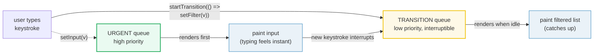
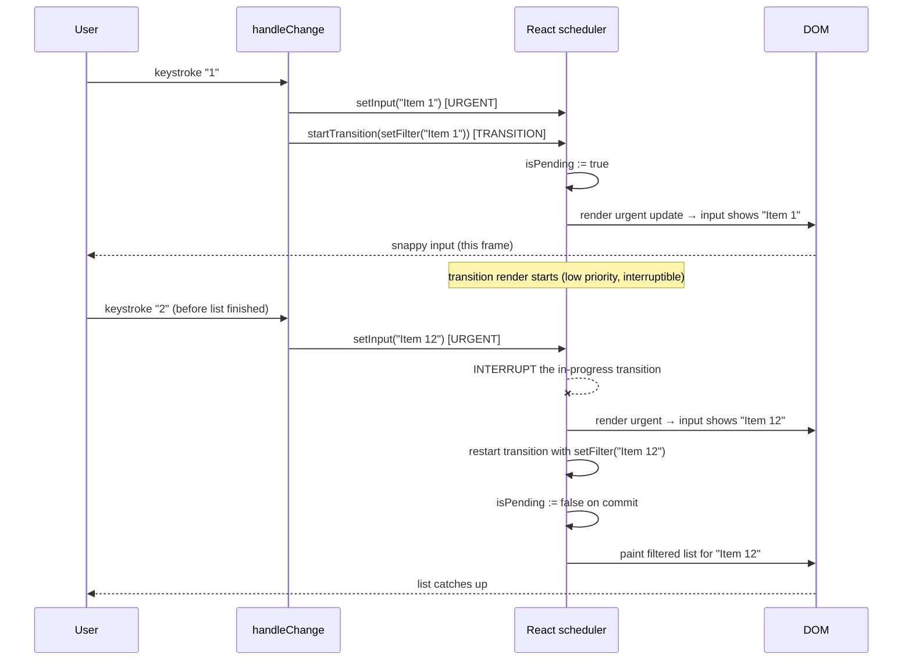

# useTransition — urgent vs non-urgent updates

> **Companion demo:** [`use_transition.html`](./use_transition.html) — open in a browser.
> **React version:** 19.2.7 via ESM CDN + Babel standalone.

---

## 0. TL;DR — the one idea

> **The analogy:** every state update used to jump the same queue — React had
> to finish rendering it before the browser could paint the next frame. That
> made typing feel frozen whenever the render was heavy. `useTransition` splits
> that one queue into **two**: an *urgent* tray (typing, clicks, scroll — must
> paint now) and a *non-urgent* tray (filtering, tab switches — can wait a few
> ms). The urgent tray is processed first and can **interrupt** work in the
> non-urgent tray.



`useTransition` returns a pair `[isPending, startTransition]`. Wrap the
expensive `setState` in `startTransition(fn)`; React keeps the current UI on
screen while it computes the update in the background. `isPending` is `true`
for as long as that background render is in flight — show a spinner.

```jsx
const [isPending, startTransition] = React.useTransition();

function handleChange(e) {
  setInputValue(e.target.value);          // urgent — paints now
  startTransition(() => {                 // non-urgent — deferred
    setSearchResults(expensiveSearch(e.target.value));
  });
}
```

---

## 1. How it works

### The two-queue mental model

```javascript
const [isPending, startTransition] = React.useTransition();
```

| Piece | Role | What it does |
|-------|------|-------------|
| `startTransition` | Scope marker | Every `setState` called **inside** its callback is scheduled at **transition priority** (low, interruptible) |
| `isPending` | Pending flag | `true` from the moment the transition is scheduled until its render commits; use it to show a spinner / dim the stale UI |
| urgent `setState` | Default | Any `setState` **outside** `startTransition` — high priority, must paint before the next frame |

### Splitting one interaction into urgent + non-urgent

The whole point is that **one user action** (a keystroke) produces **two
state updates at two priorities**:

```javascript
function Search() {
  const [input, setInput]   = React.useState('');   // urgent: what the box shows
  const [filter, setFilter] = React.useState('');   // non-urgent: what the list uses
  const [isPending, startTransition] = React.useTransition();

  function handleChange(e) {
    const v = e.target.value;
    setInput(v);                       // 1. urgent — input updates this frame
    startTransition(() => setFilter(v)); // 2. non-urgent — list updates when idle
  }

  const filtered = ALL_ITEMS.filter(it => it.includes(filter));
  // render <input value={input}/> (always current) + <ul>{filtered}</ul> (may lag)
}
```

While the transition is computing, `isPending` is `true` and React is still
showing the **old** list. The input — driven by urgent state — keeps updating
every keystroke. When the transition finishes, the list swaps to the new
filter result in one paint.

### The pending indicator

```jsx
return (
  <h2>Search {isPending && <Spinner />}</h2>
);
```

`isPending` is the **only** built-in way to know a transition is in flight —
there is no event, no promise. Read it during render and branch the UI.

---

## 2. Mechanism — the concurrent rendering model



1. **Schedule.** `setInput` goes on the urgent lane; `setFilter` (inside
   `startTransition`) goes on the transition lane. `isPending` flips `true`.
2. **Urgent first.** React renders the urgent update and paints — the input
   value is now correct, this frame.
3. **Transition render.** React begins rendering the new filter result at low
   priority. Crucially, **this render is interruptible**.
4. **Interruption.** If a new urgent update arrives mid-transition (another
   keystroke), React **discards** the half-finished transition render and
   restarts it from the latest state. The user never sees a stale intermediate.
5. **Commit.** When the transition render completes uninterrupted, React
   commits it to the DOM and sets `isPending := false`.

This is the heart of **concurrent React**: renders are no longer a single
synchronous, uninterruptible pass. React can start, pause, abandon, and
resume them. `useTransition` is the user-facing handle onto that machinery.

> **React 18 vs 19.** 18 introduced `useTransition` as an opt-in concurrent
> feature (the default render path was still synchronous unless you opted in).
> 19 keeps the exact same `useTransition` API but concurrent rendering is now
> the baseline — `useDeferredValue`, `Suspense`, and the new `use()` /
> Actions features all ride on the same interruptible scheduler.

---

## 3. useTransition vs useDeferredValue

Both defer work. The difference is **where you mark the deferral**.

| Criterion | `useTransition` | `useDeferredValue` |
|-----------|-----------------|--------------------|
| **Where you defer** | At the **producer** (the `setState` call site) | At the **consumer** (the value you read) |
| **What you control** | The update itself | A derived/deferred copy of a value |
| **Returns** | `[isPending, startTransition]` | a deferred value |
| **Pending flag?** | Yes — `isPending` | No — compare `value !== deferredValue` yourself |
| **Best when** | You own the event handler that triggers the update | You receive a value (e.g. a prop) and can't wrap its origin |
| **Typical use** | Tab switch, filter input you write | Debounce-expensive render of a prop you don't control |

```javascript
// useTransition — you own the update
const [isPending, startTransition] = useTransition();
function onChange(e) {
  setQuery(e.target.value);                       // urgent
  startTransition(() => setFilter(e.target.value)); // non-urgent
}

// useDeferredValue — you only read the value
const deferredQuery = useDeferredValue(query);    // lags behind query
const results = expensiveSearch(deferredQuery);
const isStale = query !== deferredQuery;          // hand-rolled pending flag
```

Rule of thumb: if you're inside the event handler that sets the value, use
`useTransition`. If the value arrives from above (a prop) or from a store you
can't instrument, use `useDeferredValue`.

---

## Killer Gotchas

| Trap | Symptom | Fix |
|------|---------|-----|
| **Wrapping urgent updates** | Typing/clicking feels frozen | Keep input, click, and scroll `setState` **outside** `startTransition`; wrap only the expensive downstream update |
| **Treating `startTransition` as async/await** | Code after it runs immediately, transition not done | `startTransition` is synchronous to call — the *render* is deferred. Don't `await` it; use `isPending` to gate UI |
| **Logging / fetching inside `startTransition`** | Side effects run, then get discarded on interrupt | `startTransition` scopes **priority**, not a transaction. Interrupted renders throw away work — put `fetch`/effects in `useEffect`, not in the transition callback |
| **Expecting `isPending` to always visibly flash** | For trivial work it may commit in one tick | `isPending` is still set for at least one render; for very fast work the flash is just brief. Track it with a ref if you must assert it (see the demo's `pending-witness`) |
| **Mutating the same state twice** | Urgent + transition updates to one state fight | Split into two states (urgent `input` + non-urgent `filter`) like the demo — one value, two priorities |
| **Using it to "debounce"** | You reimplement debounce badly | `useTransition` is priority-based, not time-based. Use `useDeferredValue` or a real debounce for time-based delays |
| **Forgetting the pending UI** | UI looks frozen with no feedback | Always branch on `isPending` (spinner, dim, "Filtering…") so the user knows work is pending |
| **`startTransition` outside React** | Error or no deferral | Call it inside React-rendered handlers/effects; it relies on React's scheduler being active |

### Cheat sheet

```javascript
// Declare
const [isPending, startTransition] = React.useTransition();

// Split one interaction into urgent + non-urgent
function handleChange(e) {
  setInput(e.target.value);                       // urgent — paints now
  startTransition(() => setFilter(e.target.value)); // non-urgent — deferred
}

// Show pending state
{isPending && <Spinner />}

// Dim the stale content while the new content computes
<div style={{ opacity: isPending ? 0.7 : 1 }}>{list}</div>

// DON'T: wrap the input's own state
startTransition(() => setInput(e.target.value));  // ❌ typing feels frozen
// DO: wrap only the expensive downstream state
startTransition(() => setFilter(e.target.value)); // ✅ list defers, input is snappy
```

---

## 🔗 Cross-references

- [use_deferred_value](./use_deferred_value.html) — the read-side twin: defer at the consumption site when you don't control the `setState`
- [suspense_patterns](./suspense_patterns.html) — `useTransition` coordinates with Suspense; transitions can suspend and show fallbacks without blocking the urgent UI
- [frontend/react: State & Hooks](../frontend/react/react_state_hooks.html) — the synchronous `useState` model whose single-queue render this makes concurrent; start there if priority scheduling feels unfamiliar

---

## Sources

1. **React Docs — `useTransition`**: https://react.dev/reference/react/useTransition (API reference, transition priority & `isPending`)
2. **React Docs — You Might Not Need an Effect (deferring with transitions)**: https://react.dev/learn/you-might-not-need-an-effect#adjusting-some-state-when-a-prop-changes (when to reach for a transition)
3. **React Blog — React v18.0 (Concurrent Features)**: https://react.dev/blog/2022/03/29/react-v18 (introduction of `useTransition` and the interruptible scheduler)
4. **React Blog — React v19**: https://react.dev/blog/2024/12/05/react-19 (concurrent rendering as the baseline; `useTransition` semantics unchanged)
