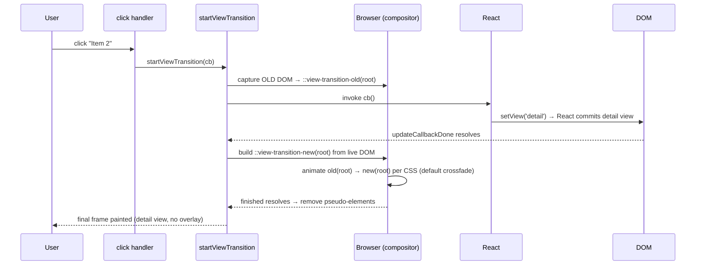

# View Transitions API — crossfade between DOM states

> **Companion demo:** [`view_transitions.html`](./view_transitions.html) — open in a browser.
> **Not a React API:** `document.startViewTransition()` is a **browser** API (W3C). React just happens to be what mutates the DOM inside its callback.

---

## 0. TL;DR — the one idea

> **The analogy:** a film dissolve. The director yells *freeze the old frame*, the
> actors move to their new marks (React re-renders), then the film stock
> **crossfades** the frozen old frame into the live new scene. You wrote zero
> animation code — you only wrapped the state update in one function call.

```mermaid
graph LR
    C["click handler calls<br/>navigateTo('detail')"] -->|"document.<br/>startViewTransition(cb)"| S["1. snapshot OLD DOM<br/>(browser screenshot)"]
    S -->|"cb() runs synchronously"| R["2. React setState fires<br/>→ re-render commits NEW DOM"]
    R -->|updateCallbackDone resolves| X["3. crossfade<br/>OLD screenshot → NEW DOM"]
    X -->|finished resolves| P["paint complete<br/>pseudo-elements removed"]
    style S fill:#fef9e7,stroke:#f1c40f,stroke-width:2px
    style R fill:#eaf2f8,stroke:#2980b9,stroke-width:2px
    style X fill:#eafaf1,stroke:#27ae60,stroke-width:2px
    style P fill:#eafaf1,stroke:#27ae60
```



`document.startViewTransition(callback)` snapshots the page, runs `callback`
(where your `setState` lives — React re-renders inside it), then crossfades the
old screenshot into the new live DOM. Tag an element with
`view-transition-name: hero` and the browser morphs that element between its old
and new position/size automatically — a shared-element (hero) animation with no
FLIP math.

```jsx
function navigateTo(newView) {
  // Feature-detect: fall back to plain setState where unsupported
  if (document.startViewTransition) {
    document.startViewTransition(function () {
      setView(newView);   // React re-renders INSIDE the transition callback
    });
  } else {
    setView(newView);
  }
}
```

---

## 1. How it works

### The three-phase lifecycle

```javascript
document.startViewTransition(function () {
  setView('detail');   // ← your DOM mutation lives here
});
```

| Phase | What happens | Who runs it |
|-------|-------------|-------------|
| **1. Snapshot** | Browser captures the current rendered DOM as a set of pseudo-element images (`::view-transition-old(*)`) | the browser |
| **2. Update** | Your callback runs synchronously → React commits the new state to the real DOM | React (inside the callback) |
| **3. Crossfade** | Browser builds `::view-transition-new(*)` from the live DOM and animates old ↔ new per your CSS (default: a crossfade) | the browser |

The callback may **return a Promise**. If it does, the browser waits for it to
resolve before snapshotting the new state — useful when the new view needs async
data before it's "ready" to be frozen.

### Wrapping a React state update

The entire React integration is "put the `setState` inside the callback":

```javascript
function ViewTransitionDemo() {
  const [view, setView] = React.useState('list');

  function navigateTo(next) {
    if (!document.startViewTransition) { setView(next); return; }   // feature-detect
    document.startViewTransition(() => setView(next));              // the wrap
  }
  // …render list view or detail view based on `view`…
}
```

Click an item → `navigateTo('detail')` → browser snapshots the list, React swaps
to the detail view, browser crossfades. The gold-check in the companion demo
proves the state update commits on every navigation (list → item-2 → detail →
back → list).

---

## 2. Mechanism — snapshot → DOM update → crossfade



1. **Capture.** The browser takes a pixel snapshot of the current page and parks
   it in the `::view-transition-old(root)` pseudo-element tree (kept on top of
   the live DOM, like an overlay).
2. **Update.** Your callback runs. React's `setState` schedules a render; because
   the call originates inside a user event, React flushes the commit
   synchronously, so the real DOM now reflects the new view.
3. **Re-snapshot.** The browser builds `::view-transition-new(root)` from the
   *live* DOM (now the detail view). `updateCallbackDone` resolves.
4. **Animate.** The browser runs whatever CSS animation you declared on the
   `::view-transition-old/new` pseudo-elements. With no custom CSS, that's a
   built-in crossfade. While animating, the old snapshot sits on top and fades
   out as the live DOM fades in underneath.
5. **Finish.** When the animation ends (`finished` resolves), the pseudo-element
   tree is torn down and the user is left looking at the plain live DOM.

> **Named elements override per-element.** `::view-transition-old(root)` controls
> the whole-page fade. If you tagged an element with
> `view-transition-name: hero`, the browser generates a *separate*
> `::view-transition-group(hero)` / `old(hero)` / `new(hero)` triplet and morphs
> that element's position/size independently of the root crossfade.

---

## 3. Named elements — hero (shared-element) transitions

The crossfade is the default. The magic is **named elements**: give the same
`view-transition-name` to an element in the old view *and* an element in the new
view, and the browser morphs one into the other (position, size, and content)
instead of crossfading them.

```jsx
// list view: each thumbnail is a candidate hero


// detail view: the big image is the hero target

```

Rules of the morph:

- The name must be **unique per snapshot** — two live elements with the same
  `view-transition-name` at capture time throws and aborts the transition. That's
  why the list sets its hero name to `'none'` once an item is selected.
- The browser interpolates the element's `border-radius`, position, and size
  between old and new automatically — this is the FLIP technique done for you.
- You can still customise the morph via `::view-transition-old(hero-x)` /
  `::view-transition-new(hero-x)` (e.g. blend modes, custom easing).

---

## 4. Custom animations via pseudo-elements

The browser exposes the two frames as pseudo-elements. Override their animation
in plain CSS to replace the default crossfade with anything `@keyframes` can
express:

```css
/* The companion demo uses exactly this: an explicit 0.25s fade */
@keyframes vt-fade-out { from { opacity: 1; } to { opacity: 0; } }
@keyframes vt-fade-in  { from { opacity: 0; } to { opacity: 1; } }
::view-transition-old(root) { animation: vt-fade-out 0.25s ease forwards; }
::view-transition-new(root) { animation: vt-fade-in  0.25s ease forwards; }
```

Swap the keyframes for a slide, zoom, or directional reveal:

```css
/* slide + fade, e.g. for "forward" route navigation */
::view-transition-old(root) { animation: slide-out-to-left 0.3s ease both; }
::view-transition-new(root) { animation: slide-in-from-right 0.3s ease both; }
```

Pseudo-element tree the browser generates (one `group`/`old`/`new` per named
element, plus `root`):

```
::view-transition              ← the overlay container
├─ ::view-transition-old(root) / ::view-transition-new(root)
├─ ::view-transition-group(hero)
│  ├─ ::view-transition-old(hero)
│  └─ ::view-transition-new(hero)
```

---

## 5. Feature detection & browser support

Always feature-detect. The API is recent and Firefox only shipped it in 144.

```javascript
if (document.startViewTransition) {
  document.startViewTransition(() => setView(next));
} else {
  setView(next);   // graceful degradation: instant swap, no animation
}
```

| Browser | Support | Notes |
|---------|---------|-------|
| Chrome / Edge | **111+** (Mar 2023) | same-document transitions landed first |
| Safari | **18+** (Sept 2024) | macOS Sequoia / iOS 18.1 |
| Firefox | **144+** (2025) | shipped as part of Interop 2025; older Firefox has no API — must fall back |
| Status | **Baseline Newly Available** (Oct 2025) | same-document view transitions |

The DOM result is **identical** with or without the transition — the API only
adds a visual layer on top. So feature detection is purely about whether you get
the animation, never about correctness. That's exactly what the demo's gold-check
relies on: it asserts DOM state, which is the same either way.

---

## 6. SPA route transitions

View Transitions shine for route-to-route navigation in an SPA, where a full
page reload would otherwise produce a hard cut. Wrap your router's `navigate()`
call:

```jsx
function navigateWithTransition(to) {
  if (!document.startViewTransition) { router.navigate(to); return; }
  document.startViewTransition(() => router.navigate(to));
}
```

- **React Router / TanStack Router** — both work because navigation is just a
  state update under the hood; wrapping the call defers the route change into the
  callback.
- **Astro** does this for you with `<ClientRouter />` (same API, page-level) —
  see the cross-link below.
- **Directional variants** — set `transition-name` types
  (`e.g. document.documentElement.dataset.transition = 'forward'`) to pick
  different keyframes for forward vs. back navigation.

---

## Killer Gotchas

| Trap | Symptom | Fix |
|------|---------|-----|
| **Two live elements share a `view-transition-name`** | Transition **throws** `TypeError` and aborts (no animation, DOM still updates) | Ensure the name is unique at capture time; set unselected items to `view-transition-name: none` |
| **Forgetting feature detection** | Blank/frozen UI or error on Firefox <144 | Always guard `if (document.startViewTransition)` and fall back to plain `setState` |
| **Async work *inside* the callback** | Snapshot taken before data arrives → crossfades into a loading spinner, then pops to content | Return a Promise from the callback so the browser waits; or fetch *before* calling `startViewTransition` |
| **React 18 batching defers the commit** | Old+new snapshots look identical → no visible transition | The callback's `setState` in a user event flushes synchronously; if you batch across ticks, the new DOM isn't ready at snapshot time. Keep the state change inside the sync callback |
| **View Transitions + Strict Mode double-invoke** | Callback runs twice in dev → double `setState` | Harmless for idempotent state updates; be aware the snapshot still happens once |
| **Heavy transition blocks the main thread** | Snapshot/crossfade stutters because the new render is expensive | The new DOM must paint *before* the crossfade starts — pair with `useTransition`/`useDeferredValue` to keep the urgent frame cheap, or suspend inside the callback |
| **`::view-transition-*` in scoped/CSS-in-JS** | Custom animation never applies | These pseudo-elements live on a top-level overlay, not inside your component's shadow root — declare them in a global stylesheet, not scoped CSS |
| **Expecting the gold-check to "see" the animation** | Tests pass/fail on DOM state, not pixels | The transition is a visual overlay; assert DOM state (which is identical with/without the API) and verify the look manually |

### Cheat sheet

```javascript
// 1. Wrap a state update — default crossfade
if (document.startViewTransition) {
  document.startViewTransition(() => setView('detail'));
} else {
  setView('detail');                       // graceful fallback
}

// 2. Hero / shared element — same name on old + new element, unique per snapshot

// then in the target view:


// 3. Customise the fade (global CSS, not scoped)
::view-transition-old(root) { animation: vt-fade-out 0.25s ease forwards; }
::view-transition-new(root) { animation: vt-fade-in  0.25s ease forwards; }

// 4. Async data before snapshotting — return a promise from the callback
document.startViewTransition(async () => {
  await fetchData(id);
  setSelected(id);                         // new DOM is "ready" → crossfade into it
});

// 5. SPA route change
document.startViewTransition(() => router.navigate(to));
```

---

## 🔗 Cross-references

- [astro_view_transitions](../frontend/astro/astro_view_transitions.html) — Astro wraps the *same* `document.startViewTransition` for MPA/page-level transitions via `<ClientRouter />`; this bundle is the pure-React, single-component equivalent
- [css_animations](./css_animations.html) — the FLIP technique and CSS `@keyframes` that View Transitions automate for you; reach for raw CSS animations when you need finer control than the pseudo-elements allow
- [framer_motion_core](./framer_motion_core.html) — when you need gesture-driven, physics-based, or layout animations *within* a single view (View Transitions only animate across a state/route change)
- [animation_orchestration](./animation_orchestration.html) — staggering, variants, and `AnimatePresence` exit animations; combine with View Transitions for coordinated enter/exit + page morphs
- [use_transition](./use_transition.html) — *different concept, confusingly similar name*: React's `useTransition` schedules urgent vs deferred **renders**; View Transitions schedule a **visual crossfade**. Pair them when the new view is expensive to render

---

## Sources

1. **MDN Web Docs — View Transition API**: https://developer.mozilla.org/en-US/docs/Web/API/View_Transition_API (API reference, `startViewTransition`, pseudo-element tree, named elements)
2. **Chrome for Developers — Smooth and simple transitions with the View Transitions API**: https://developer.chrome.com/docs/web-platform/view-transitions (same-document transitions, hero animations, feature detection)
3. **web.dev — Same-document view transitions are Baseline Newly available (Oct 2025)**: https://web.dev/blog/same-document-view-transitions-are-now-baseline-newly-available (Baseline status, cross-browser shipping)
4. **Chrome for Developers — View Transitions in 2025**: https://developer.chrome.com/blog/view-transitions-in-2025 (Firefox/Interop 2025, React integration notes)
