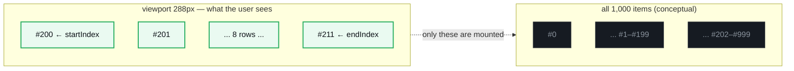
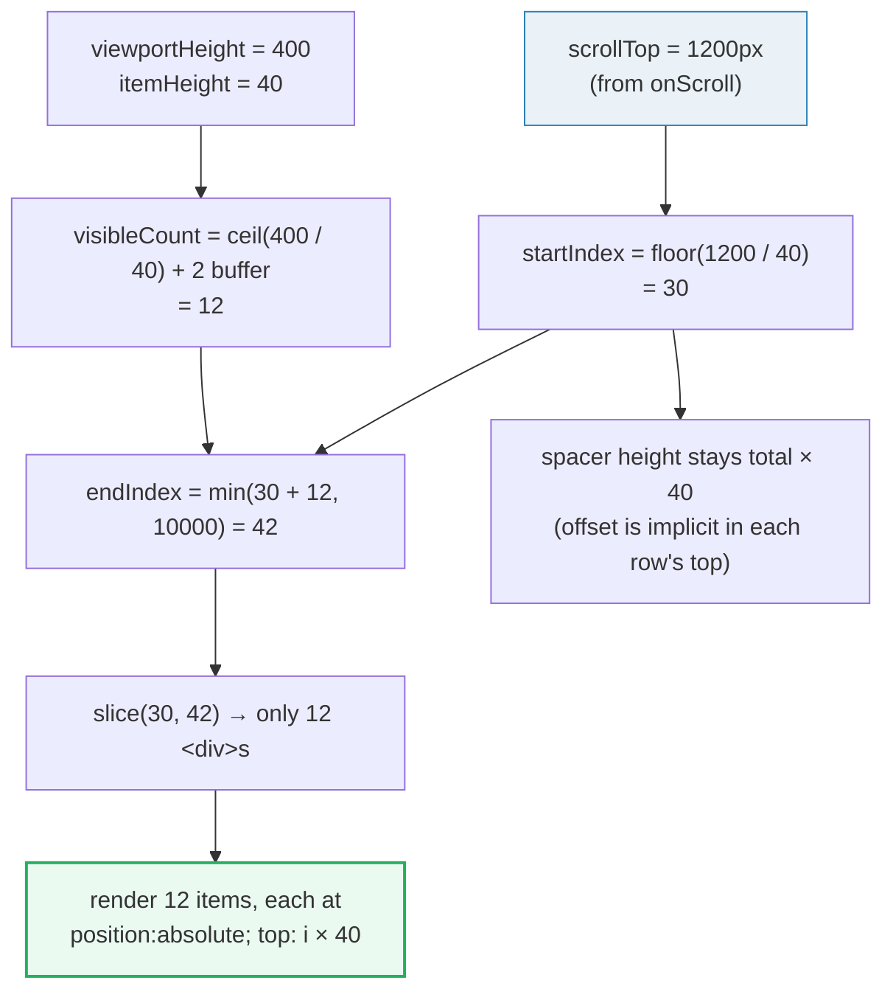

# Virtual Lists (Windowing)

> **Companion demo:** [`virtual_lists.html`](./virtual_lists.html) — open in a browser.
> It renders a 1,000-row list from scratch (no libraries) and the gold-check
> proves only ~12 DOM nodes exist at any time.

---

## 0. TL;DR — the one idea

A normal `items.map()` mounts **one DOM node per item**. Render 10,000 rows and
you get 10,000 nodes — the browser re-layouts all of them on every paint and
scrolling turns to jelly. **Virtualization (a.k.a. windowing)** renders only the
slice currently inside the scroll viewport: ~12 nodes whether you have 1,000 or
1,000,000 rows. **DOM cost becomes O(viewport), not O(data).**



The trick has two halves:

1. **A full-height spacer** (`height = total × itemHeight`) inside the scroll
   container, so the scrollbar is honest about how much data exists.
2. **Absolutely-positioned rows** placed at `top = i × itemHeight` — only the
   rows whose index falls in `[startIndex, endIndex)` are actually rendered.

---

## 1. How it works — the math

Everything is pure arithmetic on `scrollTop`. No scan over the data, no DOM
measurement (for fixed-height rows):



| variable | formula | notes |
|---|---|---|
| `startIndex` | `floor(scrollTop / itemHeight)` | first row whose top is at/above the viewport top |
| `visibleCount` | `ceil(viewportHeight / itemHeight) + overscan` | `overscan` (±2–5) hides the blank flash during fast scroll |
| `endIndex` | `min(startIndex + visibleCount, total)` | clamp at the last row |
| `offsetY` | `startIndex × itemHeight` | either a `paddingTop` on the spacer, or baked into each row's `top` |
| row `top` | `i × itemHeight` | absolute positioning inside the spacer |

> **`overscan` is the buffer.** Rendering `ceil(vp/h)` rows exactly fills the
> viewport but flashes blank during momentum scroll. Rendering a few extra rows
> above and below (`+2` in the demo) covers the commit gap. Libraries expose
> this as an `overscan` prop.

---

## 2. From-scratch implementation (what the demo proves)

```jsx
var TOTAL = 1000;
var ITEM_HEIGHT = 36;
var VIEWPORT_HEIGHT = 288;          // 8 rows visible (288 / 36)

function VirtualList() {
  var [scrollTop, setScrollTop] = React.useState(0);

  // 1. windowing math — recomputed on every scroll event
  var startIndex   = Math.floor(scrollTop / ITEM_HEIGHT);
  var visibleCount = Math.ceil(VIEWPORT_HEIGHT / ITEM_HEIGHT) + 2;  // +2 overscan
  var endIndex     = Math.min(startIndex + visibleCount, TOTAL);

  // 2. build ONLY the visible slice — never all 1000
  var items = [];
  for (var i = startIndex; i < endIndex; i++) {
    items.push(
      <div
        key={i}
        style={{
          height: ITEM_HEIGHT + "px",
          position: "absolute",
          top: i * ITEM_HEIGHT + "px",     // slot each row at its real offset
          left: 0,
          right: 0
        }}
      >
        Item #{i + 1} of {TOTAL}
      </div>
    );
  }

  // 3. the spacer sells the scrollbar; rows paint inside it
  return (
    <div
      onScroll={(e) => setScrollTop(e.target.scrollTop)}
      style={{ height: VIEWPORT_HEIGHT, overflowY: "auto", position: "relative" }}
    >
      <div style={{ height: TOTAL * ITEM_HEIGHT, position: "relative" }}>
        {items}
      </div>
    </div>
  );
}
```

Three things make this work:

- **`overflowY: "auto"` + a 36,000px-tall child** → the browser draws a real
  scrollbar and handles inertia/momentum for free. We never touch it.
- **`onScroll → setScrollTop`** → a single state update; React re-renders, the
  loop emits a *different short slice*, and reconciliation swaps the ~12 nodes.
- **`position: "absolute"` with `top: i × itemHeight`** → rows land at the exact
  pixel offset they would have had in a fully-rendered list, so there's no jump.

That's the whole algorithm — ~15 lines, no dependencies, works for any
fixed-row-height list.

---

## 3. Mechanism / internals — why it's fast

| cost driver | plain `.map()` | virtualized |
|---|---|---|
| DOM nodes created | `O(total)` (1,000) | `O(viewport)` (~12) |
| initial mount time | grows linearly with data | **constant** |
| memory (React fibers + DOM) | `O(total)` | `O(viewport)` |
| scroll paint work | re-layout of all nodes | re-render ~12 nodes per scroll burst |

The key insight: **the browser's layout/paint cost is roughly proportional to
DOM node count, not to scroll position.** By capping node count at `visibleCount`,
every scroll event triggers a reconciliation of ~12 elements regardless of how
much data exists below. A list of 1,000,000 rows scrolls at the same frame rate
as a list of 100.

The spacer div is load-bearing: without it the scroll container would be only
`viewportHeight` tall and there'd be nothing to scroll. Its height (`total ×
itemHeight`) is what makes `scrollTop` range from `0` to `(total × itemHeight) −
viewportHeight`, which is what lets `floor(scrollTop / itemHeight)` map to every
row index.

> **Why `setScrollTop` doesn't kill performance.** Native scroll events fire at
> high frequency, but each one just updates a number and React re-renders ~12
> cheap divs. The expensive part of a normal long list isn't the scroll *event*
> — it's the 1,000-node DOM the browser must re-paint. Remove the nodes and the
> event handler is trivial. (For truly extreme cases, throttle/`useDeferredValue`
> the scroll state; see [Killer Gotchas](#5-killer-gotchas).)

---

## 4. Library comparison — when to stop hand-rolling

The from-scratch version handles **fixed-height** rows perfectly. The moment you
need **variable heights**, **horizontal+vertical grids**, **sticky headers**, or
**reverse lists** (chat), the bookkeeping (measure → cache → recompute cumulative
offsets → re-measure on resize) explodes. Reach for a library then.

| | **react-window** | **TanStack Virtual** (`@tanstack/react-virtual`) | **react-virtualized** |
|---|---|---|---|
| status | maintained; **v2.0** released 2025 | actively maintained; **v3.14.x** current | legacy — predecessor of react-window, effectively superseded |
| style | **component** (`<FixedSizeList>`, `<VariableSizeList>`) | **headless hook** (`useVirtualizer`) | component |
| bundle | small (~6 KB) | small, framework-agnostic core (React/Vue/Solid/Svelte/Lit/Angular adapters) | larger, heavier |
| variable height | `VariableSizeList` (you supply a `itemSize(index)` fn) | first-class — measures & caches for you | yes |
| best for | simple fixed/variable lists, drop-in component | dynamic heights, grids, infinite scroll, chat/reverse lists, SSR | legacy codebases only |

**TanStack Virtual** minimal usage (headless — you own the markup):

```jsx
import { useVirtualizer } from "@tanstack/react-virtual";

function List({ rows }) {
  var parentRef = React.useRef(null);
  var rowVirtualizer = useVirtualizer({
    count: rows.length,
    getScrollElement: () => parentRef.current,
    estimateSize: () => 36,          // px — refined by real measurement
    overscan: 5,
  });

  return (
    <div ref={parentRef} style={{ height: 288, overflow: "auto" }}>
      <div style={{ height: rowVirtualizer.getTotalSize(), position: "relative" }}>
        {rowVirtualizer.getVirtualItems().map(function (vi) {
          return (
            <div
              key={vi.key}
              style={{
                position: "absolute",
                top: 0,
                left: 0,
                width: "100%",
                transform: "translateY(" + vi.start + "px)",  // or top: vi.start
              }}
            >
              {rows[vi.index]}
            </div>
          );
        })}
      </div>
    </div>
  );
}
```

Note the same skeleton as the from-scratch version: a full-height spacer
(`getTotalSize()`), absolutely-positioned rows offset by `vi.start`, and a
visible-only slice (`getVirtualItems()`). The library just adds measurement,
caching, and edge-case handling around that core.

---

## When to virtualize (and when NOT to)

**Virtualize when:**
- The list can grow large (rule of thumb: **>200 rows**, or any unbounded feed).
- Rows are uniform-ish in shape (even variable-height virtualization wants a
  stable `estimateSize`).
- Scrolling performance matters (tables, logs, feeds, file trees, selectors).

**Don't virtualize when:**
- The list is small and **bounded** (a 20-item nav menu) — the added complexity
  (absolute positioning, scroll container constraints) costs more than it saves.
- Rows need to participate in **normal document flow** (print layouts, SEO-critical
  content crawled without JS) — virtualized rows aren't in the DOM until scrolled.
- You need **CSS `scroll-snap`, native find-in-page, or text selection across
  the whole list** — windowing breaks all three (rows off-screen don't exist).

A cheap first step before virtualizing: **`React.memo` the row component** so
re-renders skip unchanged rows (see [`use_memo_callback`](./use_memo_callback.html)).
If that's not enough at your data size, virtualize.

---

## 5. Killer Gotchas

| trap | symptom | fix |
|---|---|---|
| **Variable row heights** | fixed-`itemHeight` math breaks; rows overlap or gap; `floor(scrollTop/h)` jumps to the wrong index | measure each row after render, cache its height, and keep a cumulative-offset array so `startIndex` is found by binary search. This is the #1 reason to use a library. |
| **Scroll restoration** | navigating away and back (or a re-mount) snaps the list back to the top — the user loses their place | persist `scrollTop` (or `startIndex`) in component state / URL / `sessionStorage` and restore it via `ref.scrollTo({ offset })` on mount. TanStack Virtual exposes `scrollToIndex()`. |
| **`overscan` too small** | blank stripes flicker above/below during fast momentum scroll | raise `overscan` (±3–8). Trade-off: more off-screen nodes rendered. |
| **`overscan` too large** | you're rendering half the list — virtualization stops paying off | lower it; profile with the React DevTools Profiler (see [`re_render_profiling`](./re_render_profiling.html)). |
| **Non-stable `key`s** | rows remount on every scroll → input focus/state inside a row is lost, and React thrashes | use the data's stable id (or the index) as `key`. Never derive it from array position *after* slicing if order changes. |
| **Stateful rows (inputs, checkboxes)** | scrolling unmounts the row and its local state vanishes | lift row state out to the parent (by id), not into the row component. |
| **`onScroll` storms** | hundreds of scroll events/frame on some trackpads | debounce, or feed scrollTop through `useDeferredValue` so urgent scroll paint isn't blocked by React's re-render. |
| **`position: sticky` headers/footers** | sticky children inside the spacer don't stick (the spacer, not the viewport, is the offset parent) | render sticky elements as siblings of the spacer, inside the scroll viewport — not inside the spacer. |
| **`ResizeObserver`/window resize** | viewport width changes but `visibleCount` (computed from a fixed height) goes stale | recompute `viewportHeight` from a ref + `ResizeObserver`; libraries do this for you. |
| **Accessibility / find-in-page** | Ctrl+F can't find off-screen rows; screen readers see only ~12 items | for content that must be searchable/crawlable, virtualization is the wrong tool — paginate or render all. |

---

### Cheat sheet

```jsx
// fixed-height virtual list — the minimal core
const start   = Math.floor(scrollTop / ROW_H);
const count   = Math.ceil(viewportH / ROW_H) + OVERSCAN;   // OVERSCAN ≈ 2–5
const end     = Math.min(start + count, total);

<div onScroll={e => setScrollTop(e.target.scrollTop)}            // 1. scroll source
     style={{ height: viewportH, overflowY: "auto", position: "relative" }}>
  <div style={{ height: total * ROW_H, position: "relative" }}>  {/* 2. honest scrollbar */}
    {slice(start, end).map(i =>
      <div key={i} style={{ position: "absolute", top: i * ROW_H, height: ROW_H }}>
        {rows[i]}
      </div>
    )}
  </div>
</div>
```

**Decision ladder:**
1. `< 200 rows` → just `.map()` (+ `React.memo` the row if re-renders are hot).
2. `200–10k` fixed-height rows → the from-scratch version above.
3. variable heights / grids / chat / infinite scroll → **TanStack Virtual**.
4. simple list, want a drop-in component → **react-window** `<FixedSizeList>`.

---

## 🔗 Cross-references

- [frontend/react: effects & lists](../frontend/react/react_effects_lists.html) — the normal `.map()` model this replaces: `useEffect` + `items.map()` renders **every** item; virtualization renders only what's visible.
- [`use_memo_callback`](./use_memo_callback.html) — `React.memo` the row component first (cheap win) before reaching for windowing; `useCallback` keeps row props stable so memoized rows skip re-render.
- [`react_memo`](./react_memo.html) — `React.memo` itself: the shallow prop compare that makes per-row memoization work, and the prerequisite for a virtualized row that doesn't re-render on every scroll.
- [`re_render_profiling`](./re_render_profiling.html) — React DevTools Profiler workflow: measure whether the long list's cost is mount-time (→ virtualize) or update-time (→ memoize) *before* choosing a strategy.

## Sources

- React docs — "Windowing and Virtualization" guidance, react.dev (rendering performance patterns). <https://react.dev/reference/react>
- TanStack Virtual — official docs & API (`useVirtualizer`, `getTotalSize`, `getVirtualItems`, `overscan`). <https://tanstack.com/virtual/latest/docs/framework/react/react-virtual>
- `@tanstack/react-virtual` on npm — current release v3.14.x. <https://www.npmjs.com/package/@tanstack/react-virtual>
- react-window — official site & docs (`FixedSizeList`, `VariableSizeList`), v2.0 (2025). <https://react-window.vercel.app/> · <https://www.npmjs.com/package/react-window>
- web.dev — "Virtualize large lists with react-window" (FixedSizeList / VariableSizeList walkthrough). <https://web.dev/articles/virtualize-long-lists-react-window>
- bvaughn/react-window GitHub (issue #413) — known re-mount-on-list-change behavior with stateful children. <https://github.com/bvaughn/react-window/issues/413>
