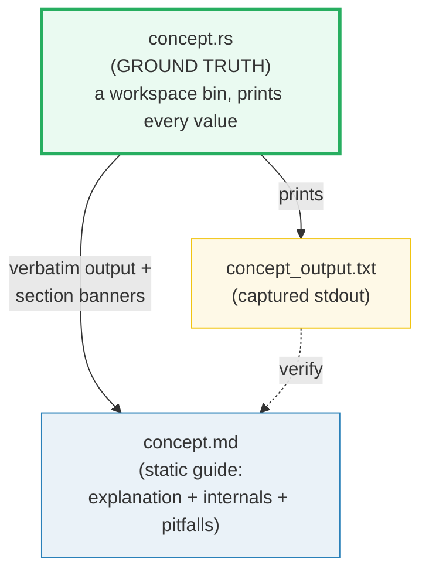
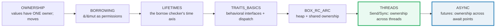

# HOW_TO_RESEARCH — The "Concept-as-a-Bundle" Workflow (Rust)

> A note from past-me to future-me: **how this `rust/` folder is organized, why
> it is a Cargo workspace, and how to extend it.** Each concept is a small,
> runnable `.rs` binary whose output is pasted verbatim into a `.md` guide.
> Nothing is hand-waved; every claim is reproducible by `cargo run --bin <name>`.
>
> **The north-star goal:** a reader who walks every bundle start-to-finish
> becomes a **Rust expert** — fluent in ownership/borrowing/lifetimes, the borrow
> checker, traits and generics, smart pointers and interior mutability,
> concurrency (`Send`/`Sync`, threads, channels, atomics), `async`, `unsafe`/FFI,
> the standard library, and the production ecosystem (serde/tokio/axum/sqlx).
>
> **The golden rule of building:** you (the orchestrator) **never write or edit a
> bundle file by hand.** Every bundle is produced by a **subagent** (one worker
> per bundle, max 4 per batch). Your job is to write tight worker briefs, launch
> them in parallel, maintain the workspace manifests, and run the verification
> sweep. This is the [`../go/`](../go/) and [`../python/`](../python/) discipline
> applied to Rust.
>
> Sister folders: [`../go/`](../go/) (Go), [`../python/`](../python/) (Python),
> [`../llm/`](../llm/) (LLM systems). The pre-existing `rust/{axum,fred.rs,sqlx}/`
> subfolders are curated library walkthroughs — the curriculum 🔗 cross-references
> them where relevant; they are **not** Cargo members.

---

## 0. The one rule (of a bundle)

> **Every concept is a `.rs` + `_output.txt` + `.md` triple that cite each other,
> all deriving from ONE runnable `.rs` binary. Nothing is hand-computed.**

If a claim, value, or output appears in a `.md`, it was printed by the `.rs` (or
recomputed with the identical logic). This is the discipline that keeps the
guides trustworthy as they scale to 50+ topics.



There is **no `.html`** in this folder (like `../python/`, unlike `../llm/`). The
runnable `.rs` binary *is* the interactive artifact — a reader opens it, runs it,
edits it, and watches the output change.

---

## 1. The directory layout (a Cargo workspace of dep-tiers)

Rust's toolchain differs from Go's in one decisive way: **all bins in one Cargo
package share that package's `[dependencies]`**, so a stdlib-only binary would
still compile the whole ecosystem graph. The fix is a **workspace with one member
crate per dep-tier** — verified to give build isolation (a `core` build compiles
in ~0.4s and does **not** touch `axum`/`tokio`).

```
rust/
├── HOW_TO_RESEARCH.md          ← you are here (per-bundle workflow)
├── SUBAGENTS_GUIDE.md          ← delegation at scale (worker prompt + sweep)
├── TODO.md                     ← the phase-by-phase build checklist (all bundles)
├── Justfile                    ← run/out/check/sweep/new/clippy/module
├── Cargo.toml                  ← [workspace] members = [ ... ]
├── Cargo.lock                  ← committed (deterministic builds, like go/go.sum)
├── .gitignore                  ← ignores target/
├── scripts/skeleton.rs         ← the house skeleton (banner + check helpers)
│
├── core/                       ← member: STDLIB-ONLY (no [dependencies])
│   ├── Cargo.toml              ← [[bin]] entries per bundle (orchestrator-maintained)
│   ├── ownership.rs            ← ground-truth impl   ─┐
│   ├── ownership_output.txt    ← captured stdout       │ one concept bundle
│   └── OWNERSHIP.md            ← static guide          ─┘
│
├── serde/                      ← member: serde + serde_json (Phase 6)
├── pmacros-derive/ + pmacros-demo/  ← member pair: proc-macro (Phase 6)
├── async/                      ← member: tokio + futures + tracing (Phase 7)
├── web/                        ← member: axum + serde + reqwest (Phase 8)
├── db/                         ← member: sqlx (Phase 8)
│
├── axum/  fred.rs/  sqlx/      ← pre-existing library walkthroughs (NOT members)
└── ...
```

A **concept bundle** = `{name}.rs` + `{name}_output.txt` + `{NAME}.md`, all three
co-located **flat in the member folder** that matches the bundle's dependency
tier.

**Naming convention** (matches `../go/` and `../python/`):
- `.rs` / `_output.txt` → `lower_snake_case` (e.g. `ownership.rs`).
- `.md` → `UPPER_SNAKE_CASE` (e.g. `OWNERSHIP.md`).
- One stem per concept; the three files share it.

### Why flat `.rs` with explicit `[[bin]]` (not `src/bin/`)

Each bundle's `.rs` lives at the member root (e.g. `core/ownership.rs`) and is
declared in `core/Cargo.toml`:

```toml
[[bin]]
name = "ownership"
path = "ownership.rs"
```

This keeps the triple co-located and browsable (like `../go/`), at the cost of
the orchestrator maintaining the `[[bin]]` list. Workers **never** edit any
`Cargo.toml` — the orchestrator adds the `[[bin]]` entry for each batch, exactly
as it adds deps to `../go/go.mod`. **No build-ignore tag is needed**: Cargo bins
are isolated, so there is no `main` redeclared conflict (unlike Go's
`//go:build ignore` requirement).

### Run any bundle

```bash
just run ownership          # = cargo run --bin ownership -q   (workspace-wide)
just out  ownership         # capture core/ownership_output.txt
just check ownership        # run + [check] count + rustfmt + clippy + output
just sweep                  # verify every bundle
```

`cargo run --bin <name>` resolves the bin **workspace-wide** (bin names are
unique), so `just run <name>` works regardless of which member holds it.

---

## 2. The three roles of each file

| File | Role | Hard rules |
|---|---|---|
| **`name.rs`** | Ground truth. Clean, runnable, **self-contained** `fn main()` binary that prints every value the `.md` needs, behind a section banner. | Single source of truth. Run via `cargo run --bin name`. Declared as a `[[bin]]` in its member's `Cargo.toml`. Each teachable point gets its own `section_x()` printing a banner + a readable block. Tiny-but-complete examples. Deterministic inputs only. Add `[check] ... OK` asserts for invariants (see §4). |
| **`{NAME}.md`** | Static, rigorous guide. Mermaid diagrams + **verbatim** output pasted from the `.rs`. | Every output block sits under a `> From name.rs Section X:` callout — no orphan numbers. Explains **what**, **why** (internals), and the **expert-level gotchas**. Cross-refs to siblings marked 🔗. Ends with a pitfalls table + cheat sheet + `## Sources`. |
| **`name_output.txt`** | Captured stdout. Committed so the `.md` can be re-derived/audited without building. | `just out name` → `<member>/name_output.txt`. Diff it against the `.md` callouts to audit any value. |

---

## 3. The "expert depth" requirement

A junior tutorial stops at "here's how you borrow a reference." This folder's bar
is higher. **Every `.md` a worker produces must answer three layers:**

1. **What** — the syntax / API and a runnable worked example (the `.rs`).
2. **Why** — the mechanism beneath it. For Rust this usually means: the
   **ownership/borrowing/lifetime model** and the **borrow checker**; **move vs
   copy** semantics; **`Send`/`Sync`** and the thread-safety contract; **zero-cost
   abstractions** (monomorphization vs dynamic dispatch); the **stack-vs-heap**
   story (`Box`/`Rc`/`Arc`); or **`unsafe`** and the invariants the compiler
   can't prove.
3. **Gotchas that separate juniors from experts** — the silent-bug traps: moves
   invalidating the source, lifetime elision corner cases, fighting the borrow
   checker over aliasing, `Rc` vs `Arc` (why `Rc` isn't `Sync`), interior
   mutability (`RefCell`/`Mutex`), integer-overflow semantics, `PhantomData`,
   closure `move` capture, `?` with `Option` vs `Result`, etc.

The **pitfalls table** at the end of each `.md` is non-negotiable — it is the
"expert payoff." If a worker ships a `.md` with no pitfalls table, re-spawn it.

---

## 4. The `.rs` authoring conventions (the house style)

Every bundle's `.rs` follows the same skeleton so output is uniform and
verifiable. Workers MUST replicate it exactly. Study `scripts/skeleton.rs` and
the Phase 1 style anchor (`core/ownership.rs` once shipped).

### 4.1 The required file skeleton

```rust
//! ownership.rs — Phase 1 bundle #1 (STYLE ANCHOR).
//!
//! GOAL (one line): show, by printing every value, how Rust's ownership model
//! moves values and why borrowing lets you use them without taking ownership.
//!
//! This is the GROUND TRUTH for OWNERSHIP.md. Every number, table, and worked
//! example in the guide is printed by this file. Change it -> re-run ->
//! re-paste. Never hand-compute.
//!
//! Run:
//!     just run ownership   (== cargo run --bin ownership)

const BANNER_WIDTH: usize = 70;

fn banner(title: &str) {
    let bar = "=".repeat(BANNER_WIDTH);
    println!("\n{bar}\nSECTION {title}\n{bar}");
}

/// Assert an invariant and print a uniform `[check] ...: OK` line.
/// Panics on failure (non-zero exit) so `just check` / `just sweep` catch it.
fn check(desc: &str, ok: bool) {
    if !ok {
        panic!("INVARIANT VIOLATED: {desc}");
    }
    println!("[check] {desc}: OK");
}

// ... section_a(), section_b(), ... each prints a banner + a readable block + checks

fn main() {
    println!("ownership.rs — Phase 1 bundle #1 (style anchor).");
    println!("Every value below is computed by this file.\n");
    section_a();
    section_b();
    banner("DONE — all sections printed");
}
```

### 4.2 The Rust-specific HARD RULES (these make output reproducible)

Rust differs from Go/Python in ways that bite determinism. Every worker MUST honor:

1. **`HashMap` uses a RANDOM seed per run** (SipHash, for DoS resistance). Both
   iteration order AND the addresses of entries vary between runs. **Never range
   a `HashMap` straight to stdout** — collect keys into a `Vec`, **sort** it, then
   print. (Or use `BTreeMap` for inherently-sorted output.) Otherwise
   `_output.txt` won't reproduce.

2. **Pointer addresses vary with ASLR.** `x as *const T as usize` prints a
   different number each run. **Never print raw addresses as values** — assert
   structural facts (equality of two pointers, capacity, length), not the address.

3. **Thread interleaving is nondeterministic.** For any concurrency bundle
   (`std::thread`, channels), never print directly from threads in scheduling
   order. Collect results into a `Vec` (guarded by a `Mutex` or sent over a
   channel), **sort**, then print from `main` after `join`. Stable stdout is the
   goal.

4. **`cargo fmt` is canon.** The file MUST be `rustfmt`'d (`just fmt name`).
   Unformatted Rust is an automatic verification FAIL.

5. **`cargo clippy` must be clean** (`cargo clippy --bin name -- -D warnings`).
   Clippy lints ARE the expert teaching surface (idiomatic loops, needless
   clones, `unwrap`-in-hot-paths, etc.). The sweep enforces `-D warnings`; fix
   lints rather than `#[allow]`-ing them (an `#[allow]` must be justified in the
   `.md`).

6. **No `assert!` for output invariants** — use the `check(desc, ok)` helper
   above (it prints the uniform `[check] ...: OK` line and **panics** on failure →
   non-zero exit → the sweep flags it). `assert!` is fine inside the helper.

7. **No uncontrolled RNG.** The `rand` crate is NOT in any member by default. For
   a bundle that needs "random" data, implement a tiny **deterministic LCG from a
   fixed seed** in pure stdlib (e.g. `fn lcg(state: &mut u64) -> u64 { ... }`).
   Output must be byte-reproducible on re-run.

8. **Integer overflow**: in `debug` builds (what `cargo run` uses) integer
   overflow **panics**; in `release` it wraps. The bundle runs in debug, so
   assert the panic behavior or use `checked_*`/`wrapping_*` deliberately — and
   say so in the `.md`.

9. **Self-contained, tier-correct deps.** Each `.rs` is a single file. Use ONLY
   the dependencies of its member (`core` = stdlib only; `serde`, `async`, `web`,
   `db`, `pmacros-*` = their declared crates). Never edit any `Cargo.toml`. If a
   worker "needs" a crate its member doesn't have, flag it — the orchestrator
   adds the dep (or it's the wrong member).

10. **Tiny-but-complete examples.** Small data (a 4-element `Vec`, a 3-field
    struct) so every value prints while every behavior shows.

---

## 5. The `.md` authoring conventions

Each `{NAME}.md` is a static, rigorous guide. Structure (copy the style anchor
`core/OWNERSHIP.md`):

1. **Header block** — one-line goal; "Run: `just run name`"; prerequisites (which
   bundles to read first); which member it lives in.
2. **Lineage / "why this exists"** — for ecosystem bundles, the old→new story.
3. **Mermaid diagram(s)** — at least one per guide (ownership flow, borrow-checker
   decision, scheduler state, whatever makes the mechanism visible).
4. **`> From name.rs Section X:` callouts** — every printed value/table sits under
   such a callout, pasted **verbatim** from `_output.txt`. No orphan numbers.
5. **The "why" (internals) section** — the second depth layer: the borrow checker,
   `Send`/`Sync`, monomorphization, stack vs heap, `unsafe` invariants.
6. **🔗 cross-references** — to sibling bundles + the `axum/`/`sqlx/` walkthroughs,
   each with a one-line *why*.
7. **Pitfalls table** — non-negotiable; columns: trap | symptom | fix.
8. **Cheat sheet** — a one-block quick reference.
9. **`## Sources`** — URLs (doc.rust-lang.org/book, doc.rust-lang.org/reference,
   doc.rust-lang.org/nomicon for `unsafe`, the crate docs). Every signature cited
   must be web-verified (see `SUBAGENTS_GUIDE.md` §2 Step 2).

---

## 6. Tooling & environment

- **`just run NAME`** runs a bundle (`cargo run --bin NAME -q`). The Justfile
  locates the member dir automatically.
- **`just fmt [NAME]`** rustfmt one (or `cargo fmt --all`).
- **`just clippy [NAME]`** clippy one (strict `-D warnings`) or the workspace.
- **`just check NAME`** verify ONE: run + `[check]` count + rustfmt + clippy +
  output presence.
- **`just sweep`** verify ALL bundles.
- **`cargo test`** powers the `testing` bundle (Phase 8) and any fixture checks.
- **Workspace `Cargo.toml`** is the orchestrator's to edit (members + the
  `[workspace.package]` edition=2024). Workers are FORBIDDEN from editing any
  `Cargo.toml`/`Cargo.lock`. Deps land per phase:
  - Phase 1–5 + stdlib P6/P8: **`core`, pure stdlib** (no deps).
  - Phase 6: `serde` (serde, serde_json), `pmacros-derive` + `pmacros-demo`
    (syn, quote, proc-macro2).
  - Phase 7: `async` (tokio, futures, tracing).
  - Phase 8: `web` (axum, serde, serde_json, reqwest, tokio), `db` (sqlx, tokio).

> **Offline by default.** `tokio`/`axum`/`sqlx` bundles use in-process fakes:
> `axum` + `tower::ServiceExt::oneshot` (no socket), `sqlx` with an in-memory
> sqlite (`sqlx::sqlite`), in-memory channels. **No bundle should require a live
> network or a running DB**; if one genuinely does, mark it loudly in the `.md`
> header.

---

## 7. Verifying a single bundle (worker self-check)

Every worker runs this before reporting done (`just check NAME` does it all):

1. `cargo run --bin name` runs clean; every `[check] ... OK` prints.
2. `just out name` — captured file is non-empty and **byte-identical on re-run**
   (determinism: sorted map keys, serialized thread output, fixed-seed LCG, no
   printed addresses).
3. `rustfmt --check name.rs` passes (`just fmt name` fixes it).
4. `cargo clippy --bin name -- -D warnings` passes (no lints).
5. The `.md` callouts match `_output.txt` verbatim.

For the **batch** sweep, see [`SUBAGENTS_GUIDE.md`](./SUBAGENTS_GUIDE.md) §5
(or `just sweep`).

---

## 8. Cross-referencing conventions

The whole point is **contrast to build understanding**. Tell workers to be
explicit:

- 🔗 marker in a `.md` = a cross-reference to a related bundle.
- Always state *why* the link matters in one line, e.g.
  "🔗 [BORROWING](./BORROWING.md) — you cannot understand a move until you see
  that a reference is a *permission to use without owning*, and the borrow
  checker is what enforces that permission."

The expertise spine across the phases:



That chain — **ownership → borrowing → lifetimes → traits → smart pointers →
threads → async** — *is* Rust expertise.

---

## 9. Common failure modes (single-bundle)

| Worker symptom | Cause | Fix |
|---|---|---|
| `cargo run` fails to compile | borrow-checker error / wrong API / missing dep | re-spawn with the correct anchor concepts + exact signature |
| `_output.txt` differs on re-run | unsorted `HashMap` / unsynced thread output / printed address / unseeded LCG | re-spawn citing the DETERMINISM hard rules (§4.2 rules 1–3,7) |
| `[check]` count is 0 | worker skipped invariants | re-spawn, emphasize "add a `check(...)` for every invariant" |
| `rustfmt --check` non-empty | worker didn't format | `just fmt name`; or re-spawn |
| `clippy` fails `-D warnings` | a lint (needless clone, `unwrap`, etc.) | re-spawn: fix the lint (don't `#[allow]` without justification) |
| `cargo check` can't find bin `X` | orchestrator didn't add the `[[bin]]` entry | add `[[bin]] name="X" path="X.rs"` to the member Cargo.toml |
| Numbers in `.md` don't match `_output.txt` | worker hand-typed | re-spawn, emphasize "paste verbatim under callouts"; `just out name` to regenerate |
| No `## Sources` | worker skipped web search | re-spawn, make Step 2 of the worker prompt non-optional |
| No pitfalls table | worker wrote a junior tutorial | re-spawn, cite §3 (the "expert payoff") |

---

## 10. Why this produces experts (not just users)

- **The `.rs` makes it falsifiable.** Anyone can `cargo run --bin name` and see
  the exact output — including the internals (`as *const` to reason about layout
  without printing it, `size_of_val`, `std::thread::spawn` + `join` to see
  interleaving you then sort, `unsafe` blocks with their stated invariants). No
  hand-waving over "trust me, that's how the borrow checker works."
- **The three-layer depth rule** forces every concept past syntax into mechanism
  and into the traps that working engineers actually hit.
- **Subagent delegation keeps depth uniform** — bundle #50 is as deep as #1
  because each gets a fresh context and the same constant preamble.
- **Cross-references force the big picture.** Linking borrowing to lifetimes, and
  lifetimes to `Send`/`Sync` across threads, and threads to async — that chain
  *is* Rust expertise.

---

## 11. Where to start

1. Open [`TODO.md`](./TODO.md) for the full phase-by-phase build plan (50 bundles,
   8 phases, 6 workspace members).
2. Open [`SUBAGENTS_GUIDE.md`](./SUBAGENTS_GUIDE.md) for the worker prompt
   template + batch verification sweep.
3. Launch the **Phase 1 swarm** (max 4 workers per batch), designating
   `ownership` as the style anchor. Ship it first (or in batch 1 copying
   `scripts/skeleton.rs` + the §4.1 example), then launch the rest of Phase 1
   against it.
