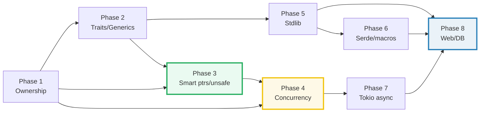

# TODO.md — The Rust Expertise Curriculum (build checklist)

> **Goal:** a reader who walks every bundle start-to-finish becomes a **Rust
> expert** — fluent in ownership/borrowing/lifetimes and the borrow checker,
> traits and generics, smart pointers and interior mutability, concurrency
> (`Send`/`Sync`, threads, channels, atomics), `async`, `unsafe`/FFI, the standard
> library, and the production ecosystem (serde/tokio/axum/sqlx).
>
> **How bundles get built:** see [`HOW_TO_RESEARCH.md`](./HOW_TO_RESEARCH.md)
> (per-bundle workflow) and [`SUBAGENTS_GUIDE.md`](./SUBAGENTS_GUIDE.md)
> (delegation at scale). The orchestrator **never edits a bundle by hand** — each
> bundle is produced by a subagent (one worker per bundle, **max 4 per batch**),
> then passed through `just sweep`.
>
> Each bundle = `{name}.rs` (ground truth, a `[[bin]]` in its member) +
> `{name}_output.txt` (captured stdout) + `{NAME}.md` (guide). No `.html`.
>
> **Layout:** a Cargo **workspace** of dep-tier members — `core` (stdlib-only)
> holds Phases 1–5 + stdlib P6/P8 bundles; `serde`/`pmacros-*` (P6),
> `async` (P7), `web`/`db` (P8) hold the ecosystem bundles. Run any via
> `cargo run --bin <name>`.

---

## Progress

| Phase | Theme | Member | Bundles | Status |
|---|---|---|---|---|
| 1 | Language Foundations | core | 8 | ✅ done (8/8, 140 checks) |
| 2 | Types, Traits & Generics | core | 7 | ✅ done (7/7, 138 checks) |
| 3 | Memory & Smart Pointers | core | 6 | ✅ done (6/6, 108 checks) |
| 4 | Concurrency | core | 7 | ✅ done (7/7, 101 checks) |
| 5 | Standard Library Essentials | core | 6 | ⬜ not started |
| 6 | Serde & Macros | serde + pmacros + core | 5 | ⬜ not started |
| 7 | Tokio Async | async | 5 | ⬜ not started |
| 8 | Web, DB & Production | web + db + core | 6 | ⬜ not started |
| | **Total** | **6 members** | **50** | **28 / 50 done — 487 checks, 0 failures** |

**Reading order is the phase order.** Each phase assumes the prior — Phase 3
smart pointers lean on Phase 1's ownership; Phase 4 concurrency leans on
`Send`/`Sync` which lean on ownership; Phase 7 async leans on the whole core.

---

## Phase 1 — Language Foundations (8) · `core`

> **Goal:** rock-solid command of ownership, borrowing, lifetimes, and moves —
> the model every downstream concept (smart pointers, concurrency, async) rests on.

- [x] **1. `ownership`** — every value has ONE owner; assignment/move transfers
  it; a move invalidates the source for non-`Copy` types; `drop` at end of scope.
  *(Designated **style anchor** — ship first.)*
- [x] **2. `borrowing`** — `&T` (shared) and `&mut T` (exclusive) as *permissions*;
  the aliasing-XOR-mutability rule; why borrowing avoids moves.
- [x] **3. `lifetimes`** — the borrow checker's time axis; elision rules; the
  `'a` annotation on returning refs; `'_`; `static`.
- [x] **4. `move_semantics`** — partial moves out of structs; moves into
  functions/closures; `move ||` closures; re-assignment after move.
- [x] **5. `copy_clone`** — `Copy` (bitwise, implicit) vs `Clone` (explicit
  `.clone()`); which types are `Copy`; the `Drop`-XOR-`Copy` rule.
- [x] **6. `strings_str`** — `String` (owned, growable, heap) vs `&str` (borrowed
  view); UTF-8 bytes vs chars; the `&str`↔`String` ergonomics.
- [x] **7. `vec_collections`** — `Vec<T>` (capacity/len, growth amortization,
  aliasing during `push`); slices `&[T]`; the `Vec`↔slice relationship.
- [x] **8. `control_flow`** — `if`/`match`/`let-else`/`if let`/`while let`;
  exhaustive matching; `loop`/`while`/`for`; `break` values; `?` early-return.

---

## Phase 2 — Types, Traits & Generics (7) · `core`

> **Goal:** the type system — structs/enums, pattern matching, traits (static +
> dynamic dispatch), generics, trait bounds, and `Result`/`?` error handling.

- [x] **9. `structs_enums`** — named/tuple/unit structs; `enum` as a tagged union;
  `Option`/`Result`; methods + `impl`; `Self`.
- [x] **10. `pattern_matching`** — `match` exhaustiveness; destructuring structs/
  enums/tuples/slices; guards; bindings (`@`); `if let`/`while let`/`let else`.
- [x] **11. `traits_basics`** — defining + implementing traits; default methods;
  `impl Trait` in arg/return; static dispatch via monomorphization.
- [x] **12. `trait_objects`** — `dyn Trait` + dynamic dispatch (vtable); object
  safety; `Box<dyn Trait>`; static vs dynamic dispatch tradeoffs.
- [x] **13. `generics`** — generic functions/types over `T`; monomorphization;
  `const` generics; the `Self`-in-trait pattern.
- [x] **14. `trait_bounds`** — `T: Trait`, multiple bounds (`+`), `where` clauses,
  `impl Trait` shorthand, associated types, supertraits.
- [x] **15. `error_handling`** — `Result<T,E>` + `?`; the `Error`/`Display`/`Debug`
  trio; `thiserror`-style enums from scratch; `Option`↔`Result` combos.

---

## Phase 3 — Memory & Smart Pointers (6) · `core`

> **Goal:** the heap and shared ownership — `Box`/`Rc`/`Arc`, interior
> mutability (`Cell`/`RefCell`/`Mutex`), advanced lifetimes, closures, iterators,
> and `unsafe`. *This is where "Rust expert" actually lives.*

- [x] **16. `box_rc_arc`** — `Box<T>` (unique heap); `Rc<T>` (shared, single-thread,
  refcount); `Arc<T>` (atomic, thread-safe); why `Rc` is not `Sync`.
- [x] **17. `interior_mutability`** — `Cell<T>` (copy types) and `RefCell<T>`
  (runtime borrow check); the `Mutex`/`RwLock` thread-safe variants; `RefCell`
  panic on double-`&mut`.
- [x] **18. `lifetimes_advanced`** — elision limits; structs holding refs; HRTB
  (`for<'a>`); `'static`; the borrow-checker's NLL; lifetime variance.
- [x] **19. `closures`** — `Fn`/`FnMut`/`FnOnce`; capture by ref vs `move`; how
  closures are desugared to structs; returning closures (`Box<dyn Fn>`).
- [x] **20. `iterators`** — the `Iterator` trait; lazy adapters (`map`/`filter`)
  vs consuming (`collect`/`sum`); zero-cost fusion; `into_iter`/`iter`/`iter_mut`.
- [x] **21. `drop_unsafe`** — the `Drop` trait + RAII deterministic cleanup; `unsafe`
  blocks/`unsafe fn`; the 4 superpowers (dereference raw, call unsafe fn, access
  mutable statics, implement unsafe trait) + the invariants you must uphold.

---

## Phase 4 — Concurrency (7) · `core`

> **Goal:** `Send`/`Sync` and the threads/channels/atomics built on them, plus
> the `Future` model — all stdlib (no tokio yet; that's Phase 7).

- [x] **22. `threads`** — `std::thread::spawn` + `join`; `move` closures into
  threads; thread panics are isolated; scoped threads (`scope`) for borrowed data.
- [x] **23. `mpsc_channels`** — `std::sync::mpsc` (multi-producer single-consumer);
  bounded vs unbounded; `send`/`recv`; ownership transfer through a channel.
- [x] **24. `mutex_rwlock`** — `Mutex<T>` + `RwLock<T>`; the guard-as-borrow
  pattern; poisoning; lock granularity.
- [x] **25. `atomics`** — `AtomicUsize`/`AtomicBool`; `Ordering` (Relaxed/Acquire/
  Release/SeqCst); CAS loops (`compare_exchange`); the memory model.
- [x] **26. `send_sync`** — `Send` (ownership moves across threads) and `Sync`
  (`&T` sharable across threads) as auto-traits; why `Rc`/`RefCell` aren't; the
  "thread-safe if all fields are" rule.
- [x] **27. `async_basics`** — `async fn` + `.await`; `Future` as a state machine;
  `Pin`; a hand-rolled single-thread executor (block_on) — no runtime yet.
- [x] **28. `barrier_once`** — `Barrier`/`Once`/`Condvar`/`OnceLock` — the
  lower-level sync primitives and lazy init.

---

## Phase 5 — Standard Library Essentials (6) · `core`

> **Goal:** ship correct Rust using the stdlib — collections, I/O, fs, time,
> formatting, and the module/crate system.

- [ ] **29. `collections`** — `HashMap`/`BTreeMap`/`HashSet`/`VecDeque`/`LinkedList`;
  when each wins; the `HashMap` random-seed (sort keys for output!); `Entry`.
- [ ] **30. `io`** — `Read`/`Write`/`BufRead` traits; `io::copy`; chaining;
  `Cursor`; `?` on `io::Result`; the `std::io` error story.
- [ ] **31. `fs_paths`** — `fs::read`/`write`/`File`; `Path`/`PathBuf`; `walkdir`-
  style traversal by hand; canonicalize/join; dirs vs files.
- [ ] **32. `time`** — `Instant` (monotonic, for measuring) vs `SystemTime`
  (wall); `Duration`; sleep; do NOT print wall-clock values as asserted numbers.
- [ ] **33. `formatting`** — `Display`/`Debug`; `format!`/`println!`/`write!`;
  formatting traits (`{:?}`/`{:#?}`/`{:>5}`/`{:.2}`); custom `Debug`.
- [ ] **34. `modules`** — `mod`/`use`/`pub`/`pub(crate)`; file mod tree; `crate`/
  `super`/`self`; re-exports; visibility gating.

---

## Phase 6 — Serde & Macros (5) · `serde` + `pmacros-*` + `core`

> **Goal:** serialization (serde) and metaprogramming (declarative + procedural
> macros). Third-party crates land here.

- [ ] **35. `serde_basics`** [serde] — `#[derive(Serialize, Deserialize)]`; struct
  tags (`#[serde(rename, default)]`); JSON round-trip; field visibility.
- [ ] **36. `serde_advanced`** [serde] — custom `Serialize`/`Deserialize`;
  `#[serde(tag, untagged, flatten)]` for enums; `serde_json::Value` dynamic JSON.
- [ ] **37. `macro_rules`** [core] — declarative macros; the matcher grammar;
  repetitions (`$x:expr, *`); hygiene; macro-export vs crate-local.
- [ ] **38. `proc_macros`** [pmacros-derive + pmacros-demo] — a derive macro
  (syn + quote + proc-macro2); the `pmacros-derive` lib produces tokens the
  `pmacros-demo` bin consumes.
- [ ] **39. `build_config`** [core] — `build.rs` + `OUT_DIR` codegen; reading
  env at build time; `include!` of generated code; feature flags (`#[cfg]`).

---

## Phase 7 — Tokio Async (5) · `async`

> **Goal:** the tokio runtime — the production layer over `Future`. Member gets
> `tokio`, `futures`, `tracing`.

- [ ] **40. `tokio_runtime`** — `#[tokio::main]`; the runtime; `spawn` + `JoinHandle`;
  blocking vs async (the `spawn_blocking` rule); `tokio::time` timeouts.
- [ ] **41. `tokio_select`** — `tokio::select!`; first-ready wins; branch futures
  dropped; the `biased` mode; cancellation propagation.
- [ ] **42. `tokio_channels`** — `mpsc`/`oneshot`/`broadcast`/`watch`; backpressure
  (bounded capacity); ownership through async channels.
- [ ] **43. `tokio_io`** — `AsyncRead`/`AsyncWrite`; `tokio_util::io` framing;
  `BufReader` async; copying streams; EOF handling.
- [ ] **44. `tracing_basics`** — `tracing` structured spans/events; the subscriber;
  context propagation across `.await`; deterministic output (drop timestamps).

---

## Phase 8 — Web, DB & Production (6) · `web` + `db` + `core`

> **Goal:** wire the whole stack into production — HTTP (axum/reqwest), DB
> (sqlx), testing, FFI, and deployment.

- [ ] **45. `axum_basics`** [web] — `Router`/`get`/`post`; `Handler` + extractors;
  `State`; tested via `tower::ServiceExt::oneshot` (in-process, no socket).
- [ ] **46. `reqwest_client`** [web] — the HTTP client; timeouts; a `wiremock`
  or `httpmock`-style in-process mock (offline); retries pattern.
- [ ] **47. `sqlx_basics`** [db] — `sqlx` with in-memory sqlite; compile-time
  checked queries; `FromRow`; `Pool`; transactions.
- [ ] **48. `testing`** [core] — `#[test]`/`#[should_panic]`; `assert_eq!`;
  unit vs integration tests; `cargo test`; doc-tests; parametrize-by-hand.
- [ ] **49. `ffi`** [core] — `extern "C"`; calling libc (`abs`/`strlen`); C
  calling Rust (`#[no_mangle]`); `repr(C)`; the safety contract.
- [ ] **50. `deployment`** [core] — cross-compile (`--target`); `musl` static
  binaries; Docker multi-stage (scratch/distroless); binary size; CI gates.

---

## Cross-cutting 🔗 map (the expertise chain)

Key cross-links workers should wire up:
- `ownership` (P1) ⟷ `borrowing`/`lifetimes` (P1) ⟷ `box_rc_arc` (P3) ⟷ `send_sync`
  (P4) — **the ownership→borrow→smart-ptr→thread-safety chain is the heart of
  "Rust expert".**
- `traits_basics` (P2) ⟷ `trait_objects`/`generics` — static (monomorphization)
  vs dynamic (vtable) dispatch.
- `threads` (P4) ⟷ `async_basics` (P4) ⟷ `tokio_runtime` (P7) — OS threads vs
  async tasks; when each wins.
- `interior_mutability` (P3) ⟷ `mutex_rwlock` (P4) — `RefCell` is the single-threaded
  `Mutex`.
- `serde_basics` (P6) ⟷ `axum_basics`/`sqlx_basics` (P8) — serde is the wire format.
- `drop_unsafe` (P3) ⟷ `ffi` (P8) — `unsafe` is the FFI boundary.
- The pre-existing `rust/axum/` and `rust/sqlx/` walkthrough subfolders are the
  deep-dive companions to `axum_basics`/`sqlx_basics` — 🔗 reference them.

---

## How to run a phase (orchestrator recipe)

For each phase:

1. **Set up members/manifests.** Add the batch's `[[bin]]` entries to the right
   member's `Cargo.toml` (e.g. P1 → `core`). For a new member (P6 serde/pmacros,
   P7 async, P8 web/db): create the member crate + its `Cargo.toml` + add it to
   the workspace `members`. For proc-macros: create BOTH `pmacros-derive` (lib,
   `proc-macro = true`) and `pmacros-demo` (consumer bin).
2. **Write briefs.** Fill the `SUBAGENTS_GUIDE.md` §2 template for each bundle
   (5 min each).
3. **Launch the swarm in batches of ≤4.** One `Task` worker per bundle, up to 4
   per message. For Phase 1, ship `ownership` as the style anchor (in batch 1,
   copying `scripts/skeleton.rs` + the HOW_TO_RESEARCH §4.1 example).
4. **Verify after each batch.** `just sweep` + `just module`; spot-check 2–3 `.md`
   callouts against `_output.txt`.
5. **Re-spawn** failures (≤4 again); tick the boxes above; update the Progress
   table.
