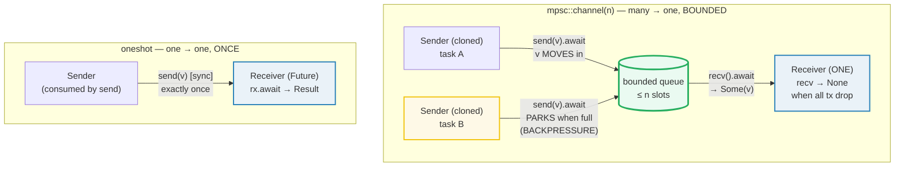
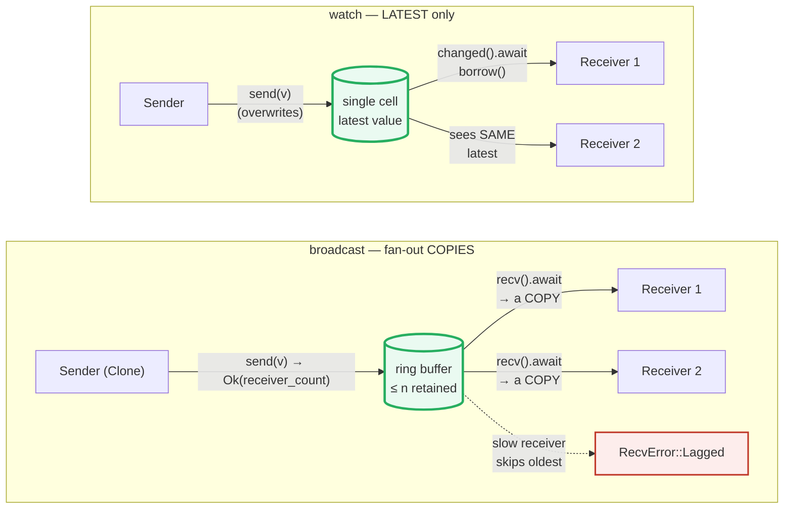

# TOKIO_CHANNELS — Async Channels: mpsc, oneshot, broadcast, watch

> **One-line goal:** tokio's four async channel flavors synchronize values
> across **async tasks** with `.await` on `send`/`recv` (instead of blocking an
> OS thread) — `mpsc` (many→one, bounded backpressure), `oneshot` (one→one,
> a complete-once promise), `broadcast` (one→many, each receiver gets a copy),
> and `watch` (one→many, receivers see only the **latest** value).
>
> **Run:** `just run tokio_channels` (== `cargo run --bin tokio_channels`)
> **Member:** `async` (deps: `tokio` (full), `futures`, `tracing`, ...).
> **Prerequisites:** 🔗 [MPSC_CHANNELS](../core/MPSC_CHANNELS.md) (the sync
> sibling — same move/ownership rules, blocking thread), 🔗 [OWNERSHIP](../core/OWNERSHIP.md)
> (`send` *moves* the value), and the tokio runtime model from 🔗 [TOKIO_RUNTIME](./TOKIO_RUNTIME.md).
> **Ground truth:** [`tokio_channels.rs`](./tokio_channels.rs); captured stdout:
> [`tokio_channels_output.txt`](./tokio_channels_output.txt).

---

## Why this exists (lineage)

🔗 [MPSC_CHANNELS](../core/MPSC_CHANNELS.md) showed `std::sync::mpsc`: threads
communicate by moving values through a queue, and `recv`/bounded `send`
**block the OS thread**. That is the right tool when each producer/consumer is
its own thread — but inside a tokio runtime a single thread drives **thousands**
of tasks, so blocking one would stall them all. The async analogs fix exactly
that:

| Flavor | Topology | Buffer | `send`/`recv` | Blocking model |
|---|---|---|---|---|
| **`mpsc::channel(n)`** | many producers → **one** consumer | bounded (`n`) | `send().await`, `recv().await` | `.await` **yields the TASK** when full → **backpressure** |
| **`mpsc::unbounded_channel()`** | many → one | **unbounded** | `send` (sync, never blocks), `recv().await` | never yields — **no backpressure** (memory hazard) |
| **`oneshot::channel()`** | **one** → **one** | exactly 1 | `send` (sync, once), `rx.await` | a complete-once **promise** |
| **`broadcast::channel(n)`** | one → **many** | bounded ring | `send` (sync), `recv().await` | each receiver gets a **copy**; slow ones **lag** |
| **`watch::channel(init)`** | one → many | 1 (latest only) | `send` (sync), `changed().await` | receivers see only the **most recent** value |

The defining difference from the sync channels is the `.await`: when a bounded
`mpsc` is full, `send().await` does **not** park the OS thread — it parks the
*future*, returning control to the runtime so another task on the same thread
can run ([tokio tutorial — Channels][tokio-tut]). That is the load-bearing
mechanism that makes async channels "free" at scale.





---

## Section A — mpsc bounded: the async send/recv handshake

```rust
use tokio::sync::mpsc;

let (tx, mut rx) = mpsc::channel::<i32>(8);   // bounded(8): max 8 buffered
tx.send(42).await?;                            // 42 MOVES in; .await (may yield)
let got = rx.recv().await;                      // Some(42); None when all tx drop
```

> **From tokio_channels.rs Section A:**
> ```
> ======================================================================
> SECTION A — mpsc bounded: async send().await / recv().await handshake
> ======================================================================
>   let (tx, rx) = mpsc::channel::<i32>(8);   // bounded(8), MPSC
>   tx.send(42).await;   // 42 MOVED into the channel
>   rx.recv().await -> Some(42)
> [check] tx.send(42).await then rx.recv().await yields Some(42): OK
>   after drop(tx): rx.recv().await -> None
> [check] recv returns None once all Senders are dropped (channel closed): OK
> ```

**What.** `mpsc::channel(n)` returns `(Sender, Receiver)` for a bounded,
multi-producer single-consumer queue of capacity `n`. `tx.send(v).await` moves
`v` in and returns `Result<(), SendError<T>>`; `rx.recv().await` returns
`Option<T>` — `Some(v)` for a message, `None` once every `Sender` has been
dropped (the channel "closed"). The two checks pin both behaviors: the value
round-trips as `Some(42)`, and `recv` returns `None` after `drop(tx)`.

**Why (internals).**
- **`.await` is the whole point.** The tokio docs describe `mpsc` as *"a
  multi-producer, single-consumer queue for sending values between asynchronous
  tasks"*; on the bounded channel *"if this limit is reached, trying to send
  another message will wait until a message is received ... the channel provides
  backpressure"* ([tokio mpsc][tokio-mpsc]). The `wait` is an `.await`: the send
  future parks, the runtime runs another task, and the send resumes when a slot
  frees. Contrast the sync sibling, where the same condition would block the OS
  thread.
- **Closure = `None`, not a panic.** *"When all `Sender` handles have been
  dropped ... `Receiver::recv` returns `None`"* ([tokio mpsc — Disconnection][tokio-mpsc]).
  That is why a `while let Some(v) = rx.recv().await` loop terminates cleanly
  once production is done — it is the async-drain analog of `rx.iter()` in the
  sync bundle.
- **Ownership still moves.** `send` takes `v` by value, exactly like the sync
  `Sender::send` in 🔗 [MPSC_CHANNELS](../core/MPSC_CHANNELS.md) Section B.
  Reusing a sent `String` is the same `E0382`; the move is the synchronization.

> **Capacity is a deliberate choice, not a default.** The tokio tutorial is
> emphatic: *"Unbounded queues will eventually fill up all available memory and
> cause the system to fail in unpredictable ways ... When using `mpsc::channel`,
> pick a manageable channel capacity"* ([tokio tutorial — Backpressure][tokio-tut]).
> `unbounded_channel()` exists (its `send` is sync and never blocks) but trades
> safety for an unbounded memory hazard — see the pitfalls table.

---

## Section B — Bounded backpressure: `send().await` PARKS when the buffer is full

```rust
let (tx, mut rx) = mpsc::channel::<i32>(1);   // ONE slot
tx.send(1).await?;                             // fills the only slot
// a 2nd send().await would PARK here until a recv frees the slot
```

> **From tokio_channels.rs Section B:**
> ```
> ======================================================================
> SECTION B — bounded(1) backpressure: a full channel parks send().await
> ======================================================================
>   let (tx, rx) = mpsc::channel::<i32>(1);   // ONE slot
>   tx.send(1).await;   // slot now FULL (capacity reached)
>   tx.try_send(2) -> Err(TrySendError::Full(2))   (= send(2).await would PARK)
> [check] bounded(1) is full -> try_send returns Full(2) (backpressure): OK
>   spawned tx.send(2).await PARKED, then resumed after rx.recv() freed a slot;
>     rx.recv() -> Some(1), then Some(2)
> [check] backpressure: the parked send(2) delivered AFTER a recv freed the slot: OK
> ```

**What.** A `bounded(1)` channel holds one message. `tx.send(1).await` fills it;
a second `send(2).await` would now **park** (yield the task) until a `recv`
drains a slot. The bundle *observes* the full state deterministically with
`try_send` — which never blocks and instead returns
`Err(TrySendError::Full(v))`, handing the value back. It then *proves* the parked
send resumes: a spawned sender calling `send(2).await` parks, `rx.recv()` frees
the slot, the parked future wakes, and a second `recv` returns `Some(2)`.

**Why (internals).**
- **`try_send` is the deterministic witness.** You cannot `println!` "I am now
  parked" from inside a future without making the output depend on scheduling —
  which would break byte-reproducibility (HOW_TO_RESEARCH.md §4.2 rule 3).
  `try_send` returning `Full(2)` *is* the proof that `send(2).await` would yield
  here, with no timing in the output. This mirrors how the sync bundle used
  `try_send`/`Full` to witness a blocking `sync_channel`.
- **Backpressure throttles the producer.** Because `send().await` yields when
  full, a fast producer is forced to the speed of the slow consumer — *"the
  channel provides backpressure"* ([tokio mpsc][tokio-mpsc]). This is the async
  analog of `std::sync::mpsc::sync_channel(n)` blocking the producer thread, but
  it parks a *task* rather than an OS thread, so the runtime stays responsive.
- **`unbounded_channel()` has no backpressure.** Its `send` is **not** async —
  *"an unbounded channel has an infinite capacity, so the `send` method will
  always complete immediately"* ([tokio mpsc][tokio-mpsc]). Convenient, but a
  fast producer and slow consumer will grow the queue without bound. Prefer
  bounded unless you have an explicit reason.

---

## Section C — Multi-producer: `clone tx`; collect; **SORT** (determinism)

```rust
let (tx, mut rx) = mpsc::channel::<i32>(8);
for v in [10, 20, 30] {
    let tx = tx.clone();                       // each task gets its own Sender
    tokio::spawn(async move { tx.send(v).await.unwrap(); });
}
drop(tx);                                      // close once all clones finish
let mut got: Vec<i32> = Vec::new();
while let Some(v) = rx.recv().await { got.push(v); }
got.sort_unstable();                           // reception order is NONDETERMINISTIC
assert_eq!(got, vec![10, 20, 30]);
```

> **From tokio_channels.rs Section C:**
> ```
> ======================================================================
> SECTION C — multi-producer: clone tx per task; collect and SORT (determinism)
> ======================================================================
>   spawned 3 tasks, each cloned tx and sent one of [10, 20, 30];
>   collected (sorted) -> [10, 20, 30]
> [check] 3 cloned senders delivered exactly {10, 20, 30} as a set: OK
> ```

**What.** `Sender: Clone`, so `tx.clone()` hands each spawned task an independent
producer feeding the **same** receiver. Three tasks each send one value; the
receiver collects `{10, 20, 30}`. The check passes on the **sorted set**, never
the raw order.

**Why (internals).**
- **Multi-producer by cloning.** The tokio tutorial: *"Sending from multiple
  tasks is done by **cloning** the `Sender` ... Both messages are sent to the
  single `Receiver` handle. It is not possible to clone the receiver of an `mpsc`
  channel"* ([tokio tutorial — Channels][tokio-tut]). The single-consumer rule is
  structural: `Receiver` is **not** `Clone` (and async `Receiver` is also not
  `Sync`), so there is provably one draining task.
- **Reception order is nondeterministic.** Each clone writes into one FIFO queue,
  but *when* each task runs is up to the scheduler — so `[10, 20, 30]` may arrive
  as `[20, 10, 30]` or any permutation. The bundle therefore collects into a
  `Vec`, **sorts**, and prints from `main` after all senders finish (the same
  discipline as the sync sibling, and the DETERMINISM rule in
  HOW_TO_RESEARCH.md §4.2 rule 3). Do this and `_output.txt` is byte-stable.
- **`drop(tx)` the original before draining.** The `while let Some(...) =
  rx.recv().await` loop only ends when *all* senders are gone. Holding the
  original `tx` while collecting deadlocks the drain — exactly the trap from the
  sync bundle's pitfalls table.

---

## Section D — oneshot: a complete-once promise (one sender → one receiver)

```rust
use tokio::sync::oneshot;

let (tx, rx) = oneshot::channel();    // capacity is always 1; NOT cloneable
tx.send("done").unwrap();             // sync, completes immediately, consumes tx
let got = rx.await;                    // Ok("done"); Err if tx dropped w/o sending
```

> **From tokio_channels.rs Section D:**
> ```
> ======================================================================
> SECTION D — oneshot: a complete-once promise (one sender -> one receiver)
> ======================================================================
>   let (tx, rx) = oneshot::channel::<&str>();   // capacity is always 1
>   tx.send("done");   // NOT async; completes immediately
>   rx.await -> Ok("done")
> [check] oneshot: send once + recv once yields the single value: OK
>   drop(tx2) without sending; rx2.await -> Err(RecvError(()))
> [check] oneshot: a dropped Sender makes rx.await return Err (RecvError): OK
> ```

**What.** `oneshot::channel()` returns a `(Sender, Receiver)` for **exactly one**
value. The `Sender::send` is **not** async — it completes immediately and
**consumes** `self` (takes it by value), so a `Sender` can be used once and only
once. The `Receiver` is itself a `Future`: `rx.await` yields `Result<T,
RecvError>` — `Ok(v)` for the value, `Err` if the sender was dropped without
sending. The two checks pin both the happy path and the dropped-sender branch.

**Why (internals).**
- **A single-value promise.** The tokio docs: *"A one-shot channel is used for
  sending a single message between asynchronous tasks ... `send` ... is not async,
  it can be used anywhere. This includes sending between two runtimes, and using
  it from non-async code"* ([tokio oneshot][tokio-oneshot]). This is the canonical
  "reply" channel: embed a `oneshot::Sender` in a request message over an `mpsc`,
  and the requester `await`s the `Receiver` for the response ([tokio tutorial][tokio-tut]).
- **`send` consumes the sender.** Because `send` takes `self` by value, calling it
  twice is a **compile error**, not a runtime check:

```console
error[E0382]: use of moved value: `tx`
  --> src/main.rs:5:5
   |
2  |     let (tx, _rx) = tokio::sync::oneshot::channel();
   |          -- move occurs because `tx` has type `Sender<_>`,
   |             which does not implement the `Copy` trait
...
4  |     tx.send(1).unwrap();
   |        ------- `tx` moved into `send` (which takes `self` by value)
5  |     tx.send(2).unwrap();   // cannot use `tx` a second time
   |     ^^ value used here after move
```

  (This cannot live in the runnable `.rs` — it would not build. It is the very
  same `E0382` you met in 🔗 [OWNERSHIP](../core/OWNERSHIP.md), now surfaced by
  the single-shot contract.)

- **Sender-is-`Option` for Drop.** To send from a destructor, store the
  `Sender` in an `Option` and `take()` it in `Drop::drop` — the oneshot docs show
  exactly this `SendOnDrop` pattern ([tokio oneshot — Examples][tokio-oneshot]).

> **Using a `oneshot` in `tokio::select!`?** Take it **by reference**: write
> `msg = &mut rx`, not `msg = rx`. Borrowing lets the same receiver survive
> across loop iterations; consuming it in one `select!` arm would move it
> ([tokio oneshot][tokio-oneshot]). 🔗 [TOKIO_SELECT](./TOKIO_SELECT.md).

---

## Section E — broadcast: multi-consumer; each receiver gets a COPY

```rust
use tokio::sync::broadcast;

let (tx, mut rx1) = broadcast::channel::<i32>(16);
let mut rx2 = tx.subscribe();         // extra receivers via subscribe()
tx.send(10)?;                          // returns the receiver COUNT
// rx1.recv().await == 10; rx2.recv().await == 10  (each gets its own COPY)
```

> **From tokio_channels.rs Section E:**
> ```
> ======================================================================
> SECTION E — broadcast: multi-consumer; each receiver gets a COPY
> ======================================================================
>   let (tx, rx1) = broadcast::channel::<i32>(16);  let mut rx2 = tx.subscribe();
>   tx.send(10) -> Ok(2)   (returned receiver count)
>   rx1.recv() x2 -> [10, 20]   rx2.recv() x2 -> [10, 20]
> [check] broadcast: rx1 received the full sequence [10, 20]: OK
> [check] broadcast: rx2 received a COPY of the SAME sequence [10, 20]: OK
> [check] broadcast::send returned the number of receivers (2): OK
> ```

**What.** `broadcast::channel(n)` is a multi-producer, **multi-consumer** queue:
every sent value is delivered to **all** connected receivers. New receivers are
created with `tx.subscribe()` (and receive only values sent *after* subscribing).
`send` returns the **number of receivers** that will see the value (`Ok(2)` with
two subscribers). Each receiver independently reads its **own copy**, so `rx1`
and `rx2` both observe `[10, 20]`.

**Why (internals).**
- **Stored once, cloned per receiver.** *"The value is stored once inside the
  channel and cloned on demand for each receiver. Once all receivers have
  received a clone of the value, the value is released from the channel"*
  ([tokio broadcast][tokio-broadcast]). This is why `T: Clone` is required — and
  why `send` is **not** async (the clone happens lazily at `recv`, never blocking
  the sender).
- **Slow receivers LAG, not block the producer.** *"As sent messages must be
  retained until all `Receiver` handles receive a clone, broadcast channels are
  susceptible to the 'slow receiver' problem ... If a value is sent when the
  channel is at capacity, the oldest value currently held by the channel is
  released ... will return `RecvError::Lagged`"* ([tokio broadcast — Lagging][tokio-broadcast]).
  Unlike `mpsc` backpressure, a slow broadcast consumer does **not** throttle the
  sender — it just skips messages and is told how far behind it fell.
- **`Sender: Clone`, `Receiver: Clone`-via-`subscribe`.** Both halves are `Send +
  Sync` (when `T: Send`), so you can fan out the producer and the consumers
  across tasks freely ([tokio broadcast][tokio-broadcast]).

---

## Section F — watch: one latest value; receivers see only the most recent

```rust
use tokio::sync::watch;

let (tx, mut rx) = watch::channel(0);   // created with an INITIAL value
tx.send(1); tx.send(2); tx.send(3);     // only 3 (the latest) is retained
rx.changed().await?;                      // resolves once an UNSEEN value exists
assert_eq!(*rx.borrow(), 3);             // borrow() reads without an .await
```

> **From tokio_channels.rs Section F:**
> ```
> ======================================================================
> SECTION F — watch: one latest value; receivers see only the most recent
> ======================================================================
>   let (tx, rx) = watch::channel(0);   // initial value 0 (considered SEEN)
>   tx.send(1); tx.send(2); tx.send(3);   // only 3 (the latest) is retained
>   rx.changed().await; *rx.borrow() -> 3
> [check] watch: receiver sees only the LATEST value (3); 1 and 2 were coalesced away: OK
>   tx.send(7); rx.has_changed() -> true   (sync probe; does NOT mark seen)
> [check] watch: has_changed() is true after a send the receiver has not marked seen: OK
> ```

**What.** `watch::channel(init)` is a multi-producer, multi-consumer channel that
retains **only the last** value sent. It is created with an initial value. The
bundle sends `1`, `2`, `3` in rapid succession before the receiver ever awaits;
`changed().await` then resolves and `borrow()` returns `3` — the intermediates
`1` and `2` are **coalesced away** and were never observable. A final `send(7)`
makes the sync `has_changed()` probe return `true`.

**Why (internals).**
- **Only the latest survives.** *"A multi-producer, multi-consumer channel that
  only retains the *last* sent value ... useful for watching for changes to a
  value from multiple points in the code base, for example, changes to
  configuration values"* ([tokio watch][tokio-watch]). This is the right channel
  for "current state" (a config flag, a leader epoch), not "event log."
- **`changed().await` vs `has_changed()` vs `borrow()`.** The receiver tracks
  whether the current value is *seen*:
  - `changed().await` — async; resolves once an **unseen** value exists, then
    marks it seen. *"At creation, the initial value is considered *seen* ...
    `changed()` will not return until a subsequent value is sent"*
    ([tokio watch][tokio-watch]).
  - `has_changed()` — sync probe; returns a bool, **does not** mark seen.
  - `borrow()` / `borrow_and_update()` — read the current value as a `watch::Ref`.
    Prefer `borrow_and_update()` (`&mut self`) inside a `changed()` loop to avoid
    a race where a new value lands between `changed` resolving and the read
    ([tokio watch — `borrow_and_update` vs `borrow`][tokio-watch]).
- **`send` overwrites, never queues.** Because there is no history, `send` is
  sync and unbounded in *time* (never blocks) — the capacity is conceptually 1.

---

## Choosing a channel (the decision table)

| You want... | Use | Because |
|---|---|---|
| Stream many values, **one** consumer, throttle a fast producer | `mpsc::channel(n)` | bounded → **backpressure**; the workhorse |
| Stream many values, one consumer, no flow control | `mpsc::unbounded_channel()` | `send` never blocks — but **unbounded memory** risk |
| Send **exactly one** value / a reply / a cancel signal | `oneshot::channel()` | one-shot promise; `send` consumes the sender |
| Fan a value out to **every** consumer (event log) | `broadcast::channel(n)` | each receiver gets a copy; slow ones **lag** |
| Broadcast the **current state** (config, metrics) | `watch::channel(init)` | receivers see only the latest; coalesces bursts |

> **Runtime-agnostic.** All four are *"runtime agnostic. You can freely move it
> between different instances of the Tokio runtime or even use it from non-Tokio
> runtimes"* ([tokio mpsc — Multiple runtimes][tokio-mpsc]). `oneshot::send` in
> particular works from plain sync code — useful for bridging sync↔async.

---

## Pitfalls (the expert payoff)

| Trap | Symptom | Fix / why |
|---|---|---|
| **Holding the original `tx` while draining `rx`** | `while let Some(...) = rx.recv().await` **never ends** | The loop only terminates when *all* `Sender`s drop. `drop(tx)` the original after spawning clones (Section C). |
| **Printing multi-producer values in arrival order** | `_output.txt` differs every run | Async task scheduling is **nondeterministic**. Collect into a `Vec`, **sort**, print from `main` after the senders finish. (HOW_TO_RESEARCH.md §4.2 rule 3.) |
| **`unbounded_channel()` OOM** | fast producer, slow consumer → queue grows without bound → memory blowup | *"Unbounded queues will eventually fill up all available memory"* ([tokio tutorial][tokio-tut]). Use a bounded `mpsc::channel(n)` for backpressure. |
| **Expecting `broadcast` to backpressure the sender** | slow receiver "should" slow the producer — but messages get dropped instead | broadcast **lags** slow receivers (`RecvError::Lagged`), it never blocks `send`. If you need throttling, use bounded `mpsc`. |
| **`broadcast::send` returning `Err(SendError)`** | there are **zero** active receivers | `send` errors when nobody is subscribed. Subscribe at least one receiver before sending, or handle the error. |
| **Ignoring `RecvError::Lagged`** | a broadcast receiver silently skips messages | *"the caller may decide how to respond ... either by aborting its task or by tolerating lost messages"* ([tokio broadcast][tokio-broadcast]). Handle it explicitly; it carries the missed count. |
| **`watch`: expecting every intermediate value** | updates `1, 2, 3` arrive but you only see `3` | watch retains **only the latest**. If you need history, use `broadcast` or `mpsc`. |
| **`watch`: using `borrow()` in a `changed()` loop** | loop body may run twice with the same value (a new value lands between `changed` and the read) | Use `borrow_and_update()` (`&mut self`) which atomically marks the value seen ([tokio watch][tokio-watch]). |
| **`watch`: awaiting `changed()` for the initial value** | `changed()` "never fires" at startup | *"At creation, the initial value is considered *seen*"* ([tokio watch][tokio-watch]). `changed()` waits for a *subsequent* send. Read the initial value with `borrow()` first. |
| **Calling `oneshot::send` twice** | `error[E0382]: use of moved value: \`tx\`` | `send` takes `self` by value — one `Sender`, one send. It is the single-shot contract enforced at compile time (Section D). |
| **`mpsc::Receiver` across tasks** | "cannot be shared between tasks safely" (`!Sync`, not `Clone`) | There is exactly **one** consumer by construction. Drain in one task and dispatch, or use `broadcast`/`watch` for fan-out. |
| **`.unwrap()` on every `send`/`recv`** | panics when the other half drops — aborts the task | In production, match the `Result`/`Option`. `unwrap`/`expect` is fine for examples where a hangup is a bug. |
| **Mixing sync `mpsc` into async code** | `recv()` blocks the **OS thread**, stalling every task on that worker | Use tokio channels (`.await` yields the task), or the `blocking_*` bridge methods only inside `spawn_blocking`. 🔗 [MPSC_CHANNELS](../core/MPSC_CHANNELS.md). |

---

## Cheat sheet

```rust
use tokio::sync::{mpsc, oneshot, broadcast, watch};

// ── mpsc BOUNDED: many -> one, backpressure. The workhorse.
let (tx, mut rx) = mpsc::channel(32);          // n = max buffered before send yields
tx.send(v).await.unwrap();                      // v MOVES in; .await parks when full
let v = rx.recv().await;                         // Some(v); None when ALL tx drop
// multi-producer: clone tx per task; drop(tx) original before draining.
let mut got: Vec<_> = Vec::new();
while let Some(v) = rx.recv().await { got.push(v); }
got.sort_unstable();                            // arrival order is NONDETERMINISTIC

// mpsc UNBOUNDED: send never blocks (no backpressure) -> memory hazard.
let (tx, mut rx) = mpsc::unbounded_channel();
tx.send(v).unwrap();                            // sync, NOT async

// ── oneshot: one -> one, exactly once (a promise/reply).
let (tx, rx) = oneshot::channel();              // capacity always 1; NOT cloneable
tx.send(v).unwrap();                            // sync; consumes tx (send twice = E0382)
let v = rx.await;                                // Ok(v); Err if tx dropped w/o sending

// ── broadcast: one -> many, each receiver gets a COPY. T: Clone required.
let (tx, mut rx1) = broadcast::channel(16);
let mut rx2 = tx.subscribe();                    // extra receivers via subscribe()
let n = tx.send(v).unwrap();                     // returns the receiver COUNT
// rx1.recv().await == v; rx2.recv().await == v  (own copy); slow rx -> RecvError::Lagged

// ── watch: one -> many, only the LATEST value survives.
let (tx, mut rx) = watch::channel(init);        // created WITH an initial value
tx.send(new);                                    // sync; overwrites (no history)
rx.changed().await.unwrap();                     // resolves on an UNSEEN value, marks seen
let cur = *rx.borrow();                          // sync read (use borrow_and_update in loops)
// initial value is SEEN -> changed() waits for a SUBSEQUENT send.
```

---

## Sources

Every claim above was web-verified against the official tokio documentation and
tutorial (>= 2 independent sources per signature).

- **`tokio::sync::mpsc` module docs** — "a multi-producer, single-consumer queue
  for sending values between asynchronous tasks"; bounded vs unbounded; *"if this
  limit is reached, trying to send another message will wait ... the channel
  provides backpressure"*; *"an unbounded channel has an infinite capacity, so
  the `send` method will always complete immediately"*; Disconnection
  (`Receiver::recv` returns `None` when all senders drop); runtime-agnostic;
  allocation behavior (blocks of 32 on 64-bit):
  https://docs.rs/tokio/latest/tokio/sync/mpsc/index.html
- **`tokio::sync::oneshot` module docs** — *"A one-shot channel is used for
  sending a single message between asynchronous tasks"*; *"the `send` method is
  not async, it can be used anywhere ... between two runtimes, and ... from
  non-async code"*; the `&mut recv` in `select!` note; the `SendOnDrop`
  (`Option`+`take`) destructor pattern:
  https://docs.rs/tokio/latest/tokio/sync/oneshot/index.html
- **`tokio::sync::broadcast` module docs** — *"A multi-producer, multi-consumer
  broadcast queue. Each sent value is seen by all consumers"*; *"stored once ...
  cloned on demand for each receiver"*; Lagging (`RecvError::Lagged`, oldest
  value released at capacity); Closing (`RecvError::Closed`); `Sender`/`Receiver`
  `Send + Sync`:
  https://docs.rs/tokio/latest/tokio/sync/broadcast/index.html
- **`tokio::sync::watch` module docs** — *"A multi-producer, multi-consumer
  channel that only retains the *last* sent value"*; *"created with an initial
  value"*; *"At creation, the initial value is considered *seen*"*;
  `changed().await` vs `has_changed()` vs `borrow()`/`borrow_and_update()`;
  thread safety:
  https://docs.rs/tokio/latest/tokio/sync/watch/index.html
- **Tokio tutorial — "Channels"** — message-passing motivation, `mpsc::channel`
  capacity *"calling `send(...).await` will go to sleep until a message has been
  removed"*, *"It is not possible to clone the receiver of an `mpsc` channel"*,
  the `oneshot` reply pattern, and the **Backpressure and bounded channels**
  section (*"Unbounded queues will eventually fill up all available memory ...
  pick a manageable channel capacity"*):
  https://tokio.rs/tokio/tutorial/channels
- **🔗 Lineage (sync sibling)** — `std::sync::mpsc` blocking semantics, the move
  model, and the `try_send`/`Full` backpressure witness, verified in
  [MPSC_CHANNELS.md](../core/MPSC_CHANNELS.md) against
  https://doc.rust-lang.org/std/sync/mpsc/index.html
