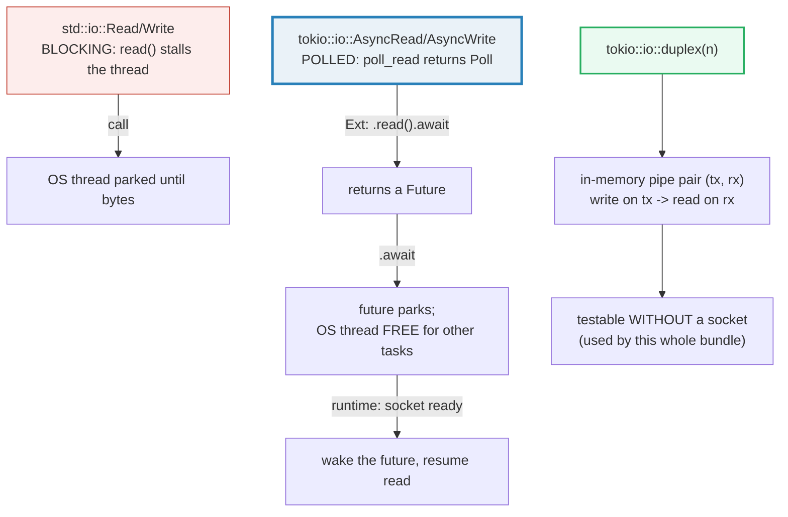

# TOKIO_IO — AsyncRead / AsyncWrite: Polled, Awaitable I/O

> **One-line goal:** `tokio::io` mirrors `std::io` (`Read`/`Write`) but the traits
> are **`AsyncRead`/`AsyncWrite`** — methods are **polled by the runtime, not
> blocking**, so every read/write **`.await`s** a `Future` instead of parking a
> thread. The `Ext` traits (`.read`, `.read_to_end`, `.write_all`, `.flush`),
> `tokio::io::duplex`, `tokio::io::copy`, `BufReader::lines`, EOF semantics, and
> the `tokio_util::io` stream bridges are all demonstrated on a **deterministic
> in-memory pipe** — no network, no files.
>
> **Run:** `just run tokio_io` (== `cargo run --bin tokio_io`)
> **Member:** `async` (deps: `tokio` `full`, `tokio-util` `io`, `bytes`, `futures`).
> **Prerequisites:** 🔗 [TOKIO_RUNTIME](./TOKIO_RUNTIME.md) — `AsyncRead`/`AsyncWrite`
> are **polled** by the runtime; you need the runtime mental model first.
> 🔗 sync `Read`/`Write` sibling (Phase 5) — `tokio::io` is its async twin.
> **Ground truth:** [`tokio_io.rs`](./tokio_io.rs); captured stdout:
> [`tokio_io_output.txt`](./tokio_io_output.txt).

---

## Why this exists (lineage)

Phase 5 had `std::io::{Read, Write}` — **blocking** I/O. A call to `read()`
**stalls the OS thread** until bytes arrive, which is fatal for a server that
must hold thousands of connections open on a handful of threads. The two classic
escapes are bad:

| Model | Who blocks? | Cost / problem |
|---|---|---|
| **1 thread per connection** + blocking `read` | The OS thread | C10k: ~1 MB stack × 10k = 10 GB; context-switch thrash; idle threads waste memory. |
| **Manual `select`/`epoll` + non-blocking sockets** | You hand-wire readiness | State machines written by hand; a nightmare to get right. |
| **`AsyncRead`/`AsyncWrite` + `async fn`** (Tokio) | **Nobody** — a future `.await`s | One thread parks the **future**, not the OS thread; the runtime wakes it when the socket is ready. Zero-cost polling. |

`tokio::io` is the asynchronous version of `std::io`: it defines two traits,
`AsyncRead` and `AsyncWrite`, whose primitive methods are `poll_read` /
`poll_write` (they return `Poll::Result`, not the data). You almost never call
those directly — the **extension traits** `AsyncReadExt` and `AsyncWriteExt`
layer async methods (`.read().await`, `.write_all().await`, ...) on top, each
returning a `Future` you `.await`. That `.await` is the *whole* point: it yields
control back to the runtime while the I/O is not ready, so one thread can juggle
thousands of `.await`ing connections.



---

## The two traits + the `Ext` layer

`AsyncRead` and `AsyncWrite` are the **poll-based** core; the `Ext` traits are
the **`.await`-able** surface you actually call. You import the `Ext` traits and
forget the poll methods exist.

```rust
// CORE (poll-based) — you almost never call these directly:
trait AsyncRead  { fn poll_read(self: Pin<&mut Self>, cx, buf: &mut ReadBuf) -> Poll<io::Result<()>>; }
trait AsyncWrite { fn poll_write(self: Pin<&mut Self>, cx, buf: &[u8]) -> Poll<io::Result<usize>>;
                   fn poll_flush(...);  fn poll_shutdown(...); }

// EXT (.await-able) — this is your daily API:
use tokio::io::{AsyncReadExt, AsyncWriteExt};
reader.read(&mut buf).await          // -> io::Result<usize>   (Ok(0) == EOF)
reader.read_to_end(&mut v).await     // -> io::Result<usize>   (drains to EOF)
reader.read_exact(&mut buf).await    // -> io::Result<()>      (fills buf or errs)
writer.write(&buf).await             // -> io::Result<usize>   (partial)
writer.write_all(&buf).await         // -> io::Result<()>      (whole buffer)
writer.flush().await                 // -> io::Result<()>
```

> **The `Self: Unpin` bound.** Every `Ext` method requires `Self: Unpin`. The
> `Ext` futures hold `&mut self` and poll it **without being pinned themselves**,
> which is only sound if `Self` can be freely moved (i.e. is `Unpin`). In
> practice `duplex` halves, `Cursor`, `BufReader`, sockets and `Vec<u8>` are all
> `Unpin`, so this is invisible — until you wrap something `!Unpin` (a
> self-referential type, a `!Unpin` future). Then `.read().await` won't compile
> and you must `Box::pin` the reader or use `tokio_util`'s pinned helpers. See
> the pitfalls table.

---

## Section A — AsyncWrite/AsyncRead over an in-memory `duplex`

`tokio::io::duplex(n)` returns **a pair of connected in-memory byte streams**:
bytes written on one half become readable on the other, exactly like a socket
pair. `n` is the per-side buffer cap before a write parks. It implements both
`AsyncRead` *and* `AsyncWrite`, so the same `Ext` methods apply. This is the
**test-friendly substitute for a real TCP connection** — no DNS, no network,
fully deterministic, which is why every section below builds on it.

```rust
use tokio::io::{AsyncReadExt, AsyncWriteExt, duplex};
let (mut tx, mut rx) = duplex(64);
tx.write_all(b"hello").await?;     // write_all loops poll_write until all 5 bytes accepted
let mut buf = [0u8; 16];
let n = rx.read(&mut buf).await?;  // n == 5; &buf[..5] == b"hello"
```

> **From tokio_io.rs Section A:**
> ```
> ======================================================================
> SECTION A — AsyncWrite/AsyncRead over an in-memory duplex pipe
> ======================================================================
>   let (mut tx, mut rx) = tokio::io::duplex(64);
>   tx.write_all(b"hello").await;   // 5 bytes flow into the pipe
>   rx.read(&mut buf).await -> 5 bytes: [104, 101, 108, 108, 111]  ("hello")
> [check] bytes written on `tx` emerge unchanged on `rx` through the duplex: OK
> [check] a single .read() drained the whole 5-byte payload: OK
> [check] after flush, the extra byte written is readable on the other side: OK
> ```

**What.** `tx.write_all(b"hello")` pushes 5 bytes into the pipe; `rx.read(&mut
buf)` pulls them back out. The first two checks confirm the bytes round-trip
unchanged and that a single `.read()` drained the whole 5-byte payload.

**Why (internals).**
- **`write_all` vs `write`.** `AsyncWriteExt::write(&[u8])` may accept only a
  *prefix* of the slice (it returns how many bytes it took) — exactly like the
  raw `poll_write` underneath. `write_all` is the loop wrapper that keeps calling
  `write` until the **entire** slice is consumed; it returns `Ok(())` only when
  every byte is written. Use `write_all` unless you specifically want
  partial-write semantics.
- **`write_all` does NOT flush.** Tokio's `write_all` mirrors `std` — it pushes
  bytes into the writer's buffer (or the kernel), but does **not** guarantee they
  reached the far end. The third check writes one more byte and then calls
  `.flush().await` explicitly to force it down. For a `duplex` this is usually a
  no-op (no user-space buffering), but for `BufWriter`/sockets forgetting
  `.flush()` is a classic "where did my last bytes go?" bug.
- **Backpressure is `max_buf_size`.** If the receiver hasn't drained, the
  per-side buffer fills to `n`; the next `write_all` `.await` **parks the writer
  future** (returns `Poll::Pending`) until the reader frees space. That *is*
  async backpressure — no unbounded queue, no OOM. Set `n` to bound memory.
- **`Ok(0)` is the only EOF signal.** A `.read()` returning `0` means EOF; `0 <
  n <= buf.len()` means data. There is no separate "EOF error".

🔗 [TOKIO_RUNTIME](./TOKIO_RUNTIME.md) — the `.await` that parks here hands the
thread to another ready future; the runtime wakes this one when `rx` is drained.

---

## Section B — `tokio::io::copy` streams reader → writer, returns the total

`tokio::io::copy(&mut reader, &mut writer)` is the async twin of
`std::io::copy`. It allocates an **8 KB scratch buffer**, loops
`read` → `write` until the reader hits **EOF**, and returns the **total number
of bytes moved**.

```rust
use tokio::io::copy;
let copied: u64 = copy(&mut reader, &mut writer).await?;   // streams to EOF, then stops
```

> **From tokio_io.rs Section B:**
> ```
> ======================================================================
> SECTION B — tokio::io::copy streams reader -> writer, returns total bytes
> ======================================================================
>   tx.write_all(b"world").await;   // 5 bytes seeded into the pipe
>   drop(tx);   // signal EOF so `copy` knows when to stop
>   copy(&mut rx, &mut sink).await -> copied = 5 bytes
>   sink = "world"
> [check] copy reports the exact byte count it moved (5): OK
> [check] copy's destination contains the streamed bytes: OK
> ```

**What.** Five bytes are seeded into `rx`'s side of the duplex; the writer `tx`
is **dropped** so `rx` sees EOF after draining; `copy` pumps the bytes into a
`Vec<u8>` sink and reports `copied == 5`, with `sink == b"world"`.

**Why (internals).**
- **`copy` needs EOF to terminate.** Its loop is `loop { read; if 0 break; write;
  }`. If the writer were never dropped, `rx` would never return `Ok(0)` and
  `copy` would `.await` **forever** — a silent deadlock. Dropping `tx` *is* the
  EOF signal (Section E makes this explicit). This is the single most common
  "my copy hangs" bug.
- **Both bounds must be `Unpin`.** The signature is `copy<'a, R, W>(reader: &'a
  mut R, writer: &'a mut W) where R: AsyncRead + Unpin, W: AsyncWrite + Unpin`.
  You hold `&mut` references for the whole duration; a `!Unpin` reader must be
  pinned first.
- **8 KB is fixed** (heap-allocated). For different chunk sizes wrap the reader
  in `BufReader::with_capacity` and use `copy_buf`, or drive `read`/`write_all`
  yourself in a loop.

🔗 [TOKIO_CHANNELS](./TOKIO_CHANNELS.md) — the duplex *is* conceptually a
bounded byte channel with backpressure; `mpsc` channels give you the
message-oriented version.

---

## Section C — `read_to_end` drains an `AsyncRead` fully into a `Vec<u8>`

`AsyncReadExt::read_to_end(&mut buf)` **appends** repeatedly to `buf` until
`read()` returns `Ok(0)`, then returns the count of newly-read bytes. A
`Cursor<Vec<u8>>` is an in-memory `AsyncRead` whose content is fixed, so the
whole payload is read then EOF.

```rust
let mut reader = std::io::Cursor::new(b"data".to_vec());
let mut buf = Vec::new();
let n = reader.read_to_end(&mut buf).await?;   // n == 4, buf == b"data"
```

> **From tokio_io.rs Section C:**
> ```
> ======================================================================
> SECTION C — read_to_end drains an AsyncRead fully into a Vec<u8>
> ======================================================================
>   let reader = Cursor::new("the quick brown fox");   // 19 bytes, then EOF
>   read_to_end(&mut buf).await -> read = 19 bytes
>   buf = "the quick brown fox"
> [check] read_to_end returns the full payload length: OK
> [check] read_to_end captured the exact bytes of the source: OK
> ```

**What.** A 19-byte `Cursor` is drained entirely: `read == 19`, `buf == "the
quick brown fox"`.

**Why (internals).**
- **`read_to_end` loops `read()` until `Ok(0)`.** Its contract: "this function
  will continuously call `read()` to append more data to `buf` until `read()`
  returns `Ok(0)`" (docs.rs). So like `copy`, **it requires a real EOF to
  terminate** — a half-open duplex would hang it. Use it on files / cursors /
  request bodies that have a known end.
- **It appends, it doesn't replace.** Bytes already in `buf` stay; the new ones
  are pushed. The returned `usize` is only the *new* byte count.
- **vs `read_exact`.** `read_exact(&mut fixed_buf)` fills an *exact* buffer or
  errors with `UnexpectedEof`; `read_to_end` reads *everything* with no upper
  bound. For untrusted streams `read_to_end` is a **memory-DoS vector** — prefer
  `read_exact` / size-limited reads (`.take(n)`) there.

---

## Section D — `BufReader` + `lines()`: async newline splitting

`BufReader::new(r)` wraps an `AsyncRead` with an **8 KB read-ahead buffer** so
many small reads share one big underlying read. `AsyncBufReadExt::lines()`
turns it into a `Lines` struct that implements the `Stream` trait, yielding one
`io::Result<String>` per line as each `\n` arrives.

```rust
use tokio::io::{BufReader, AsyncBufReadExt};
let mut lines = BufReader::new(reader).lines();
let first = lines.next_line().await??;   // io::Result<Option<String>>
```

> **From tokio_io.rs Section D:**
> ```
> ======================================================================
> SECTION D — BufReader + lines(): async newline-splitting over AsyncRead
> ======================================================================
>   tx.write_all(b"alpha\nbeta\ngamma"); drop(tx);
>   lines().next().await (1st) = "alpha"
>   lines().next().await (2nd) = "beta"
> [check] first line is split at the first newline -> "alpha": OK
> [check] second line is split at the second newline -> "beta": OK
> ```

**What.** Three lines are written; `next_line()` yields `"alpha"` then `"beta"`,
each split exactly at its `\n`.

**Why (internals).**
- **Why buffer at all?** A `read()` per line on a socket is a syscall per line —
  catastrophic. `BufReader` does *one* large `read` (up to 8 KB) into an
  in-memory buffer, then `lines()` scans that buffer for `\n` without touching
  the socket. The docs are blunt: it "does not help when reading very large
  amounts at once, or reading just one or a few times. It also provides no
  advantage when reading from a source that is already in memory, like a
  `Vec<u8>`" — so for a `Cursor` it's stylistic, but for real sockets it's
  essential.
- **`lines()` strips the `\n` (and a trailing `\r`)** from each yielded `String`.
  If you need the raw delimiter bytes, use `read_until(b'\n', &mut buf)` instead
  (it keeps the delimiter).
- **`next_line()` vs `.next()` — the Stream trait gotcha.** `Lines` implements
  `Stream` (from `futures-core`), so in principle `lines.next().await` works —
  but it requires importing a `StreamExt` (`futures::StreamExt` *or*
  `tokio_stream::StreamExt`), and the wrong one fails to resolve. `Lines` exposes
  an **inherent** `async fn next_line() -> io::Result<Option<String>>` that needs
  **no trait import** and is the idiomatic tokio choice. (This bundle uses
  `next_line()`.)

🔗 [ITERATORS](./ITERATORS.md) — `lines()` is the async cousin of an iterator:
where an iterator's `.next()` returns synchronously, a `Stream`'s `.next()`
returns a `Future` you `.await`.

---

## Section E — EOF: dropping the writer terminates the reader

An `AsyncRead` signals **EOF by returning `Ok(0)`**. For a `duplex`, **dropping
the writer half** is what produces that `Ok(0)` on the reader half *after* it
drains the buffered bytes. If the writer is never dropped, the reader parks
forever — `read_to_end` would **hang**.

```rust
let (mut tx, mut rx) = duplex(64);
tx.write_all(b"final").await?;
drop(tx);                                   // <- the EOF signal
let mut out = Vec::new();
let n = rx.read_to_end(&mut out).await?;    // terminates: n == 5, then Ok(0)
```

> **From tokio_io.rs Section E:**
> ```
> ======================================================================
> SECTION E — EOF: dropping the writer lets the reader finish (no hang)
> ======================================================================
>   tx.write_all(b"final").await;   // 5 bytes buffered for rx
>   drop(tx);   // writer gone -> rx will hit Ok(0) after draining
>   rx.read_to_end(&mut out).await -> 5 bytes: "final"
> [check] after the writer drops, read_to_end returns (does NOT hang): OK
> [check] EOF drains exactly the bytes written before the drop: OK
> ```

**What.** Five bytes are buffered; `tx` is dropped; `rx.read_to_end` returns `5`
with `out == b"final"` and — crucially — **does not hang**.

**Why (internals).**
- **EOF is the only thing that ends a streaming read.** `read_to_end`, `copy`,
  and `lines()` all loop until they see `Ok(0)`. For a socket, EOF comes from the
  peer closing the connection; for a `duplex`, EOF comes from **dropping the
  other half**. A future stuck `.await`-ing a read whose writer lives forever is
  the canonical async deadlock.
- **Drained-then-EOF ordering is guaranteed.** The buffered bytes (`b"final"`)
  are delivered first; only *after* the buffer is empty does the next `read`
  return `Ok(0)`. No bytes are lost on close.
- **`shutdown` is the half-close.** For a bidirectional socket, `AsyncWriteExt::
  shutdown().await` closes the *write* direction while keeping the *read*
  direction open (so you can still receive the response). `drop` closes both.
- **`Ok(0)` ≠ "the reader is dead forever" — necessarily.** The `read()` docs
  warn `0` "can indicate EOF **or** a zero-length buffer"; and for some sources it
  doesn't mean "always no longer able to produce bytes." `read_to_end` treats it
  as terminal; if you hand-roll a loop, treat `0` as EOF and stop.

---

## Section F — `ReaderStream` / `StreamReader`: the AsyncRead ↔ Stream bridge

`tokio_util::io` (enabled by the `io` feature) provides the two halves of the
**byte-stream ↔ `AsyncRead` bridge** that hyper/reqwest use for chunked HTTP
bodies:

- **`ReaderStream`** — `AsyncRead` → `Stream<Item = io::Result<Bytes>>`. Turns a
  reader into a stream of byte chunks.
- **`StreamReader`** — `Stream<Item = io::Result<Bytes>>` → `AsyncRead`. Turns a
  chunk stream back into a reader.

```rust
use tokio_util::io::{ReaderStream, StreamReader};
// AsyncRead -> Stream
let s = ReaderStream::new(some_async_reader);
// Stream -> AsyncRead
let r = StreamReader::new(some_bytes_stream);
```

> **From tokio_io.rs Section F:**
> ```
> ======================================================================
> SECTION F — ReaderStream / StreamReader: bridge AsyncRead <-> byte Stream
> ======================================================================
>   ReaderStream::new(Cursor("stream-me!"))
>   -> 1 chunk(s); rejoined = "stream-me!"
> [check] ReaderStream re-emits the whole reader content when chunks are rejoined: OK
>   StreamReader::new(stream of [b"chunk-1", b"-chunk-2"])
>   reader.read_to_end(&mut out).await -> 15 bytes: "chunk-1-chunk-2"
> [check] StreamReader concatenates the chunks back into one byte stream: OK
> ```

**What.** Direction 1: a `Cursor("stream-me!")` is wrapped in `ReaderStream`;
its single chunk rejoins to the original 10 bytes. Direction 2: a stream of two
`Bytes` chunks (`chunk-1`, `-chunk-2`) is wrapped in `StreamReader`;
`read_to_end` concatenates them into `"chunk-1-chunk-2"` (15 bytes).

**Why (internals).**
- **Chunks are `Bytes`, not `Vec<u8>`.** `bytes::Bytes` is an **atomically
  reference-counted, sliceable** byte buffer — cloning a `Bytes` is cheap (bumps
  a refcount) and slicing it (`.slice(..)`) shares the allocation. That is why
  stream-of-`Bytes` is the lingua franca of HTTP bodies: a 1 GB body can be
  chunked and shared across tasks without copying. 🔗 The `bytes` crate is a
  first-class dep of the `async` member for exactly this reason.
- **`ReaderStream` chunk size = its internal buffer.** Default capacity gives one
  chunk per buffered read; a 10-byte `Cursor` yields one 10-byte chunk. For
  controlled chunking use `ReaderStream::with_capacity`.
- **"StreamWriter" does not exist.** The brief's "StreamWriter" is, in
  `tokio_util::io`, actually **`SinkWriter`** — it converts a `Sink<Bytes>` (a
  *push* async sink) into an `AsyncWrite`. The two real bridge types are
  `ReaderStream` (read→stream) and `StreamReader` (stream→read); the
  write-direction counterpart is `SinkWriter` (sink→write). There is no type
  named `StreamWriter` in tokio_util — naming it `StreamWriter` will not compile.

🔗 [SERDE_BASICS](./SERDE_BASICS.md) — read JSON: `StreamReader` over a stream
of HTTP body bytes → `AsyncRead` → `read_to_end` → `serde_json::from_slice`. The
bridge is the seam between "bytes on the wire" and "a typed value".

---

## Pitfalls (the expert payoff)

| Trap | Symptom | Fix / why |
|---|---|---|
| **`copy` / `read_to_end` hang forever** | The future never resolves | They loop until `Ok(0)` (EOF). For a duplex, you must **`drop` the writer half**; for a socket, the peer must close. No EOF = deadlock. |
| **`write_all` "loses" the last bytes** | Receiver never sees them | `write_all` does **not** flush. Call `.flush().await` (or `shutdown`) before assuming data was delivered — especially through `BufWriter`. |
| **`.read().await` in `tokio::select!`** works, **`.read_exact()` / `.read_u16()` don't** | Partial data after a cancelled branch | `read`/`write` are **cancel-safe**; `read_exact`, `read_u16`, `write_all`, etc. are **NOT** — a cancelled branch may have already filled part of `buf`/written part of the slice. Don't branch on them in `select!`. |
| **`cannot borrow as mutable` / `.read()` won't compile** | `Self: Unpin` not satisfied | The `Ext` methods require `Self: Unpin`. `!Unpin` types (self-referential, pinned futures) must be `Box::pin`'d or use `tokio_util`'s pinned helpers. |
| **`Stream` trait not satisfied on `Lines`** | `lines.next()` → "method not found" | `Lines` impls `Stream` but you need a `StreamExt` in scope — and `futures` vs `tokio_stream` `StreamExt` can mismatch. Use the **inherent** `lines.next_line().await` instead (no trait import). |
| **`read_to_end` on untrusted input = OOM** | Attacker streams 10 GB into your `Vec` | `read_to_end` has **no upper bound**. Use `read_exact` / `.take(max_bytes)` / `read_buf` with a capped `BytesMut` for untrusted sources. |
| **Naming "StreamWriter"** | Compile error: no such type | The `tokio_util::io` bridge is `ReaderStream`/`StreamReader` (read↔stream) and **`SinkWriter`** (sink→write). There is no `StreamWriter`. |
| **Forgetting `BufReader` on a socket** | One syscall per `read_line` | `read_line`/`lines` need buffering to be efficient. Wrap the socket in `BufReader` first. (It's a no-op benefit on an already-in-memory `Cursor`.) |
| **`Ok(0)` misread as "error"** | "Why did read return 0?" | `Ok(0)` is **EOF**, not an error. Errors are `Err(...)`. `0` from a zero-length buffer is also valid; distinguish by context. |
| **`duplex(n)` backpressure surprise** | Writer `.await` parks forever | When the per-side buffer (`n`) is full and the reader isn't draining, writes return `Poll::Pending` → the writer future parks. Size `n` for your latency/memory tradeoff and keep draining. |
| **Partial `write` mistaken for `write_all`** | Only some bytes sent | `write(&[u8])` returns how many bytes it accepted (may be < `buf.len()`). Loop it yourself or use `write_all`. |

---

## Cheat sheet

```rust
use tokio::io::{AsyncReadExt, AsyncWriteExt, AsyncBufReadExt, duplex, copy, BufReader};
use tokio_util::io::{ReaderStream, StreamReader};
use bytes::Bytes;

// in-memory pipe pair: write on tx, read on rx (test-friendly, no socket)
let (mut tx, mut rx) = duplex(64);
tx.write_all(b"hi").await?;        // loop poll_write until all bytes accepted
tx.flush().await?;                  // write_all does NOT flush — call this
let mut buf = [0u8; 8];
let n = rx.read(&mut buf).await?;   // Ok(0) == EOF; 0 < n <= buf.len() == data

// stream everything reader->writer until EOF; returns total bytes (8 KB buffer)
let n: u64 = copy(&mut reader, &mut writer).await?;

// drain fully into a Vec (needs a REAL EOF; OOM risk on untrusted input)
let mut v = Vec::new();
reader.read_to_end(&mut v).await?;

// buffered line reading (8 KB read-ahead); strips \n
let mut lines = BufReader::new(reader).lines();
while let Some(line) = lines.next_line().await? { /* ... */ }

// EOF: dropping the duplex writer signals Ok(0) to the reader (else read_to_end HANGS)
drop(tx);

// bridge: AsyncRead <-> Stream<io::Result<Bytes>>
let stream   = ReaderStream::new(async_reader);     // read   -> stream
let async_r  = StreamReader::new(bytes_stream);     // stream -> read
// (Sink<Bytes> -> AsyncWrite is SinkWriter; there is NO "StreamWriter")

// RULES:
//   - every Ext method needs `Self: Unpin`; .await every read/write.
//   - read/copy/lines loop until Ok(0); no EOF => deadlock.
//   - write_all doesn't flush; read_exact/read_u16/write_all are NOT cancel-safe.
```

---

## Sources

Every claim above was web-verified in at least two authoritative places (the
docs.rs API pages + the Tokio tutorial / Reference).

- **`tokio::io::duplex` docs** — `pub fn duplex(max_buf_size: usize) ->
  (DuplexStream, DuplexStream)`; "a pair of connected sockets";
  `max_buf_size` = bytes before a write returns `Poll::Pending` (backpressure):
  https://docs.rs/tokio/latest/tokio/io/fn.duplex.html
- **`tokio::io::copy` docs** — `pub async fn copy(reader, writer) -> Result<u64>`
  where `R: AsyncRead + Unpin`, `W: AsyncWrite + Unpin`; "streams … until `reader`
  returns EOF"; 8 KB heap-allocated buffer; returns total bytes copied:
  https://docs.rs/tokio/latest/tokio/io/fn.copy.html
- **`tokio::io::AsyncReadExt` docs** — `read` ("`Ok(0)` … can indicate EOF or a
  zero-length buffer"), `read_to_end` ("continuously call `read()` … until `read()`
  returns `Ok(0)`"), `read_exact` errors on early EOF, and the **cancel-safety**
  notes (`read` cancel-safe; `read_exact` **not**); all require `Self: Unpin`:
  https://docs.rs/tokio/latest/tokio/io/trait.AsyncReadExt.html
- **`tokio::io::AsyncWriteExt` docs** — `write` (partial, returns bytes written),
  `write_all` ("attempts to write an entire buffer"), `flush`, `shutdown`;
  require `Self: Unpin`:
  https://docs.rs/tokio/latest/tokio/io/trait.AsyncWriteExt.html
- **`tokio::io::BufReader` docs** — 8 KB default buffer; "does not help … when
  reading from a source that is already in memory"; `AsyncBufReadExt::lines`/
  `next_line`/`read_until`/`fill_buf`:
  https://docs.rs/tokio/latest/tokio/io/struct.BufReader.html
- **`tokio::io::AsyncRead` / `AsyncWrite` trait docs** — the poll-based core
  (`poll_read`/`poll_write`/`poll_flush`/`poll_shutdown`, `Pin<&mut Self>`):
  https://docs.rs/tokio/latest/tokio/io/trait.AsyncRead.html
  https://docs.rs/tokio/latest/tokio/io/trait.AsyncWrite.html
- **`tokio_util::io` module docs** — `ReaderStream` (AsyncRead → Stream of
  `Bytes`), `StreamReader` (Stream of `Bytes` → AsyncRead), `SinkWriter`
  (Sink → AsyncWrite), `CopyToBytes`, `SyncIoBridge`; "used in combination with
  hyper or reqwest":
  https://docs.rs/tokio-util/latest/tokio_util/io/index.html
- **Tokio Tutorial — "I/O"** — "primarily … two traits, `AsyncRead` and
  `AsyncWrite`, which are asynchronous versions of the `Read` and `Write` …
  `AsyncReadExt::read_to_end` reads all bytes from the stream until EOF":
  https://tokio.rs/tokio/tutorial/io
- **`bytes::Bytes` crate** — reference-counted, cheaply-cloneable/sliceable byte
  buffer; the chunk type used by the stream bridges:
  https://docs.rs/bytes/latest/bytes/struct.Bytes.html
