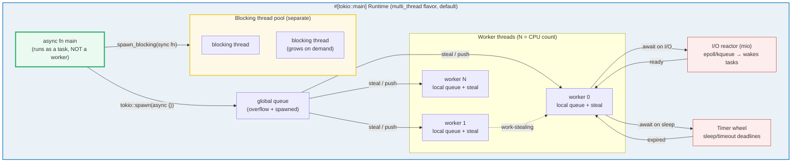
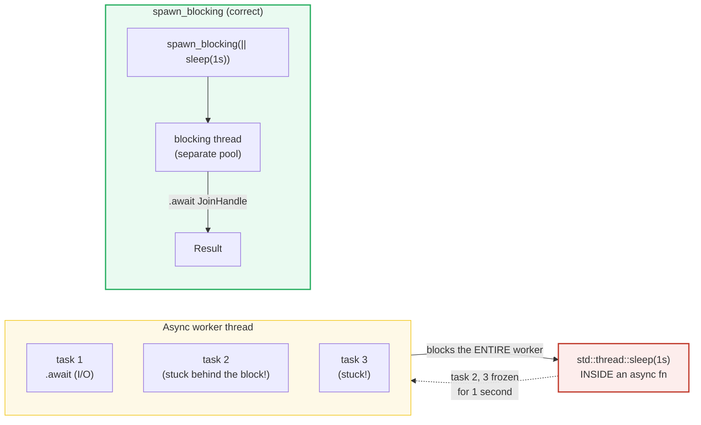

# TOKIO_RUNTIME — The Production Async Runtime: Tasks, Blocking, Timers

> **One-line goal:** tokio is the **production async runtime** — a work-stealing
> executor with a reactor for I/O and timers. It turns `async fn` into
> cooperatively-scheduled **tasks** (green threads) via `tokio::spawn`, offloads
> blocking sync work via `spawn_blocking`, and races futures against deadlines
> via `tokio::time::{sleep, timeout}`.
>
> **Run:** `just run tokio_runtime` (== `cargo run --bin tokio_runtime`)
> **Member:** `async` (deps: tokio `full`, futures, tracing, tokio-util, bytes).
> **Prerequisites:** read 🔗 [ASYNC_BASICS](./ASYNC_BASICS.md) (the hand-rolled
> executor and the `Future` trait) and 🔗 [THREADS](../core/THREADS.md)
> (`Send`/`Sync`, `join`) first — a tokio task IS a `Future`, and the runtime IS
> a thread pool.
> **Ground truth:** [`tokio_runtime.rs`](./tokio_runtime.rs); captured stdout:
> [`tokio_runtime_output.txt`](./tokio_runtime_output.txt).

---

## Why this exists (lineage)

🔗 [ASYNC_BASICS](./ASYNC_BASICS.md) built a **hand-rolled** single-threaded
executor: a `Vec<BoxFuture>` polled in a loop, with a `Waker` that re-enqueued
ready futures. That bundle proves you understand what a `Future` *is* (a state
machine polled to `Poll::Ready`), and what an executor *does* (drive futures,
park on `Poll::Pending`). But it could not do **I/O** (no `epoll`/`kqueue`
reactor), could not do **timers** (no timer wheel), and ran on **one thread**
(no work-stealing across cores).

**tokio is the production version of that executor.** It provides:

| Layer | What it is | The hand-rolled analog |
|---|---|---|
| **Scheduler** | a work-stealing thread pool of worker threads, each with a local run-queue | the `Vec<BoxFuture>` loop |
| **Reactor (I/O)** | `mio` wrapping `epoll`/`kqueue`/IOCP — registers sockets, wakes the task when data arrives | none (hand-rolled had no I/O) |
| **Timer** | a hierarchical timer wheel — `sleep`/`timeout` register deadlines, the reactor wakes on expiry | none |
| **Blocking pool** | a **separate** growable thread pool for sync (blocking) work, isolated from the async workers | none |
| **Task** | `tokio::spawn(async {})` — a green thread, cheaper than an OS thread, that the scheduler polls | `Box::pin(async {})` pushed to the queue |

The runtime's job is to **poll futures efficiently**: run ready tasks, and park
the worker thread (via the reactor) when every task is `Poll::Pending` waiting
on I/O or a timer — instead of busy-spinning.



The critical insight: **the async worker threads and the blocking pool are
physically separate.** A blocking call (`std::thread::sleep`, a sync DB query)
on a worker thread freezes that worker's entire run-queue — every task queued
behind it stalls. `spawn_blocking` routes such work to the dedicated pool so
the async workers never block.

---

## Section A — `#[tokio::main]` + `tokio::spawn` → `JoinHandle`

```rust
#[tokio::main]                     // bootstraps the runtime, then block_on(main)
async fn main() {
    let handle: tokio::task::JoinHandle<i32> = tokio::spawn(async { 42 });
    let result = handle.await;     // Result<i32, JoinError>
    assert_eq!(result.unwrap(), 42);
}
```

> **From tokio_runtime.rs Section A:**
> ```
> ======================================================================
> SECTION A — #[tokio::main] + tokio::spawn -> JoinHandle
> ======================================================================
>   // `#[tokio::main]` expands to building a multi-thread runtime and
>   // calling .block_on() on `async fn main`. It is NOT magic — it is:
>   //   Builder::new_multi_thread().enable_all().build().block_on(main)
>   // The async main itself runs as a task on the runtime, NOT as a
>   // worker; you `tokio::spawn` real worker tasks from it.
>   let h: JoinHandle<i32> = tokio::spawn(async { 42 });
>   h.await -> Ok(42)
> [check] tokio::spawn(async { 42 }).await yields Ok(42): OK
> [check] spawned task is a TASK (green thread): its value comes back via the handle: OK
> ```

**What.** `#[tokio::main]` turns `async fn main` into a real entry point by
**constructing a runtime** and calling `.block_on()` on it. `tokio::spawn` then
launches an async block as a **task** — the async analog of `std::thread::spawn`
— and returns a `JoinHandle<T>`. Awaiting the handle yields `Result<T,
JoinError>` (the error case is Section B).

**Why (internals).** The macro expansion is fully documented
([docs.rs `#[tokio::main]`][tokio-main]):

```rust
// What #[tokio::main] expands to (multi_thread, the DEFAULT flavor):
fn main() {
    tokio::runtime::Builder::new_multi_thread()
        .enable_all()           // enables I/O reactor + timer wheel
        .build()
        .unwrap()
        .block_on(async {
            println!("Hello world");   // <- your async main body
        });
}
```

Key facts from the tokio docs:
- **`worker_threads` defaults to the number of CPUs.** The `multi_thread`
  flavor is the default; it requires the `rt-multi-thread` feature flag (enabled
  by the `full` feature) ([docs.rs][tokio-main]).
- **`async fn main` is NOT a worker.** The docs state: "the async function
  marked with this macro does not run as a worker. The expectation is that other
  tasks are spawned by the function here. Awaiting on other futures from the
  function provided here will not perform as fast as those spawned as workers"
  ([docs.rs][tokio-main]). This is why real work goes in `tokio::spawn`.
- **A task is a green thread.** The tokio tutorial: "A Tokio task is an
  asynchronous green thread. They are created by passing an async block to
  `tokio::spawn`. The `tokio::spawn` function returns a `JoinHandle`"
  ([tokio.rs tutorial — Spawning][tokio-spawn]).
- **Tasks can migrate between worker threads.** The multi-thread scheduler uses
  **work-stealing**: a worker with an empty queue steals from another worker's
  queue or the global queue. This is why spawned tasks must be `Send + 'static`
  — they may resume on a different OS thread
  ([StackOverflow — work-stealing][so-worksteal]).
- **`JoinHandle` detaches on drop.** Dropping the handle without awaiting does
  NOT cancel the task — the task keeps running in the background (detached). To
  cancel, call `.abort()` ([docs.rs `JoinHandle`][tokio-joinhandle]).

### Runtime flavors

| Flavor | Macro | Scheduler | When to use |
|---|---|---|---|
| **`multi_thread`** (default) | `#[tokio::main]` or `#[tokio::main(flavor = "multi_thread")]` | N workers, work-stealing | Servers, anything CPU-parallel or I/O-heavy |
| **`current_thread`** | `#[tokio::main(flavor = "current_thread")]` | 1 worker thread | Embedded, WASM, single-core, or when `Send` bounds are a burden |
| **`local`** | `#[tokio::main(flavor = "local")]` | 1 worker, supports `!Send` tasks via `spawn_local` | When you need `!Send` futures on a single thread |

The `current_thread` runtime still spawns **separate threads** for
`spawn_blocking` — only the async code is single-threaded
([docs.rs `spawn_blocking`][tokio-spawnblocking]).

---

## Section B — A panicking task → `JoinHandle.await` is `Err(JoinError)`

```rust
let handle: tokio::task::JoinHandle<i32> = tokio::spawn(async {
    panic!("boom inside a task");
});
let result = handle.await;      // Err(JoinError) — NOT a process abort
assert!(result.is_err());
```

> **From tokio_runtime.rs Section B:**
> ```
> ======================================================================
> SECTION B — a panicking task -> JoinHandle.await is Err (JoinError)
> ======================================================================
>   // tokio CATCHES a task panic and surfaces it as Err(JoinError),
>   // so ONE panicking task does NOT tear down the whole runtime.
>   // (The panic message still hits stderr; it is NOT in this stdout.)
>   let h = tokio::spawn(async { panic!("boom inside a task") });
>   panicking_task.await -> is_err() = true
> [check] a panicked task's JoinHandle.await is Err (JoinError), not an abort: OK
> ```

**What.** A task that panics does **not** abort the process. The runtime catches
the panic (via `std::panic::catch_unwind` internally) and stores it as a
`JoinError` in the `JoinHandle`. The check confirms `result.is_err()`.

**Why (internals).**
- **tokio mirrors `std::thread::join`'s contract.** Just as `thread::spawn`
  catches a panic and surfaces it as `Err(Box<dyn Any>)` from `join().unwrap()`,
  tokio catches task panics and surfaces them as `Err(JoinError)`. As Jack
  O'Connor's analysis notes: "The Tokio version had an extra `.unwrap()` after
  `handle.await`, because Tokio catches panics and converts them to `Result`s,
  like `.join()` does" ([O'Connor — Async Rust, Tasks][jacko-tasks]).
- **The panic message still prints to stderr.** The default panic hook runs
  *before* `catch_unwind` catches the payload, so you see `thread
  'tokio-rt-worker' panicked at ...` on stderr. That is why this bundle's stdout
  (captured by `just out`) is clean — only `is_err() = true` appears in the
  output, never the panic text. The check is on the `Result` variant, not on
  any panic string.
- **`catch_unwind` requires `panic = "unwind"`.** This is the default for debug
  builds (what `cargo run` uses). If the profile were set to `panic = "abort"`,
  `catch_unwind` cannot catch and the process would terminate — so tokio's
  panic-isolation guarantee depends on unwinding being enabled. The workspace
  uses the default (no profile override), so Section B works.

> **The `JoinError` vs `Elapsed` distinction.** Both are `Err` variants, but
> they mean different things: `JoinError` = "the task ended badly (panic /
> cancelled)"; `Elapsed` (Section D) = "the future was too slow." Don't
> confuse them.

---

## Section C — `spawn_blocking`: offload sync work off the async thread

```rust
// A SYNC closure (no async!), run on a dedicated blocking thread.
let handle = tokio::task::spawn_blocking(|| 7 * 6);
let result = handle.await;     // Ok(42) — same JoinHandle<R> shape as spawn
```

> **From tokio_runtime.rs Section C:**
> ```
> ======================================================================
> SECTION C — spawn_blocking offloads SYNC work off the async thread
> ======================================================================
>   // A blocking/sync call inside an async fn STALLS the executor
>   // thread: no other task on that worker can make progress until it
>   // returns. spawn_blocking moves it to a DEDICATED blocking pool.
>   // Signature: F: FnOnce() -> R + Send + 'static  (a sync closure!)
>   let h = tokio::task::spawn_blocking(|| 7 * 6);
>   spawn_blocking(|| 7*6).await -> Ok(42)
> [check] spawn_blocking(|| 7*6).await yields Ok(42): OK
> [check] spawn_blocking returns the SAME shape as spawn (JoinHandle<R>): OK
> ```

**What.** `spawn_blocking` takes a **plain (non-async) closure** and runs it on
a thread from the runtime's **dedicated blocking pool** — physically separate
from the async worker threads. It returns `JoinHandle<R>`, the same shape as
`tokio::spawn`, so you await it identically.

**Why (internals).** The signature from the docs
([docs.rs `spawn_blocking`][tokio-spawnblocking]):

```rust
pub fn spawn_blocking<F, R>(f: F) -> JoinHandle<R>
where
    F: FnOnce() -> R + Send + 'static,   // <- a SYNC closure, not async
    R: Send + 'static,
```

The docs state the core rule: "In general, issuing a blocking call or performing
a lot of compute in a future without yielding is problematic, as it may prevent
the executor from driving other futures forward. This function runs the provided
closure on a thread dedicated to blocking operations"
([docs.rs][tokio-spawnblocking]).

**The "don't block the async thread" rule.** An async worker thread runs a
**run-queue of tasks**. If one task calls `std::thread::sleep` (or a blocking
`read()`, or `std::fs::read_to_string`, or a CPU-bound loop without `.await`),
that worker **cannot poll any other task** until the call returns — the
scheduler is cooperative, and `.await` is the only yield point. Alice Ryhl's
canonical post explains: "The spawn_blocking function. The Tokio runtime
includes a separate thread pool specifically for running blocking functions"
([Ryhl — Async: What is blocking?][ryhl-blocking]).



The docs give a clear rule of thumb for when to use `spawn_blocking` vs a
dedicated thread ([docs.rs][tokio-spawnblocking]):
- **Use `spawn_blocking`** for **short-lived** blocking operations (a DB query,
  a file read, a small computation).
- **Use `thread::spawn`** for **long-lived / persistent** blocking workloads
  (a background worker loop), because each `spawn_blocking` call occupies a
  pool thread for its duration, and saturating the pool queues later work.

> **`spawn_blocking` tasks cannot be aborted.** Unlike async tasks (where
> `.abort()` drops the future at the next `.await`), a `spawn_blocking` task
> that has started **cannot** be cancelled — the docs warn: "tasks spawned
> using `spawn_blocking` cannot be aborted because they are not async"
> ([docs.rs][tokio-spawnblocking]).

---

## Section D — `tokio::time::timeout`: race a future against a deadline

```rust
use std::time::Duration;
use std::future::pending;

// A future that NEVER resolves always loses → Err(Elapsed).
let lost = tokio::time::timeout(Duration::from_millis(1), pending::<()>()).await;
assert!(lost.is_err());

// An immediate future always wins, even against a long deadline → Ok.
let won = tokio::time::timeout(Duration::from_secs(60), async { 99 }).await;
assert_eq!(won.unwrap(), 99);
```

> **From tokio_runtime.rs Section D:**
> ```
> ======================================================================
> SECTION D — tokio::time::timeout races a future against a deadline
> ======================================================================
>   // timeout(d, future) -> Result<T, Elapsed>. If the future does not
>   // finish within d, it is CANCELED and you get Err(Elapsed).
>   // We assert the VARIANT only — never the elapsed wall-clock.
>   let r = tokio::time::timeout(Duration::from_millis(1), pending::<()>());
>   timeout(1ms, never_completes).await -> is_err() = true
> [check] timeout(tiny, never_completes) -> Err(Elapsed): OK
>   let r = tokio::time::timeout(Duration::from_secs(60), async { 99 });
>   timeout(60s, immediate).await -> Ok(99)
> [check] timeout(long, immediate_future) -> Ok(99) (instant future wins the race): OK
> ```

**What.** `timeout(duration, future)` wraps a future with a deadline. If the
future finishes in time, you get `Ok(value)`; if not, the future is **canceled**
(dropped) and you get `Err(Elapsed)`. The two checks show both branches.

**Why (internals).** The signature and contract from the docs
([docs.rs `timeout`][tokio-timeout]):

```rust
pub fn timeout<F>(duration: Duration, future: F) -> Timeout<F::IntoFuture>
where F: IntoFuture;
// Returns a future whose Output is Result<T, Elapsed>,
// where T is the return type of the provided future.
```

The docs: "Requires a `Future` to complete before the specified duration has
elapsed. If the future completes before the duration has elapsed, then the
completed value is returned. Otherwise, an error is returned and the future is
**canceled**" ([docs.rs][tokio-timeout]).

Key subtlety — the docs warn about a corner case: "the timeout is checked
before polling the future, so if the future does not yield during execution then
it is possible for the future to complete and exceed the timeout *without*
returning an error" ([docs.rs][tokio-timeout]). This is the Section C problem
in disguise: a blocking future that never hits `.await` cannot be preempted by
the timer, so the timeout silently fails to fire.

The docs also guarantee: "If the provided future completes immediately, then the
future returned from this function is guaranteed to complete immediately with an
`Ok` variant no matter the provided duration" ([docs.rs][tokio-timeout]). That
is the second check — `timeout(60s, async { 99 })` returns `Ok(99)` instantly.

> **Cancellation = dropping the future.** The docs: "Cancelling a timeout is
> done by dropping the future. No additional cleanup or other work is
> required." When `timeout` fires `Err(Elapsed)`, the inner future is **dropped**
> — its stack state is unwound. If that future held a resource (a lock, a
> connection), it is released at that point. This is `async`'s analog of
> `Drop`. 🔗 [ASYNC_BASICS](./ASYNC_BASICS.md).

> **DETERMINISM (why we never assert elapsed).** The `Duration` you pass is a
> *lower bound* on when the timer fires — actual elapsed time depends on OS
> scheduling, CPU load, and timer granularity. This bundle asserts only the
> `Result` **variant** (`is_err()` / `Ok(99)`), never a measured
> `Instant::now()` delta. See `HOW_TO_RESEARCH.md` §4.2 rule 3.

---

## Section E — `tokio::time::sleep`: the async analog of `thread::sleep`

```rust
// Yields the task back to the executor until the duration elapses.
// Other tasks run during the wait — the worker is NOT blocked.
let done = {
    tokio::time::sleep(Duration::from_millis(1)).await;
    true
};
assert!(done);
```

> **From tokio_runtime.rs Section E:**
> ```
> ======================================================================
> SECTION E — tokio::time::sleep is the async analog of thread::sleep
> ======================================================================
>   // sleep(d).await YIELDS the task back to the executor until d has
>   // elapsed, then resumes — other tasks run during the wait. This is
>   // the cooperative scheduling contract: `.await` is the yield point.
>   // We assert a flag set AFTER, never the wall-clock duration.
>   after sleep(1ms).await: done = true
> [check] flag set to true after sleep(tiny).await completes: OK
> ```

**What.** `sleep(d).await` pauses the current task for `d`, then resumes. The
check confirms a flag set **after** the sleep completes — we never print or
assert the actual elapsed wall-clock.

**Why (internals).** The docs: "`sleep` waits until duration has elapsed.
Equivalent to `sleep_until(Instant::now() + duration)`. An asynchronous analog
to `std::thread::sleep`" ([docs.rs `sleep`][tokio-sleep]).

The critical difference from `std::thread::sleep`:
- `std::thread::sleep(1s)` **blocks the OS thread** — nothing else runs on it
  for 1 second.
- `tokio::time::sleep(1s).await` **yields** the task back to the executor. The
  task registers a timer deadline with the runtime's timer wheel, returns
  `Poll::Pending`, and the worker **immediately polls another ready task**.
  When the timer expires, the reactor wakes the sleeping task and it resumes.

This is the **cooperative scheduling contract** in action: `.await` is the
yield point. Every `.await` is a place where the executor may switch to another
task. A task that never `.await`s (e.g. a tight CPU loop) **hoggs** its worker
until it finishes — the scheduler cannot preempt it. This is the complement of
the "don't block the async thread" rule from Section C.

---

## Section F — Concurrent tasks: collect → sort → assert (determinism)

```rust
const N: i32 = 5;
let results: Arc<Mutex<Vec<i32>>> = Arc::new(Mutex::new(Vec::new()));

let mut handles = Vec::new();
for i in 0..N {
    let r = results.clone();
    handles.push(tokio::spawn(async move {
        tokio::task::yield_now().await;   // cooperative yield — may reorder
        r.lock().await.push(i * i);       // push into shared, locked Vec
    }));
}
for h in handles { h.await.unwrap(); }    // join all

let mut sorted = results.lock().await.clone();
sorted.sort_unstable();                   // SORT — kill nondeterministic order
assert_eq!(sorted, vec![0, 1, 4, 9, 16]); // the SET is invariant
```

> **From tokio_runtime.rs Section F:**
> ```
> ======================================================================
> SECTION F — N concurrent tasks -> collect (Mutex<Vec>), SORT, assert the SET
> ======================================================================
>   // Task interleaving is nondeterministic, so we NEVER print from
>   // tasks in scheduling order. Each task pushes its value into a
>   // shared Mutex<Vec>; after joining ALL tasks we SORT and print from
>   // main. The sorted SET is invariant; the arrival order is not.
>   5 tasks each pushed i*i; sorted results = [0, 1, 4, 9, 16]
> [check] 5 tasks' results collected + sorted == [0, 1, 4, 9, 16]: OK
> [check] exactly 5 values were collected (one per joined task): OK
> ```

**What.** Five tasks are spawned concurrently, each computing `i * i` and
pushing it into a shared `tokio::sync::Mutex<Vec<i32>>`. After joining all five,
the `Vec` is **sorted** and printed. The sorted set `[0, 1, 4, 9, 16]` is
deterministic even though the push order is not.

**Why (internals).**
- **Task interleaving is nondeterministic.** On the `multi_thread` runtime, the
  five tasks may run on different worker threads in any order — `yield_now()`
  makes this explicit by forcing a yield. Printing push order directly would
  produce different output on every run. The fix: collect into a shared
  container, then **sort before printing** from `main` after all joins.
- **`tokio::sync::Mutex` vs `std::sync::Mutex`.** The async `Mutex`'s
  `.lock().await` does **not** block the worker thread — if the lock is held,
  the task yields (`Poll::Pending`) and the worker polls another task. This is
  the right choice for shared state touched from `async` code. `std::sync::Mutex`
  would block the worker thread while waiting (acceptable only for locks held
  for trivially short, non-async critical sections). 🔗 [TOKIO_CHANNELS](./TOKIO_CHANNELS.md)
  shows the channel alternative (`mpsc`) which avoids shared mutable state
  entirely.
- **`Arc<Mutex<...>>` is the sharing pattern.** `tokio::spawn` requires `Send +
  'static`, so the shared `Vec` must live on the heap behind an `Arc` (for
  shared ownership across tasks) wrapping a `Mutex` (for interior mutability).
  This is the async analog of the `Arc<Mutex<T>>` pattern from
  🔗 [THREADS](../core/THREADS.md).
- **`join` all handles, then read.** The `for h in handles { h.await }` loop is
  the barrier: only after every task is joined can we safely read the final
  `Vec`. Dropping a handle without awaiting would **detach** the task — it keeps
  running, and we would race on reading incomplete results.

---

## Pitfalls (the expert payoff)

| Trap | Symptom | Fix / why |
|---|---|---|
| **Blocking inside an async fn** | One slow task freezes the entire worker; other tasks stall | Use `spawn_blocking` for sync I/O / CPU loops, or make it truly async (`tokio::fs`, `reqwest`). `.await` is the ONLY yield point — no `.await`, no preemption. |
| **`.unwrap()` on `JoinHandle.await`** | Panics if the task panicked (you get `Err(JoinError)`, not the value) | Handle the `Result`: `handle.await?` or `match`. tokio catches task panics into `JoinError`, mirroring `thread::join`. |
| **Dropping the `JoinHandle` = detach** | "My task didn't run" / ran but you didn't wait | Dropping the handle **detaches** (background) — the task keeps running but you can't join. Await it if you need the result; `.abort()` to cancel. |
| **`std::sync::Mutex` in async code** | Deadlock: a worker thread blocks on `.lock()`, stalling all tasks on it | Use `tokio::sync::Mutex` (`.lock().await` yields) for locks held across `.await`. `std::sync::Mutex` is OK only for trivial, non-async critical sections. |
| **`timeout` doesn't fire on a blocking future** | A future that never `.await`s exceeds its timeout silently | The timeout is checked at `.await` boundaries. A blocking future that spins without yielding cannot be preempted by the timer. Make it yield, or use `spawn_blocking`. |
| **Asserting elapsed timer duration** | Flaky test: "expected ~1ms, got 3ms" | Timers are lower bounds, not exact. Assert the `Result` variant (`Ok`/`Err(Elapsed)`), never a measured `Instant` delta. |
| **Forgetting `.enable_all()` on a manual `Builder`** | `panic: there is no reactor running` / timer panics | `#[tokio::main]` calls `enable_all()` for you. If you build a `Runtime` by hand, you MUST call `.enable_all()` to start the I/O reactor + timer wheel. |
| **`panic = "abort"` breaks task isolation** | One panicking task kills the whole process | tokio's panic-catching uses `catch_unwind`, which only works with `panic = "unwind"` (the default). With `abort`, `JoinError` isolation is lost. |
| **`spawn_blocking` for long-lived work** | Pool saturates; later `spawn_blocking` calls queue up | Use `thread::spawn` for persistent loops. `spawn_blocking` is for *short-lived* blocking ops (each call holds a pool thread for its duration). |
| **Printing from tasks in scheduling order** | `_output.txt` differs on every run | Async interleaving is nondeterministic. Collect into a `Mutex<Vec>`/channel, **sort**, print from `main` after join. (§4.2 rule 3.) |
| **Task not `Send + 'static`** | `error: future cannot be sent between threads safely` | The multi-thread scheduler may move a task between worker threads. Ensure captured data is `Send`; use `spawn_local` (needs `local` flavor) for `!Send` futures. |

---

## Cheat sheet

```rust
// BOOTSTRAP: #[tokio::main] = build a runtime + block_on(main).
#[tokio::main]                                    // default: multi_thread, N=CPUs
async fn main() { /* your async entry point */ }

// Equivalent manual form:
//   Builder::new_multi_thread().enable_all().build().unwrap()
//       .block_on(async { ... });

// Flavor variants:
#[tokio::main(flavor = "current_thread")]         // single-threaded scheduler
#[tokio::main(flavor = "multi_thread", worker_threads = 4)]

// SPAWN a task (green thread) -> JoinHandle<T>:
let handle: JoinHandle<i32> = tokio::spawn(async { 42 });
let result: Result<i32, JoinError> = handle.await; // Err if task panicked
// drop(handle);  // DETACHES — task keeps running, you just can't join
// handle.abort(); // CANCELS the task (drops it at next .await)

// BLOCKING work -> dedicated pool (NOT the async workers):
let h = tokio::task::spawn_blocking(|| 7 * 6);   // sync closure!
h.await  // -> Ok(42), same JoinHandle<R> shape
// short-lived ops -> spawn_blocking; long-lived -> std::thread::spawn

// TIMERS (require .enable_all() or #[tokio::main]):
tokio::time::sleep(Duration::from_millis(1)).await;  // yields, doesn't block
let r = tokio::time::timeout(Duration::from_millis(1), future).await;
// r: Result<T, Elapsed>  — Err(Elapsed) = too slow, future CANCELED

// CONCURRENCY + DETERMINISM: collect -> sort -> print from main:
let results = Arc::new(Mutex::new(Vec::new()));
let handles: Vec<_> = (0..5).map(|i| {
    let r = results.clone();
    tokio::spawn(async move { r.lock().await.push(i * i); })
}).collect();
for h in handles { h.await.unwrap(); }
let mut sorted = results.lock().await.clone();
sorted.sort_unstable();  // [0, 1, 4, 9, 16] — invariant regardless of order
```

---

## Sources

Every claim above was web-verified against the authoritative tokio documentation
or an independent corroboration.

- **docs.rs — `#[tokio::main]` attribute** — macro expansion to
  `Builder::new_multi_thread().enable_all().build().block_on(...)`, the default
  `multi_thread` flavor, `worker_threads` defaulting to CPU count,
  `current_thread` / `local` flavors, "does not run as a worker":
  https://docs.rs/tokio/latest/tokio/attr.main.html
- **docs.rs — `tokio::time::timeout`** — signature
  `timeout<F>(duration, future) -> Timeout` returning `Result<T, Elapsed>`,
  "an error is returned and the future is canceled", immediate-completion
  guarantee, the "does not yield" caveat, cancellation = drop:
  https://docs.rs/tokio/latest/tokio/time/fn.timeout.html
- **docs.rs — `tokio::time::sleep`** — "Waits until duration has elapsed … An
  asynchronous analog to `std::thread::sleep`", `sleep_until` equivalence:
  https://docs.rs/tokio/latest/tokio/time/fn.sleep.html
- **docs.rs — `tokio::task::spawn_blocking`** — signature
  `spawn_blocking<F, R>(f: F) -> JoinHandle<R> where F: FnOnce() -> R + Send +
  'static`, "Runs the provided closure on a thread where blocking is
  acceptable", the "don't block the executor" rule, short-lived vs dedicated
  threads, cannot be aborted:
  https://docs.rs/tokio/latest/tokio/task/fn.spawn_blocking.html
- **docs.rs — `tokio::task::JoinHandle`** — "detaches the associated task when
  it is dropped", `.await` returns `Result<T, JoinError>`, `.abort()`:
  https://docs.rs/tokio/latest/tokio/task/struct.JoinHandle.html
- **Tokio Tutorial — "Spawning"** — "A Tokio task is an asynchronous green
  thread. They are created by passing an async block to `tokio::spawn`. The
  `tokio::spawn` function returns a `JoinHandle`":
  https://tokio.rs/tokio/tutorial/spawning
- **Alice Ryhl — "Async: What is blocking?"** — the canonical explanation of
  why blocking stalls the executor, and that `spawn_blocking` uses a separate
  thread pool:
  https://ryhl.io/blog/async-what-is-blocking/
- **Jack O'Connor — "Async Rust, Part Two: Tasks"** — "The Tokio version had
  an extra `.unwrap()` after `handle.await`, because Tokio catches panics and
  converts them to `Result`s, like `.join()` does":
  https://jacko.io/async_tasks.html
- **StackOverflow — "Does multithreaded tokio run task on a single OS thread?"**
  — "a task can switch between OS threads as tokio is using a work-stealing
  scheduler. This is why tasks are required to be `Send`":
  https://stackoverflow.com/questions/76589659/does-multithreaded-tokio-run-task-on-a-single-os-thread
- **The Rust Async Book** — the `Future` trait, executors, tasks (the
  foundation this runtime builds on):
  https://rust-lang.github.io/async-book/
