# TOKIO_SELECT — Awaiting Many Futures; First Ready Wins, Losers Cancelled

> **One-line goal:** `tokio::select!` awaits several futures **on one task** at
> once; the **first** to become ready wins and its handler runs; the **rest are
> dropped (cancelled)** mid-`.await`. When **multiple** are ready at once the
> winner is picked **pseudo-randomly** (`biased;` makes it top-down); `else`
> runs when all branches are **disabled**; and `loop { select! }` is the event
> loop.
>
> **Run:** `just run tokio_select` (== `cargo run --bin tokio_select`)
> **Member:** `async` (deps: `tokio` full, `futures`, `tracing`, …).
> **Prerequisites:** 🔗 [ASYNC_BASICS](./ASYNC_BASICS.md) (what a `Future` /
> `.await` *is*) and 🔗 [TOKIO_RUNTIME](./TOKIO_RUNTIME.md) (the reactor +
> `#[tokio::main]`).
> **Ground truth:** [`tokio_select.rs`](./tokio_select.rs); captured stdout:
> [`tokio_select_output.txt`](./tokio_select_output.txt).

---

## Why this exists (lineage)

Spawning a task (`tokio::spawn`) is one way to get concurrency, but it has two
costs: the spawned future must **own** all its data (no borrowing across the
spawn), and it gets scheduled **independently** — possibly on another OS thread,
so it needs `Send`/`Sync` and you lose fine-grained control of "which thing
finishes first".

`tokio::select!` is the **single-task** concurrency primitive. It runs several
async expressions **concurrently but not in parallel** — all on the *current*
task, multiplexed by the same poll loop. Because they share one task, the
expressions may **borrow** (several `&`, or one `&mut`, per the borrow checker),
and you can write "do whichever of these finishes first, abandon the rest" as a
single expression. That is the engine behind timeouts, "first-of" races,
shutdown signals, and every async event loop.

```mermaid
graph TD
    Start["select! { a=futA, b=futB, c=futC }"]
    Start --> Poll["poll ALL branches on THIS task<br/>(concurrent, NOT parallel)"]
    Poll -->|"exactly one ready<br/>(others pending)"| First["that one WINS"]
    Poll -->|"several ready at once"| Rand["pseudo-random pick<br/>(fairness)"]
    Poll -->|"biased;"| TopDown["check top-down; first ready wins"]
    First --> Handler["run winner's handler;<br/>return its value"]
    Rand --> Handler
    TopDown --> Handler
    Handler --> Drop["DROP every other branch future<br/>= CANCELLATION (Drop runs)"]
    Poll -->|"all branches DISABLED<br/>(pattern/precondition)"| Else["run else =><br/>(panic if absent)"]
    Drop --> Out["select! yields handler's value"]
    Else --> Out
    style Start fill:#eafaf1,stroke:#27ae60,stroke-width:3px
    style Drop fill:#fdedec,stroke:#c0392b,stroke-width:2px
    style Handler fill:#eaf2f8,stroke:#2980b9,stroke-width:2px
    style Else fill:#fef9e7,stroke:#f1c40f,stroke-width:2px
```



---

## The branch lifecycle (memorize this)

The official docs give the exact lifecycle of a `select!` evaluation
([docs.rs `select!`][docs-select]):

1. Evaluate every branch's `if <precondition>`. `false` **disables** that branch
   for this call (its future is still built, but never polled).
2. Aggregate all `<async expression>`s.
3. If **all** branches are disabled → go to step 6.
4. **Concurrently** await the remaining futures.
5. When one resolves, try `<pattern>` against its value. If it **matches** → run
   `<handler>`, return. If it **does not** match → disable that branch, repeat
   from step 3.
6. Evaluate `else =>`. If there is no `else`, **panic**.

Branch syntax:

```text
<pattern> = <async expression> (, if <precondition>)? => <handler>,
```

Every `<handler>` must evaluate to the **same type** (that is the type of the
whole `select!` expression). Up to **64** branches.

---

## Section A — First ready wins: only ONE ready → deterministic

```rust
let winner = tokio::select! {
    v = ready("A") => v,
    _ = pending::<&str>() => "B",
};
```

> **From tokio_select.rs Section A:**
> ```
> ======================================================================
> SECTION A — first ready wins: only ONE branch ready -> deterministic pick
> ======================================================================
>   select!(ready("A"), pending::<&str>()) -> winner = "A"
> [check] with only A ready, select picks A every time: OK
> ```

**What.** `ready("A")` is ready on the first poll; `pending()` is **never**
ready. Because exactly one branch *can* be ready, the result is **deterministic**
— `A` wins every run. The check asserts the winner directly.

**Why (internals).** `select!` lowers to a hand-written `Future` (the tutorial
shows a minimal version, [`MySelect`][tokio-tutorial-select]) whose `poll`
polls each branch; the **first** to return `Poll::Ready` decides the output and
the `Future` returns `Ready`. The others are dropped at that point — see Section
E. When only one can ever be `Ready`, there is no nondeterminism to handle.

> **When MAY you assert which branch won?** Only when the scenario guarantees
> exactly one is ready (Section A), or when `biased;` fixes the order (Section
> C). When several are ready, the winner is random — see Section B. Getting this
> distinction wrong is the #1 `select!` bug.

---

## Section B — BOTH ready: the pick is pseudo-RANDOM; assert a SET

```rust
for _ in 0..1000 {
    let w = tokio::select! {
        v = ready("A") => v,
        v = ready("B") => v,
    };
    winners.insert(w);
}
// assert winners == {"A", "B"} (BOTH appeared) — NEVER assert the counts.
```

> **From tokio_select.rs Section B:**
> ```
> ======================================================================
> SECTION B — BOTH ready: pick is pseudo-RANDOM -> assert a SET, never which
> ======================================================================
>   over 1000 trials with both branches ready, the set of winners = ["A", "B"]
> [check] both A and B appeared as winners (set len == 2): OK
> [check] A was a winner at least once: OK
> [check] B was a winner at least once: OK
> ```

**What.** Both `ready("A")` and `ready("B")` are ready on the first poll. Over
1000 trials the **set** of winners is always `{"A", "B"}` — both appear. But the
*split* (how many times each) varies per run, so we deliberately **print only
the sorted set, never the counts** (counts would break byte-reproducibility of
`_output.txt`).

**Why (internals) — fairness.** The docs are explicit: "By default, `select!`
**randomly** picks a branch to check first. This provides some level of fairness
when calling `select!` in a loop with branches that are always ready"
([docs.rs — Fairness][docs-select]). Without it, in a `loop { select! }` over
several channels where `rx1` always has messages, `rx1` would be checked first
every iteration and the other channels would **starve** (never drained). The
random ordering defeats starvation. The price: you can never assume *which*
ready branch a single `select!` picked — only that *some* ready branch did.

> **Determinism rule for `select!`.** Design scenarios where **exactly one**
> branch is ready (assert the winner — Section A), OR collect outcomes into a
> sorted set and assert membership (Section B). Never `assert!` which of several
> ready branches won.

---

## Section C — `biased;`: top-down order, FIRST ready always wins

```rust
let w = tokio::select! {
    biased;
    v = ready("first") => v,
    v = ready("second") => v,
}; // always "first"
```

> **From tokio_select.rs Section C:**
> ```
> ======================================================================
> SECTION C — biased: branches polled TOP-DOWN -> FIRST ready always wins
> ======================================================================
>   biased; select!(ready("first"), ready("second")) x1000
>   -> "first" won every time: true
> [check] biased: first-listed ready branch always wins (top-down order): OK
> ```

**What.** Prefixing the macro with `biased;` makes `select!` poll branches **in
the order written**, top to bottom, instead of pseudo-randomly. With both ready,
`"first"` won all 1000 trials — fully deterministic, so we assert the winner.

**Why (internals) — and the starvation trap.** The docs list two reasons to use
`biased;`: the RNG has a "non-zero CPU cost", and sometimes "known polling order
is significant" ([docs.rs — Fairness][docs-select]). But the **critical caveat**:
*"it becomes your responsibility to ensure that the polling order … is fair."*
If an upper branch is **always ready** (e.g. a hot stream), every lower branch is
**starved** — never polled. The fix the docs give: in a stream-vs-shutdown
`select!`, put the **shutdown** future **first** so it is never ignored. Reach
for `biased;` sparingly; the default random order is usually what you want.

---

## Section D — `else`: runs when ALL branches are DISABLED

```rust
let (tx, rx) = oneshot::channel::<u32>();
drop(tx);                          // close without sending -> rx resolves to Err
let outcome = tokio::select! {
    Ok(v) = rx => v,               // Err(RecvError) does NOT match Ok(v) -> disabled
    else => 999_u32,               // all branches disabled -> else runs
}; // 999
```

> **From tokio_select.rs Section D:**
> ```
> ======================================================================
> SECTION D — else branch: runs when ALL branches are DISABLED
> ======================================================================
>   oneshot closed without send: rx resolves to Err; Ok(v) never matches
>   -> select! else branch produced = 999
> [check] else runs when every branch's pattern fails to match (closed channel): OK
> ```

**What.** The oneshot is closed without a send, so `rx` resolves to
`Err(RecvError)`. The pattern `Ok(v)` does **not** match → the branch is
**disabled** (lifecycle step 5). With no branch left enabled, `else =>` runs and
yields `999`.

**Why (internals) — the expert point about `else`.** A branch is **disabled**
when (a) its `if <precondition>` is `false`, or (b) its `<pattern>` does not
match the resolved value. `else` fires only when **every** branch is disabled.
This is *not* the same as "no future is ready right now": if a branch is merely
**Pending** (not ready, but still enabled), `select!` **awaits** it and returns
`Poll::Pending` to the task — `else` does **not** fire. The docs are unambiguous:
"`else` … evaluates if none of the other branches match their patterns"; and
"`select!` panics if all branches are disabled **and** there is no provided
`else`" ([docs.rs][docs-select]).

> **`tokio::select!` `else` ≠ `futures::select!` `default =>`.** The
> `futures` crate's `select!` has a `default =>` arm that fires when *no future
> is ready this poll* (a non-blocking fallback). Tokio's `else` is different — it
> is about *disabled branches*, not about readiness. Do not transplant one
> crate's semantics onto the other.

---

## Section E — Cancellation: the LOSING branch is dropped mid-`.await`

```rust
let winner = tokio::select! {
    v = ready("winner") => v,
    _ = async move {
        let _g = guard;          // CancelGuard lives across the await below
        pending::<()>().await;   // suspended HERE when the future is dropped
    } => "loser",
}; // "winner"; the loser's CancelGuard::drop has already run.
```

> **From tokio_select.rs Section E:**
> ```
> ======================================================================
> SECTION E — cancellation: the LOSING branch is dropped mid-await
> ======================================================================
>     (CancelGuard::drop fired — losing branch was CANCELLED)
>   winner = "winner"
>   cancelled flag after select = true
> [check] the winning (ready) branch won deterministically: OK
> [check] the losing branch's guard was dropped -> cancellation propagated: OK
> ```

**What.** `ready("winner")` wins immediately; the losing branch holds a
`CancelGuard` (an RAII sentinel whose `Drop` flips a shared `Arc<AtomicBool>`
flag) and is suspended forever at `pending().await`. The moment `select!` picks
the winner it **drops** the loser — and the guard's `Drop` runs (the line
`CancelGuard::drop fired` prints **before** `winner = "winner"`, because the drop
is part of the `select!` returning). The flag ends up `true`: cancellation
propagated.

**Why (internals) — cancellation IS dropping a future.** The tutorial states it
directly: "with asynchronous Rust, cancellation is performed by **dropping a
future** … if the future is dropped, the operation cannot proceed because all
associated state has been dropped" ([tokio tutorial — Select, "Cancellation"][tokio-tutorial-select]).
Because a `select!` branch future is dropped the instant another branch wins,
**any** resource held across an `.await` in the losing branch has its `Drop`
run: a `MutexGuard` is released, a `oneshot::Receiver` sends a "closed" notice
to its `Sender`, a buffer is freed. This is identical in spirit to
🔗 [OWNERSHIP](../core/OWNERSHIP.md) Section D — `std::mem::drop` runs `Drop`
immediately — except here the drop is triggered by the `select!` macro, not by
you. `Arc<AtomicBool>` (not `Cell`) is used because the future carrying it must
be `Send` on the multi-thread runtime.

---

## Section F — The event loop: `loop { select! { … else => break } }`

```rust
let (tx, mut rx) = mpsc::channel::<u32>(8);
for v in [1, 2, 3] { tx.try_send(v).unwrap(); }
drop(tx);                          // close -> recv() returns None after the 3 values
let mut received = Vec::new();
loop {
    tokio::select! {
        Some(v) = rx.recv() => received.push(v),
        else => break,            // None doesn't match Some(v) -> disabled -> else
    }
} // received == [1, 2, 3]
```

> **From tokio_select.rs Section F:**
> ```
> ======================================================================
> SECTION F — event loop: loop { select! { ... else => break } }
> ======================================================================
>   loop drained the channel -> received = [1, 2, 3]
> [check] loop+select drains a channel then exits via else: OK
>   event loop: from_work = Some(42), from_chan = [10, 20, 30]
> [check] event loop runs the resumed future exactly once: OK
> [check] event loop drains the rest of the channel (sorted): OK
> ```

**What.** Two idioms. **F1** fills a channel, closes it, and a `loop { select! }`
drains it; once `recv()` returns `None` the `Some(v)` branch is disabled, `else`
fires, the loop breaks (`received == [1, 2, 3]`). **F2** adds a **resumed**
future (`work`) guarded by an `if !work_done` precondition: the work runs
**exactly once**, then the branch is disabled, the channel drains, and `else`
exits the loop. The final state is deterministic (`from_work == Some(42)`,
`from_chan == [10, 20, 30]`) even though the per-iteration winner is random when
both are ready.

**Why (internals) — the precondition that prevents a panic.** In F2 the work
future is **borrowed** each iteration (`&mut work`, with `tokio::pin!`), not
recreated — so it tracks one in-flight operation across loop turns (the tutorial's
"resuming an async operation" pattern, [tokio tutorial][tokio-tutorial-select]).
But a `Future` that has already returned `Ready` will **panic** if polled again
(`"`async fn` resumed after completion"'). The `if !work_done` precondition
**disables** the branch the instant work finishes, so the completed future is
never re-polled. This is the canonical reason preconditions exist in a loop.

> **`if` preconditions clear each loop iteration.** The "disabled" state lasts
> only for the *current* call to `select!`. Re-entering `select!` at the top of
> the loop re-evaluates every precondition from scratch ([docs.rs lifecycle step
> 1][docs-select]).

```mermaid
sequenceDiagram
    participant L as loop {}
    participant S as select!
    participant W as &mut work (precondition !work_done)
    participant C as rx.recv()
    L->>S: enter loop body
    S->>W: poll (if !work_done)
    S->>C: poll
    alt work Ready && not done
        S-->>L: run work handler; work_done = true
    else Some(v) from channel
        S-->>L: push v; drop loser branch (cancel)
    else recv() == None (all disabled)
        S-->>L: else => break; loop ENDS
    else nothing Ready
        S-->>S: return Pending; await (NO else)
    end
    L->>S: (unless break) re-enter; re-evaluate preconditions
```

🔗 [TOKIO_CHANNELS](./TOKIO_CHANNELS.md) — `mpsc`/`oneshot`/`broadcast`/`watch`
are the event sources you most often feed into a `select!` loop, and
`recv()`/`changed()` are the **cancellation-safe** ways to consume them.

---

## Cancellation safety — the silent-bug surface

Cancelling a future is *always* legal (it's just a drop). But some operations
**lose data** if cancelled mid-way — they are not **cancellation safe**. The
docs define it precisely: *"If you have a future that has not yet completed,
then it must be a no-op to drop that future and recreate it"* ([docs.rs —
Cancellation safety][docs-select]). In a `loop { select! }`, every losing branch
is dropped and **recreated** next iteration — so only cancellation-safe receive
calls belong there.

| Cancellation-SAFE (safe in a `select!` loop) | NOT cancellation-safe (lose data on drop) |
|---|---|
| `mpsc::Receiver::recv` • `UnboundedReceiver::recv` • `broadcast::Receiver::recv` • `watch::Receiver::changed` | `AsyncReadExt::read_exact` • `read_to_end` • `read_to_string` |
| `TcpListener::accept` • `UnixListener::accept` • `signal::Signal::recv` | `AsyncWriteExt::write_all` |
| `AsyncReadExt::read` • `read_buf` • `AsyncWriteExt::write` • `write_buf` | `Mutex::lock` • `RwLock::read`/`write` • `Semaphore::acquire` • `Notify::notified` |
| `StreamExt::next` (tokio-stream & futures) | — |

*(Verbatim from the `select!` docs.)* The unsafe I/O calls buffer partial reads
internally; dropping them **discards** the buffered bytes. The unsafe lock
calls use a fairness queue; dropping loses your place in line. The safe
`recv`/`read` calls either deliver a whole message or none — no half-state to
lose.

> **Cancelling an unsafe operation is not always *wrong*.** If you are shutting
> the whole application down, losing a half-finished `read_exact` may be fine.
> The danger is *routine* cancellation inside a long-running `select!` loop.

---

## Pitfalls (the expert payoff)

| Trap | Symptom | Fix / why |
|---|---|---|
| **Asserting which ready branch won** | a test that "passes on my machine" flakes CI | When several are ready, the pick is **pseudo-random**. Assert a *set* over many trials, or design exactly-one-ready. (`biased;` is the other deterministic escape.) |
| **`biased;` starving lower branches** | a shutdown/timeout future never fires | Put the **rarely-ready / important** future (shutdown, timeout) **first**; a constantly-ready upper branch eats every poll. Default random order is usually fairer. |
| **`else` ≈ "nothing ready"** | `else` never fires (loop hangs) or fires unexpectedly | `else` runs only when **all branches are DISABLED** (pattern non-match / `if false`). A merely-**Pending** branch makes `select!` **await**, not run `else`. |
| **No `else` + a pattern that can miss** | `panic: all branches are disabled with no else branch` | Add `else =>` whenever a `<pattern>` can fail (`Ok(v)`, `Some(v)`, …) or a precondition can be false for all branches. |
| **`select!`-ing a non-cancellation-safe op in a loop** | silently dropped bytes / lost lock-queue slot | Use `recv`/`read`/`read_buf` (safe), or move the unsafe op (`read_exact`, `write_all`, `lock`) into its **own task** so it is never cancelled mid-way. |
| **Re-polling a completed resumed future** | `panic: 'async fn' resumed after completion` | In a `loop`, guard a resumed (`&mut fut`) branch with `, if !done` and set `done = true` in its handler. |
| **`select!` is concurrent, not parallel** | CPU work in one branch blocks the others | All branches run on **one task** (one thread). For parallel CPU work, `tokio::spawn` each and select on the `JoinHandle`s. |
| **Borrowing a future in a loop without pinning** | `error[E0596/0599]: cannot borrow / not Unpin` | `tokio::pin!(fut)` then pass `&mut fut`; or `Box::pin`. A future must be `Unpin` (or pinned) to `.await` a reference to it. |
| **Handlers of different types** | `error: match arms have incompatible types` | Every branch's `<handler>` must yield the **same** type. Use `()` if you don't need a value. |
| **`?` inside vs outside the handler** | different error-propagation behavior | `?` in the `<async expression>` makes that branch's output a `Result`; `?` in the `<handler>` propagates out of the whole `select!`. |
| **Expecting messages preserved across cancellation** | a queued broadcast/`read_exact` message vanishes | Only cancellation-safe receive calls keep their state across drop-and-recreate. See the table above. |

---

## Cheat sheet

```rust
use tokio::{sync::{mpsc, oneshot}, time::sleep};
use std::time::Duration;

// FIRST ready wins; the rest are DROPPED (cancelled). Handlers share one type.
let v: &str = tokio::select! {
    a = async { "a" } => a,
    b = async { "b" } => b,
};

// BOTH ready -> pseudo-RANDOM pick (fairness). Assert a SET, never which.
// `biased;` -> top-down order; FIRST ready ALWAYS wins (watch for starvation).

// `else` runs when ALL branches are DISABLED (pattern miss / `if false`):
tokio::select! {
    Ok(v) = rx => v,            // Err doesn't match Ok(v) -> disabled
    else => default_value,      // panics if absent and all disabled
}

// Branch precondition (cleared each loop iteration):
tokio::select! {
    _ = fut, if !done => { done = true; }   // disabled once `done`
    Some(m) = chan.recv() => { /* ... */ }
    else => break,
}

// EVENT LOOP — cancellation-safe receive (recv is safe; read_exact is NOT).
loop {
    tokio::select! {
        Some(m) = rx.recv() => handle(m),
        _       = sleep(Duration::from_secs(1)) => tick(),
        else    => break,                 // channel closed
    }
}

// RULES: first ready wins; losers dropped; random pick if several ready;
//        biased = top-down; else = all-disabled; cancellation = drop mid-await.
```

---

## Sources

Every claim above was web-verified in at least two authoritative places (the
official `tokio` API docs and the official tutorial).

- **`tokio::select!` macro docs (docs.rs)** — the branch syntax, the full
  6-step lifecycle, fairness / `biased;`, `else` / panic-on-all-disabled, and the
  complete cancellation-safety table (safe vs unsafe methods):
  https://docs.rs/tokio/latest/tokio/macro.select.html
- **Tokio tutorial — "Select"** — first-ready-wins-and-rest-dropped, the
  cancellation-by-dropping-a-future model, the hand-written `MySelect` `Future`
  implementation, pattern matching + `else`, `tokio::pin!` to resume an
  operation across a loop, the `, if !done` precondition (and the "resumed after
  completion" panic it prevents), per-task concurrency vs `tokio::spawn`:
  https://tokio.rs/tokio/tutorial/select
- **Tokio tutorial — "Async in depth"** — the `Future`/`Poll`/waker model that
  `select!` is built on (why returning `Pending` without registering a waker
  hangs the task — the reason a merely-Pending branch makes `select!` await
  rather than run `else`):
  https://tokio.rs/tokio/tutorial/async
- **The Rust async book — "Select" (rust-lang.github.io/async-book)** — the
  independent corroboration of first-ready-wins + cancellation, and the
  `default =>` arm of `futures::select!` that "will run if none of the futures …
  are yet complete" (the non-blocking fallback that is *not* what tokio's `else`
  does):
  https://rust-lang.github.io/async-book/06_multiple_futures/03_select.html
