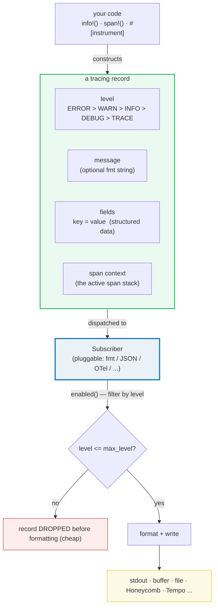
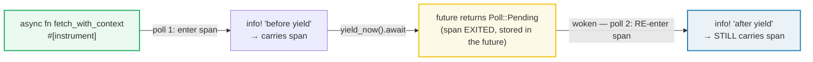

# TRACING_BASICS — Structured, Async-Aware Diagnostic Logging

> **One-line goal:** `tracing` is Rust's **structured** diagnostics framework —
> every record is `{level, message, fields, span-context}`, routed by a
> pluggable **`Subscriber`**. Unlike flat `println!`/`log`, a record's fields are
> **queryable data**, its span is a **scope** that survives across `.await`
> points, and *where* records go (stdout/JSON/OpenTelemetry/…) is decided by the
> subscriber, not the call site.
>
> **Run:** `just run tracing_basics` (== `cargo run --bin tracing_basics`)
> **Member:** `async` (deps: tokio `full`, futures, tracing, tracing-subscriber
> `fmt`, tokio-util, bytes).
> **Prerequisites:** read 🔗 [TOKIO_RUNTIME](./TOKIO_RUNTIME.md) (the runtime
> that drives the futures whose spans propagate) first — a `tracing` span is
> **async-aware context**, and understanding `.await` is understanding why.
> **Ground truth:** [`tracing_basics.rs`](./tracing_basics.rs); captured stdout:
> [`tracing_basics_output.txt`](./tracing_basics_output.txt).

---

## Why this exists (lineage)

🔗 [FORMATTING](../core/FORMATTING.md)'s `print!`/`println!` and the `log` crate
are **unstructured**: a log line is one flat string. That is fine for "hello
world", but it breaks down the moment you have a real system:

| Want | `println!` / `log` | `tracing` |
|---|---|---|
| "show me all records where `count > 2`" | grep / regex over text | a **field** — indexable, no parsing |
| "which request did this event belong to?" | thread it into every message by hand | a **span** — the context is automatic |
| "in async, which task is this line from?" | impossible (tasks interleave on one thread) | the span **propagates across `.await`** |
| "send logs as JSON to Loki, spans to Tempo" | rewrite every call site | swap the **`Subscriber`** — call sites untouched |
| "drop DEBUG records in prod, keep ERROR" | per-crate log levels only | `.with_max_level(...)` + per-target filters |

The crate's own framing is precise: "`tracing` is a framework for instrumenting
Rust programs to collect structured, event-based diagnostic information. In
asynchronous systems like Tokio, interpreting traditional log messages can often
be quite challenging. Since individual tasks are multiplexed on the same thread,
associated events and log lines are intermixed making it difficult to trace the
logic flow" ([docs.rs — `tracing`][tracing-crate]).

The escape from that mess is to model diagnostics as **spans** (periods of time)
and **events** (points in time inside a span), each carrying **structured
fields**, all handed to a **subscriber** that decides what to keep and where it
goes.



The two load-bearing ideas: **records carry structured fields + span context**
(not text), and **the subscriber is pluggable** (the call site never knows where
data ends up).

---

## The three core concepts (memorize these)

The crate names them directly ([docs.rs — Core Concepts][tracing-crate]):

1. **Span** — "a *period of time* with a beginning and an end … a span
   represents performing a unit of work." Entered/exited as execution flows.
2. **Event** — "a *moment* in time … signifies something that happened while a
   trace was being recorded. Unlike a typical log line, an `Event` may occur
   **within the context of a span**."
3. **Subscriber** — the thing that "records or aggregates" spans and events as
   they occur; it is notified via `event`, `enter`, `exit`, and may implement
   `enabled` to filter.

Everything below is the mechanics of those three.

---

## Section A — Events + levels: a record is `{level, message, fields}`

```rust
// Fields come BEFORE the message format string (tracing grammar). This also
// keeps rustc's format-args checker happy ("app started" has no placeholders).
tracing::info!(version = "1.0", "app started");
tracing::warn!(percent = 95_u32, "disk almost full");
tracing::error!(status = 500_u32, "request failed");
```

> **From tracing_basics.rs Section A:**
> ```
> ======================================================================
> SECTION A — events + levels: a record is {level, message, fields}
> ======================================================================
>   // An EVENT is a single point-in-time record. Each carries a LEVEL
>   // (ERROR > WARN > INFO > DEBUG > TRACE) and STRUCTURED FIELDS, not
>   // just a flat string. The Subscriber decides where each record goes.
>   // --- captured tracing records (timestamp dropped, ANSI off) ---
>  INFO app started version="1.0"
>  WARN disk almost full percent=95
> ERROR request failed status=500
> [check] info! event message 'app started' is captured: OK
> [check] structured field version="1.0" is captured (strings are quoted): OK
> [check] warn! field percent=95 is captured: OK
> [check] error! field status=500 is captured: OK
> [check] level INFO appears in the record: OK
> [check] level WARN appears in the record: OK
> [check] level ERROR appears in the record: OK
> ```

**What.** Three events at three levels (`info!`/`warn!`/`error!` are shorthand
macros for `event!(Level::INFO, …)`). Each record renders as `LEVEL message
fields`. The checks confirm the messages, the fields, and the levels all land in
the captured output.

**Why (internals).**
- **A field is `key = value`, recorded as data, not interpolated into text.**
  The grammar is `field = expr` (or the struct-init *shorthand* `name` when a
  local variable of the same name exists) — see Section C. A field value is a
  `tracing::field::Value`; primitives (`&str`, integers, `bool`, …) implement it
  directly ([docs.rs — recording fields][tracing-crate]).
- **Field values default to `fmt::Debug`.** That is *why* the string field shows
  `version="1.0"` (quoted) while the integer shows `percent=95` (unquoted): a
  `&str`'s `Debug` adds quotes. To force `Display` (no quotes), prefix the field
  with `%`: `info!(%version, "app started")` ⇒ `version=1.0`; to be explicit
  about `Debug`, prefix with `?` ([docs.rs][tracing-crate]). This default-Debug
  rule is the single biggest "why is my string quoted?" surprise.
- **The message is itself just a field named `message`.** The docs: "if a format
  string and arguments are provided, they will implicitly create a new field
  named `message`" ([docs.rs][tracing-crate]). There is nothing special about it
  to the subscriber — it is one field among many, which is why a JSON subscriber
  emits `{"message":"app started","version":"1.0",…}`.
- **Levels are ordered `ERROR > WARN > INFO > DEBUG > TRACE`.** A subscriber's
  `max_level` keeps everything at or above that level (Section D). This is the
  "volume knob"; filtering is a *subscriber* concern, never a call-site one.

> **The message goes LAST.** Notice `info!(version = "1.0", "app started")` —
> fields first, message last. On edition 2024 rustc, the older `info!("msg",
> field = val)` form makes the format-args checker complain the named argument is
> unused in the string. The tracing grammar explicitly supports fields-before-
> message, so that is the form used throughout this bundle.

---

## Section B — Spans: a structured scope; events inside carry the context

```rust
let span = tracing::info_span!("request", id = "req-42");
{
    let _enter = span.enter();        // RAII guard: "request" is now current
    tracing::info!("handling request");
    tracing::info!("finished request");
}                                    // `_enter` drops -> span context ends
```

> **From tracing_basics.rs Section B:**
> ```
> ======================================================================
> SECTION B — spans: a structured scope; events inside carry the context
> ======================================================================
>   // A SPAN is a PERIOD of time (a scope), unlike an event's instant.
>   // `.enter()` returns an RAII guard: while it lives, the span is the
>   // current context, so events inside it are tagged with the span.
>   // (The `enter` guard must NOT be held across `.await` — Section F.)
>   // --- captured tracing records (timestamp dropped, ANSI off) ---
>  INFO request{id="req-42"}: handling request
>  INFO request{id="req-42"}: finished request
> [check] span name 'request' appears as context: OK
> [check] span field id="req-42" appears (strings are quoted): OK
> [check] event 'handling request' is recorded inside the span: OK
> [check] event 'finished request' is recorded inside the span: OK
> ```

**What.** A span named `"request"` (with field `id="req-42"`) is created with
`info_span!`. Calling `.enter()` returns an RAII **guard**; while the guard
lives, `"request"` is the *current* span, so both `info!` events are rendered
with the `request{id="req-42"}:` prefix. The moment the guard drops (at the `}`),
the span is no longer current — events after the block would have no span.

**Why (internals).**
- **A span is a period, not a point.** The docs: "unlike a log line that
  represents a *moment in time*, a span represents a *period of time* with a
  beginning and an end … The span in which a thread is currently executing is
  referred to as that thread's *current* span" ([docs.rs — Spans][tracing-crate]).
- **`enter()` is RAII.** "`Span::enter` … records that the span has been
  entered, and returns a RAII guard object, which will exit the span when
  dropped" ([docs.rs][tracing-crate]). This is the same `Drop`-tied-to-braces
  discipline as a `MutexGuard` — 🔗 [OWNERSHIP](../core/OWNERSHIP.md) Section C.
  The current span is a **stack**: entering a second span inside the first nests
  it, and the subscriber sees the full path.
- **The subscriber is notified on enter/exit.** `Subscriber::enter` and
  `Subscriber::exit` are called as the guard is created/dropped
  ([docs.rs][tracing-crate]); the `fmt` subscriber uses them to build the
  `span{fields}:` context prefix you see in the output.
- **A span can be entered many times / recorded into later.** `Span::record`
  fills in fields declared `Empty` earlier, and `in_scope(closure)` is the
  one-shot synchronous helper for code you can't annotate (e.g. a call into
  another crate) ([docs.rs][tracing-crate]).

> **`enter()` across `.await` is UNSOUND — do not do it.** The crate's top-level
> warning: "In asynchronous code that uses async/await syntax, `Span::enter` may
> produce incorrect traces if the returned drop guard is held across an await
> point" ([docs.rs][tracing-crate]). The guard would mark the span "current" on
> thread A, the future suspends, resumes on thread B with a *stale* current-span
> pointer, and the trace lies. Section F shows the correct async tool:
> `#[instrument]` / `.instrument()`. This is the #1 tracing footgun.

---

## Section C — Fields are STRUCTURED (queryable), not flat text

```rust
let order_id = "ord-7";
// shorthand: `order_id` == `order_id = order_id` (struct-init style)
tracing::info!(order_id, count = 3_u32, total_cents = 4999_u32, "order placed");
```

> **From tracing_basics.rs Section C:**
> ```
> ======================================================================
> SECTION C — fields are STRUCTURED (queryable), not flat text
> ======================================================================
>   // Unlike `println!`, tracing fields are KEY=VALUE data. A downstream
>   // subscriber (Honeycomb/OpenTelemetry/journald/...) can INDEX
>   // 'count=3' as a field rather than grep it out of a string.
>   // --- captured tracing records (timestamp dropped, ANSI off) ---
>  INFO order placed order_id="ord-7" count=3 total_cents=4999
> [check] count=3 is a structured field: OK
> [check] total_cents=4999 is a structured field: OK
> [check] field-init shorthand records order_id="ord-7": OK
> ```

**What.** One event carries three fields. The `order_id` local is captured by the
**field-init shorthand** (`order_id` ≡ `order_id = order_id`, exactly like struct
literal shorthand). The checks confirm each field is present as a distinct
`key=value`.

**Why (internals).**
- **Fields are typed values, not string fragments.** Because each field is a
  `Value` recorded through the subscriber, a structured backend (JSON,
  OpenTelemetry, Honeycomb) stores `count` as the *integer* 3 — you can later ask
  "all events with `count > 2`" without parsing. The `fmt` subscriber just prints
  them as text for humans; that is one possible rendering, not what the data *is*.
- **Field naming is flexible.** Names can include dots (`user.email`), can be
  string-quoted for non-identifiers (`"guid:x-request-id" = …`), and can use
  constant expressions in braces (`{CONST} = …`) ([docs.rs — recording
  fields][tracing-crate]). Dotted names plus the shorthand let you capture struct
  fields directly: `span!(Level::TRACE, "login", user.name, user.email)`.
- **Lazy fields via `Empty`.** A span can declare `parting = field::Empty` and
  `record("parting", &value)` later, once the value is known
  ([docs.rs][tracing-crate]). This decouples "where the span opens" from "when the
  data exists".
- **`%` and `?` sigils choose the formatter per field.** `info!(%name)` ⇒
  Display (no quotes for strings); `info!(?name)` ⇒ explicit Debug; bare `name`
  ⇒ Debug by default ([docs.rs][tracing-crate]). Pick per field, not per record.

---

## Section D — Level filtering: INFO is DROPPED when max level is WARN

```rust
let (buf, _guard) = scoped_capture(LevelFilter::WARN);
tracing::info!("FILTERED_INFO_RECORD_should_be_dropped");  // below WARN -> gone
tracing::warn!("KEPT_WARN_RECORD_should_survive");          // == WARN -> kept
```

> **From tracing_basics.rs Section D:**
> ```
> ======================================================================
> SECTION D — level filtering: INFO is DROPPED when max level is WARN
> ======================================================================
>   // `.with_max_level(WARN)` makes the subscriber drop every record below
>   // WARN — BEFORE it is even formatted (cheap). We emit one INFO and one
>   // WARN record and assert the INFO one is absent, the WARN one present.
>   // --- captured tracing records (timestamp dropped, ANSI off) ---
>  WARN KEPT_WARN_RECORD_should_survive
> [check] INFO record is DROPPED under max_level=WARN: OK
> [check] WARN record SURVIVES under max_level=WARN: OK
> ```

**What.** The subscriber is built with `.with_max_level(LevelFilter::WARN)`. An
`info!` and a `warn!` are both emitted; only the `warn!` appears in the buffer.
The checks assert the INFO record is **absent** and the WARN record is
**present**.

**Why (internals).**
- **Filtering is a subscriber concern, and it happens before construction.** The
  docs: "subscribers may implement the `enabled` function to filter the
  notifications they receive based on metadata … if no currently active
  subscribers express interest … the corresponding Span or Event will **never be
  constructed**" ([docs.rs — Subscribers][tracing-crate]). `.with_max_level`
  configures exactly that `enabled` check: anything below `WARN` is refused, so
  the `info!` macro never even builds the `Event` — the drop is nearly free.
- **`LevelFilter` vs `EnvFilter`.** `with_max_level(LevelFilter)` is a single
  global ceiling (what this section uses). `EnvFilter` (the `env-filter` feature)
  is the richer, runtime-configurable layer: `RUST_LOG=my_crate=debug,warn` sets
  per-target/per-span directives, a superset of `env_logger` syntax
  ([docs.rs — `fmt` filtering][ts-fmt]). `tracing_subscriber::fmt::init()`
  installs an `EnvFilter` from `RUST_LOG` by default ([docs.rs][ts-fmt]).
- **You can filter at the writer, too.** `MakeWriter::make_writer_for(metadata)`
  receives the event's `Metadata`, so a writer can route by level (e.g. WARN+
  to stderr, the rest to stdout) — the `with_max_level(Level::WARN)` writer
  adapter does precisely this ([docs.rs — `MakeWriter`][ts-makewriter]).

---

## Section E — `#[tracing::instrument]`: span auto-named after the fn

```rust
#[tracing::instrument]
fn do_thing(magic: u32) -> u32 {
    tracing::info!("working inside do_thing");
    magic + 1
}
// do_thing(7) -> emits one event inside a span named "do_thing", field magic=7
```

> **From tracing_basics.rs Section E:**
> ```
> ======================================================================
> SECTION E — #[tracing::instrument]: span auto-named after the fn
> ======================================================================
>   // `#[tracing::instrument]` on `fn do_thing(magic)` creates + enters a
>   // span named 'do_thing' with `magic` recorded as a field, on every
>   // call (default level INFO). The event inside carries that span.
>   // --- captured tracing records (timestamp dropped, ANSI off) ---
>  INFO do_thing{magic=7}: working inside do_thing
> [check] instrumented fn returns magic+1 = 8: OK
> [check] a span named 'do_thing' appears as context: OK
> [check] instrument records the arg as a field magic=7: OK
> [check] event 'working inside do_thing' is captured: OK
> ```

**What.** The attribute on `fn do_thing(magic: u32)` makes every call open a span
**named `do_thing`** with **`magic` recorded as a field**, then run the body
inside it. The `info!` inside therefore renders as
`do_thing{magic=7}: working inside do_thing` — no manual span code at all.

**Why (internals).** From the attribute docs ([docs.rs — `#[instrument]`][tracing-instrument]):
- **Name = the function name** (override with `#[instrument(name = "…")]`).
- **Arguments become fields**, recorded via `Value` for primitives, else
  `fmt::Debug` ([docs.rs][tracing-instrument]). That is why `magic=7` appears
  with no boilerplate.
- **Default level is `INFO`** (override with `#[instrument(level = "debug")]`,
  a `Level` constant, or a number 1–5) ([docs.rs][tracing-instrument]).
- **Skips / extra fields.** `#[instrument(skip(self, secret))]`] drops arguments
  that aren't `Debug` or are huge; `#[instrument(fields(next = i + 1))]` adds
  computed fields; `#[instrument(ret)]` / `#[instrument(err)]` emit an event with
  the return value / error ([docs.rs][tracing-instrument]).
- **It is a proc-macro rewrite of the body**, equivalent to wrapping it in
  `span!(…).in_scope(|| { body })` — which is why it works for both sync and
  async fns, and (importantly) is the *correct* async instrumentation (Section F).

---

## Section F — Context propagates across `.await` (`#[instrument]` on async fn)

```rust
#[tracing::instrument]
async fn fetch_with_context() -> u32 {
    tracing::info!("before yield (poll 1)");
    tokio::task::yield_now().await;            // future returns Pending here
    tracing::info!("after yield (poll 2) - STILL inside fetch_with_context");
    42
}
```

> **From tracing_basics.rs Section F:**
> ```
> ======================================================================
> SECTION F — context propagates across .await (#[instrument] on async fn)
> ======================================================================
>   // `#[instrument]` on an ASYNC fn instruments the returned FUTURE: it
>   // ENTERS the span on every poll and EXITS on every return. So an event
>   // emitted AFTER an `.await` still carries the span — even though the
>   // future was suspended and resumed (possibly on another thread).
>   // Contrast: a hand `span.enter()` guard held across `.await` is UNSOUND
>   // --- captured tracing records (timestamp dropped, ANSI off) ---
>  INFO fetch_with_context: before yield (poll 1)
>  INFO fetch_with_context: after yield (poll 2) - STILL inside fetch_with_context
> [check] instrumented async fn returns 42: OK
> [check] pre-await event captured: OK
> [check] post-await event captured: OK
> [check] span 'fetch_with_context' wraps BOTH polls (carries across .await): OK
> ```

**What.** An async `fn` annotated with `#[instrument]` is awaited. Between the two
`info!`s sits a `yield_now().await` — a real suspend point that returns
`Poll::Pending` and lets the runtime resume the future later. The output shows
that the **second** event — emitted on the *next* poll, after the suspension — is
**still inside the `fetch_with_context` span**. The final check asserts the span
name appears on both event lines (count ≥ 2).

**Why (internals).** This is the heart of "async-aware tracing", and it is a
consequence of the `Instrument` trait:
- **`#[instrument]` on an async fn instruments the *future*, not the call.** It
  wraps the returned future so that **each `poll` enters the span before polling
  and exits after**. The docs: "`async fn`s may also be instrumented"
  ([docs.rs][tracing-instrument]); the crate overview notes that an instrumented
  future's span is "entered … under the hood" on each poll
  ([docs.rs][tracing-crate]). Because entering/exiting happens per-poll, a future
  can be suspended and resumed on a *different* thread (the multi-thread runtime
  work-steals tasks) and the span is still correct — it is re-entered on the
  resuming poll, not inherited from some thread-local guard.
- **Contrast with the manual `enter()` guard.** Section B's `let _e =
  span.enter()` is fine for *synchronous* scopes. But held across an `.await`
  the guard's "current span" lives in a thread-local that is wrong after the
  future migrates threads — the very trap the crate warns about
  ([docs.rs][tracing-crate]). `#[instrument]` / `future.instrument(span)` /
  `tracing::Instrument` are the async-safe replacements: they thread the span
  *through the future*, not through a thread-local that outlives a poll.
- **`Instrument::instrument(span)` does the same for hand-written futures.** For
  an async block you cannot annotate, `.instrument(span)` attaches the span:
  `async { /* … */ }.instrument(span)` ([docs.rs — `Instrument`][tracing-crate]).
  This is the building block `#[instrument]` is sugar for.



> **Why this matters for tokio.** On the `multi_thread` runtime, a task can hop
> worker threads at every `.await` (🔗 [TOKIO_RUNTIME](./TOKIO_RUNTIME.md) —
> work-stealing, `Send + 'static`). A per-thread "current span" would be wrong
> after the hop; instrumenting the *future* is what keeps a distributed trace
> coherent across the suspension. This is the feature that makes `tracing` the
> successor to `slog`-style loggers in async Rust.

---

## Determinism: how this bundle kills the timestamp (and stays byte-identical)

`tracing`'s default `fmt` output is **not** reproducible run-to-run — it embeds a
wall-clock timestamp and (optionally) a thread id. Per `HOW_TO_RESEARCH.md` §4.2
that breaks the "capture once, paste verbatim" discipline. This binary
neutralizes every nondeterministic piece and asserts on the **structured fields**
instead:

| Nondeterminism | Neutralizer |
|---|---|
| wall-clock **timestamp** prefix | `.without_time()` — drops it entirely |
| **ANSI** color escapes | `.with_ansi(false)` — plain bytes |
| **thread id** | left **off** (the default; we never call `.with_thread_ids(true)`) |
| **where records go** | a custom `MakeWriter` into an `Arc<Mutex<Vec<u8>>>` buffer, inspected with substring `check`s |

> **`without_time()`, not a fake timer.** A common suggestion is
> `.with_timer(time::Empty)`, but **`tracing_subscriber::fmt::time` has no
> `Empty` type in 0.3.x** — its time providers are `SystemTime`, `Uptime`,
> `UtcTime`, etc. ([docs.rs — `fmt::time`][ts-time]). The actual way to drop the
> timestamp is the builder's own `.without_time()` ("Do not emit timestamps with
> log messages", [docs.rs — `SubscriberBuilder`][ts-builder]).

The custom `MakeWriter` mirrors the crate's own `Mutex<W: Write>` impl
([docs.rs — `MakeWriter`][ts-makewriter]): `make_writer(&self)` returns a
`CaptureWriter` holding a `MutexGuard<Vec<u8>>` that implements `io::Write`, so
each record appends to the shared buffer. A second `Arc` clone reads it back.
`.set_default()` (via `SubscriberInitExt`) installs the subscriber as a
**thread-local** scoped default for the section; dropping the guard restores the
prior default, so each section gets a fresh subscriber + buffer. Two `just out
tracing_basics` runs are **byte-identical** (verified).

---

## Pitfalls (the expert payoff)

| Trap | Symptom | Fix / why |
|---|---|---|
| **`span.enter()` held across `.await`** | Traces are wrong / span context leaks between tasks | The crate warns this "may produce incorrect traces" ([docs.rs][tracing-crate]). Use `#[instrument]` or `future.instrument(span)` for async code — they enter/exit the span **per poll**, not via a thread-local guard. |
| **Expecting unquoted string fields** | `user="ferris"` shows up quoted | Fields default to `fmt::Debug` (strings quoted). Use the `%` sigil for `Display`: `info!(%user, …)` ⇒ `user=ferris`. `?` forces Debug explicitly. |
| **`info!("msg", field = val)` on edition 2024** | `error: named argument never used` | Put fields **before** the message: `info!(field = val, "msg")`. The trailing form makes rustc's format-args checker think `field` is an unused format arg. |
| **No output at all** | Events silently vanish | No `Subscriber` is set → "any trace events generated outside the context of a subscriber will not be collected" ([docs.rs][tracing-crate]). Call `fmt().init()` (binary) or `.set_default()` (scoped). |
| **`init()`/`try_init()` called twice** | `panic`/`Err` — global default already set | The global default is set **once per process**. In tests or libraries use `set_default()` (scoped, thread-local), never `init()`. |
| **`set_default()` is thread-local** | Events from a spawned task don't appear | `with_default`/`set_default` apply to the *current thread only*. For spawned tasks, set a **global** default (`init()`) so all worker threads share it. This bundle avoids the issue by emitting every captured record on the main thread. |
| **Filtering too coarse** | Either everything or nothing prints | `with_max_level` is one global ceiling. For per-crate/per-span control use `EnvFilter` (`RUST_LOG=my_crate=debug,warn`) via `.with_env_filter(...)`. |
| **Forgetting `#[instrument]` needs the `attributes` feature** | `error: cannot find attribute` | `tracing`'s `#[instrument]` needs the (default-on) `attributes` feature. This member has it; if you trim default-features, re-add it. |
| **`#[instrument]` on a `!Debug` arg** | compile error: arg doesn't impl `Debug` | `skip(arg)` (or `skip_all`) excludes it from the span; or `fields(…)` to record a derived field instead. |
| **Thinking the `message` is special** | Surprised a JSON subscriber emits it as a field | It is just a field named `message`; nothing distinguishes it structurally. It only "looks" special under the human `fmt` formatter. |
| **Capturing output in tests** | Tests interleave / can't assert on tracing | Write to a `MakeWriter` over a buffer (this bundle's pattern), or use `tracing_subscriber::fmt().with_test_writer()` ([docs.rs — `SubscriberBuilder`][ts-builder]). |
| **Span context missing after `spawn`** | Child task's events have no parent span | A spawned task starts with a *fresh* context. Pass the span explicitly (`span.in_scope(|| spawn(...))`, `Instrument`, or `WithSubscriber`) to attach it. |

---

## Cheat sheet

```rust
// ── EVENTS: a point in time, = {level, message, fields}. ──────────────────
tracing::info!(version = "1.0", "app started");   // fields BEFORE message
tracing::warn!(percent = 95_u32, "disk full");
tracing::error!(status = 500_u32, "failed");
// Shorthand: `name` == `name = name`; sigils: %name (Display), ?name (Debug).

// ── SPANS: a period of time (a scope). RAII guard = current span. ─────────
let span = tracing::info_span!("request", id = "req-42");
let _e = span.enter();        // SYNC only — NEVER hold across .await
tracing::info!("handling");   // rendered as: request{id="req-42"}: handling
// drop(_e) ends the span context

// ── #[instrument]: span named after the fn, args as fields (default INFO). ─
#[tracing::instrument]
fn do_thing(magic: u32) -> u32 { /* … */ magic + 1 }
// #[instrument(skip(self))]            skip a !Debug/huge arg
// #[instrument(fields(next = i + 1))]  add a computed field
// #[instrument(ret)] / #[instrument(err)]  log return / error as an event

// ── ASYNC: instrument the FUTURE (enters span per poll) — never enter(). ──
#[tracing::instrument]
async fn fetch() -> u32 { /* …await… */ 42 }
// or for a hand-written future:  async { }.instrument(span)

// ── SUBSCRIBER: where records go. Pluggable, set once (or scoped). ────────
// Global (binary main):
tracing_subscriber::fmt()                 // fmt() -> SubscriberBuilder
    .with_writer(std::io::stderr)         // MakeWriter: stdout/stderr/file/buffer
    .with_max_level(tracing::Level::INFO) // global ceiling; or .with_env_filter(...)
    .init();                              // global, ONCE per process
// Scoped / thread-local (tests, in-process capture):
let _g = tracing_subscriber::fmt()
    .with_ansi(false).without_time()      // neutralize color + timestamp
    .set_default();                       // restores prior default on drop

// ── CUSTOM BUFFER via MakeWriter (testable, deterministic): ───────────────
struct Capture { buf: Arc<Mutex<Vec<u8>>> }
impl<'a> tracing_subscriber::fmt::MakeWriter<'a> for Capture {
    type Writer = /* a Write over MutexGuard<Vec<u8>> */;
    fn make_writer(&'a self) -> Self::Writer { /* lock + return guard */ }
}
// then: .with_writer(Capture { buf: buf.clone() }) and read `buf` afterwards.
```

---

## Sources

Every claim above was web-verified against the authoritative tracing /
tracing-subscriber documentation.

- **docs.rs — `tracing` crate overview (Core Concepts)** — spans vs events vs
  subscribers, the `enter()`-across-`.await` warning, field grammar (`field =
  value`, shorthand, `%`/`?` sigils), the `message` field, `Span::enter`/`record`/
  `in_scope`, `Instrument`, the subscriber `enabled`/`enter`/`exit`/`event`
  methods, "events outside a subscriber are not collected":
  https://docs.rs/tracing/latest/tracing/
- **docs.rs — `#[tracing::instrument]` attribute** — span named after the fn,
  args recorded as fields (`Value` or `fmt::Debug`), default `INFO` level,
  `name`/`target`/`level`/`skip`/`fields`/`ret`/`err` overrides, `async fn`
  instrumentation:
  https://docs.rs/tracing/latest/tracing/attr.instrument.html
- **docs.rs — `tracing_subscriber::fmt` module** — `fmt()` builder, `FmtSubscriber`,
  `Full`/`Compact`/`Pretty`/`Json` formatters, composing `Layer`s,
  `EnvFilter`/`RUST_LOG`, `set_global_default` vs `with_default`, "libraries
  should not call `fmt::init()`":
  https://docs.rs/tracing-subscriber/latest/tracing_subscriber/fmt/index.html
- **docs.rs — `SubscriberBuilder`** — `with_writer`, `with_ansi`,
  `without_time` ("Do not emit timestamps"), `with_timer`, `with_target`,
  `with_thread_ids`, `with_max_level` (replaces prior max level / env filter),
  `with_env_filter`, `with_test_writer`, `finish`/`init`/`try_init`:
  https://docs.rs/tracing-subscriber/latest/tracing_subscriber/fmt/struct.SubscriberBuilder.html
- **docs.rs — `MakeWriter` trait** — `make_writer(&'a self) -> Writer`, the
  `Mutex<W: Write>` and `Arc<W>` and `Fn() -> W` blanket impls,
  `make_writer_for(metadata)` for per-level routing:
  https://docs.rs/tracing-subscriber/latest/tracing_subscriber/fmt/trait.MakeWriter.html
- **docs.rs — `tracing_subscriber::fmt::time` module** — the available time
  providers (`SystemTime`, `Uptime`, `UtcTime`, `LocalTime`, …); notably **no
  `Empty`** type exists in 0.3.x, so the timestamp is dropped via
  `SubscriberBuilder::without_time()` instead:
  https://docs.rs/tracing-subscriber/latest/tracing_subscriber/fmt/time/index.html
- **docs.rs — `tracing::Instrument` trait / `instrument` module** — "Attach a
  span to a `Future`"; the per-poll enter/exit mechanism that makes
  `#[instrument]` / `.instrument(span)` the async-correct alternative to a manual
  `enter()` guard:
  https://docs.rs/tracing/latest/tracing/instrument/index.html
- **Tokio — "Getting started with Tracing"** — independent corroboration that
  tracing is the structured, async-aware diagnostics framework for Tokio:
  https://tokio.rs/tokio/topics/tracing
