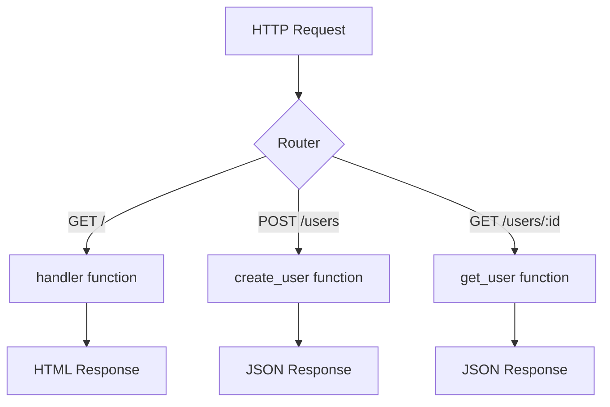

# Hello World: Your First Axum Web Server

**Example Source**: [hello-world](https://github.com/tokio-rs/axum/tree/6bc0717b06c665baf9dea57d977363ade062bf17/examples/hello-world)

## The Core Concept: Why This Example Exists

**The Problem:** Every web framework needs to prove it can handle the most fundamental task: accepting an HTTP request and returning a response. The "Hello, World!" example is the simplest possible demonstration that a web server can listen for connections, process requests, and send back meaningful data.

**The Solution:** Axum approaches this with radical simplicity. Unlike frameworks that require extensive configuration or boilerplate, Axum's design philosophy centers on three core principles:
1. **Ergonomic Routing**: Connecting URLs to functions feels natural and readable
2. **Type Safety**: The compiler prevents common web development mistakes
3. **Tower Integration**: Built on proven async infrastructure from the start

Think of Axum as a sophisticated traffic director. When a request arrives at your server, Axum's Router examines the request's path and HTTP method, then dispatches it to the appropriate handler function—all with zero runtime overhead.

## Practical Walkthrough: Code Breakdown

Let's examine each piece of this minimal web server:

### Dependencies Setup

```toml
[dependencies]
axum = { path = "../../axum" }
tokio = { version = "1.0", features = ["full"] }
```

This declares two essential dependencies:
- **axum**: The web framework itself
- **tokio**: The async runtime that powers everything underneath

Axum is built on top of Tokio's async ecosystem, which means it can handle thousands of concurrent connections efficiently without blocking threads.

### The Main Function

```rust
#[tokio::main]
async fn main() {
    // build our application with a route
    let app = Router::new().route("/", get(handler));

    // run it
    let listener = tokio::net::TcpListener::bind("127.0.0.1:3000")
        .await
        .unwrap();
    println!("listening on {}", listener.local_addr().unwrap());
    axum::serve(listener, app).await.unwrap();
}
```

Breaking this down step by step:

1. **`#[tokio::main]`**: This macro transforms your async main function into a synchronous one that starts the Tokio runtime
2. **`Router::new()`**: Creates a new router—think of this as a phone switchboard that will direct incoming calls
3. **`.route("/", get(handler))`**: Maps HTTP GET requests to the root path "/" to our handler function
4. **`TcpListener::bind()`**: Creates a socket listener on localhost port 3000
5. **`axum::serve()`**: Starts the server, connecting the listener to our router

### The Handler Function

```rust
async fn handler() -> Html<&'static str> {
    Html("<h1>Hello, World!</h1>")
}
```

This is where the magic happens. The handler function:
- Is `async` because it might need to do I/O operations (database calls, file reads, etc.)
- Returns `Html<&'static str>`, which tells Axum to set the `Content-Type` header to `text/html`
- The `Html` wrapper is Axum's way of providing type-safe response generation

## Mental Model: Thinking in Axum

**The Router as a Highway System:** Imagine your Axum application as a highway system. The `Router` is like a complex interchange where different roads (HTTP paths) connect. When a car (HTTP request) approaches, the router examines the car's destination (the URL path) and the type of vehicle (HTTP method: GET, POST, etc.), then directs it down the correct off-ramp to the appropriate handler.



**Why It's Designed This Way:** Axum's router system follows the principle of "composition over configuration." Instead of requiring XML config files or annotation magic, you build your application by combining simple, pure functions. Each handler is just a function that takes some inputs (extracted from the request) and returns some output (converted to a response).

This design has profound implications:
- **Testability**: Each handler is just a function you can call directly in tests
- **Reusability**: Handlers can be shared between different routes or even different applications
- **Type Safety**: The compiler ensures your routes and handlers are compatible

**Further Exploration:** Try modifying the handler to return different content types:
- Change `Html<&'static str>` to just `&'static str` and see what happens to the Content-Type header
- Return a JSON response using `Json(serde_json::json!({"message": "Hello, World!"}))`
- Add a new route for `/goodbye` with its own handler

The beauty of Axum is that these changes require minimal code modifications—the framework's type system guides you toward correct implementations.