# Extractors and Responses: The Heart of Axum's Type System

**Example Source**: [readme](https://github.com/tokio-rs/axum/tree/6bc0717b06c665baf9dea57d977363ade062bf17/examples/readme)

## The Core Concept: Why This Example Exists

**The Problem:** Raw HTTP is essentially a stream of bytes with some headers. How do you safely transform this unstructured data into typed Rust structs? How do you ensure that a JSON request body actually contains valid JSON? How do you automatically set the correct `Content-Type` headers in responses? Most web frameworks make you manually parse and validate everything—a breeding ground for bugs and security vulnerabilities.

**The Solution:** Axum introduces **extractors** and **response types**—a powerful type system that handles the conversion between HTTP data and Rust types automatically. Extractors pull data *out* of requests and parse it into your desired types. Response types take your Rust data and convert it *into* properly formatted HTTP responses.

Think of extractors as intelligent customs agents at an airport. They examine incoming passengers (HTTP requests), check their documentation (headers and body), and sort them into the appropriate processing lanes (your typed structs). Response types are like the departure gate system—they take processed passengers and put them on the right flight with the correct boarding passes (HTTP responses with proper headers).

## Practical Walkthrough: Code Breakdown

This example demonstrates the full request-response cycle with type safety:

### The Complete Application Structure

```rust
use axum::{
    http::StatusCode,
    response::IntoResponse,
    routing::{get, post},
    Json, Router,
};
use serde::{Deserialize, Serialize};

#[tokio::main]
async fn main() {
    // initialize tracing
    tracing_subscriber::fmt::init();

    // build our application with a route
    let app = Router::new()
        // `GET /` goes to `root`
        .route("/", get(root))
        // `POST /users` goes to `create_user`
        .route("/users", post(create_user));

    // run our app with hyper
    let listener = tokio::net::TcpListener::bind("127.0.0.1:3000")
        .await
        .unwrap();
    tracing::debug!("listening on {}", listener.local_addr().unwrap());
    axum::serve(listener, app).await.unwrap();
}
```

Key additions from our previous examples:
- **`tracing_subscriber::fmt::init()`**: Sets up structured logging (we'll explore this in detail later)
- **Two distinct routes**: A simple GET and a more complex POST endpoint
- **Different handler signatures**: Notice how `create_user` takes parameters while `root` doesn't

### Simple Response Handler

```rust
// basic handler that responds with a static string
async fn root() -> &'static str {
    "Hello, World!"
}
```

This handler demonstrates the simplest possible response type. The `&'static str` return type automatically:
- Sets `Content-Type: text/plain; charset=utf-8`
- Sets `Content-Length` header appropriately
- Returns HTTP 200 OK status

### JSON Extraction and Response

```rust
async fn create_user(
    // this argument tells axum to parse the request body
    // as JSON into a `CreateUser` type
    Json(payload): Json<CreateUser>,
) -> impl IntoResponse {
    // insert your application logic here
    let user = User {
        id: 1337,
        username: payload.username,
    };

    // this will be converted into a JSON response
    // with a status code of `201 Created`
    (StatusCode::CREATED, Json(user))
}
```

This function showcases Axum's most powerful features:

**Extraction Magic**: `Json(payload): Json<CreateUser>`
- Axum automatically reads the request body
- Validates that it contains valid JSON
- Deserializes it into the `CreateUser` struct using serde
- If any step fails, returns appropriate error responses (400 Bad Request, etc.) automatically

**Response Composition**: `(StatusCode::CREATED, Json(user))`
- The tuple syntax lets you combine multiple response components
- `StatusCode::CREATED` sets the HTTP status to 201
- `Json(user)` serializes the user struct to JSON and sets `Content-Type: application/json`

### Data Type Definitions

```rust
// the input to our `create_user` handler
#[derive(Deserialize)]
struct CreateUser {
    username: String,
}

// the output to our `create_user` handler
#[derive(Serialize)]
struct User {
    id: u64,
    username: String,
}
```

These structs demonstrate **contract-driven development**:
- `CreateUser` defines exactly what data clients must send
- `User` defines exactly what data clients will receive
- Serde handles all the JSON serialization/deserialization
- The type system prevents runtime errors from malformed data

## Mental Model: Thinking in Axum

**The Data Transformation Pipeline:** Think of each Axum handler as a factory assembly line. Raw HTTP requests enter at one end, go through a series of transformations, and emerge as properly formatted HTTP responses.

```mermaid
graph LR
    A[Raw HTTP Request] --> B[Extractor Layer]
    B --> C[Your Handler Logic]
    C --> D[Response Layer]
    D --> E[Formatted HTTP Response]
    
    B --> B1["🔍 Parse JSON<br/>🔍 Validate Types<br/>🔍 Extract Headers"]
    D --> D1["📦 Serialize Data<br/>📦 Set Headers<br/>📦 Set Status Code"]
```



**The Type System as a Safety Net:** In traditional web frameworks, you might write code like:

```rust
// Traditional approach - error-prone
let body = request.body().await?;
let json_str = String::from_utf8(body)?;
let data: Value = serde_json::from_str(&json_str)?;
let username = data["username"].as_str().ok_or("Missing username")?;
```

With Axum extractors, this becomes:

```rust
// Axum approach - compiler-verified
async fn handler(Json(payload): Json<CreateUser>) -> impl IntoResponse {
    // payload is guaranteed to be valid CreateUser
    // No null checks, no casting, no manual error handling
}
```

**Why It's Designed This Way:** Axum's extractor system implements the principle of **"parse, don't validate"**. Instead of checking if data is valid at runtime, you parse it into types that can only represent valid states. This eliminates entire classes of bugs:

- **No null pointer exceptions**: Optional fields are `Option<T>`
- **No type confusion**: JSON numbers become `u64`, not generic values
- **No missing fields**: Required fields cause compilation errors if not handled
- **No malformed data**: Invalid JSON is rejected before your handler runs

**Error Handling Philosophy:** Notice that our handler doesn't contain any explicit error handling code. Axum's extractors handle all the edge cases:

- Invalid JSON → 400 Bad Request with error details
- Missing Content-Type → 415 Unsupported Media Type  
- Oversized payloads → 413 Payload Too Large
- Network interruption → Connection closed gracefully

This follows the Rust philosophy of **making the correct path easy and the incorrect path difficult**.

**Further Exploration:** Try these modifications to deepen your understanding:

1. **Add field validation**: Use `#[serde(deserialize_with = "...")]` to add custom validation
2. **Combine multiple extractors**: What if you need both JSON body AND query parameters?
3. **Custom error responses**: Return `Result<Json<User>, MyError>` to handle business logic errors
4. **Response headers**: Try returning `(StatusCode, HeaderMap, Json<User>)` to add custom headers

The beauty of Axum's type system is that it guides you toward robust, secure code while keeping the happy path simple and readable.