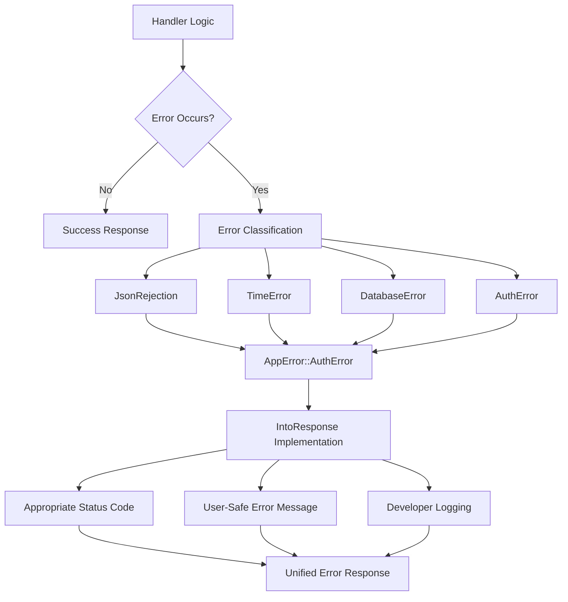

# Error Handling: Building Resilient Web Applications

**Example Source**: [error-handling](https://github.com/tokio-rs/axum/tree/6bc0717b06c665baf9dea57d977363ade062bf17/examples/error-handling)

## The Core Concept: Why This Example Exists

**The Problem:** Real-world web applications are messy. Database connections fail, external APIs return errors, users send malformed JSON, and file systems run out of space. Most web frameworks force you to handle each error individually, leading to inconsistent error responses, poor logging, and defensive programming patterns that obscure your business logic.

**The Solution:** Axum's error handling system follows Rust's philosophy of **explicit error handling** combined with **zero-cost abstractions**. Instead of exceptions or magic error handlers, you build a unified error type that represents all possible failures in your application. The `?` operator and trait system then handle the tedious conversion work, while the `IntoResponse` trait ensures consistent error formatting.

Think of Axum's error handling like a well-designed emergency response system in a building. When something goes wrong, there are clear protocols for each type of emergency (fire, medical, security), but they all funnel through a unified response center that coordinates the appropriate actions—logging, notifications, and safe resolution.

## Practical Walkthrough: Code Breakdown

This example demonstrates production-ready error handling patterns:

### The Unified Error Type

```rust
// The kinds of errors we can hit in our application.
enum AppError {
    // The request body contained invalid JSON
    JsonRejection(JsonRejection),
    // Some error from a third party library we're using
    TimeError(time_library::Error),
}
```

This `AppError` enum serves as your application's **error vocabulary**. Every possible failure mode has a variant here. This centralization provides several benefits:

- **Exhaustive handling**: The compiler ensures you handle every error type
- **Consistent responses**: All errors go through the same formatting logic
- **Easy debugging**: Every error type has a clear place in your mental model

### Automatic Error Conversion

```rust
impl From<JsonRejection> for AppError {
    fn from(rejection: JsonRejection) -> Self {
        Self::JsonRejection(rejection)
    }
}

impl From<time_library::Error> for AppError {
    fn from(error: time_library::Error) -> Self {
        Self::TimeError(error)
    }
}
```

These `From` implementations enable **seamless error propagation**. When you use the `?` operator in your handlers:

```rust
let created_at = Timestamp::now()?;  // Automatically converts time_library::Error -> AppError
```

The Rust compiler automatically inserts the conversion. This eliminates error-handling boilerplate while maintaining type safety.

### Response Generation

```rust
impl IntoResponse for AppError {
    fn into_response(self) -> Response {
        #[derive(Serialize)]
        struct ErrorResponse {
            message: String,
        }

        let (status, message) = match self {
            AppError::JsonRejection(rejection) => {
                // This error is caused by bad user input so don't log it
                (rejection.status(), rejection.body_text())
            }
            AppError::TimeError(err) => {
                // Log internal errors but don't expose details to clients
                tracing::error!(%err, "error from time_library");
                (
                    StatusCode::INTERNAL_SERVER_ERROR,
                    "Something went wrong".to_owned(),
                )
            }
        };

        (status, AppJson(ErrorResponse { message })).into_response()
    }
}
```

This implementation demonstrates several **security and usability principles**:

- **Information hiding**: Internal errors show generic messages to users but log details for developers
- **Appropriate status codes**: User errors (400) vs. server errors (500)
- **Consistent format**: All errors return JSON with the same structure
- **Contextual logging**: Only log what developers need for debugging

### Custom JSON Extractor

```rust
#[derive(FromRequest)]
#[from_request(via(axum::Json), rejection(AppError))]
struct AppJson<T>(T);
```

This newtype wrapper around `axum::Json` ensures that JSON parsing errors flow through your unified error system instead of using Axum's default error responses. It's a small detail that demonstrates **system integration**—making all components work together seamlessly.

### Handler Logic with Error Propagation

```rust
async fn users_create(
    State(state): State<AppState>,
    AppJson(params): AppJson<UserParams>,
) -> Result<AppJson<User>, AppError> {
    let id = state.next_id.fetch_add(1, Ordering::SeqCst);

    // The `?` operator automatically converts time_library::Error -> AppError
    let created_at = Timestamp::now()?;

    let user = User {
        id,
        name: params.name,
        created_at,
    };

    state.users.lock().unwrap().insert(id, user.clone());

    Ok(AppJson(user))
}
```

Notice how clean this handler looks despite robust error handling. The business logic is clear and uncluttered, while errors are handled systematically by the type system.

## Mental Model: Thinking in Axum

**The Error Transformation Pipeline:** Think of error handling as a sophisticated postal system. Different types of errors are like letters from different countries—they start with different formats and languages, but they all need to be delivered to the same destination (your users) in a consistent format.



**Why It's Designed This Way:** Axum's error handling reflects several important principles:

1. **Fail Fast, Fail Clearly**: Errors should be detected as early as possible and communicated clearly
2. **Separation of Concerns**: Business logic shouldn't be cluttered with error formatting code
3. **Security by Default**: Internal system details shouldn't leak to external users
4. **Developer Experience**: Error handling should be easy to write correctly and hard to write incorrectly

**The Result Type Philosophy:** In many languages, errors are handled through exceptions—invisible control flow that can jump out of any function call. Rust's `Result<T, E>` type makes error handling **explicit and local**. Your function signature tells you exactly what can go wrong:

```rust
// Clear contract: this function can succeed with User or fail with AppError
async fn users_create(...) -> Result<AppJson<User>, AppError>
```

**Error Context and Observability:** Notice the sophisticated logging setup:

```rust
tracing::error!(%err, "error from time_library");
```

This creates **structured logs** that can be easily searched and aggregated by monitoring systems. The `TraceLayer` automatically adds request context (method, URI, matched path), so you get rich debugging information without manual work.

**Further Exploration:** Try these patterns to deepen your understanding:

1. **Add custom error types**: What if you need to handle database connection errors or validation failures?
2. **Error recovery**: How would you implement retry logic for transient failures?
3. **Error aggregation**: What if a single operation can fail in multiple ways that you want to report together?
4. **Context preservation**: How can you add context ("Failed to create user for email: user@example.com") without cluttering your handlers?

The beauty of Axum's error handling is that it scales from simple applications to complex microservices while maintaining clarity and performance. The type system guides you toward robust patterns, and the runtime overhead is effectively zero.