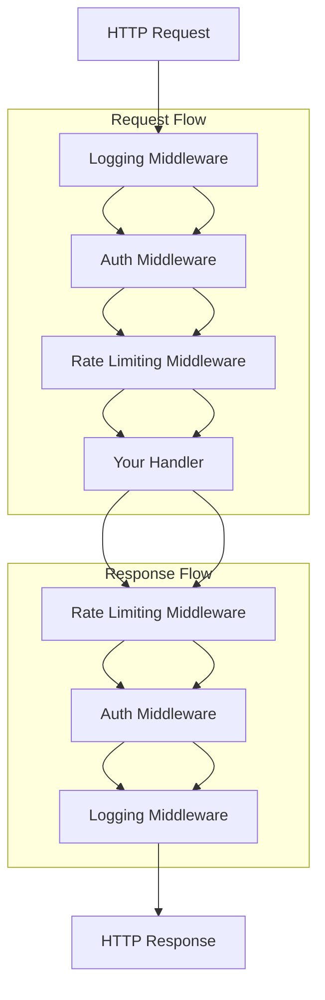

# Middleware from Functions: Intercepting the Request-Response Flow

**Example Source**: [print-request-response](https://github.com/tokio-rs/axum/tree/6bc0717b06c665baf9dea57d977363ade062bf17/examples/print-request-response)

## The Core Concept: Why This Example Exists

**The Problem:** Web applications often need to perform cross-cutting operations that apply to multiple routes: logging requests, authentication, rate limiting, request transformation, or performance monitoring. Writing this logic in every handler leads to code duplication and inconsistency. You need a way to **intercept** and potentially modify requests before they reach handlers, and responses before they return to clients.

**The Solution:** Axum's middleware system allows you to wrap your application in layers of functionality. Each layer can inspect, modify, or reject requests and responses. The `middleware::from_fn` approach lets you write middleware as simple async functions—no complex traits or boilerplate required.

Think of middleware like security checkpoints at an airport. Each checkpoint (middleware layer) examines travelers (HTTP requests) and their belongings, potentially adding stamps to passports (headers), checking credentials (authentication), or recording information (logging). The traveler continues through multiple checkpoints before reaching their gate (handler) and then passes through similar checkpoints on the way out.

## Practical Walkthrough: Code Breakdown

This example demonstrates request/response inspection and transformation:

### Setting Up Middleware

```rust
let app = Router::new()
    .route("/", post(|| async move { "Hello from `POST /`" }))
    .layer(middleware::from_fn(print_request_response));
```

The key insight here is **layer ordering**. Middleware is applied in **reverse order** of how you chain it:

- `.layer(middleware::from_fn(print_request_response))` is applied closest to the handler
- If you had `.layer(auth).layer(logging)`, requests would flow: `logging → auth → handler`

This allows you to build sophisticated processing pipelines where each layer focuses on a single responsibility.

### The Middleware Function Signature

```rust
async fn print_request_response(
    req: Request,
    next: Next,
) -> Result<impl IntoResponse, (StatusCode, String)>
```

This signature follows a specific pattern that all Axum middleware must follow:

- **`req: Request`**: The incoming HTTP request (headers, body, method, URI, etc.)
- **`next: Next`**: A function that continues processing through the remaining middleware layers and eventually calls your handler
- **Return type**: Either a successful response or an error that gets converted to an HTTP error response

The `next` parameter is crucial—it represents **the rest of your application**. When you call `next.run(req).await`, you're saying "continue processing this request through the remaining layers."

### Request Inspection and Transformation

```rust
let (parts, body) = req.into_parts();
let bytes = buffer_and_print("request", body).await?;
let req = Request::from_parts(parts, Body::from(bytes));

let res = next.run(req).await;
```

This code demonstrates several advanced concepts:

**Request Decomposition**: `req.into_parts()` splits the request into:
- `parts`: Headers, method, URI, extensions—everything except the body
- `body`: The request body as a stream

**Body Buffering**: HTTP bodies are streams, not simple strings. The `buffer_and_print` function reads the entire stream into memory so we can log it, then reconstructs it for the handler to use.

**Request Reconstruction**: `Request::from_parts()` rebuilds a complete request from the modified parts and body.

### Response Inspection

```rust
let res = next.run(req).await;

let (parts, body) = res.into_parts();
let bytes = buffer_and_print("response", body).await?;
let res = Response::from_parts(parts, Body::from(bytes));

Ok(res)
```

The same pattern applies to responses. After `next.run()` completes, you receive the response that would be sent to the client. You can inspect it, log it, transform it, or even replace it entirely.

### Stream Processing Utility

```rust
async fn buffer_and_print<B>(direction: &str, body: B) -> Result<Bytes, (StatusCode, String)>
where
    B: axum::body::HttpBody<Data = Bytes>,
    B::Error: std::fmt::Display,
{
    let bytes = match body.collect().await {
        Ok(collected) => collected.to_bytes(),
        Err(err) => {
            return Err((
                StatusCode::BAD_REQUEST,
                format!("failed to read {direction} body: {err}"),
            ));
        }
    };

    if let Ok(body) = std::str::from_utf8(&bytes) {
        tracing::debug!("{direction} body = {body:?}");
    }

    Ok(bytes)
}
```

This utility function showcases **robust stream handling**:

- **Generic over body types**: Works with different HTTP body implementations
- **Error handling**: Network issues or malformed data are handled gracefully
- **UTF-8 safety**: Only logs body content if it's valid UTF-8 text
- **Memory efficiency**: Uses `collect()` to efficiently gather all chunks

## Mental Model: Thinking in Axum

**The Middleware Onion:** Think of your application as an onion where each layer is a middleware function. Requests peel through the layers from outside to inside, and responses build back up from inside to outside.



**Why It's Designed This Way:** Axum's middleware system follows the **decorator pattern**. Each middleware layer:

1. **Can inspect the request** before passing it along
2. **Can modify the request** before passing it along
3. **Can short-circuit** and return early (useful for auth failures)
4. **Can inspect the response** after receiving it back
5. **Can modify the response** before returning it

This design enables powerful composition patterns:

```rust
let app = Router::new()
    .route("/api/users", get(get_users))
    .layer(middleware::from_fn(auth_middleware))     // Check authentication
    .layer(middleware::from_fn(rate_limit))          // Rate limiting
    .layer(middleware::from_fn(request_id))          // Add request IDs
    .layer(middleware::from_fn(logging));            // Log everything
```

**Request/Response Transformation Patterns:** This example shows **passive observation**—logging without changing behavior. But middleware can perform active transformations:

- **Authentication**: Add user information to request extensions
- **Compression**: Compress response bodies
- **Caching**: Return cached responses for repeated requests  
- **Request rewriting**: Modify paths or headers before routing
- **Error enrichment**: Add request context to error responses

**Performance Considerations:** Notice that this middleware buffers entire request and response bodies into memory. This is fine for development/debugging but could be problematic for large file uploads in production. More sophisticated middleware might:

- Only log the first N bytes of large bodies
- Stream logs to avoid memory usage
- Use sampling to reduce overhead

**Further Exploration:** Try these patterns to deepen your understanding:

1. **Add request timing**: Measure how long handlers take to respond
2. **Implement authentication**: Extract and validate JWT tokens
3. **Add request IDs**: Generate unique IDs for request tracing
4. **Create conditional middleware**: Only apply middleware to certain routes
5. **Build middleware stacks**: Combine multiple middleware functions into reusable components

The beauty of Axum's middleware system is that it makes complex cross-cutting concerns feel like simple function composition, while providing the full power of async Rust for high-performance web applications.