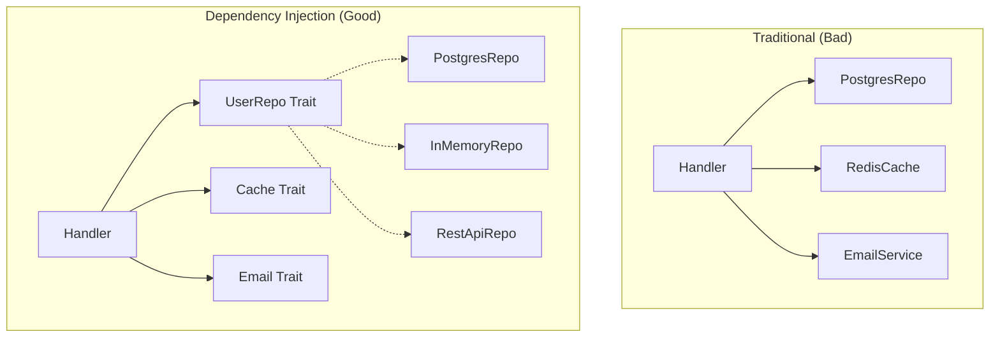

# Dependency Injection and State: Building Testable, Maintainable Applications

**Example Source**: [dependency-injection](https://github.com/tokio-rs/axum/tree/6bc0717b06c665baf9dea57d977363ade062bf17/examples/dependency-injection)

## The Core Concept: Why This Example Exists

**The Problem:** Real web applications need to interact with databases, external APIs, file systems, and other services. Hard-coding these dependencies makes your code impossible to test, difficult to modify, and tightly coupled to specific implementations. You need a way to provide these dependencies to your handlers without making them aware of the specific implementations being used.

**The Solution:** Axum's state system enables **dependency injection**—a design pattern where dependencies are provided to your handlers rather than created within them. This example demonstrates two approaches: trait objects (`dyn Trait`) for simplicity and generics (`T: Trait`) for maximum flexibility. Both approaches allow you to write handlers that work with abstract interfaces rather than concrete implementations.

Think of dependency injection like a restaurant's supply chain. Instead of each chef personally going to the market to buy ingredients (tight coupling), the restaurant has suppliers who deliver what's needed (loose coupling). The chef knows they need "fresh tomatoes" but doesn't need to know which farm they came from or how they were transported.

## Practical Walkthrough: Code Breakdown

This example shows two complete dependency injection patterns:

### The Abstract Interface

```rust
trait UserRepo: Send + Sync {
    fn get_user(&self, id: Uuid) -> Option<User>;
    fn save_user(&self, user: &User);
}
```

This trait defines the **contract** that any user repository must fulfill. Notice the `Send + Sync` bounds—these are required because Axum handlers run in a multi-threaded async environment. Any type used in Axum state must be safely shareable between threads.

### Concrete Implementation

```rust
#[derive(Debug, Clone, Default)]
struct InMemoryUserRepo {
    map: Arc<Mutex<HashMap<Uuid, User>>>,
}

impl UserRepo for InMemoryUserRepo {
    fn get_user(&self, id: Uuid) -> Option<User> {
        self.map.lock().unwrap().get(&id).cloned()
    }

    fn save_user(&self, user: &User) {
        self.map.lock().unwrap().insert(user.id, user.clone());
    }
}
```

This implementation uses an in-memory HashMap for simplicity, but it could just as easily be a PostgreSQL database, Redis cache, or remote API client. The key insight is that **handlers don't need to know which implementation is being used**.

### Approach 1: Trait Objects (Dynamic Dispatch)

```rust
#[derive(Clone)]
struct AppStateDyn {
    user_repo: Arc<dyn UserRepo>,
}

async fn create_user_dyn(
    State(state): State<AppStateDyn>,
    Json(params): Json<UserParams>,
) -> Json<User> {
    let user = User {
        id: Uuid::new_v4(),
        name: params.name,
    };

    state.user_repo.save_user(&user);

    Json(user)
}
```

**Trait Objects Explained**: `Arc<dyn UserRepo>` means "a reference-counted pointer to some type that implements UserRepo." The `dyn` keyword indicates **dynamic dispatch**—the specific method implementation is determined at runtime.

**Benefits**:
- **Simpler code**: No generic type parameters to manage
- **Type erasure**: All implementations look the same to the compiler
- **Easy composition**: You can store multiple different trait objects in the same collection

**Trade-offs**:
- **Runtime overhead**: Method calls go through a vtable lookup
- **Object safety restrictions**: Not all traits can be made into trait objects

### Approach 2: Generics (Static Dispatch)

```rust
#[derive(Clone)]
struct AppStateGeneric<T> {
    user_repo: T,
}

async fn create_user_generic<T>(
    State(state): State<AppStateGeneric<T>>,
    Json(params): Json<UserParams>,
) -> Json<User>
where
    T: UserRepo,
{
    let user = User {
        id: Uuid::new_v4(),
        name: params.name,
    };

    state.user_repo.save_user(&user);

    Json(user)
}
```

**Generics Explained**: The function is generic over any type `T` that implements `UserRepo`. At compile time, Rust generates specialized versions of this function for each concrete type you use.

**Benefits**:
- **Zero runtime overhead**: Method calls are resolved at compile time
- **Full trait flexibility**: Any trait can be used, regardless of object safety
- **Compiler optimizations**: The compiler can inline and optimize aggressively

**Trade-offs**:
- **Code complexity**: Generic parameters and bounds can be verbose
- **Compilation time**: Each generic instantiation requires separate compilation

### Router Assembly with Nesting

```rust
let using_dyn = Router::new()
    .route("/users/{id}", get(get_user_dyn))
    .route("/users", post(create_user_dyn))
    .with_state(AppStateDyn {
        user_repo: Arc::new(user_repo.clone()),
    });

let using_generic = Router::new()
    .route("/users/{id}", get(get_user_generic::<InMemoryUserRepo>))
    .route("/users", post(create_user_generic::<InMemoryUserRepo>))
    .with_state(AppStateGeneric { user_repo });

let app = Router::new()
    .nest("/dyn", using_dyn)
    .nest("/generic", using_generic);
```

This setup demonstrates **router composition**—building complex applications by combining smaller, focused routers. The `.nest()` method allows you to mount sub-applications at specific paths:

- `/dyn/users` → trait object approach
- `/generic/users` → generic approach

## Mental Model: Thinking in Axum

**The Dependency Inversion Principle:** Traditional architectures often have high-level modules depending on low-level modules. Dependency injection inverts this relationship:



**Why It's Designed This Way:** Dependency injection follows several key principles:

1. **Separation of Concerns**: Handlers focus on business logic, not implementation details
2. **Testability**: You can inject mock implementations during testing
3. **Flexibility**: You can swap implementations without changing handler code
4. **Composition**: Complex applications are built from simple, focused components

**State vs. Extensions**: Axum provides two ways to share data with handlers:

- **State** (`State<T>`): For application-wide dependencies that are known at startup
- **Extensions** (`Extension<T>`): For request-specific data added by middleware

State is perfect for dependency injection because it's available to all handlers and established once during application initialization.

**Testing Benefits**: With dependency injection, testing becomes straightforward:

```rust
#[cfg(test)]
mod tests {
    use super::*;

    struct MockUserRepo {
        users: Vec<User>,
    }

    impl UserRepo for MockUserRepo {
        fn get_user(&self, id: Uuid) -> Option<User> {
            self.users.iter().find(|u| u.id == id).cloned()
        }

        fn save_user(&self, user: &User) {
            // In a real mock, you'd track saved users
        }
    }

    #[tokio::test]
    async fn test_create_user() {
        let state = AppStateGeneric {
            user_repo: MockUserRepo { users: vec![] },
        };
        
        // Test your handler with a controlled mock implementation
    }
}
```

**Real-World Patterns**: In production applications, your state might include:

```rust
struct AppState {
    db_pool: Arc<DatabasePool>,
    redis_client: Arc<RedisClient>,
    email_service: Arc<dyn EmailService>,
    config: Arc<AppConfig>,
    metrics: Arc<dyn MetricsCollector>,
}
```

**Performance Considerations**: For the trait object vs. generics decision:

- **Use trait objects** for most applications—the performance difference is negligible
- **Use generics** when you need maximum performance or non-object-safe traits
- **Benchmark** if you're unsure—Rust makes it easy to switch between approaches

**Further Exploration:** Try these patterns to deepen your understanding:

1. **Add a database**: Replace `InMemoryUserRepo` with a real database connection
2. **Implement caching**: Add a cache layer that wraps your repository
3. **Add configuration**: Use state to provide application configuration to handlers
4. **Create a service layer**: Build higher-level services that compose multiple repositories
5. **Implement request-scoped dependencies**: Use middleware to add request-specific data

The beauty of Axum's state system is that it makes dependency injection feel natural and ergonomic while maintaining Rust's performance and safety guarantees.